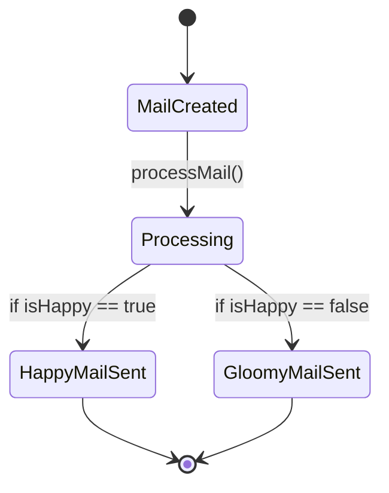
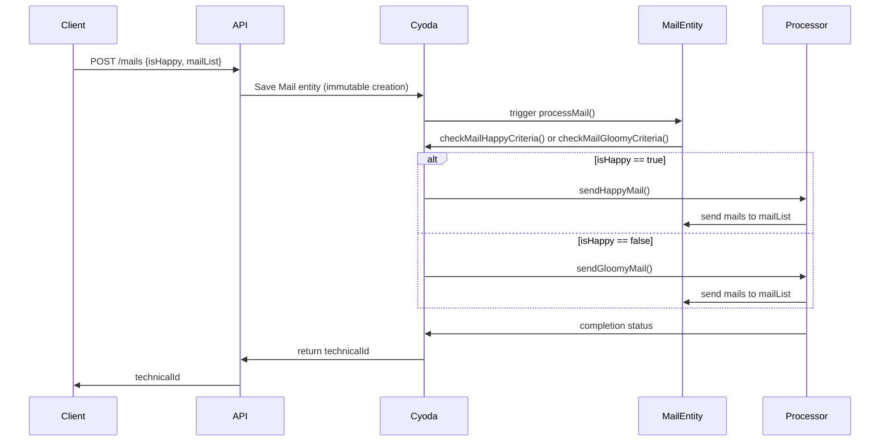

### 1. Entity Definitions

```
Mail:
- isHappy: Boolean (Indicates if the mail is happy or gloomy)
- mailList: List<String> (List of recipient email addresses)
```

### 2. Process Method Flows

```
processMail() Flow:
1. Initial State: Mail entity is created (immutable creation)
2. Validation:
   - checkMailHappyCriteria(): Validates if isHappy == true
   - checkMailGloomyCriteria(): Validates if isHappy == false
3. Processing:
   - If isHappy == true → invoke sendHappyMail() processor
   - If isHappy == false → invoke sendGloomyMail() processor
4. Completion: Mail is sent to all recipients in mailList
5. Notification: Optional logging or notification of mail sent status
```

### 3. API Endpoints Design

- **POST /mails**  
  - Description: Create a new Mail entity; triggers `processMail()` event  
  - Request Body:  
    ```json
    {
      "isHappy": true,
      "mailList": ["recipient1@example.com", "recipient2@example.com"]
    }
    ```  
  - Response Body:  
    ```json
    {
      "technicalId": "string"  // Unique identifier of the created Mail entity
    }
    ```

- **GET /mails/{technicalId}**  
  - Description: Retrieve stored Mail entity result by technicalId  
  - Response Body Example:  
    ```json
    {
      "technicalId": "string",
      "isHappy": true,
      "mailList": ["recipient1@example.com", "recipient2@example.com"],
      "status": "SENT"
    }
    ```

### 4. Event Processing Workflows

- When a Mail entity is created via POST, Cyoda triggers the `processMail()` event.
- Within `processMail()`, Cyoda validates the entity by invoking:
  - `checkMailHappyCriteria()` if `isHappy` is true.
  - `checkMailGloomyCriteria()` if `isHappy` is false.
- Based on the criteria evaluation:
  - If `isHappy` is true, `sendHappyMail` processor is invoked.
  - Otherwise, `sendGloomyMail` processor is invoked.
- The processors send mails to all recipients in `mailList`.
- Immutable creation of Mail entity preserves event history.

### 5. Visual Diagrams

#### Entity Lifecycle State Diagram


```mermaid
stateDiagram-v2
    [*] --> MailCreated
    MailCreated --> Processing : processMail()
    Processing --> HappyMailSent : if isHappy == true
    Processing --> GloomyMailSent : if isHappy == false
    HappyMailSent --> [*]
    GloomyMailSent --> [*]
```

#### Event-Driven Processing Chain


```mermaid
sequenceDiagram
    participant Client
    participant API
    participant Cyoda
    participant MailEntity
    participant Processor

    Client->>API: POST /mails {isHappy, mailList}
    API->>Cyoda: Save Mail entity (immutable creation)
    Cyoda->>MailEntity: trigger processMail()
    MailEntity->>Cyoda: checkMailHappyCriteria() or checkMailGloomyCriteria()
    alt isHappy == true
        Cyoda->>Processor: sendHappyMail()
        Processor->>MailEntity: send mails to mailList
    else isHappy == false
        Cyoda->>Processor: sendGloomyMail()
        Processor->>MailEntity: send mails to mailList
    end
    Processor->>Cyoda: completion status
    Cyoda->>API: return technicalId
    API->>Client: technicalId
```

---

This document captures all confirmed functional requirements and essential details for implementation following Cyoda's Event-Driven Architecture principles.