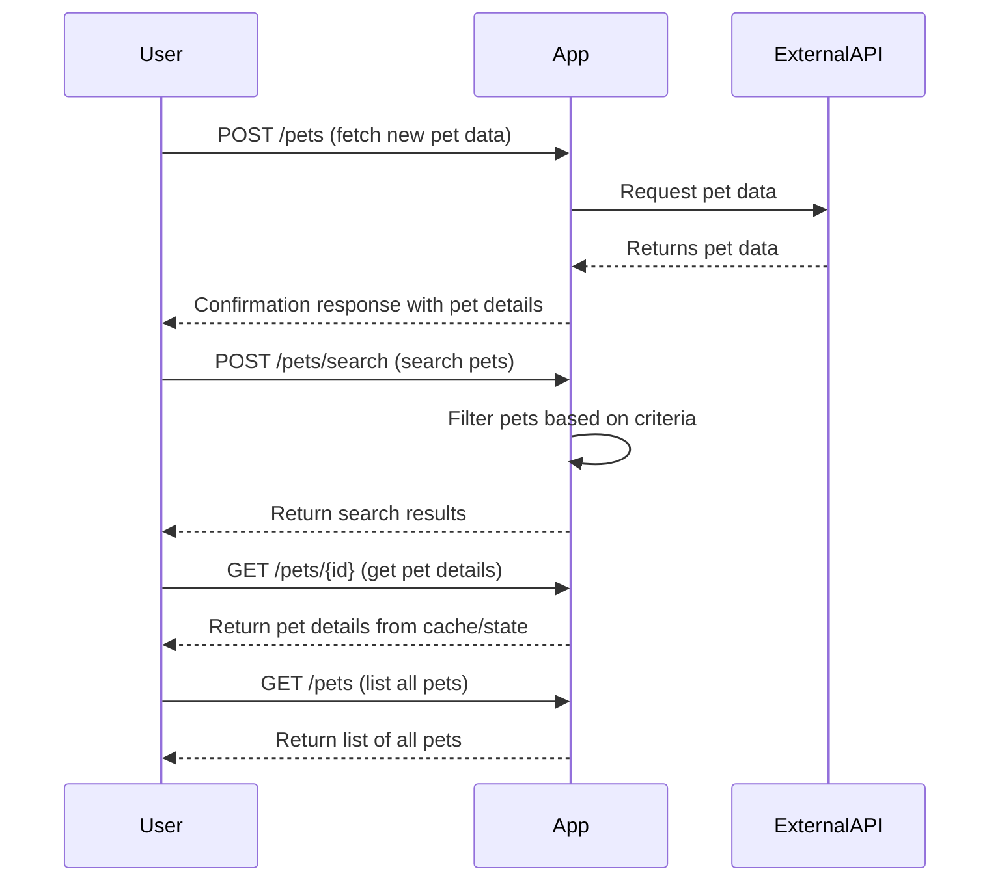

# Purrfect Pets API - Functional Requirements

## API Endpoints

### 1. Add or Update Pet Data (POST /pets)
- **Description:** Fetches or updates pet data from the external Petstore API or any business logic related to pet data processing.
- **Request:**
```json
{
  "action": "fetch" | "add" | "update",
  "pet": {
    "id": "optional for add",
    "name": "string",
    "category": "string",
    "status": "available" | "pending" | "sold"
  }
}
```
- **Response:**
```json
{
  "success": true,
  "pet": {
    "id": "number",
    "name": "string",
    "category": "string",
    "status": "string"
  },
  "message": "Operation completed successfully"
}
```

---

### 2. Search Pets (POST /pets/search)
- **Description:** Executes search queries against pet data with filters.
- **Request:**
```json
{
  "filters": {
    "status": "available" | "pending" | "sold",
    "category": "string",
    "nameContains": "string"
  }
}
```
- **Response:**
```json
{
  "results": [
    {
      "id": "number",
      "name": "string",
      "category": "string",
      "status": "string"
    }
  ]
}
```

---

### 3. Get Pet Details (GET /pets/{id})
- **Description:** Retrieves pet information by ID from local app state or cache.
- **Response:**
```json
{
  "id": "number",
  "name": "string",
  "category": "string",
  "status": "string"
}
```

---

### 4. List All Pets (GET /pets)
- **Description:** Retrieves a list of all pets currently available in the system.
- **Response:**
```json
[
  {
    "id": "number",
    "name": "string",
    "category": "string",
    "status": "string"
  }
]
```

---

## User-App Interaction Sequence Diagram


```mermaid
sequenceDiagram
    participant User
    participant App
    participant ExternalAPI

    User->>App: POST /pets (fetch new pet data)
    App->>ExternalAPI: Request pet data
    ExternalAPI-->>App: Returns pet data
    App-->>User: Confirmation response with pet details

    User->>App: POST /pets/search (search pets)
    App->>App: Filter pets based on criteria
    App-->>User: Return search results

    User->>App: GET /pets/{id} (get pet details)
    App-->>User: Return pet details from cache/state

    User->>App: GET /pets (list all pets)
    App-->>User: Return list of all pets
```
