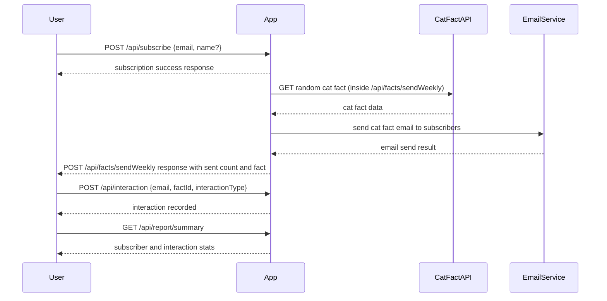

# Functional Requirements and API Design

## API Endpoints

### 1. User Subscription

**POST /api/subscribe**  
- Description: Register a new subscriber with their email (and optionally name).  
- Request:  
```json
{
  "email": "user@example.com",
  "name": "Optional Name"
}
```  
- Response:  
```json
{
  "success": true,
  "message": "Subscription successful"
}
```

### 2. Trigger Weekly Cat Fact Ingestion and Email Sending

**POST /api/facts/sendWeekly**  
- Description: Trigger the ingestion of a new cat fact from the external API and send it via email to all subscribers. This endpoint handles external API call and emailing logic.  
- Request:  
```json
{}
```  
- Response:  
```json
{
  "success": true,
  "sentCount": 42,
  "fact": "Cats sleep 70% of their lives."
}
```

### 3. Retrieve Subscriber Count and Interaction Summary

**GET /api/report/summary**  
- Description: Return summary statistics such as number of subscribers and interaction counts (e.g., email opens).  
- Response:  
```json
{
  "subscriberCount": 100,
  "factSentCount": 10,
  "interactionCount": 75
}
```

### 4. Record Interaction with Cat Fact (e.g., email open or click)

**POST /api/interaction**  
- Description: Record an interaction event related to a sent cat fact (email open or link click).  
- Request:  
```json
{
  "subscriberEmail": "user@example.com",
  "factId": "12345",
  "interactionType": "email_open" // or "link_click"
}
```  
- Response:  
```json
{
  "success": true
}
```

---

## User-App Interaction Sequence Diagram


```mermaid
sequenceDiagram
    participant User
    participant App
    participant CatFactAPI
    participant EmailService

    User->>App: POST /api/subscribe {email, name?}
    App-->>User: subscription success response

    App->>CatFactAPI: GET random cat fact (inside /api/facts/sendWeekly)
    CatFactAPI-->>App: cat fact data

    App->>EmailService: send cat fact email to subscribers
    EmailService-->>App: email send result

    App-->>User: POST /api/facts/sendWeekly response with sent count and fact

    User->>App: POST /api/interaction {email, factId, interactionType}
    App-->>User: interaction recorded

    User->>App: GET /api/report/summary
    App-->>User: subscriber and interaction stats
```

---

### Notes

- POST endpoints handle all external API calls and business logic.
- GET endpoints are reserved for retrieving stored results.
- Weekly ingestion and email sending is triggered via POST `/api/facts/sendWeekly`.
- Interaction events can be tracked via `/api/interaction`.

If you need further adjustments or want to proceed with implementation, just let me know!