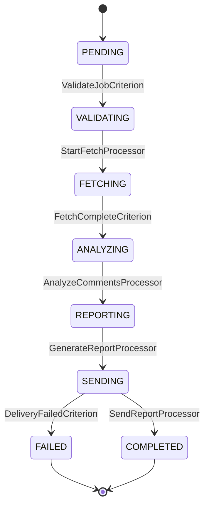
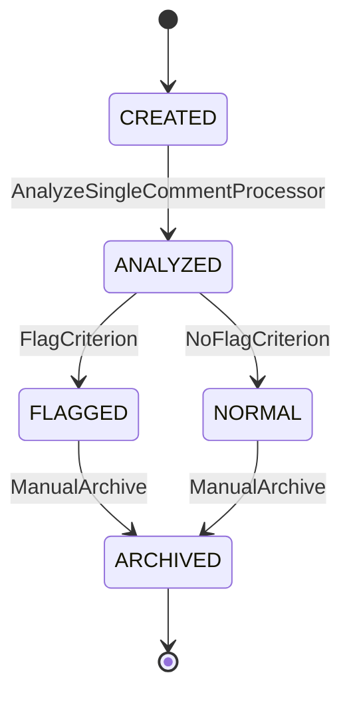
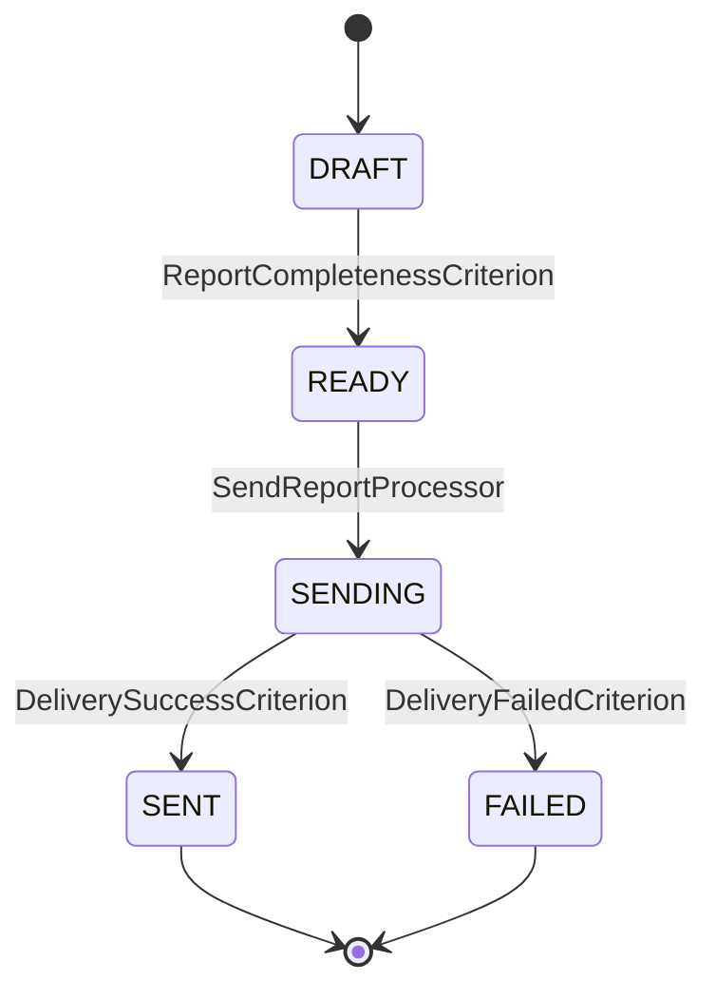
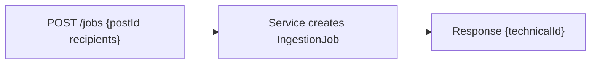
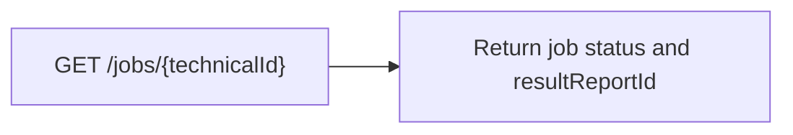

### 1. Entity Definitions
```
IngestionJob:
- postId: Integer (id of the post to ingest comments for)
- requestedByEmail: String (email that requested the report / primary recipient)
- recipients: Array[String] (additional email recipients)
- schedule: String (optional cron or run-once flag)
- status: String (PENDING / IN_PROGRESS / COMPLETED / FAILED)
- createdAt: String (timestamp)
- completedAt: String (timestamp)
- resultReportId: String (link to Report.technicalId)

Comment:
- commentId: Integer (source comment id)
- postId: Integer (links to post)
- authorName: String
- authorEmail: String
- body: String
- receivedAt: String (timestamp)
- sentimentScore: Number (analysis result)
- keywords: Array[String]
- flags: Array[String] (e.g., TOXIC, DUPLICATE)

Report:
- reportId: String (business id)
- postId: Integer
- generatedAt: String
- summary: String
- metrics: Object (counts, sentimentTotals, topKeywords)
- highlights: Array[Object] (sample comments / alerts)
- recipients: Array[String]
- deliveryStatus: String (PENDING / SENT / FAILED)
```

### 2. Entity workflows

IngestionJob workflow:
1. Initial State: PENDING when POSTed
2. Validation: automatic param checks
3. Fetching: automatic fetch comments event
4. Analysis: automatic comments analysis
5. Report Generation: automatic Report created
6. Delivery: automatic send email
7. Completion: COMPLETED or FAILED


```mermaid
stateDiagram-v2
    [*] --> PENDING
    PENDING --> VALIDATING : ValidateJobCriterion
    VALIDATING --> FETCHING : StartFetchProcessor
    FETCHING --> ANALYZING : FetchCompleteCriterion
    ANALYZING --> REPORTING : AnalyzeCommentsProcessor
    REPORTING --> SENDING : GenerateReportProcessor
    SENDING --> COMPLETED : SendReportProcessor
    SENDING --> FAILED : DeliveryFailedCriterion
    FAILED --> [*]
    COMPLETED --> [*]
```

Processors/Criteria needed:
- ValidateJobCriterion
- StartFetchProcessor
- FetchCompleteCriterion
- AnalyzeCommentsProcessor
- GenerateReportProcessor
- SendReportProcessor
- DeliveryFailedCriterion

Comment workflow:
1. Initial State: CREATED when persisted by job
2. Analysis: automatic sentiment/keyword/flag enrichment
3. Marked: flagged or normal
4. Archived: optional manual cleanup


```mermaid
stateDiagram-v2
    [*] --> CREATED
    CREATED --> ANALYZED : AnalyzeSingleCommentProcessor
    ANALYZED --> FLAGGED : FlagCriterion
    ANALYZED --> NORMAL : NoFlagCriterion
    FLAGGED --> ARCHIVED : ManualArchive
    NORMAL --> ARCHIVED : ManualArchive
    ARCHIVED --> [*]
```

Processors/Criteria:
- AnalyzeSingleCommentProcessor
- FlagCriterion
- NoFlagCriterion
- ManualArchive

Report workflow:
1. Initial State: DRAFT after generation
2. Review: automatic content completeness check
3. Sending: SendReportProcessor attempts delivery
4. Final: SENT or FAILED


```mermaid
stateDiagram-v2
    [*] --> DRAFT
    DRAFT --> READY : ReportCompletenessCriterion
    READY --> SENDING : SendReportProcessor
    SENDING --> SENT : DeliverySuccessCriterion
    SENDING --> FAILED : DeliveryFailedCriterion
    SENT --> [*]
    FAILED --> [*]
```

Processors/Criteria:
- ReportCompletenessCriterion
- SendReportProcessor
- DeliverySuccessCriterion
- DeliveryFailedCriterion

### 3. Pseudo code for processor classes
FetchCommentsProcessor:
```
process(job):
  resp = ExternalApi.fetchComments(postId=job.postId)
  for c in resp:
    persist Comment(c)
  mark job.status = IN_PROGRESS
```
AnalyzeCommentsProcessor:
```
process(job):
  comments = query Comments where postId = job.postId and sentimentScore null
  for c in comments:
    c.sentimentScore = Sentiment.analyze(c.body)
    c.keywords = Keyword.extract(c.body)
    if Toxicity.check(c.body): c.flags.add("TOXIC")
    persist c
```
GenerateReportProcessor:
```
process(job):
  comments = query Comments where postId = job.postId
  metrics = aggregate(comments)
  report = new Report(... metrics, recipients=job.recipients)
  persist report
  job.resultReportId = report.technicalId
```
SendReportProcessor:
```
process(report):
  content = render(report)
  ok = Email.send(report.recipients, content)
  report.deliveryStatus = ok ? SENT : FAILED
  persist report
```

### 4. API Endpoints Design Rules

POST endpoint (create orchestration job) — returns only technicalId
Request JSON:
{
  "postId": 1,
  "requestedByEmail": "owner@example.com",
  "recipients": ["a@x.com"],
  "schedule": null
}
Response JSON:
{
  "technicalId": "job_abc123"
}

GET by technicalId (job status/result)
Response JSON:
{
  "technicalId": "job_abc123",
  "postId": 1,
  "status": "COMPLETED",
  "createdAt": "...",
  "completedAt": "...",
  "resultReportId": "report_xyz"
}

GET comment/report by technicalId (retrieve stored results)
- GET /comments/{technicalId} -> returns Comment object
- GET /reports/{technicalId} -> returns Report object

Mermaid flow for POST job request/response:

```mermaid
flowchart LR
    A["POST /jobs {postId recipients}"] --> B["Service creates IngestionJob"]
    B --> C["Response {technicalId}"]
```

Mermaid flow for GET job:

```mermaid
flowchart LR
    D["GET /jobs/{technicalId}"] --> E["Return job status and resultReportId"]
```