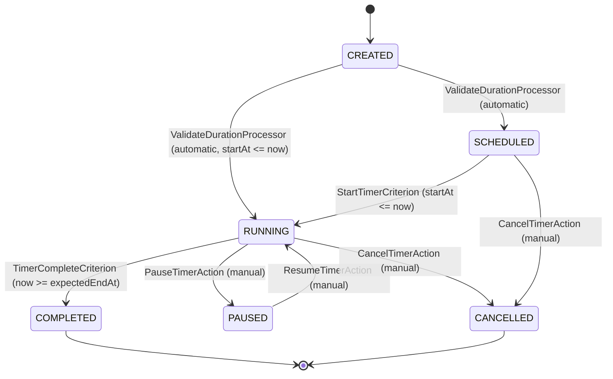
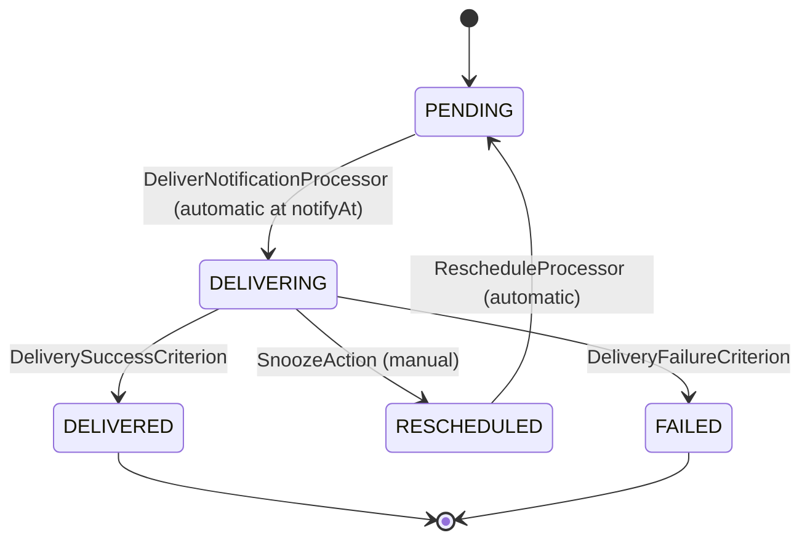
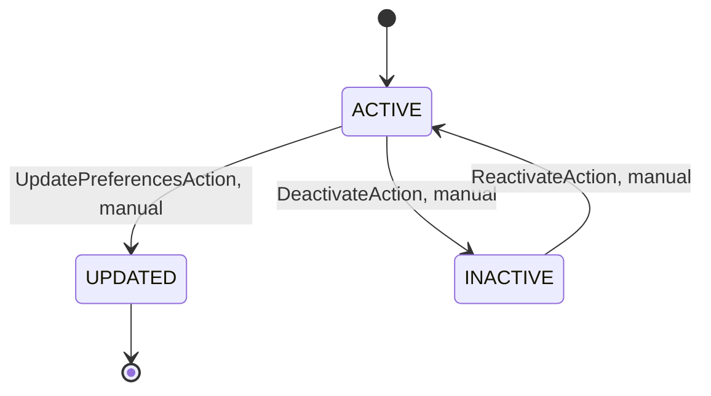

# Functional Requirements — Egg Timer Prototype

Last updated: 2025-08-21

This document defines the canonical functional requirements for the EggTimer prototype: entities, state workflows, processors/criteria, API surface, and business rules. It consolidates and clarifies logic to ensure the implementation (and Cyoda workflows) are consistent and unambiguous.

---

## 1. High-level summary

The system allows users to create egg timers with a desired boil type and egg size/count. Timers can be scheduled in the future, started immediately, paused, resumed, cancelled, and will produce notifications when the timer completes. Notifications support delivery, snooze, retry, and delivery state tracking. Completed/cancelled timers are persisted to history for analytics and audit.

Design goals:
- Clear state transitions for timers and notifications.
- Deterministic duration computation with sensible defaults and override capability.
- Robust pause/resume semantics with remaining-time tracking.
- Idempotent processors and explicit criteria to be used by Cyoda (or similar workflow engine).
- API that separates business IDs (provided by callers) from internal technical IDs.

---

## 2. Entities (updated and clarified)

All timestamps are ISO-8601 strings in UTC unless otherwise noted. Where business id and technical id both exist, "id" refers to the business id and "technicalId" is the internal identifier returned by the service on create.

1) User
- id: String (business id, e.g., email or UUID supplied by caller)
- technicalId: String (internal id)
- name: String
- timezone: String (IANA timezone id, used for local scheduling display)
- preferences: Object
  - defaultBoilType: String (soft|medium|hard)
  - defaultEggSize: String (small|medium|large)
  - allowMultipleTimers: Boolean
  - defaultNotificationMethod: String (alarm|sound|visual|push|email)
- state: String (ACTIVE | INACTIVE)
- createdAt: String
- updatedAt: String

2) EggTimer
- id: String (business id)
- technicalId: String (internal id)
- ownerUserId: String (business id of User)
- boilType: String (soft|medium|hard)
- eggSize: String (small|medium|large)
- eggsCount: Integer (>=1)
- durationSeconds: Integer (total duration for the boil; computed or overridden)
- startAt: String (ISO timestamp of intended start, nullable — if null then start immediately on CREATE)
- scheduledStartAt: String (internal computed scheduled start time in UTC; set when scheduled)
- expectedEndAt: String (scheduledStartAt + remainingSeconds; updated on pause/resume)
- remainingSeconds: Integer (remaining seconds when paused; null otherwise)
- state: String (CREATED | SCHEDULED | RUNNING | PAUSED | COMPLETED | CANCELLED)
- createdAt: String
- updatedAt: String
- metadata: Object (freeform for presets or labels)

Notes:
- durationSeconds is authoritative for full duration. When paused, remainingSeconds is used to resume. On resume we recompute expectedEndAt = now + remainingSeconds.
- If startAt is in the past (or null), the timer should start immediately (scheduledStartAt = now).

3) Notification
- id: String (business id)
- technicalId: String (internal id)
- timerId: String (business id of EggTimer)
- userId: String (business id of User)
- notifyAt: String (ISO timestamp for delivery)
- method: String (alarm|sound|visual|push|email)
- delivered: Boolean
- deliveryAttempts: Integer (>=0)
- snoozeCount: Integer (>=0)
- lastAttemptAt: String (nullable)
- state: String (PENDING | DELIVERING | DELIVERED | RESCHEDULED | FAILED)
- createdAt: String
- updatedAt: String

4) TimerHistory (recommended addition)
- id: String (internal)
- timerId: String (business id)
- ownerUserId: String
- startedAt: String
- endedAt: String
- finalState: String (COMPLETED | CANCELLED)
- durationSeconds: Integer (actual elapsed seconds)
- createdAt: String

Rationale: Tracking TimerHistory avoids large growth of active timers and provides an audit trail. This is recommended but optional if storage is limited.

---

## 3. Business rules and logic (clarified)

1. Multiple timers per user
- Behavior is controlled by user.preferences.allowMultipleTimers. If false, only one ACTIVE SCHEDULED or RUNNING timer may exist for the user. Attempts to create a second timer should fail with a 409 Conflict (or return the technicalId of the existing timer depending on UX choice).

2. Duration computation
- If durationSeconds is explicitly provided on creation, the system will use that value (subject to validation limits, e.g., > 0 and < configurable max).
- If durationSeconds is omitted, system computes duration via mapping:
  - Base durations (example):
    - soft: small=180s, medium=210s, large=240s
    - medium: small=240s, medium=300s, large=360s
    - hard: small=300s, medium=360s, large=420s
  - eggsCount adjustment: +15 seconds per additional egg (eggsCount - 1) to account for heat loss; this is configurable.
- The computed value is stored in durationSeconds and persisted by ValidateDurationProcessor.

3. Start semantics
- If startAt is null or startAt <= now on create, the timer is scheduledStartAt = now and transitions to RUNNING immediately (subject to allowMultipleTimers check).
- If startAt > now, timer goes to SCHEDULED with scheduledStartAt = startAt (normalized to UTC).

4. Pause / Resume
- Pause: only allowed when state == RUNNING. Action stores remainingSeconds = max(0, expectedEndAt - now), sets state=PAUSED, clears expectedEndAt.
- Resume: only allowed when state == PAUSED. Action sets scheduledStartAt = now, expectedEndAt = now + remainingSeconds, sets remainingSeconds = null, and transitions to RUNNING.
- Cancel: allowed in any non-terminal state; sets state=CANCELLED, creates TimerHistory record with finalState=CANCELLED.

5. Completion
- Completion is detected when now >= expectedEndAt (or startAt + durationSeconds if expectedEndAt is not stored). On completion the timer transitions to COMPLETED, persists TimerHistory (finalState=COMPLETED), and schedules/creates Notification(s) if not already created.

6. Notifications
- A Notification for timer completion is created as part of schedule flow (ScheduleNotificationProcessor) at notifyAt = expectedEndAt (or startAt + durationSeconds when running without pause) and state=PENDING.
- DeliverNotificationProcessor will attempt delivery at notifyAt: it moves state to DELIVERING, attempts the configured method(s), marks delivered=true and state=DELIVERED on success, or increments deliveryAttempts and marks FAILED on permanent failure.
- Snooze: user can request snooze on a notification; the notification's notifyAt is increased by the snooze delta (e.g., 300s), snoozeCount++, and state becomes RESCHEDULED -> then PENDING. Multiple snoozes are allowed up to a configurable max.
- Retry: for transient delivery failures, background retry attempts may be scheduled using exponential backoff; deliveryAttempts tracks attempts.

7. Idempotency and consistency
- All processors must be idempotent. If a processor runs twice for the same timer/notification, the state must remain correct and no duplicate notifications created.
- Use optimistic locking or timestamp-based concurrency controls when updating state to avoid lost updates from overlapping processors.

---

## 4. State workflows (updated diagrams & notes)

EggTimer workflow (detailed):

- CREATED: initial state on POST.
- CREATED -> SCHEDULED: ValidateDurationProcessor computes duration and registers Notification(s) (if startAt > now) or sets up RUNNING if startAt <= now.
- SCHEDULED -> RUNNING: StartTimerCriterion (startAt <= now) triggers transition; when moving to RUNNING compute expectedEndAt = now + durationSeconds.
- RUNNING -> COMPLETED: TimerCompleteCriterion (now >= expectedEndAt) triggers TimerCompleteProcessor.
- RUNNING -> PAUSED: PauseTimerAction (manual) stores remainingSeconds and sets state=PAUSED.
- PAUSED -> RUNNING: ResumeTimerAction (manual) sets expectedEndAt = now + remainingSeconds and clears remainingSeconds.
- Any non-terminal -> CANCELLED: CancelTimerAction (manual) sets final state and triggers persist history.

Mermaid (recommended):


```mermaid
stateDiagram-v2
    [*] --> CREATED
    CREATED --> SCHEDULED : ValidateDurationProcessor (automatic)
    CREATED --> RUNNING : ValidateDurationProcessor (automatic, startAt <= now)
    SCHEDULED --> RUNNING : StartTimerCriterion (startAt <= now)
    RUNNING --> COMPLETED : TimerCompleteCriterion (now >= expectedEndAt)
    RUNNING --> PAUSED : PauseTimerAction (manual)
    PAUSED --> RUNNING : ResumeTimerAction (manual)
    RUNNING --> CANCELLED : CancelTimerAction (manual)
    SCHEDULED --> CANCELLED : CancelTimerAction (manual)
    COMPLETED --> [*]
    CANCELLED --> [*]
```

Notification workflow (detailed):

- PENDING: created by ScheduleNotificationProcessor.
- PENDING -> DELIVERING: DeliverNotificationProcessor runs at notifyAt.
- DELIVERING -> DELIVERED: on success.
- DELIVERING -> RESCHEDULED: SnoozeAction (manual) updates notifyAt and sets state=RESCHEDULED, then RescheduleProcessor sets state back to PENDING.
- DELIVERING -> FAILED: on permanent failure.

Mermaid:


```mermaid
stateDiagram-v2
    [*] --> PENDING
    PENDING --> DELIVERING : DeliverNotificationProcessor (automatic at notifyAt)
    DELIVERING --> DELIVERED : DeliverySuccessCriterion
    DELIVERING --> RESCHEDULED : SnoozeAction (manual)
    DELIVERING --> FAILED : DeliveryFailureCriterion
    RESCHEDULED --> PENDING : RescheduleProcessor (automatic)
    DELIVERED --> [*]
    FAILED --> [*]
```

User workflow (unchanged but clarified):

- Creation sets state=ACTIVE.
- Updates are manual actions and merely change preferences/state.

Mermaid:


```mermaid
stateDiagram-v2
    [*] --> ACTIVE
    ACTIVE --> UPDATED : UpdatePreferencesAction, manual
    ACTIVE --> INACTIVE : DeactivateAction, manual
    INACTIVE --> ACTIVE : ReactivateAction, manual
    UPDATED --> [*]
```

---

## 5. Processors and criteria (detailed pseudocode)

All processors should persist entity snapshots after modifying state and include logging for audit and troubleshooting.

ValidateDurationProcessor

```
process(timer):
  if timer.durationSeconds is null or timer.durationSeconds <= 0:
    base = lookupBaseDuration(timer.boilType, timer.eggSize)
    adjustment = (timer.eggsCount - 1) * config.perEggAdjustmentSeconds
    timer.durationSeconds = base + adjustment
  // normalize startAt to UTC if provided
  if timer.startAt is null or timer.startAt <= now:
    timer.scheduledStartAt = now
    timer.state = RUNNING
    timer.expectedEndAt = now + timer.durationSeconds
  else:
    timer.scheduledStartAt = timer.startAt
    timer.state = SCHEDULED
    timer.expectedEndAt = timer.startAt + timer.durationSeconds
  persist(timer)
  // register notifications for completion (idempotent)
  ScheduleNotificationProcessor.process(timer)
```

ScheduleNotificationProcessor

```
process(timer):
  // Ensure single notification for completion exists (idempotent)
  targetNotifyAt = timer.expectedEndAt
  if not notificationExists(timerId=timer.id, notifyAt=targetNotifyAt):
    create Notification(timerId=timer.id, userId=timer.ownerUserId, notifyAt=targetNotifyAt, method=timer.userPreferredMethod, delivered=false, state=PENDING)
  persist if any
```

TimerCompleteProcessor

```
process(timer):
  // Idempotent completion
  if timer.state == COMPLETED or timer.state == CANCELLED:
    return
  if now >= timer.expectedEndAt:
    timer.state = COMPLETED
    persist(timer)
    // ensure notification exists (if missed earlier)
    ScheduleNotificationProcessor.process(timer)
    // record history
    PersistHistoryProcessor.process(timer)
```

DeliverNotificationProcessor

```
process(notification):
  if notification.state in (DELIVERED, DELIVERING) and notification.delivered:
    return
  notification.state = DELIVERING
  notification.deliveryAttempts += 1
  notification.lastAttemptAt = now
  persist(notification)

  success = attemptDelivery(notification)
  if success:
    notification.delivered = true
    notification.state = DELIVERED
    persist(notification)
  else:
    if isPermanentFailure():
      notification.state = FAILED
      persist(notification)
    else:
      // schedule retry with backoff
      notification.state = RESCHEDULED
      notification.notifyAt = now + computeBackoff(notification.deliveryAttempts)
      persist(notification)
```

PauseTimerAction / ResumeTimerAction

```
pause(timer):
  if timer.state != RUNNING: error
  timer.remainingSeconds = max(0, timer.expectedEndAt - now)
  timer.expectedEndAt = null
  timer.state = PAUSED
  persist(timer)

resume(timer):
  if timer.state != PAUSED: error
  timer.scheduledStartAt = now
  timer.expectedEndAt = now + timer.remainingSeconds
  timer.remainingSeconds = null
  timer.state = RUNNING
  persist(timer)
```

PersistHistoryProcessor

```
process(timer):
  create TimerHistory(timerId=timer.id, ownerUserId=timer.ownerUserId, startedAt=timer.scheduledStartAt, endedAt=now, finalState=timer.state, durationSeconds=timer.durationSeconds)
  persist(history)
```

---

## 6. API endpoints (expanded and clarified)

Principles:
- POST responses return an internal technicalId and 201 Created on success.
- All write endpoints are idempotent by business id (clients may retry safely using the same business id).
- Actions that change timer state (pause/resume/cancel) are explicit endpoints.

1) POST /users
- Creates a user.
- Request body example:
  { "id": "user-123", "name": "Alice", "timezone": "Europe/Berlin", "preferences": {"defaultBoilType":"soft","defaultEggSize":"medium","allowMultipleTimers":true, "defaultNotificationMethod":"alarm" } }
- Response example:
  { "technicalId": "tech-usr-0001" }

2) GET /users/{technicalId}
- Returns stored user JSON (including preferences and technicalId)

3) POST /timers
- Creates a timer.
- Request example:
  { "id":"timer-456","ownerUserId":"user-123","boilType":"soft","eggSize":"medium","eggsCount":2,"startAt":"2025-08-21T07:00:00Z" }
- Response example:
  { "technicalId": "tech-timer-0001" }
- Errors:
  - 409 Conflict if user.allowMultipleTimers == false and user has active timer
  - 400 Bad Request if eggsCount < 1 or boilType/eggSize invalid

4) GET /timers/{technicalId}
- Returns stored EggTimer JSON (including computed durationSeconds, state, expectedEndAt)

5) POST /timers/{technicalId}/pause
- Pauses a running timer. Returns updated timer.

6) POST /timers/{technicalId}/resume
- Resumes a paused timer. Returns updated timer.

7) POST /timers/{technicalId}/cancel
- Cancels the timer. Returns updated timer.

8) GET /timers?ownerUserId={userId}&state={state}
- List timers of a user with optional state filter.

9) GET /notifications/{technicalId}
- Returns stored Notification JSON.

10) POST /notifications/{technicalId}/snooze
- Request body { "seconds": 300 }
- Snoozes the notification; increases snoozeCount and reschedules notifyAt.

11) POST /notifications/{technicalId}/ack
- Mark as acknowledged/delivered by user interaction.

---

## 7. Operational considerations

- Timezones: display should use user.timezone, but internal scheduling uses UTC.
- Clock skew: assume servers synchronized using NTP. Criteria should be tolerant of small skews.
- Concurrency: processors should use optimistic locking to avoid double-completion or duplicate notification creation.
- Retention: TimerHistory and delivered notifications should be aged out according to retention policy.
- Observability: log every state transition and delivery attempt with correlation ids.

---

## 8. Open questions (recommend confirming)

- Do you want multiple simultaneous timers per user? (affects allowMultipleTimers enforcement) — recommended default: true.
- Should eggsCount and eggSize be used to modify duration? (document above provides a recommended rule)
- Do you want a persistent TimerHistory entity? (recommended: yes)
- What notification methods will be supported in the MVP (alarm/sound/visual/push/email)?
- What is the snooze policy (max snoozes, default snooze duration)?

Answering these will allow me to expand the model (e.g., add presets, more entities, richer notification routing) and produce a Cyoda-ready specification.

---

End of functional requirements.
