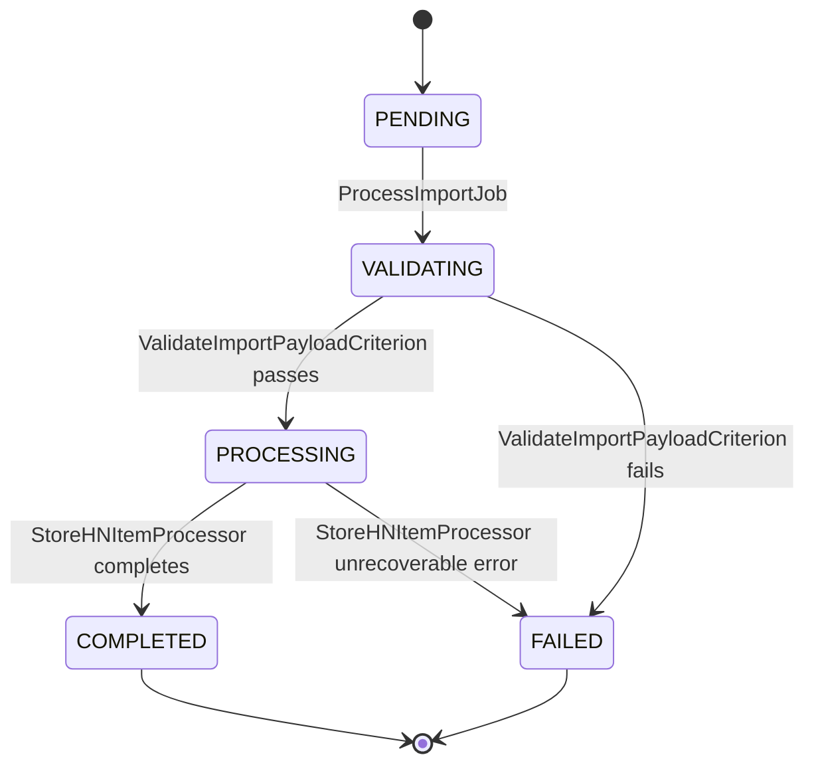
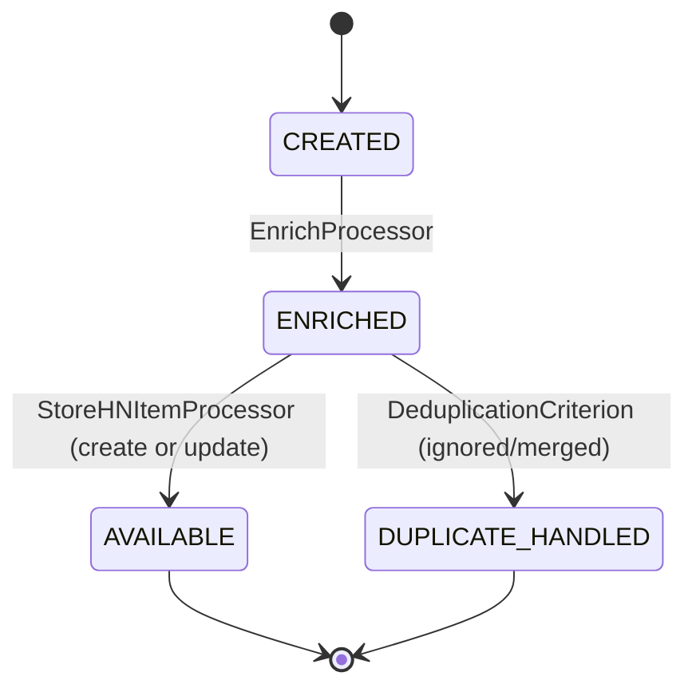
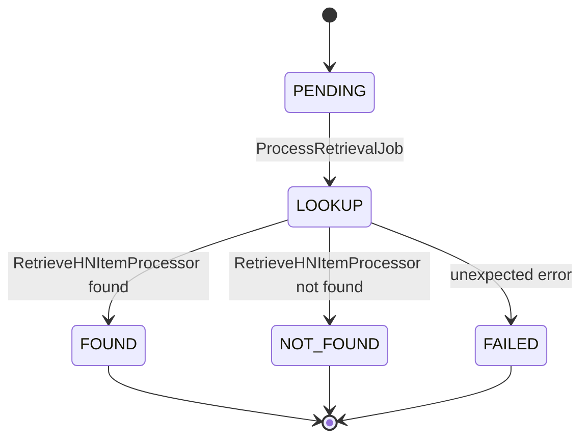

# Functional Requirements

This document specifies the current, authoritative functional requirements for the Hacker News ingest + retrieval prototype. It documents the entities, workflows, processors/criteria, and API contract. Where there was ambiguity, an explicit, pragmatic choice has been made and recorded here.

## 1. Entities

### HNItem
- id: Number (Hacker News id field, required and used as the unique business key)
- type: String (Hacker News type field, required, e.g. "story", "comment", "poll", ...)
- rawJson: Object (the original JSON payload as received; preserved exactly as submitted unless explicitly updated by merge rules)
- importTimestamp: String (ISO 8601 timestamp added when the item was persisted into the system)
- metadata: Object (optional; contains ingestion metadata such as validation notes, source, version, deduplication action, history)
- version: Number (incremented on updates; used for audit/optimistic concurrency if implemented)

Notes:
- rawJson must be preserved so the system can return the original payload by default. importTimestamp and metadata are stored in separate fields on the HNItem record and are not injected into rawJson unless requested.
- id is the primary business identifier used for deduplication and lookups.

### ImportJob
- technicalId: String (system-generated id for the orchestration entity; returned by POST endpoints)
- payload: Object | Array<Object> (the JSON payload to ingest; may be a single HN item object or an array of HN item objects)
- source: String (optional; source/origin information)
- createdAt: String (ISO 8601 timestamp when the job was created)
- status: String (PENDING / VALIDATING / PROCESSING / COMPLETED / FAILED)
- itemsCreatedCount: Number (how many HNItem records were newly created)
- itemsUpdatedCount: Number (how many existing HNItem records were updated/merged)
- itemsIgnoredCount: Number (how many incoming items were ignored due to exact-duplicate detection)
- errorMessage: String (failure reason if any)
- processingDetails: Object (optional; detailed per-item processing outcome for audit)

Notes:
- The job tracks created/updated/ignored counts separately to provide full visibility of what happened during processing.

### RetrievalJob
- technicalId: String (system-generated id for the orchestration entity)
- itemId: Number (HN item id requested)
- createdAt: String (ISO 8601 timestamp)
- status: String (PENDING / LOOKUP / FOUND / NOT_FOUND / FAILED)
- result: Object (when FOUND, contains rawJson and optional metadata if requested)
- errorMessage: String (failure reason if any)

Notes:
- RetrievalJob is an auditable orchestration record for lookups. Direct GET by id is also supported for convenience and can be audited via RetrievalJob.

---

## 2. Workflows and State Machines

### ImportJob workflow (detailed)
1. Created via POST /import-jobs. Initial state: PENDING.
2. System transitions job to VALIDATING and runs ValidateImportPayloadCriterion.
3. If validation passes, job transitions to PROCESSING.
4. Processing runs EnrichProcessor (adds importTimestamp to each item’s enriched record), then StoreHNItemProcessor (persists/merges items).
5. After processing, UpdateImportJobProcessor sets final status to COMPLETED and populates counts. If any unrecoverable error occurs, set FAILED with errorMessage.
6. Finalization writes processingDetails (per-item outcomes) to the job record for audit.

State diagram (Mermaid):

```mermaid
stateDiagram-v2
    [*] --> PENDING
    PENDING --> VALIDATING : ProcessImportJob
    VALIDATING --> PROCESSING : ValidateImportPayloadCriterion passes
    VALIDATING --> FAILED : ValidateImportPayloadCriterion fails
    PROCESSING --> COMPLETED : StoreHNItemProcessor completes
    PROCESSING --> FAILED : StoreHNItemProcessor unrecoverable error
    COMPLETED --> [*]
    FAILED --> [*]
```

Processors/criteria required for ImportJob:
- ValidateImportPayloadCriterion: validate overall payload and each item (presence and type checks). Returns per-item validation errors.
- EnrichProcessor: attach importTimestamp and canonicalize incoming item payloads for persistence.
- DeduplicationCriterion (used by StoreHNItemProcessor): determine whether an incoming item is new, an exact duplicate, or a changed record and decide action (CREATE / IGNORE / MERGE).
- StoreHNItemProcessor: upsert logic that creates new HNItem records or merges/updates existing ones; collects created/updated/ignored counts and per-item outcome details.
- UpdateImportJobProcessor: set final import job status, counts, and errorMessage when applicable.

Decision (explicit):
- Deduplication behavior: default = MERGE when the incoming item differs from stored rawJson (MERGE replaces rawJson and increments version; metadata records previous rawJson pointer or summary). If incoming item equals stored rawJson exactly, record as IGNORED. This default can be changed later (e.g., to always overwrite or to store versions) if product requirements change.


### HNItem workflow (detailed)
1. A HNItem is created (or updated) by StoreHNItemProcessor.
2. Enrichment: importTimestamp is added and metadata populated.
3. Availability: after successful persistence the item is queryable (AVAILABLE).
4. Duplicate handling: DeduplicationCriterion determines if the incoming item was merged, ignored, or created and this outcome is recorded in metadata and processingDetails.

State diagram (Mermaid):

```mermaid
stateDiagram-v2
    [*] --> CREATED
    CREATED --> ENRICHED : EnrichProcessor
    ENRICHED --> AVAILABLE : StoreHNItemProcessor (create or update)
    ENRICHED --> DUPLICATE_HANDLED : DeduplicationCriterion (ignored/merged)
    AVAILABLE --> [*]
    DUPLICATE_HANDLED --> [*]
```

Processors/criteria for HNItem:
- DeduplicationCriterion: compare incoming rawJson to stored rawJson by id. If exact match -> IGNORED. If different -> MERGE (update rawJson, increment version, record previous state in metadata). If not present -> CREATE.
- EnrichProcessor: attach importTimestamp and any canonicalization required for consistent storage.
- StoreHNItemProcessor: perform the persistent upsert and return per-item outcome (CREATED / UPDATED / IGNORED). Should be idempotent relative to the job (re-processing the same ImportJob should not create duplicates).

Notes about idempotency and concurrency:
- ImportJob processing must be idempotent. The system should use the ImportJob.technicalId and StoreHNItemProcessor upsert semantics to avoid duplicate created records when the same job is processed more than once.
- StoreHNItemProcessor should use optimistic concurrency (version) or transactions depending on the storage layer to avoid race conditions when multiple imports for the same id are processed concurrently.


### RetrievalJob workflow (detailed)
1. Created via POST /retrieval-jobs or implicitly by GET requests that want an auditable retrieval. Initial state: PENDING.
2. System transitions job to LOOKUP and runs RetrieveHNItemProcessor.
3. If found, job status = FOUND and result.rawJson populated; otherwise set to NOT_FOUND. Any unexpected error sets status = FAILED with errorMessage.
4. Final job record is persisted for audit and can be queried via GET /retrieval-jobs/{technicalId}.

State diagram (Mermaid):

```mermaid
stateDiagram-v2
    [*] --> PENDING
    PENDING --> LOOKUP : ProcessRetrievalJob
    LOOKUP --> FOUND : RetrieveHNItemProcessor found
    LOOKUP --> NOT_FOUND : RetrieveHNItemProcessor not found
    LOOKUP --> FAILED : unexpected error
    FOUND --> [*]
    NOT_FOUND --> [*]
    FAILED --> [*]
```

Processors/criteria for RetrievalJob:
- RetrieveHNItemProcessor: find HNItem by id and populate result.rawJson and optionally metadata.
- RetrievalAuthorizationCriterion (optional): check caller permissions for retrieval before lookup; if unauthorized, job may be set to FAILED and errorMessage populated.

Notes:
- RetrievalJob is useful for auditing and asynchronous retrievals. For synchronous, low-latency GET /hnitems/byId/{id} exists and does a direct lookup without creating a job unless auditing is requested.

---

## 3. Processor pseudocode (updated)

ValidateImportPayloadCriterion
```java
ValidationResult validate(ImportJob job) {
  // Normalize payload to an array for processing
  List<Object> items = normalizePayloadToList(job.payload);
  List<ItemError> errors = new ArrayList<>();
  for (int i = 0; i < items.size(); i++) {
    Object item = items.get(i);
    if (item == null) {
      errors.add(new ItemError(i, "item is null"));
      continue;
    }
    if (!item.containsKey("id") || item.get("id") == null) {
      errors.add(new ItemError(i, "missing id"));
      continue;
    }
    if (!(item.get("id") instanceof Number)) {
      errors.add(new ItemError(i, "id must be numeric"));
    }
    if (!item.containsKey("type") || item.get("type") == null) {
      errors.add(new ItemError(i, "missing type"));
    }
    // Optionally validate allowed types (story, comment, ...)
  }
  if (!errors.isEmpty()) {
    return ValidationResult.failure(errors);
  }
  return ValidationResult.success();
}
```

EnrichProcessor
```java
void process(ImportJob job) {
  List<Object> items = normalizePayloadToList(job.payload);
  String now = nowIso();
  for (Object item : items) {
    // Do not mutate the original submitted object if you need to preserve it elsewhere;
    // instead store enrichment fields on the HNItem record or on a copy used for persistence.
    item.put("importTimestamp", now);
  }
}
```

StoreHNItemProcessor
```java
void process(ImportJob job) {
  List<Object> items = normalizePayloadToList(job.payload);
  int created = 0, updated = 0, ignored = 0;
  List<PerItemOutcome> outcomes = new ArrayList<>();
  for (Object incoming : items) {
    Number id = (Number) incoming.get("id");
    HNItem existing = findHNItemById(id);
    if (existing == null) {
      // Create new HNItem
      HNItem h = new HNItem();
      h.id = id;
      h.type = (String) incoming.get("type");
      h.rawJson = deepCopy(incoming); // preserve original payload
      h.importTimestamp = (String) incoming.get("importTimestamp");
      h.version = 1;
      h.metadata = createMetadataForCreate(job.source);
      persist(h);
      created++;
      outcomes.add(new PerItemOutcome(id, "CREATED"));
    } else {
      if (jsonEquals(existing.rawJson, incoming)) {
        // Exact duplicate
        ignored++;
        outcomes.add(new PerItemOutcome(id, "IGNORED"));
      } else {
        // Merge/overwrite according to policy: here we update rawJson and increment version
        HNItem before = snapshot(existing);
        existing.rawJson = deepCopy(incoming);
        existing.importTimestamp = (String) incoming.get("importTimestamp");
        existing.version = existing.version + 1;
        updateMetadataWithMerge(existing.metadata, before);
        persist(existing);
        updated++;
        outcomes.add(new PerItemOutcome(id, "UPDATED"));
      }
    }
  }
  job.itemsCreatedCount = created;
  job.itemsUpdatedCount = updated;
  job.itemsIgnoredCount = ignored;
  job.processingDetails = outcomes;
}
```

UpdateImportJobProcessor
```java
void process(ImportJob job) {
  if (job.processingDetails == null && job.status != FAILED) {
    // Something went wrong; mark failed
    job.status = FAILED;
    job.errorMessage = "processing did not complete as expected";
    persist(job);
    return;
  }
  // If we reached here with outcomes, mark completed
  job.status = COMPLETED;
  job.updatedAt = nowIso();
  persist(job);
}
```

RetrieveHNItemProcessor
```java
void process(RetrievalJob job) {
  HNItem hn = findHNItemById(job.itemId);
  if (hn != null) {
    job.status = FOUND;
    job.result = Map.of("rawJson", deepCopy(hn.rawJson));
    // Optionally include metadata if requested by the caller
  } else {
    job.status = NOT_FOUND;
  }
  job.updatedAt = nowIso();
  persist(job);
}
```

Notes:
- The processors should return structured per-item outcomes so clients (or audit) can determine exactly what happened for each item in a bulk import.
- normalizePayloadToList() must accept a single object or an array and return a list. This makes the processing logic uniform.
- deepCopy/jsonEquals should perform canonical JSON operations that ignore field ordering differences when comparing equality.

---

## 4. API Endpoints, Rules & Request/Response Formats

Rules:
- POST endpoints create orchestration entities (ImportJob / RetrievalJob) and return only the technicalId by default to encourage asynchronous processing and to provide an audit trail.
- GET endpoints return persisted entities or HNItem results. A query parameter may enable returning extra fields (e.g., ?includeMetadata=true).
- The API supports both a job-based retrieval (auditable) and a direct GET by business id for convenience.

Endpoints:

1) POST /import-jobs
- Request JSON:
```json
{
  "payload": { /* single HN item JSON */ }
}
```
or
```json
{
  "payload": [ /* array of HN item JSON objects */ ],
  "source": "optional-source-id"
}
```
- Response:
```json
{ "technicalId": "importjob-xxxxxxxx" }
```
Behavior:
- The POST will persist an ImportJob entity with status PENDING and then trigger processing by the orchestration engine. Processing is asynchronous by default but the client can poll GET /import-jobs/{technicalId} for results.

2) GET /import-jobs/{technicalId}
- Response JSON: full persisted ImportJob object (status, itemsCreatedCount, itemsUpdatedCount, itemsIgnoredCount, processingDetails, errorMessage)

3) POST /retrieval-jobs
- Request JSON:
```json
{ "itemId": 12345 }
```
- Response:
```json
{ "technicalId": "retrievaljob-xxxxxxxx" }
```
Behavior:
- The POST will persist a RetrievalJob and trigger an immediate lookup. The client may poll GET /retrieval-jobs/{technicalId} or the system may optionally return a synchronous result if configured.

4) GET /retrieval-jobs/{technicalId}
- Response JSON: RetrievalJob object including status and result when FOUND. Example when found:
```json
{
  "technicalId": "retrievaljob-xyz",
  "itemId": 12345,
  "status": "FOUND",
  "result": { "rawJson": { /* original HN JSON */ } }
}
```

5) GET /hnitems/byId/{id}
- Response JSON (when found): by default the preserved original rawJson. Optional query parameter includeMetadata=true will add metadata and importTimestamp.
Example (default):
```json
{ /* original HN JSON exactly as submitted */ }
```
Example (with metadata):
```json
{
  "rawJson": { /* original HN JSON exactly as submitted */ },
  "importTimestamp": "2024-06-01T12:00:00Z",
  "metadata": { /* ingestion metadata such as version, source, dedupeAction */ }
}
```

Notes:
- Per the rule, POST endpoints return only technicalId. They act as a handle to track and audit asynchronous processing. The client may poll the GET endpoints to read full results.
- GET /hnitems/byId/{id} returns rawJson by default and will not inject importTimestamp into rawJson by default to preserve the original payload semantics.


---

## 5. Error Handling and Validation
- Validation errors set ImportJob.status = FAILED and populate ImportJob.errorMessage with a high-level summary. processingDetails should contain per-item validation errors.
- Processing errors that affect only some items should not cause the entire job to fail; outcomes should be recorded per-item and the overall job marked COMPLETED if processing ran to completion (with counts indicating failures). Only unrecoverable system errors should set job status = FAILED.
- RetrievalJob errors (e.g., storage unavailable) should set status = FAILED and include errorMessage.


## 6. Observability & Auditing
- The system should persist processingDetails for ImportJob and RetrievalJob to enable troubleshooting and audit.
- Each job and each HNItem should have timestamps (createdAt/updatedAt/importTimestamp) recorded as ISO 8601 strings.
- Store enough metadata (source, technicalId reference, dedupeAction, version) to reconstruct what happened during ingestion.


## 7. Future/Optional Decisions (explicit)
- Bulk-only vs single-item-only ingest: current API supports both (single object or array). This keeps client integration flexible. If product later requires bulk-only, change the API to reject single-item payloads.
- Deduplication strategy: default is MERGE on content difference, IGNORE on exact match. This can be changed to ALWAYS_OVERWRITE or append-only versioning later.
- Visibility of importTimestamp: default is NOT injected into rawJson responses. A query parameter (includeMetadata=true) can return importTimestamp and metadata alongside rawJson.
- Authorization: RetrievalAuthorizationCriterion is optional; if implemented, it should be enforced before lookup.


---

If you want these decisions (dedupe policy, visibility of importTimestamp, or single-vs-bulk ingest rules) changed, please tell me which one to change and I will update the functional requirements to reflect the new chosen behaviour.