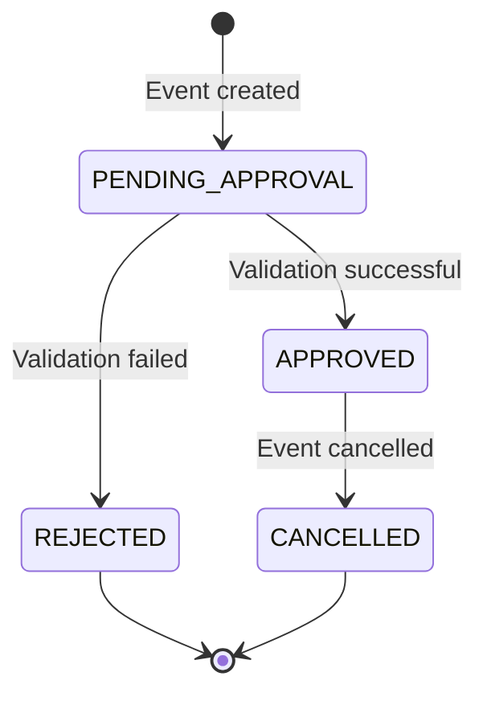
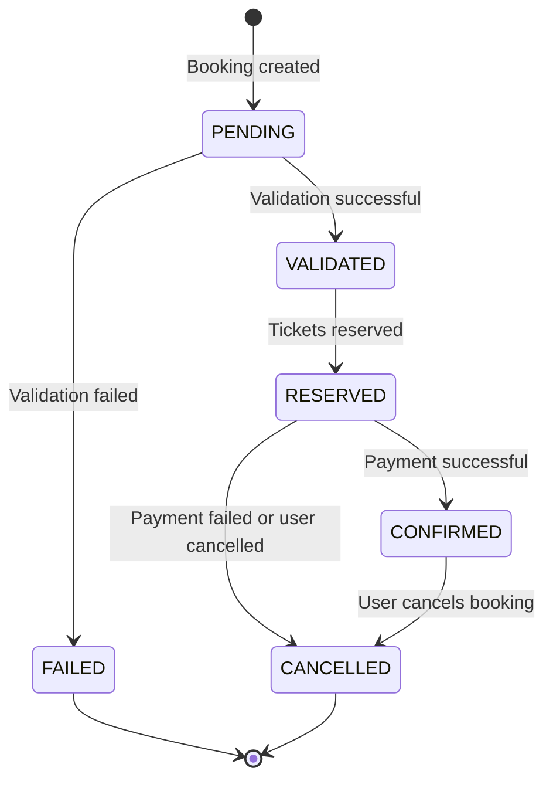
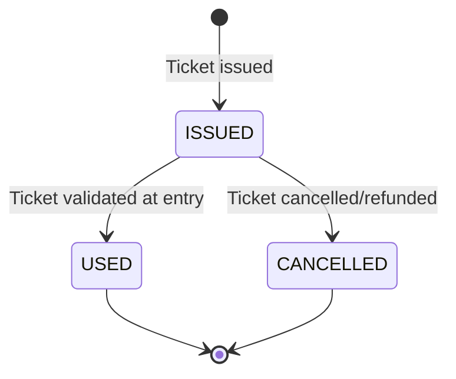
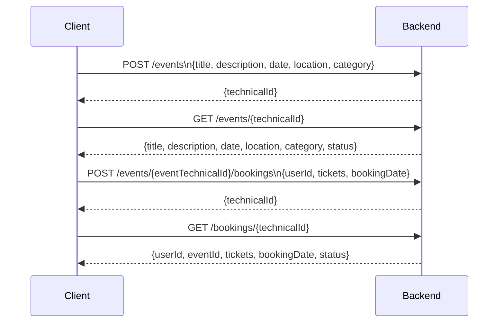

# Functional Requirements for Event Management Backend Application

---

## 1. Entity Definitions

```
Event:
- title: String (title of the event)
- description: String (description of the event)
- date: String (event date in ISO format)
- location: String (venue/location of the event)
- category: String (type of event e.g., conference, concert)

Booking:
- userId: String (identifier of the user making the booking)
- eventId: String (reference to the event)
- tickets: Integer (number of tickets booked)
- bookingDate: String (date of booking in ISO format)
- status: String (status of the booking, e.g. PENDING, CONFIRMED, CANCELLED)

Ticket:
- bookingId: String (reference to the booking)
- ticketNumber: String (unique ticket identifier)
- status: String (status of ticket, e.g. ISSUED, VALIDATED, CANCELLED)
```

---

## 2. Entity Workflows

### Event workflow:
```
1. Initial State: Event created with PENDING_APPROVAL status
2. Validation: Validate event details (title, date, location)
3. Scheduling Check: Verify no conflicting events at the same location/time
4. Approval: Update status to APPROVED or REJECTED
5. Notification: Notify subscribers or interested users of new or updated events
6. Cancellation: Update status to CANCELLED and notify attendees
```

```mermaid
stateDiagram-v2
    [*] --> PENDING_APPROVAL: Event created
    PENDING_APPROVAL --> APPROVED: Validation successful
    PENDING_APPROVAL --> REJECTED: Validation failed
    APPROVED --> CANCELLED: Event cancelled
    REJECTED --> [*]
    CANCELLED --> [*]
```

---

### Booking workflow:
```
1. Initial State: Booking created with PENDING status
2. Validation: Check event existence and tickets availability
3. Reservation: Reserve requested tickets
4. Payment Processing: Process payment (optional external integration)
5. Confirmation: Update booking status to CONFIRMED and issue tickets
6. Cancellation: Update status to CANCELLED and release tickets
7. Notification: Send booking confirmation or cancellation to user
```

```mermaid
stateDiagram-v2
    [*] --> PENDING: Booking created
    PENDING --> VALIDATED: Validation successful
    PENDING --> FAILED: Validation failed
    VALIDATED --> RESERVED: Tickets reserved
    RESERVED --> CONFIRMED: Payment successful
    RESERVED --> CANCELLED: Payment failed or user cancelled
    CONFIRMED --> CANCELLED: User cancels booking
    FAILED --> [*]
    CANCELLED --> [*]
```

---

### Ticket workflow:
```
1. Initial State: Ticket created with ISSUED status upon booking confirmation
2. Validation: Validate ticket at event entry (e.g., scan QR code)
3. Usage: Update status to USED when ticket is checked in
4. Cancellation: Update status to CANCELLED if booking is cancelled or refund issued
```

```mermaid
stateDiagram-v2
    [*] --> ISSUED: Ticket issued
    ISSUED --> USED: Ticket validated at entry
    ISSUED --> CANCELLED: Ticket cancelled/refunded
    USED --> [*]
    CANCELLED --> [*]
```

---

## 3. API Endpoints Design

### Event APIs

- **POST /events**  
  - Request JSON:  
  ```json
  {
    "title": "string",
    "description": "string",
    "date": "string",
    "location": "string",
    "category": "string"
  }
  ```
  - Response JSON:  
  ```json
  {
    "technicalId": "string"
  }
  ```

- **GET /events/{technicalId}**  
  - Response JSON:  
  ```json
  {
    "title": "string",
    "description": "string",
    "date": "string",
    "location": "string",
    "category": "string",
    "status": "string"
  }
  ```

- **GET /events**  
  - Query Parameters: location, date, category  
  - Response: list of Event objects (same as GET by technicalId)

---

### Booking APIs

- **POST /events/{eventTechnicalId}/bookings**  
  - Request JSON:  
  ```json
  {
    "userId": "string",
    "tickets": "integer",
    "bookingDate": "string"
  }
  ```
  - Response JSON:  
  ```json
  {
    "technicalId": "string"
  }
  ```

- **GET /bookings/{technicalId}**  
  - Response JSON:  
  ```json
  {
    "userId": "string",
    "eventId": "string",
    "tickets": "integer",
    "bookingDate": "string",
    "status": "string"
  }
  ```

- **GET /bookings**  
  - Response: list of Booking objects

---

### Ticket APIs

- **GET /tickets/{technicalId}**  
  - Response JSON:  
  ```json
  {
    "bookingId": "string",
    "ticketNumber": "string",
    "status": "string"
  }
  ```

---

## 4. Request/Response Sequence Diagram


```mermaid
sequenceDiagram
    participant Client
    participant Backend

    Client->>Backend: POST /events\n{title, description, date, location, category}
    Backend-->>Client: {technicalId}

    Client->>Backend: GET /events/{technicalId}
    Backend-->>Client: {title, description, date, location, category, status}

    Client->>Backend: POST /events/{eventTechnicalId}/bookings\n{userId, tickets, bookingDate}
    Backend-->>Client: {technicalId}

    Client->>Backend: GET /bookings/{technicalId}
    Backend-->>Client: {userId, eventId, tickets, bookingDate, status}
```

---

**This document represents the finalized functional requirements suitable for direct implementation on the Cyoda platform with Java Spring Boot.**
