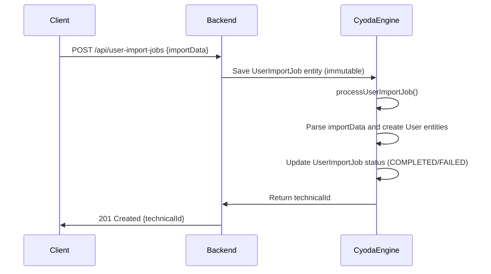
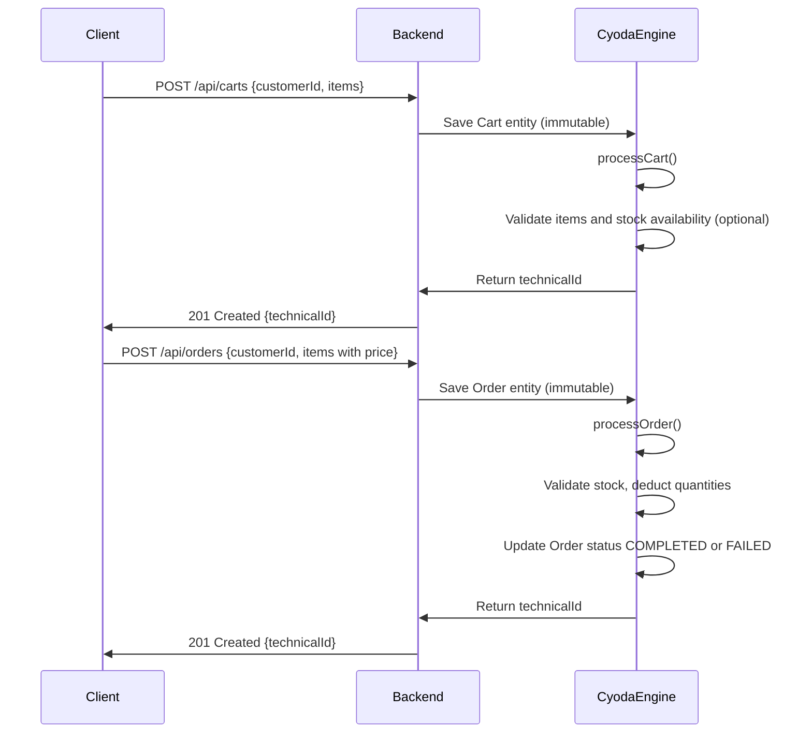
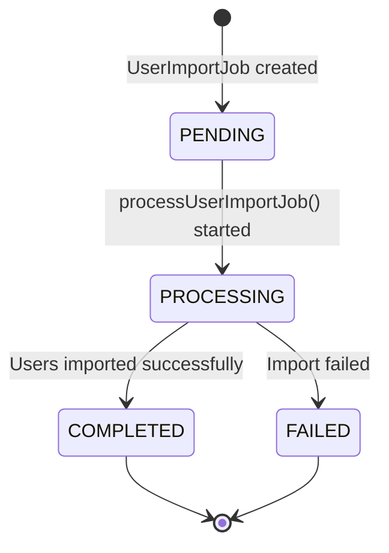
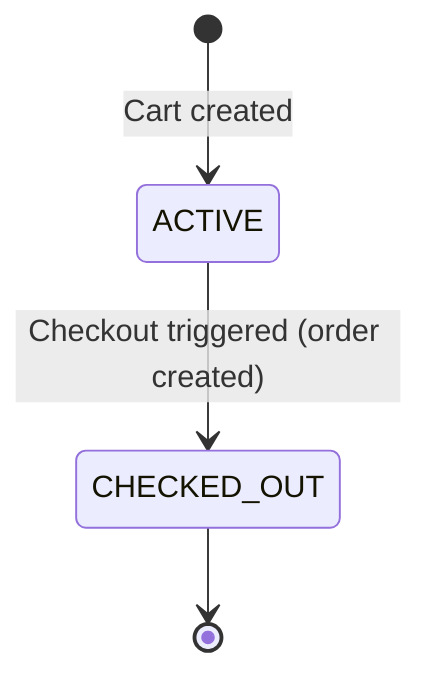
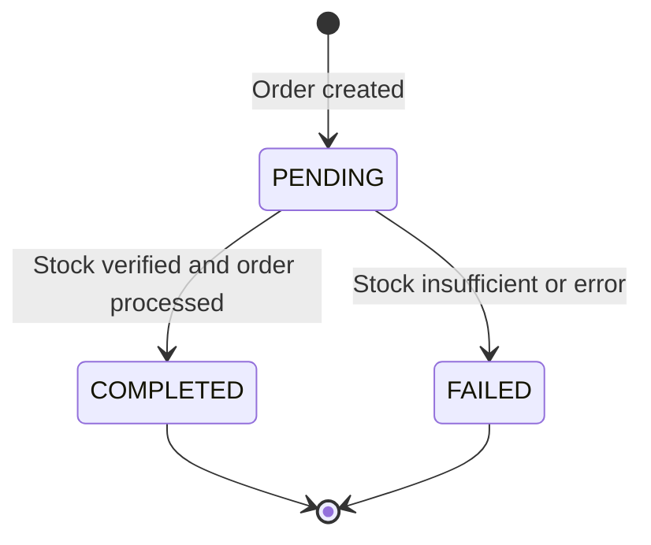

# Functional Requirements: Event-Driven Order Management System

---

## 1. Entity Definitions

```
UserImportJob:
- jobId: String (unique identifier for the import job)
- importData: String (raw user data in JSON or CSV format)
- status: String (job processing status: PENDING, PROCESSING, COMPLETED, FAILED)
- createdAt: DateTime (timestamp of job creation)

User:
- userId: String (unique identifier for user)
- name: String (user's full name)
- email: String (user email)
- role: String (user role: Admin or Customer)
- createdAt: DateTime (user creation timestamp)

Cart:
- cartId: String (unique identifier for the shopping cart)
- customerId: String (reference to Customer userId)
- items: List<CartItem> (list of current products in cart)
- status: String (cart status: ACTIVE, CHECKED_OUT)
- createdAt: DateTime (cart creation timestamp)

CartItem:
- productId: String (reference to Product)
- quantity: Integer (number of product units added)

Order:
- orderId: String (unique identifier for the order)
- customerId: String (reference to Customer userId)
- items: List<OrderItem> (products and quantities purchased)
- status: String (order status: PENDING, COMPLETED, FAILED)
- createdAt: DateTime (order creation timestamp)

OrderItem:
- productId: String (reference to Product)
- quantity: Integer (number of product units ordered)
- price: Decimal (price per unit at order time)

Product:
- productId: String (unique product identifier, e.g., SKU)
- name: String (product name)
- description: String (product description)
- price: Decimal (product price)
- stockQuantity: Integer (available stock quantity)
- createdAt: DateTime (timestamp of product creation)
```

---

## 2. Process Method Flows

### processUserImportJob() Flow:
1. Initial State: UserImportJob created with status = PENDING  
2. Validation: Validate importData format (JSON or CSV)  
3. Processing: Parse importData, create immutable User entities for each user record  
4. Status Update: Update UserImportJob status to COMPLETED or FAILED  
5. Notification: Optionally notify on import completion or errors  

### processUser() Flow:
1. Initial State: User entity created  
2. Validation: Check uniqueness of userId and email  
3. Persistence: Save immutable User record  
4. Post-Processing: Trigger role-specific events if applicable  

### processCart() Flow:
1. Initial State: Cart created with status ACTIVE  
2. Validation: Validate customerId exists and items list is valid  
3. Stock Check: (If triggered) Verify product availability for items added  
4. Persistence: Save immutable Cart record with items  
5. Status Update: On checkout event, update Cart status to CHECKED_OUT  
6. Trigger Order Creation (via order creation POST)  

### processOrder() Flow:
1. Initial State: Order created with status PENDING  
2. Validation: Verify customerId and items against product stock  
3. Stock Deduction: Deduct stock quantities from Product entities  
4. Status Update: Set Order status to COMPLETED or FAILED based on stock availability  
5. Notification: Trigger order confirmation or failure notifications  

### processProduct() Flow:
1. Initial State: Product created  
2. Validation: Validate name, price ≥ 0, stockQuantity ≥ 0  
3. Persistence: Save immutable Product record  
4. Post-Processing: Trigger inventory update events if needed  

---

## 3. API Endpoints Design

| Entity         | POST Endpoint                       | GET by technicalId Endpoint                | GET by condition Endpoint (if needed)       |
|----------------|------------------------------------|-------------------------------------------|----------------------------------------------|
| UserImportJob  | POST /api/user-import-jobs          | GET /api/user-import-jobs/{technicalId}  | (Optional: by status)                         |
| User           | POST /api/users                     | GET /api/users/{technicalId}               | (Optional: by email or role)                  |
| Cart           | POST /api/carts                    | GET /api/carts/{technicalId}               | (Optional: by customerId or status)           |
| Order          | POST /api/orders                   | GET /api/orders/{technicalId}              | (Optional: by customerId or status)           |
| Product        | POST /api/products/import          | GET /api/products/{technicalId}            | (Optional: by name or SKU)                     |

- All POST endpoints create immutable entities and return only `technicalId`.
- No update or delete endpoints unless explicitly requested.
- Cart checkout is handled by creating an Order entity with status PENDING, triggered by the client.
- UserImportJob triggers batch user creation asynchronously.

---

## 4. Request/Response Formats

### POST /api/user-import-jobs

_Request:_
```json
{
  "importData": "string (JSON or CSV formatted user data)"
}
```

_Response:_
```json
{
  "technicalId": "string"
}
```

---

### POST /api/users

_Request:_
```json
{
  "userId": "string",
  "name": "string",
  "email": "string",
  "role": "Admin" | "Customer"
}
```

_Response:_
```json
{
  "technicalId": "string"
}
```

---

### POST /api/carts

_Request:_
```json
{
  "customerId": "string",
  "items": [
    {
      "productId": "string",
      "quantity": 1
    }
  ]
}
```

_Response:_
```json
{
  "technicalId": "string"
}
```

---

### POST /api/orders

_Request:_
```json
{
  "customerId": "string",
  "items": [
    {
      "productId": "string",
      "quantity": 1,
      "price": 0.0
    }
  ]
}
```

_Response:_
```json
{
  "technicalId": "string"
}
```

---

### POST /api/products/import

_Request:_
```json
[
  {
    "productId": "string",
    "name": "string",
    "description": "string",
    "price": 0.0,
    "stockQuantity": 0
  }
]
```

_Response:_
```json
{
  "technicalId": "string"
}
```

---

## 5. Mermaid Diagrams


```mermaid
sequenceDiagram
  participant Client
  participant Backend
  participant CyodaEngine

  Client->>Backend: POST /api/user-import-jobs {importData}
  Backend->>CyodaEngine: Save UserImportJob entity (immutable)
  CyodaEngine->>CyodaEngine: processUserImportJob()
  CyodaEngine->>CyodaEngine: Parse importData and create User entities
  CyodaEngine->>CyodaEngine: Update UserImportJob status (COMPLETED/FAILED)
  CyodaEngine->>Backend: Return technicalId
  Backend->>Client: 201 Created {technicalId}
```


```mermaid
sequenceDiagram
  participant Client
  participant Backend
  participant CyodaEngine

  Client->>Backend: POST /api/carts {customerId, items}
  Backend->>CyodaEngine: Save Cart entity (immutable)
  CyodaEngine->>CyodaEngine: processCart()
  CyodaEngine->>CyodaEngine: Validate items and stock availability (optional)
  CyodaEngine->>Backend: Return technicalId
  Backend->>Client: 201 Created {technicalId}

  Client->>Backend: POST /api/orders {customerId, items with price}
  Backend->>CyodaEngine: Save Order entity (immutable)
  CyodaEngine->>CyodaEngine: processOrder()
  CyodaEngine->>CyodaEngine: Validate stock, deduct quantities
  CyodaEngine->>CyodaEngine: Update Order status COMPLETED or FAILED
  CyodaEngine->>Backend: Return technicalId
  Backend->>Client: 201 Created {technicalId}
```


```mermaid
stateDiagram-v2
  [*] --> PENDING : UserImportJob created
  PENDING --> PROCESSING : processUserImportJob() started
  PROCESSING --> COMPLETED : Users imported successfully
  PROCESSING --> FAILED : Import failed
  COMPLETED --> [*]
  FAILED --> [*]
```


```mermaid
stateDiagram-v2
  [*] --> ACTIVE : Cart created
  ACTIVE --> CHECKED_OUT : Checkout triggered (order created)
  CHECKED_OUT --> [*]
```


```mermaid
stateDiagram-v2
  [*] --> PENDING : Order created
  PENDING --> COMPLETED : Stock verified and order processed
  PENDING --> FAILED : Stock insufficient or error
  COMPLETED --> [*]
  FAILED --> [*]
```

---

This completes the finalized functional requirements and API specification for your event-driven order management system.