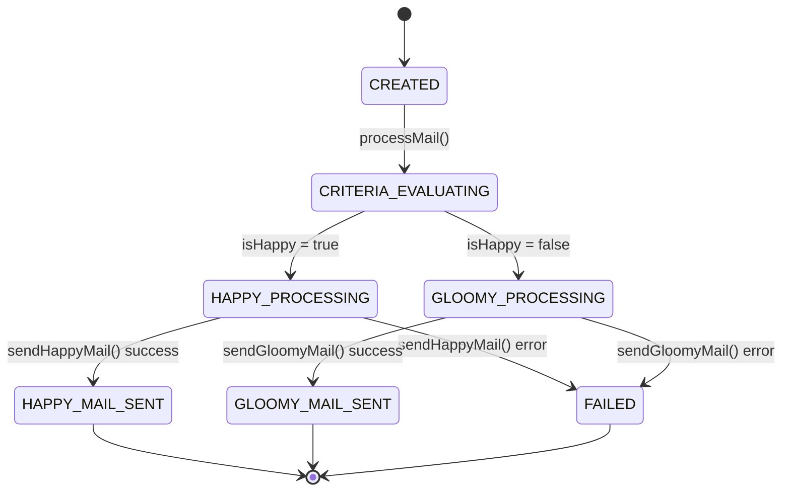
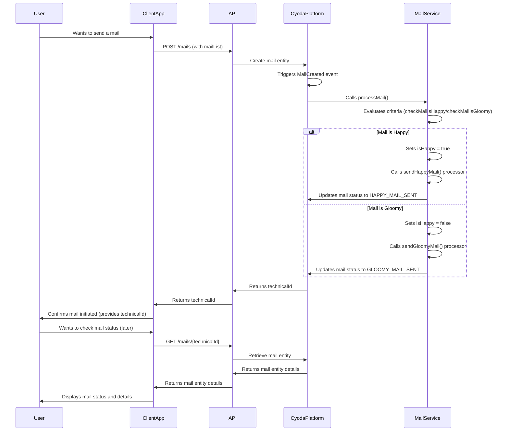

### 1. Entity Definitions

```
mail:
  - isHappy: Boolean (Indicates if the mail is classified as happy or gloomy based on criteria)
  - mailList: List<String> (List of recipient email addresses for the mail)
```

### 2. Process Method Flows

**`processMail()` Flow:**
1.  **Initial State**: A `mail` entity is created via the POST endpoint. Its initial status could be `CREATED`.
2.  **Criteria Evaluation**:
    *   Cyoda automatically triggers `checkMailIsHappy()` and `checkMailIsGloomy()` events.
    *   Based on the outcome of these checks, the `isHappy` field of the `mail` entity is determined and set.
3.  **Processor Invocation**:
    *   If `isHappy` is `true`, the `sendHappyMail()` processor is invoked.
    *   If `isHappy` is `false` (meaning the mail is gloomy), the `sendGloomyMail()` processor is invoked.
4.  **Completion/Status Update**: After the respective mail sending processor completes, the `mail` entity's status is updated (e.g., `HAPPY_MAIL_SENT`, `GLOOMY_MAIL_SENT`, or `FAILED` if an error occurs).

### 3. API Endpoints Design

*   **POST /mails**
    *   **Purpose**: To create a new `mail` entity. This action triggers the `processMail()` workflow.
    *   **Request Body**: Contains initial data for the `mail` entity, specifically `mailList`. The `isHappy` field will be set by the system based on criteria.
    *   **Response**: Returns the `technicalId` of the newly created `mail` entity.

*   **GET /mails/{technicalId}**
    *   **Purpose**: To retrieve the details and final state/result of a specific `mail` entity by its unique `technicalId`.
    *   **Response**: Returns the complete `mail` entity details, including its `isHappy` status and `mailList`.

### 4. Request/Response Formats

**POST /mails**

*   **Request JSON:**
    ```json
    {
      "mailList": ["recipient1@example.com", "recipient2@example.com"]
      // Note: isHappy is not provided in the request, it's determined by the system
    }
    ```
*   **Response JSON (Success):**
    ```json
    {
      "technicalId": "a1b2c3d4-e5f6-7890-1234-567890abcdef"
    }
    ```

**GET /mails/{technicalId}**

*   **Response JSON (Success):**
    ```json
    {
      "technicalId": "a1b2c3d4-e5f6-7890-1234-567890abcdef",
      "isHappy": true,
      "mailList": ["recipient1@example.com", "recipient2@example.com"],
      "status": "HAPPY_MAIL_SENT"
      // Additional fields like timestamp, etc., could be added
    }
    ```

### 5. Visual Representation

#### Entity Lifecycle State Diagram: `mail`


```mermaid
stateDiagram-v2
    [*] --> CREATED
    CREATED --> CRITERIA_EVALUATING : processMail()
    CRITERIA_EVALUATING --> HAPPY_PROCESSING : isHappy = true
    CRITERIA_EVALUATING --> GLOOMY_PROCESSING : isHappy = false
    HAPPY_PROCESSING --> HAPPY_MAIL_SENT : sendHappyMail() success
    HAPPY_PROCESSING --> FAILED : sendHappyMail() error
    GLOOMY_PROCESSING --> GLOOMY_MAIL_SENT : sendGloomyMail() success
    GLOOMY_PROCESSING --> FAILED : sendGloomyMail() error
    HAPPY_MAIL_SENT --> [*]
    GLOOMY_MAIL_SENT --> [*]
    FAILED --> [*]
```

#### Event-driven Processing Chain: `mail` Entity

```mermaid
graph TD
    A[POST /mails Request] --> B{Cyoda Platform};
    B --> C[MailCreated Event];
    C --> D[processMail() Method Triggered];
    D --> E{Check Mail Criteria};
    E -- isHappy = true --> F[Invoke sendHappyMail() Processor];
    E -- isHappy = false --> G[Invoke sendGloomyMail() Processor];
    F --> H[Mail Status: HAPPY_MAIL_SENT];
    G --> I[Mail Status: GLOOMY_MAIL_SENT];
    F --> J[Mail Status: FAILED];
    G --> K[Mail Status: FAILED];
    H --> L[Return technicalId to User];
    I --> L;
    J --> L;
    K --> L;
```

#### User Interaction Sequence Flow


```mermaid
sequenceDiagram
    participant User
    participant ClientApp
    participant API
    participant CyodaPlatform
    participant MailService

    User->>ClientApp: Wants to send a mail
    ClientApp->>API: POST /mails (with mailList)
    API->>CyodaPlatform: Create mail entity
    CyodaPlatform->>CyodaPlatform: Triggers MailCreated event
    CyodaPlatform->>MailService: Calls processMail()
    MailService->>MailService: Evaluates criteria (checkMailIsHappy/checkMailIsGloomy)
    alt Mail is Happy
        MailService->>MailService: Sets isHappy = true
        MailService->>MailService: Calls sendHappyMail() processor
        MailService->>CyodaPlatform: Updates mail status to HAPPY_MAIL_SENT
    else Mail is Gloomy
        MailService->>MailService: Sets isHappy = false
        MailService->>MailService: Calls sendGloomyMail() processor
        MailService->>CyodaPlatform: Updates mail status to GLOOMY_MAIL_SENT
    end
    CyodaPlatform->>API: Returns technicalId
    API->>ClientApp: Returns technicalId
    ClientApp->>User: Confirms mail initiated (provides technicalId)

    User->>ClientApp: Wants to check mail status (later)
    ClientApp->>API: GET /mails/{technicalId}
    API->>CyodaPlatform: Retrieve mail entity
    CyodaPlatform->>API: Returns mail entity details
    API->>ClientApp: Returns mail entity details
    ClientApp->>User: Displays mail status and details
```