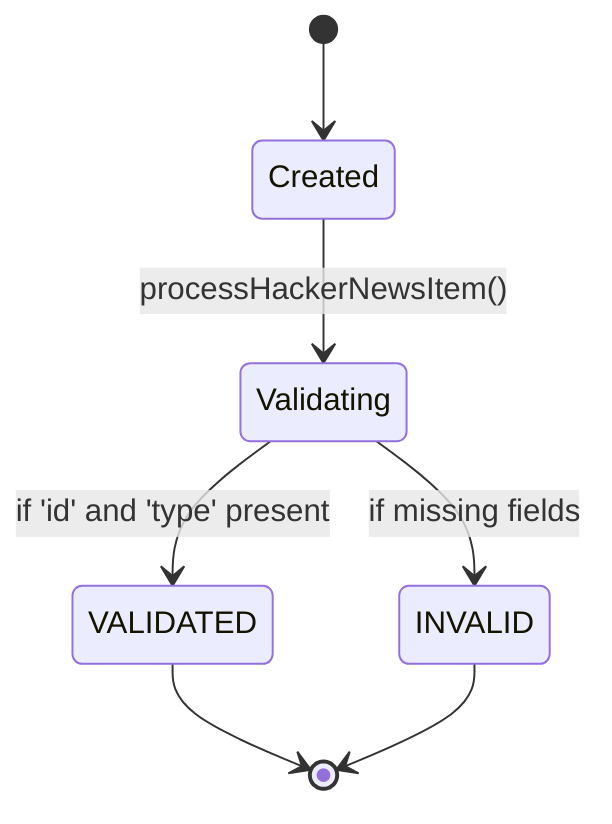
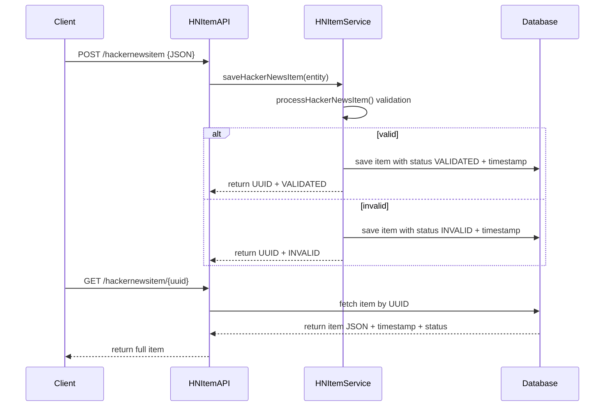

### 1. Entity Definitions

``` 
HackerNewsItem:
  - id: UUID (unique identifier generated on creation)
  - content: JSON (raw Hacker News item JSON from Firebase API)
  - timestamp: Instant (time when the item was saved)
  - status: StatusEnum {INVALID, VALIDATED} (validation state)
```

### 2. Process Method Flows

```
processHackerNewsItem() Flow:
1. Initial State: HackerNewsItem created with status PENDING (implicit before validation)
2. Validation: Check that 'id' and 'type' fields exist in the content JSON
3. Status Update:
   - If validation fails, update status to INVALID
   - If validation passes, update status to VALIDATED
4. Persistence: Save the item with generated UUID and current timestamp
5. Response: Return the UUID and the final status (INVALID or VALIDATED)
```

### 3. API Endpoints and Request/Response Formats

- **POST /hackernewsitem**  
  Request body:  
  ```json
  {
    "id": 12345,
    "type": "story",
    "...": "other fields as per Firebase HN JSON"
  }
  ```  
  Response body:  
  ```json
  {
    "uuid": "generated-uuid-string",
    "status": "VALIDATED" | "INVALID"
  }
  ```  

- **GET /hackernewsitem/{uuid}**  
  Response body:  
  ```json
  {
    "id": 12345,
    "type": "story",
    "...": "other original fields",
    "timestamp": "2024-06-01T12:34:56Z",
    "status": "VALIDATED" | "INVALID"
  }
  ```

### 4. Visual Representations

#### Entity Lifecycle State Diagram


```mermaid
stateDiagram-v2
    [*] --> Created
    Created --> Validating : processHackerNewsItem()
    Validating --> VALIDATED : if 'id' and 'type' present
    Validating --> INVALID : if missing fields
    VALIDATED --> [*]
    INVALID --> [*]
```

#### Event-Driven Processing Chain


```mermaid
sequenceDiagram
    participant Client
    participant API as HNItemAPI
    participant Service as HNItemService
    participant DB as Database

    Client->>API: POST /hackernewsitem {JSON}
    API->>Service: saveHackerNewsItem(entity)
    Service->>Service: processHackerNewsItem() validation
    alt valid
        Service->>DB: save item with status VALIDATED + timestamp
        Service-->>API: return UUID + VALIDATED
    else invalid
        Service->>DB: save item with status INVALID + timestamp
        Service-->>API: return UUID + INVALID
    end

    Client->>API: GET /hackernewsitem/{uuid}
    API->>DB: fetch item by UUID
    DB-->>API: return item JSON + timestamp + status
    API-->>Client: return full item
```

---

Feel free to use this as your functional specification for the HackerNews item saving service on Cyoda platform.