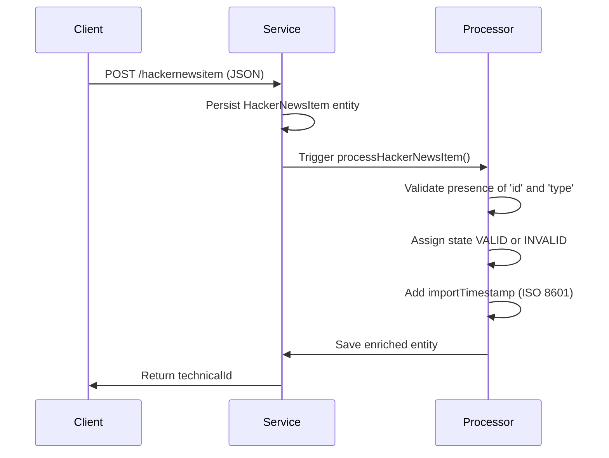

### 1. Entity Definitions

```
HackerNewsItem:
- id: Long (unique Hacker News item id)
- type: String (item type, e.g., story, comment, job)
- jsonData: String (original JSON from Firebase HN API)
- state: String (VALID or INVALID, based on presence of id and type)
- importTimestamp: String (ISO 8601 format timestamp of import, stored separately from jsonData)
```

### 2. Process Method Flows

```
processHackerNewsItem() Flow:
1. Initial State: HackerNewsItem entity created with supplied jsonData.
2. Validation: Check presence of 'id' and 'type' fields inside jsonData.
3. State Assignment: 
   - If both fields present → state = VALID
   - Otherwise → state = INVALID
4. Import Timestamp: Assign current timestamp (ISO 8601 format).
5. Storage: Persist entity with original jsonData, state, and importTimestamp.
6. Completion: Entity is ready for retrieval by id.
```

### 3. API Endpoints Design

- **POST /hackernewsitem**  
  - Description: Create a new HackerNewsItem entity. Input is the JSON item (Firebase HN API format).  
  - Response: Return only the generated `technicalId` of the stored entity.

- **GET /hackernewsitem/{technicalId}**  
  - Description: Retrieve the HackerNewsItem by its `technicalId`.  
  - Response: JSON containing original `jsonData`, `state`, and `importTimestamp`.

- No update or delete endpoints, following EDA immutability principles.

### 4. Request/Response Formats

**POST /hackernewsitem**  
_Request Body (example):_
```json
{
  "id": 123456,
  "type": "story",
  "by": "username",
  "time": 1610000000,
  "text": "Example story text",
  "url": "https://example.com/story"
}
```
_Response Body:_
```json
{
  "technicalId": "uuid-or-generated-id"
}
```

**GET /hackernewsitem/{technicalId}**  
_Response Body:_
```json
{
  "jsonData": {
    "id": 123456,
    "type": "story",
    "by": "username",
    "time": 1610000000,
    "text": "Example story text",
    "url": "https://example.com/story"
  },
  "state": "VALID",
  "importTimestamp": "2024-06-01T12:00:00Z"
}
```

---

### Mermaid Diagram: Event-Driven Processing Chain


```mermaid
sequenceDiagram
    participant Client
    participant Service
    participant Processor

    Client->>Service: POST /hackernewsitem (JSON)
    Service->>Service: Persist HackerNewsItem entity
    Service->>Processor: Trigger processHackerNewsItem()
    Processor->>Processor: Validate presence of 'id' and 'type'
    Processor->>Processor: Assign state VALID or INVALID
    Processor->>Processor: Add importTimestamp (ISO 8601)
    Processor->>Service: Save enriched entity
    Service->>Client: Return technicalId
```