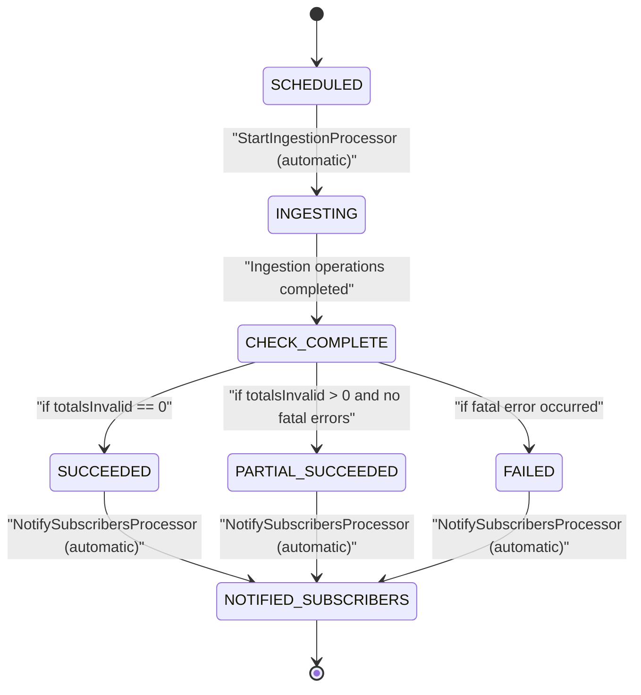
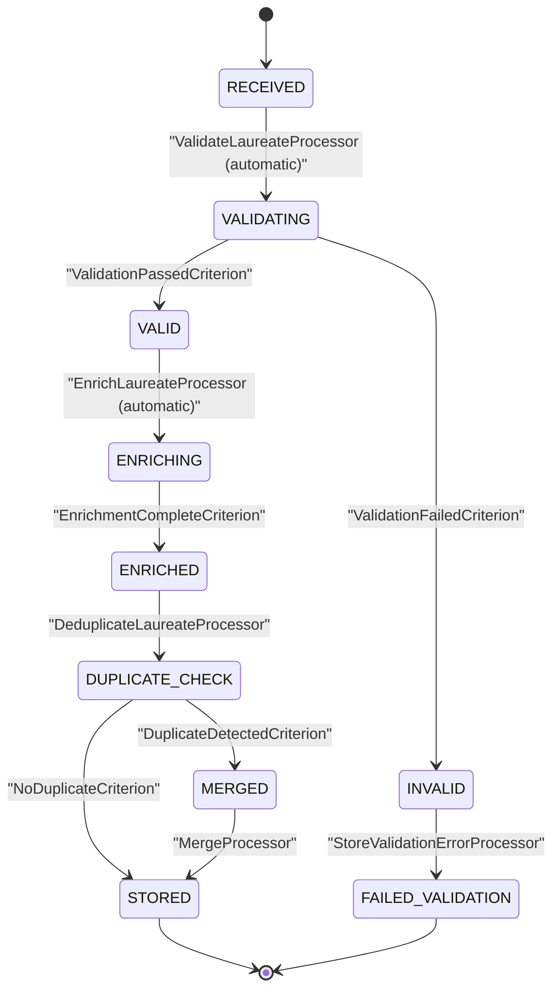
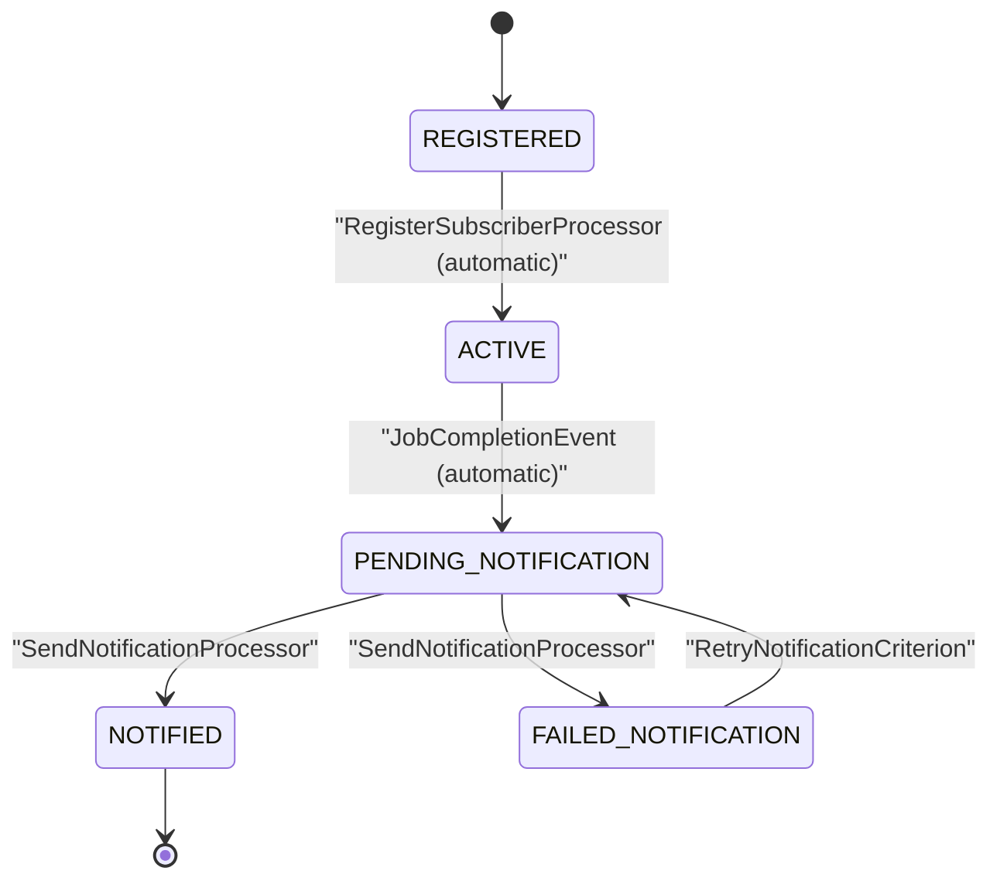

### 1. Entity Definitions
```
Job:
- id: String (human job identifier; optional)
- sourceUri: String (data source location for ingestion)
- scheduleType: String (one-off or periodic)
- scheduleExpression: String (cron/interval description)
- status: String (current workflow state: SCHEDULED, INGESTING, SUCCEEDED, PARTIAL_SUCCEEDED, FAILED, NOTIFIED_SUBSCRIBERS)
- startedAt: String (timestamp)
- finishedAt: String (timestamp)
- totalsFetched: Integer (number of records fetched)
- totalsValid: Integer (number of records validated)
- totalsInvalid: Integer (number of records failed validation)
- errorSummary: String (short description of job-level errors)
- notifyAllActive: Boolean (flag to notify subscribers)
- createdBy: String (who created the job)
- technicalId: String (system-generated id returned by POST)

Laureate:
- laureateId: Integer (domain id from source, if present)
- firstname: String (given name)
- surname: String (family name)
- gender: String (gender)
- born: String (birth date)
- died: String (death date or null)
- bornCountry: String (country name)
- bornCountryCode: String (country code)
- bornCity: String (city)
- year: String (award year)
- category: String (award category)
- motivation: String (award motivation)
- affiliationName: String (affiliation name)
- affiliationCity: String (affiliation city)
- affiliationCountry: String (affiliation country)
- computedAge: Integer (derived age at award or current)
- validationStatus: String (VALID or INVALID)
- enrichmentStatus: String (ENRICHED or PENDING)
- sourceJobId: String (Job technicalId that produced this record)
- mergedFrom: Array of Strings (optional - technicalIds of merged records)
- createdAt: String (timestamp)
- technicalId: String (system-generated id returned if created via POST — not used here because ingestion persists these)

Subscriber:
- id: String (human subscriber identifier; optional)
- name: String (human readable name)
- contactType: String (email or webhook or other)
- contactAddress: String (email address or endpoint)
- active: Boolean (is subscriber active)
- preferredFormat: String (summary or full_payload)
- lastNotifiedAt: String (timestamp of last notification)
- notificationStatus: String (last notification outcome)
- technicalId: String (system-generated id returned by POST)
```

Confirmed defaults (as requested by the user)
- Deduplication strategy: prefer source laureateId; if missing, fuzzy match by firstname+surname+year+affiliation.
- Job success semantics: treat jobs with some invalid records as PARTIAL_SUCCEEDED (not FAILED).
- Notification content: default to summary; send full_payload only if subscriber.preferredFormat == full_payload.

---

### 2. Entity workflows

Job workflow:
1. Initial State: Job persisted with status SCHEDULED (event: Job created via POST).
2. Start (automatic): StartIngestionProcessor sets startedAt and moves to INGESTING.
3. Ingestion (automatic): IngestRecordsProcessor fetches records from sourceUri and persists Laureate records (each persist triggers Laureate workflow).
4. Aggregate (automatic): AggregateResultsProcessor computes totals (totalsFetched, totalsValid, totalsInvalid).
5. Completion (automatic criterion): CheckIngestionCompleteCriterion determines SUCCEEDED / PARTIAL_SUCCEEDED / FAILED.
   - SUCCEEDED: ingestion completed, no invalid records.
   - PARTIAL_SUCCEEDED: ingestion completed but some records invalid.
   - FAILED: fatal error prevented ingestion completion.
6. Notification (automatic): NotifySubscribersProcessor creates notification events for active Subscribers (if notifyAllActive true).
7. Finalization: job status becomes NOTIFIED_SUBSCRIBERS and finishedAt set.

Mermaid Job state diagram

```mermaid
stateDiagram-v2
    [*] --> SCHEDULED
    SCHEDULED --> INGESTING : "StartIngestionProcessor (automatic)"
    INGESTING --> CHECK_COMPLETE : "Ingestion operations completed"
    CHECK_COMPLETE --> SUCCEEDED : "if totalsInvalid == 0"
    CHECK_COMPLETE --> PARTIAL_SUCCEEDED : "if totalsInvalid > 0 and no fatal errors"
    CHECK_COMPLETE --> FAILED : "if fatal error occurred"
    SUCCEEDED --> NOTIFIED_SUBSCRIBERS : "NotifySubscribersProcessor (automatic)"
    PARTIAL_SUCCEEDED --> NOTIFIED_SUBSCRIBERS : "NotifySubscribersProcessor (automatic)"
    FAILED --> NOTIFIED_SUBSCRIBERS : "NotifySubscribersProcessor (automatic)"
    NOTIFIED_SUBSCRIBERS --> [*]
```

Job processors and criteria
- Processors: StartIngestionProcessor, IngestRecordsProcessor, AggregateResultsProcessor, NotifySubscribersProcessor
- Criteria: CheckIngestionCompleteCriterion, CheckNotificationCompleteCriterion

Laureate workflow (per-record; triggered automatically when a Laureate is persisted)
1. Initial State: Laureate persisted with status RECEIVED.
2. Validation (automatic): ValidateLaureateProcessor sets validationStatus -> VALID or INVALID.
3. Enrichment (automatic if VALID): EnrichLaureateProcessor populates computed fields and sets enrichmentStatus -> ENRICHED.
4. Deduplication (automatic): DeduplicateLaureateProcessor uses the confirmed deduplication strategy (prefer source laureateId; fallback fuzzy match on firstname+surname+year+affiliation) and directs to MERGED or STORED.
5. Storage: StoreLaureateProcessor persists final record and updates sourceJob aggregates.

Mermaid Laureate state diagram

```mermaid
stateDiagram-v2
    [*] --> RECEIVED
    RECEIVED --> VALIDATING : "ValidateLaureateProcessor (automatic)"
    VALIDATING --> VALID : "ValidationPassedCriterion"
    VALIDATING --> INVALID : "ValidationFailedCriterion"
    VALID --> ENRICHING : "EnrichLaureateProcessor (automatic)"
    ENRICHING --> ENRICHED : "EnrichmentCompleteCriterion"
    ENRICHED --> DUPLICATE_CHECK : "DeduplicateLaureateProcessor"
    DUPLICATE_CHECK --> MERGED : "DuplicateDetectedCriterion"
    DUPLICATE_CHECK --> STORED : "NoDuplicateCriterion"
    MERGED --> STORED : "MergeProcessor"
    STORED --> [*]
    INVALID --> FAILED_VALIDATION : "StoreValidationErrorProcessor"
    FAILED_VALIDATION --> [*]
```

Laureate processors and criteria
- Processors: ValidateLaureateProcessor, EnrichLaureateProcessor, DeduplicateLaureateProcessor, MergeProcessor, StoreLaureateProcessor
- Criteria: ValidationPassedCriterion, EnrichmentCompleteCriterion, DuplicateDetectedCriterion

Subscriber workflow:
1. Initial State: Subscriber created via POST -> REGISTERED.
2. Activation (automatic and manual): RegisterSubscriberProcessor sets active true -> ACTIVE (manual toggle also allowed by admin).
3. Notification handling (automatic): When Job reaches completion, NotifySubscribersProcessor creates PENDING_NOTIFICATION events for active subscribers.
4. Delivery (automatic): SendNotificationProcessor attempts delivery -> NOTIFIED or FAILED_NOTIFICATION.
5. Retry/Manual: RetryNotificationCriterion may requeue PENDING_NOTIFICATION automatically; manual resend possible via operator.

Mermaid Subscriber state diagram

```mermaid
stateDiagram-v2
    [*] --> REGISTERED
    REGISTERED --> ACTIVE : "RegisterSubscriberProcessor (automatic)"
    ACTIVE --> PENDING_NOTIFICATION : "JobCompletionEvent (automatic)"
    PENDING_NOTIFICATION --> NOTIFIED : "SendNotificationProcessor"
    PENDING_NOTIFICATION --> FAILED_NOTIFICATION : "SendNotificationProcessor"
    FAILED_NOTIFICATION --> PENDING_NOTIFICATION : "RetryNotificationCriterion"
    NOTIFIED --> [*]
```

Subscriber processors and criteria
- Processors: RegisterSubscriberProcessor, SendNotificationProcessor, MarkNotificationOutcomeProcessor
- Criteria: NotificationDeliveryCriterion, RetryNotificationCriterion

---

### 3. Pseudo code for processor classes

ValidateLaureateProcessor
```
class ValidateLaureateProcessor {
  process(laureate) {
    errors = []
    if nullOrEmpty(laureate.firstname) && nullOrEmpty(laureate.surname) {
      errors.add("missing name")
    }
    if invalidDateFormat(laureate.born) {
      errors.add("bad born date")
    }
    if errors.isEmpty() {
      laureate.validationStatus = "VALID"
    } else {
      laureate.validationStatus = "INVALID"
      laureate.errorDetails = errors.join("; ")
    }
    persist(laureate)
  }
}
```

EnrichLaureateProcessor
```
class EnrichLaureateProcessor {
  process(laureate) {
    if laureate.validationStatus != "VALID" return
    laureate.computedAge = computeAgeAtYear(laureate.born, laureate.year)
    laureate.bornCountryCode = normalizeCountryCode(laureate.bornCountry, laureate.bornCountryCode)
    laureate.enrichmentStatus = "ENRICHED"
    persist(laureate)
  }
}
```

DeduplicateLaureateProcessor (confirmed strategy)
```
class DeduplicateLaureateProcessor {
  process(laureate) {
    if laureate.laureateId != null {
      existing = findBySourceId(laureate.laureateId)
      if existing found {
        create merge plan -> MergeProcessor
        return
      }
    }
    existing = fuzzyFindByNameYearAffiliation(laureate.firstname, laureate.surname, laureate.year, laureate.affiliationName)
    if existing found {
      create merge plan -> MergeProcessor
    } else {
      mark as unique -> StoreLaureateProcessor
    }
  }
}
```

MergeProcessor
```
class MergeProcessor {
  process(target, source) {
    merged = mergeFieldsPreferNonNull(target, source)
    merged.mergedFrom = union(target.mergedFrom, [source.technicalId])
    persist(merged)
    deleteOrArchive(source)
  }
}
```

IngestRecordsProcessor (Job-level)
```
class IngestRecordsProcessor {
  process(job) {
    job.startedAt = now()
    persist(job)
    records = fetchFrom(job.sourceUri)
    for record in records {
      laureate = mapRecordToLaureate(record)
      laureate.sourceJobId = job.technicalId
      persist(laureate) // triggers Laureate workflow
      job.totalsFetched += 1
    }
    persist(job)
  }
}
```

AggregateResultsProcessor
```
class AggregateResultsProcessor {
  process(job) {
    records = findLaureatesBySourceJob(job.technicalId)
    job.totalsValid = count(records where validationStatus == VALID)
    job.totalsInvalid = count(records where validationStatus == INVALID)
    if fatalErrorDetected(job) {
      job.status = "FAILED"
    } else if job.totalsInvalid > 0 {
      job.status = "PARTIAL_SUCCEEDED"
    } else {
      job.status = "SUCCEEDED"
    }
    job.finishedAt = now()
    persist(job)
  }
}
```

NotifySubscribersProcessor
```
class NotifySubscribersProcessor {
  process(job) {
    if !job.notifyAllActive return
    subscribers = listActiveSubscribers()
    for s in subscribers {
      notificationPayload = s.preferredFormat == "summary" ? buildSummary(job) : buildFullPayload(job)
      createNotificationEvent(job.technicalId, s.technicalId, notificationPayload)
    }
  }
}
```

SendNotificationProcessor
```
class SendNotificationProcessor {
  process(notificationEvent) {
    try {
      deliver(notificationEvent.contactAddress, notificationEvent.payload)
      mark notificationEvent as NOTIFIED
      update subscriber.lastNotifiedAt
    } catch (e) {
      increment retryCount
      if retryCount < MAX_RETRIES then mark PENDING_NOTIFICATION else mark FAILED_NOTIFICATION
    }
  }
}
```

---

### 4. API Endpoints Design Rules (finalized)

General rules
- POST endpoints: create orchestration/registration entities and return only technicalId (string).
- GET endpoints: read-only, return stored results.
- GET by technicalId must exist for all entities created via POST.
- Business entities created by workflows (Laureate) do not have POST endpoints; they are produced by Jobs (Event-Driven).
- GET by condition only if explicitly requested (none requested).

Endpoints (JSON request/response examples)

1) Create Job (triggers ingestion event)
- POST /jobs
Request
```json
{
  "id": "job-nobel-2025-01",
  "sourceUri": "https://public.opendata.example/nobel-laureates.csv",
  "scheduleType": "one-off",
  "scheduleExpression": "",
  "notifyAllActive": true,
  "createdBy": "analyst@example.com"
}
```
Response
```json
{
  "technicalId": "job-0001-uuid"
}
```

- GET /jobs/{technicalId}
Response
```json
{
  "technicalId": "job-0001-uuid",
  "id": "job-nobel-2025-01",
  "sourceUri": "https://public.opendata.example/nobel-laureates.csv",
  "scheduleType": "one-off",
  "scheduleExpression": "",
  "status": "NOTIFIED_SUBSCRIBERS",
  "startedAt": "2025-01-10T10:00:00Z",
  "finishedAt": "2025-01-10T10:01:05Z",
  "totalsFetched": 1200,
  "totalsValid": 1190,
  "totalsInvalid": 10,
  "errorSummary": ""
}
```

2) Register Subscriber
- POST /subscribers
Request
```json
{
  "name": "Nobel Alerts",
  "contactType": "email",
  "contactAddress": "alerts@example.com",
  "preferredFormat": "summary"
}
```
Response
```json
{
  "technicalId": "sub-0001-uuid"
}
```

- GET /subscribers/{technicalId}
Response
```json
{
  "technicalId": "sub-0001-uuid",
  "name": "Nobel Alerts",
  "contactType": "email",
  "contactAddress": "alerts@example.com",
  "active": true,
  "lastNotifiedAt": "2025-01-10T10:02:00Z",
  "notificationStatus": "DELIVERED"
}
```

3) Retrieve Laureates (read-only)
- GET /laureates (paged)
Response
```json
[
  {
    "technicalId": "laur-0001-uuid",
    "laureateId": 853,
    "firstname": "Akira",
    "surname": "Suzuki",
    "year": "2010",
    "category": "Chemistry",
    "validationStatus": "VALID",
    "enrichmentStatus": "ENRICHED",
    "sourceJobId": "job-0001-uuid"
  }
]
```

EDA behavior notes (as finalized)
- Creating a Job via POST returns technicalId and immediately triggers the Job workflow (automatic processors and criteria).
- Laureate records are created during Job processing and are retrievable with GET /laureates; they are not created by public POST endpoints unless explicitly requested.
- Subscriber POST returns technicalId and the subscriber object is activated automatically (RegisterSubscriberProcessor). Manual activation/deactivation endpoints can be added on request.
- Deduplication follows the confirmed strategy: prefer source laureateId; if missing, fuzzy match on firstname+surname+year+affiliation.
- Jobs that complete with some invalid records are marked PARTIAL_SUCCEEDED.
- Notifications default to summary; full_payload is sent only when subscriber.preferredFormat == full_payload.

---

If this final version is complete and no further changes are needed, the discussion is finished.

finish_discussion