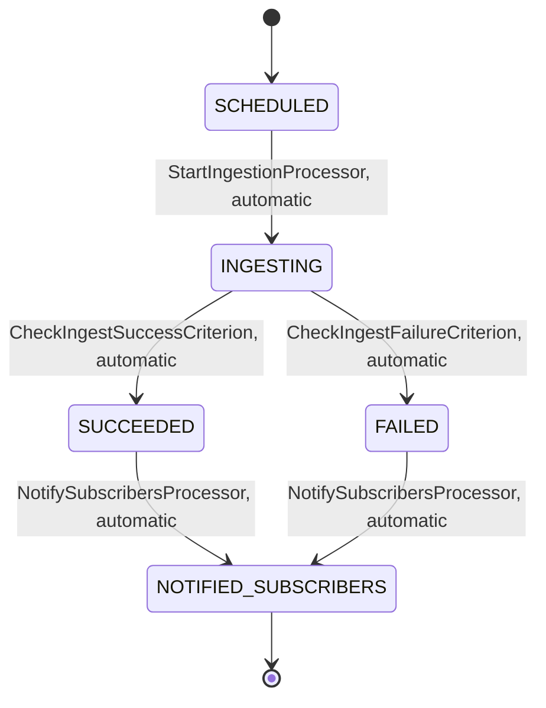
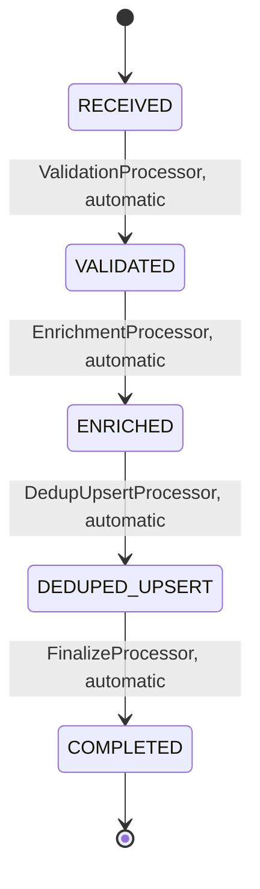
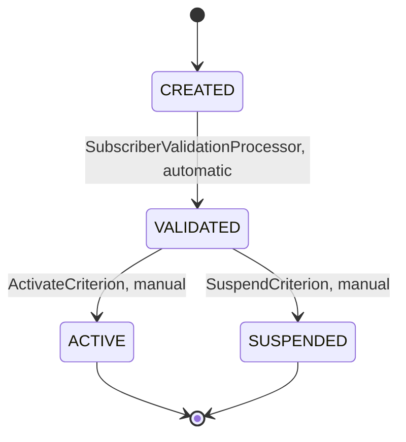

### 1. Entity Definitions
```
Job:
- jobId: String (business id)
- schedule: String (cron or on-demand label)
- status: String (SCHEDULED, INGESTING, SUCCEEDED, FAILED, NOTIFIED_SUBSCRIBERS)
- sourceUrl: String (API endpoint)
- startedAt: String (timestamp)
- finishedAt: String (timestamp)
- ingestResult: Object (countAdded, countUpdated, errors[])
- retryPolicy: Object (maxRetries, backoffSeconds)
- notifyOn: String (SUCCESS, FAILURE, BOTH)
- createdAt: String (timestamp)

Laureate:
- id: Integer (source id)
- firstname: String
- surname: String
- gender: String
- born: String (date)
- died: String (date|null)
- borncountry: String
- borncountrycode: String
- borncity: String
- year: String
- category: String
- motivation: String
- affiliationName: String
- affiliationCity: String
- affiliationCountry: String
- enrichedAgeAtAward: Integer
- normalizedCountryCode: String
- validationStatus: String
- validationErrors: String[]

Subscriber:
- id: String (business id)
- contactType: String (email|webhook|other)
- contactDetails: Object
- filters: Object (category[], yearRange, country[])
- active: Boolean
- verified: Boolean
- lastNotifiedAt: String
- createdAt: String
```

### 2. Entity workflows

Job workflow:
1. Initial State: SCHEDULED (persisting Job triggers Cyoda process)
2. INGESTING: fetch source, emit Laureate RECEIVED events
3. Outcome: SUCCEEDED or FAILED based on ingestResult
4. NOTIFIED_SUBSCRIBERS: notify active subscribers
5. Final: NOTIFIED_SUBSCRIBERS


```mermaid
stateDiagram-v2
    [*] --> SCHEDULED
    SCHEDULED --> INGESTING : StartIngestionProcessor, automatic
    INGESTING --> SUCCEEDED : CheckIngestSuccessCriterion, automatic
    INGESTING --> FAILED : CheckIngestFailureCriterion, automatic
    SUCCEEDED --> NOTIFIED_SUBSCRIBERS : NotifySubscribersProcessor, automatic
    FAILED --> NOTIFIED_SUBSCRIBERS : NotifySubscribersProcessor, automatic
    NOTIFIED_SUBSCRIBERS --> [*]
```

Processors/Criteria for Job:
- Processors: StartIngestionProcessor, AggregateIngestResultProcessor, NotifySubscribersProcessor
- Criteria: CheckIngestSuccessCriterion, CheckIngestFailureCriterion

Laureate workflow:
1. RECEIVED (persisted as event)
2. VALIDATED: validate required fields
3. ENRICHED: compute age, normalize country codes
4. DEDUPED_UPSERT: deduplicate and insert/update store
5. COMPLETED: ready for consumption


```mermaid
stateDiagram-v2
    [*] --> RECEIVED
    RECEIVED --> VALIDATED : ValidationProcessor, automatic
    VALIDATED --> ENRICHED : EnrichmentProcessor, automatic
    ENRICHED --> DEDUPED_UPSERT : DedupUpsertProcessor, automatic
    DEDUPED_UPSERT --> COMPLETED : FinalizeProcessor, automatic
    COMPLETED --> [*]
```

Processors/Criteria for Laureate:
- Processors: ValidationProcessor, EnrichmentProcessor, DedupUpsertProcessor, FinalizeProcessor
- Criteria: IsValidLaureateCriterion

Subscriber workflow:
1. CREATED (persisted triggers validation)
2. VALIDATED: verify contact
3. ACTIVE or SUSPENDED: manual activation allowed
4. RECEIVES_NOTIFICATIONS: passive — receives notifications from Job


```mermaid
stateDiagram-v2
    [*] --> CREATED
    CREATED --> VALIDATED : SubscriberValidationProcessor, automatic
    VALIDATED --> ACTIVE : ActivateCriterion, manual
    VALIDATED --> SUSPENDED : SuspendCriterion, manual
    ACTIVE --> [*]
    SUSPENDED --> [*]
```

Processors/Criteria for Subscriber:
- Processors: SubscriberValidationProcessor, ContactVerificationProcessor
- Criteria: ActivateCriterion, SuspendCriterion

### 3. Pseudo code for processor classes

Example: ValidationProcessor (Laureate)
```
class ValidationProcessor {
  process(laureate) {
    errors = []
    if missing laureate.id then errors.add("id missing")
    if missing firstname and surname then errors.add("name missing")
    if invalid date format for born then errors.add("born invalid")
    laureate.validationStatus = errors.empty ? "OK" : "INVALID"
    laureate.validationErrors = errors
    persist(laureate)
  }
}
```

Example: EnrichmentProcessor (Laureate)
```
class EnrichmentProcessor {
  process(laureate) {
    laureate.enrichedAgeAtAward = computeAge(laureate.born, laureate.year)
    laureate.normalizedCountryCode = normalizeCountry(laureate.borncountrycode)
    persist(laureate)
  }
}
```

Example: NotifySubscribersProcessor (Job)
```
class NotifySubscribersProcessor {
  process(job) {
    subscribers = findActiveSubscribersMatching(job.ingestResult)
    for s in subscribers -> sendNotification(s, job.ingestResult)
    job.status = NOTIFIED_SUBSCRIBERS
    persist(job)
  }
}
```

Note: persisting an entity starts Cyoda workflow and calls its process method; processors should persist updates so Cyoda continues the workflow.

### 4. API Endpoints Design Rules

POST /jobs
- Creates Job (triggers ingestion event). Returns ONLY technicalId.

Request:
```json
{
  "schedule":"ON_DEMAND",
  "sourceUrl":"https://public.opendatasoft.com/api/explore/v2.1/catalog/datasets/nobel-prize-laureates/records",
  "notifyOn":"BOTH",
  "retryPolicy":{"maxRetries":3,"backoffSeconds":60}
}
```
Response:
```json
{
  "technicalId":"job-0001"
}
```

GET /jobs/{technicalId}
Response:
```json
{
  "jobId":"job-0001",
  "status":"NOTIFIED_SUBSCRIBERS",
  "schedule":"ON_DEMAND",
  "sourceUrl":"https://.../records",
  "startedAt":"2025-08-01T12:00:00Z",
  "finishedAt":"2025-08-01T12:00:10Z",
  "ingestResult":{"countAdded":5,"countUpdated":2,"errors":[]}
}
```

GET /laureates/{id}
Response:
```json
{
  "id":853,
  "firstname":"Akira",
  "surname":"Suzuki",
  "born":"1930-09-12",
  "died":null,
  "borncountry":"Japan",
  "borncountrycode":"JP",
  "year":"2010",
  "category":"Chemistry",
  "affiliationName":"Hokkaido University",
  "enrichedAgeAtAward":80,
  "validationStatus":"OK"
}
```

GET /subscribers/{id}
Response:
```json
{
  "id":"sub-01",
  "contactType":"webhook",
  "contactDetails":{"url":"https://example.com/hook"},
  "filters":{"category":["Chemistry"]},
  "active":true,
  "verified":true
}
```

Notes/assumptions
- Only Job has POST (orchestration entity). Persisting any entity triggers Cyoda to start its workflow automatically.
- Notifications are sent asynchronously; errors recorded in ingestResult.
- If you want additional GET-by-condition endpoints (e.g., laureates by category), say so and I will add them.