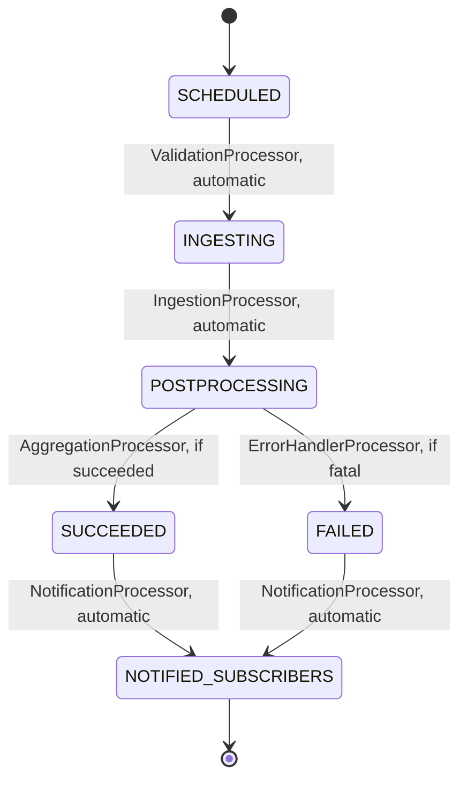
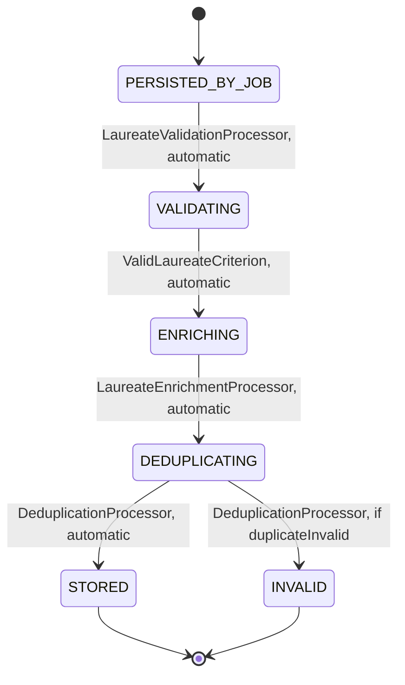
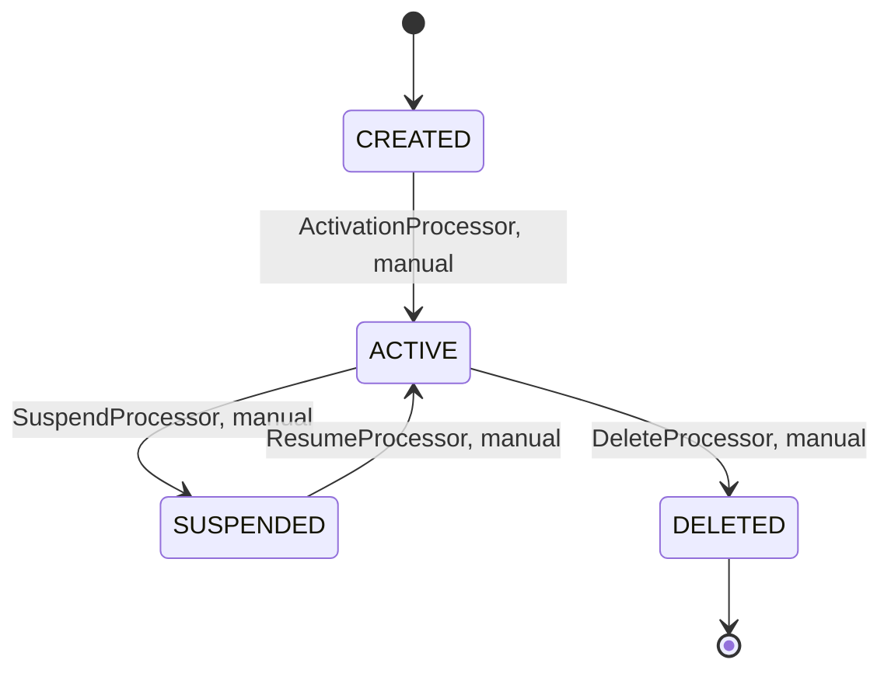

### 1. Entity Definitions
```
Job:
- jobId: String (user-supplied id for the run)
- scheduleAt: String (ISO datetime when job should run)
- startedAt: String (ISO datetime when ingestion started)
- finishedAt: String (ISO datetime when ingestion finished)
- state: String (lifecycle state)
- sourceUrl: String (API endpoint to ingest)
- totalRecords: Integer (count processed)
- succeededCount: Integer (count succeeded)
- failedCount: Integer (count failed)
- errorSummary: String (short description of failures)

Laureate:
- id: Integer (source laureate id)
- firstname: String (given name)
- surname: String (family name)
- gender: String (gender)
- born: String (birth date ISO)
- died: String (death date ISO or null)
- borncountry: String (country name)
- borncountrycode: String (country code)
- borncity: String (city)
- year: String (award year)
- category: String (award category)
- motivation: String (motivation text)
- affiliationName: String (affiliation name)
- affiliationCity: String (affiliation city)
- affiliationCountry: String (affiliation country)
- computedAge: Integer (derived age at award or current)
- ingestJobId: String (jobId that produced this record)

Subscriber:
- subscriberId: String (identifier)
- name: String (display name)
- channels: Array (list of {type: String, address: String})
- active: Boolean (active flag)
- filters: Array (optional list of simple filters like category/year/country)
- lastNotifiedAt: String (ISO datetime)
```

Note: You specified 3 entities; only these are included per instructions.

---

### 2. Entity workflows

Job workflow:
1. Initial State: SCHEDULED (job persisted event triggers processing)
2. Validation: validate job configuration and sourceUrl (automatic)
3. Ingesting: fetch data and create Laureate entities (automatic)
4. PostProcessing: aggregate per-record results (automatic)
5. Finalize: SUCCEEDED or FAILED (automatic)
6. Notification: NOTIFIED_SUBSCRIBERS (automatic)
7. End


```mermaid
stateDiagram-v2
    [*] --> SCHEDULED
    SCHEDULED --> INGESTING : ValidationProcessor, automatic
    INGESTING --> POSTPROCESSING : IngestionProcessor, automatic
    POSTPROCESSING --> SUCCEEDED : AggregationProcessor, if succeeded
    POSTPROCESSING --> FAILED : ErrorHandlerProcessor, if fatal
    SUCCEEDED --> NOTIFIED_SUBSCRIBERS : NotificationProcessor, automatic
    FAILED --> NOTIFIED_SUBSCRIBERS : NotificationProcessor, automatic
    NOTIFIED_SUBSCRIBERS --> [*]
```

Job processors and criteria:
- Processors: ValidationProcessor, IngestionProcessor, AggregationProcessor, NotificationProcessor, ErrorHandlerProcessor
- Criteria: IngestionSuccessCriterion (checks failedCount==0 or within threshold), RetryCriterion (checks attemptedCount < maxAttempts)

Laureate workflow:
1. Initial State: PERSISTED_BY_JOB (created by Job ingestion as event)
2. Validation: check required fields (automatic)
3. Enrichment: compute age, normalize country codes (automatic)
4. Deduplication: check existing records, merge or mark duplicate (automatic)
5. Persisted: STORED (final) or INVALID (failed)
6. End


```mermaid
stateDiagram-v2
    [*] --> PERSISTED_BY_JOB
    PERSISTED_BY_JOB --> VALIDATING : LaureateValidationProcessor, automatic
    VALIDATING --> ENRICHING : ValidLaureateCriterion, automatic
    ENRICHING --> DEDUPLICATING : LaureateEnrichmentProcessor, automatic
    DEDUPLICATING --> STORED : DeduplicationProcessor, automatic
    DEDUPLICATING --> INVALID : DeduplicationProcessor, if duplicateInvalid
    STORED --> [*]
    INVALID --> [*]
```

Laureate processors and criteria:
- Processors: LaureateValidationProcessor, LaureateEnrichmentProcessor, DeduplicationProcessor, LaureatePersistProcessor
- Criteria: ValidLaureateCriterion (non-null required fields + formats), MergeRequiredCriterion (when duplicate found)

Subscriber workflow (registration):
1. Initial State: CREATED (persisted via POST)
2. Activation: ACTIVE (manual or automatic activation)
3. Suspended: SUSPENDED (manual)
4. Deleted: DELETED (manual)


```mermaid
stateDiagram-v2
    [*] --> CREATED
    CREATED --> ACTIVE : ActivationProcessor, manual
    ACTIVE --> SUSPENDED : SuspendProcessor, manual
    SUSPENDED --> ACTIVE : ResumeProcessor, manual
    ACTIVE --> DELETED : DeleteProcessor, manual
    DELETED --> [*]
```

Subscriber processors and criteria:
- Processors: ActivationProcessor, SuspendProcessor, ResumeProcessor, DeleteProcessor, NotifyDeliveryProcessor (used by Job NotificationProcessor)
- Criteria: SubscriberActiveCriterion (checks active==true and filters match)

---

### 3. Pseudo code for processor classes

IngestionProcessor (called in Job -> INGESTING)
```text
class IngestionProcessor {
  process(Job job) {
    response = httpGet(job.sourceUrl)
    records = parseJson(response)
    for record in records {
      laureate = mapToLaureate(record)
      persistEntity(laureate) // triggers Laureate workflow automatically
      job.totalRecords++
    }
    updateJobCounts(job)
  }
}
```

LaureateValidationProcessor
```text
class LaureateValidationProcessor {
  process(Laureate l) {
    if l.id == null or l.firstname == null or l.surname == null or l.year == null:
      markInvalid(l, "missing required")
    else if !isDate(l.born):
      markInvalid(l, "bad born date")
    else
      pass
  }
}
```

LaureateEnrichmentProcessor
```text
class LaureateEnrichmentProcessor {
  process(Laureate l) {
    l.computedAge = computeAgeAtYear(l.born, l.year)
    l.borncountrycode = normalizeCountryCode(l.borncountry, l.borncountrycode)
  }
}
```

NotificationProcessor (used by Job when transitioning to NOTIFIED_SUBSCRIBERS)
```text
class NotificationProcessor {
  process(Job job) {
    subscribers = querySubscribers(active=true)
    payload = { jobId: job.jobId, state: job.state, summary: {total:job.totalRecords, succeeded:job.succeededCount, failed:job.failedCount}}
    for s in subscribers:
      if SubscriberActiveCriterion.matches(s, job):
        deliver(s.channels, payload)
        updateLastNotified(s, now())
  }
}
```

---

### 4. API Endpoints Design Rules

Rules applied:
- POST endpoints create orchestration entities or register subscribers and must return only technicalId.
- GET endpoints return stored results; GET by technicalId available for entities created via POST.
- Laureate records are created by Job processing (no POST). Provide GET endpoints for retrieval.

Endpoints:

1) Create Job
- POST /jobs
Request/response:
```json
// Request
{
  "jobId": "job-2025-08-28-01",
  "scheduleAt": "2025-08-28T10:00:00Z",
  "sourceUrl": "https://public.opendatasoft.com/api/explore/v2.1/catalog/datasets/nobel-prize-laureates/records"
}
```
```json
// Response
{
  "technicalId": "job-technical-0001"
}
```

- GET /jobs/{technicalId}
```json
// Response
{
  "technicalId": "job-technical-0001",
  "jobId": "job-2025-08-28-01",
  "scheduleAt": "2025-08-28T10:00:00Z",
  "startedAt": "2025-08-28T10:00:05Z",
  "finishedAt": "2025-08-28T10:00:12Z",
  "state": "NOTIFIED_SUBSCRIBERS",
  "totalRecords": 10,
  "succeededCount": 9,
  "failedCount": 1,
  "errorSummary": "1 record invalid"
}
```

2) Register Subscriber
- POST /subscribers
```json
// Request
{
  "subscriberId": "sub-abc",
  "name": "Nobel Alerts",
  "channels": [{"type":"email","address":"alerts@example.com"}],
  "active": true,
  "filters": [{"category":"Chemistry"}]
}
```
```json
// Response
{
  "technicalId": "subscriber-technical-007"
}
```

- GET /subscribers/{technicalId}
```json
// Response
{
  "technicalId": "subscriber-technical-007",
  "subscriberId": "sub-abc",
  "name": "Nobel Alerts",
  "channels": [{"type":"email","address":"alerts@example.com"}],
  "active": true,
  "filters":[{"category":"Chemistry"}],
  "lastNotifiedAt": null
}
```

3) Retrieve Laureate(s)
- GET /laureates/{technicalId}
```json
// Response
{
  "technicalId":"laureate-technical-123",
  "id":853,
  "firstname":"Akira",
  "surname":"Suzuki",
  "gender":"male",
  "born":"1930-09-12",
  "died":null,
  "borncountry":"Japan",
  "borncountrycode":"JP",
  "borncity":"Mukawa",
  "year":"2010",
  "category":"Chemistry",
  "motivation":"for palladium-catalyzed cross couplings in organic synthesis",
  "affiliationName":"Hokkaido University",
  "affiliationCity":"Sapporo",
  "affiliationCountry":"Japan",
  "computedAge":80,
  "ingestJobId":"job-2025-08-28-01"
}
```

- GET /laureates (optional, paginated) — allowed as read-only retrieval.

---

If you want, I can now:
- produce a Cyoda mapping of entities -> workflows (actions/criteria names exactly as above), or
- adjust failure vs partial-success policy and retry parameters used by Job processors. Which would you like next?