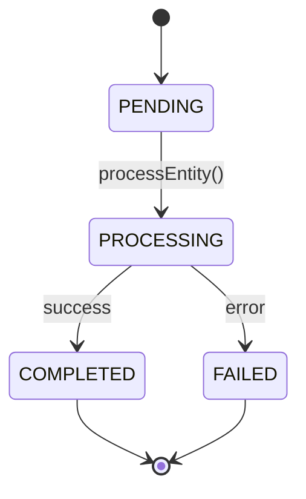
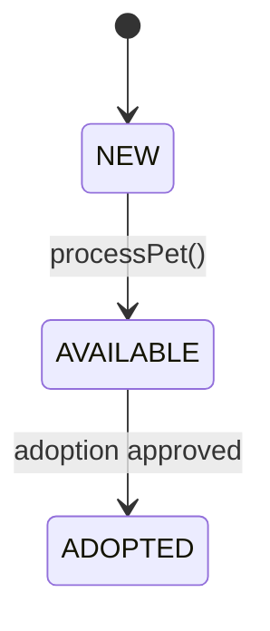
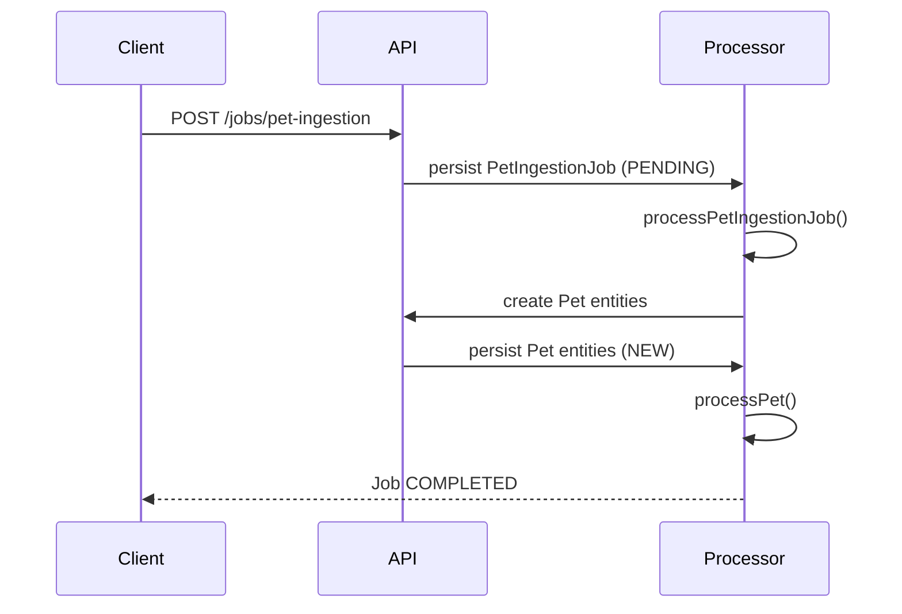

Certainly! Here is the well-formatted final version of your "Purrfect Pets" API app functional requirements using Event-Driven Architecture:

---

### 1. Entity Definitions

``` 
PetIngestionJob:
- jobId: String (unique identifier for the ingestion job)
- source: String (data source, e.g., Petstore API)
- createdAt: DateTime (job creation timestamp)
- status: StatusEnum (PENDING, PROCESSING, COMPLETED, FAILED)

Pet:
- petId: String (unique pet identifier)
- name: String (pet's name)
- category: String (e.g., cat, dog, bird)
- breed: String (breed or species detail)
- age: Integer (pet's age in years)
- status: StatusEnum (NEW, AVAILABLE, ADOPTED)

AdoptionRequest:
- requestId: String (unique request identifier)
- petId: String (referenced pet)
- requesterName: String (person requesting adoption)
- requestDate: DateTime (when the adoption was requested)
- status: StatusEnum (PENDING, APPROVED, REJECTED)
```

---

### 2. Process Method Flows

```
processPetIngestionJob() Flow:
1. Initial State: Job created with PENDING status
2. Validation: Verify source accessibility and job parameters
3. Processing: Fetch pets data from Petstore API, create immutable Pet entities with NEW status
4. Completion: Mark job COMPLETED or FAILED on error
5. Notification: Log summary or trigger downstream systems if needed

processPet() Flow:
1. Initial State: Pet created with NEW status
2. Validation: Check mandatory fields like name, category
3. Processing: Enrich pet data if needed (e.g., derive age category)
4. Completion: Update status to AVAILABLE

processAdoptionRequest() Flow:
1. Initial State: AdoptionRequest created with PENDING status
2. Validation: Confirm referenced Pet exists and is AVAILABLE
3. Processing: Evaluate request, possibly business rules (e.g., age limits)
4. Completion: Update status to APPROVED or REJECTED
5. Notification: Send response to requester or system logs
```

---

### 3. API Endpoints & JSON Formats

- **POST /jobs/pet-ingestion**  
Request:
```json
{
  "source": "Petstore API"
}
```
Response:
```json
{
  "jobId": "123",
  "status": "PENDING",
  "createdAt": "2024-06-01T10:00:00Z"
}
```

- **POST /pets**  
Request:
```json
{
  "name": "Whiskers",
  "category": "cat",
  "breed": "Siamese",
  "age": 2
}
```
Response:
```json
{
  "petId": "abc123",
  "status": "NEW"
}
```

- **POST /adoption-requests**  
Request:
```json
{
  "petId": "abc123",
  "requesterName": "Alice"
}
```
Response:
```json
{
  "requestId": "req789",
  "status": "PENDING"
}
```

- **GET /pets/{petId}**  
Response:
```json
{
  "petId": "abc123",
  "name": "Whiskers",
  "category": "cat",
  "breed": "Siamese",
  "age": 2,
  "status": "AVAILABLE"
}
```

---

### 4. Mermaid Diagrams

**Entity Lifecycle State Diagram:**


```mermaid
stateDiagram-v2
    [*] --> PENDING
    PENDING --> PROCESSING : processEntity()
    PROCESSING --> COMPLETED : success
    PROCESSING --> FAILED : error
    COMPLETED --> [*]
    FAILED --> [*]
```

**Pet Entity State Diagram:**


```mermaid
stateDiagram-v2
    [*] --> NEW
    NEW --> AVAILABLE : processPet()
    AVAILABLE --> ADOPTED : adoption approved
```

**Event-Driven Processing Chain:**


```mermaid
sequenceDiagram
    participant Client
    participant API
    participant Processor

    Client->>API: POST /jobs/pet-ingestion
    API->>Processor: persist PetIngestionJob (PENDING)
    Processor->>Processor: processPetIngestionJob()
    Processor->>API: create Pet entities
    API->>Processor: persist Pet entities (NEW)
    Processor->>Processor: processPet()
    Processor-->>Client: Job COMPLETED
```

---

If you need any further help, feel free to ask! Wishing you a great development journey with "Purrfect Pets"! 🐾