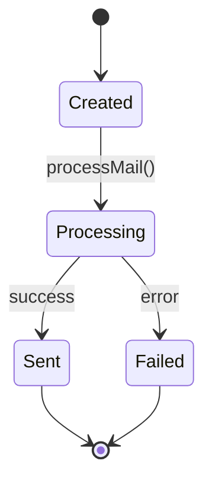
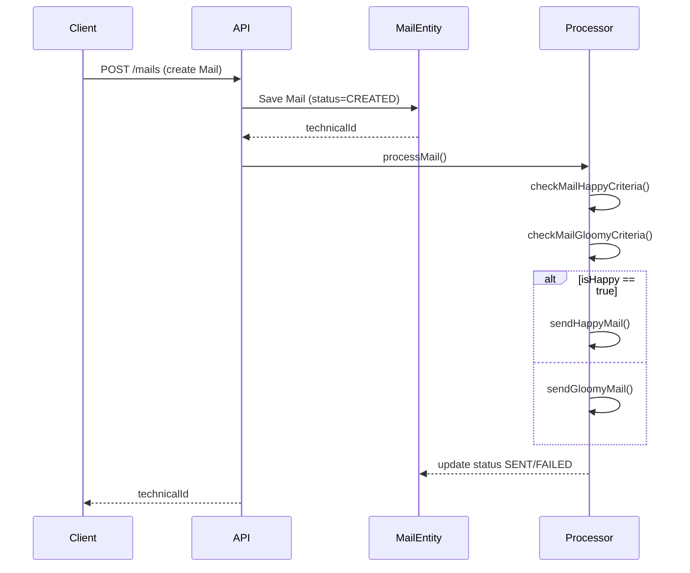
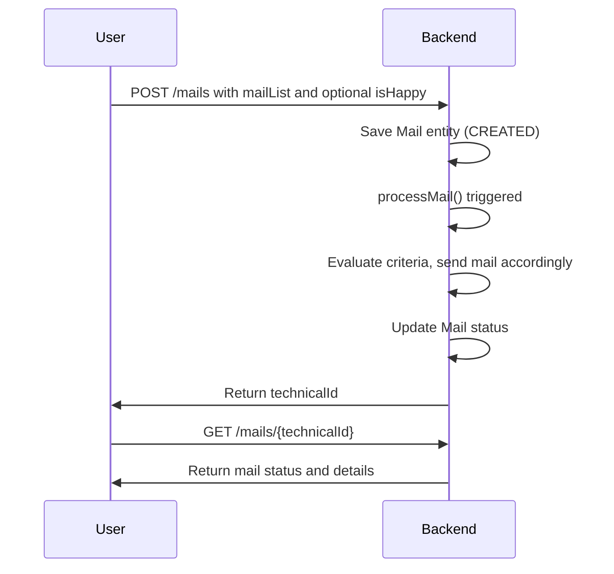

### 1. Entity Definitions

``` 
Mail:
- isHappy: Boolean (indicates if the mail is happy or gloomy)
- mailList: List<String> (list of recipient email addresses)
- status: MailStatusEnum (entity lifecycle state, e.g. CREATED, PROCESSING, SENT, FAILED)
```

### 2. Process Method Flows

```
processMail() Flow:
1. Initial State: Mail entity created with status = CREATED
2. Validation: Trigger checkMailHappyCriteria() and checkMailGloomyCriteria() to determine isHappy value if not explicitly set
3. Processing:
   - If isHappy == true, call sendHappyMail() processor to send happy mails
   - If isHappy == false, call sendGloomyMail() processor to send gloomy mails
4. Completion: Update status to SENT if mails successfully sent, or FAILED if errors occur
5. Notification: (Optional) Log or notify success/failure
```

### 3. API Endpoints Design

- **POST /mails**  
  Create a new Mail entity (immutable creation). Triggers `processMail()` automatically.  
  **Request:**  
  ```json
  {
    "isHappy": true,            // optional, can be derived by criteria if omitted
    "mailList": ["a@x.com", "b@y.com"]
  }
  ```  
  **Response:**  
  ```json
  {
    "technicalId": "generated-uuid-or-id"
  }
  ```  

- **GET /mails/{technicalId}**  
  Retrieve Mail entity status and details by technicalId.  

- **GET /mails?isHappy=true** (optional, only if explicitly requested)  
  Retrieve mails filtered by happy/gloomy status.

### 4. Request/Response Formats

- **POST /mails**

Request:  
```json
{
  "isHappy": true,
  "mailList": ["user1@example.com", "user2@example.com"]
}
```

Response:  
```json
{
  "technicalId": "123e4567-e89b-12d3-a456-426614174000"
}
```

- **GET /mails/{technicalId}**

Response:  
```json
{
  "isHappy": true,
  "mailList": ["user1@example.com", "user2@example.com"],
  "status": "SENT"
}
```

---

### Visual Representations

**Entity Lifecycle State Diagram**


```mermaid
stateDiagram-v2
    [*] --> Created
    Created --> Processing : processMail()
    Processing --> Sent : success
    Processing --> Failed : error
    Sent --> [*]
    Failed --> [*]
```

**Event-Driven Processing Chain**


```mermaid
sequenceDiagram
    participant Client
    participant API
    participant MailEntity
    participant Processor
    Client->>API: POST /mails (create Mail)
    API->>MailEntity: Save Mail (status=CREATED)
    MailEntity-->>API: technicalId
    API->>Processor: processMail()
    Processor->>Processor: checkMailHappyCriteria()
    Processor->>Processor: checkMailGloomyCriteria()
    alt isHappy == true
        Processor->>Processor: sendHappyMail()
    else
        Processor->>Processor: sendGloomyMail()
    end
    Processor-->>MailEntity: update status SENT/FAILED
    API-->>Client: technicalId
```

**User Interaction Sequence Flow**


```mermaid
sequenceDiagram
    participant User
    participant Backend
    User->>Backend: POST /mails with mailList and optional isHappy
    Backend->>Backend: Save Mail entity (CREATED)
    Backend->>Backend: processMail() triggered
    Backend->>Backend: Evaluate criteria, send mail accordingly
    Backend->>Backend: Update Mail status
    Backend->>User: Return technicalId
    User->>Backend: GET /mails/{technicalId}
    Backend->>User: Return mail status and details
```

---

Please review and confirm if this final version fits your needs or if you'd like any adjustments!