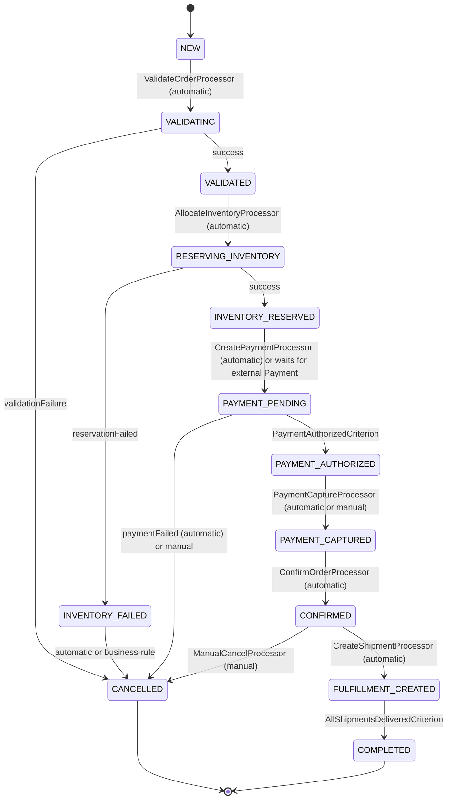
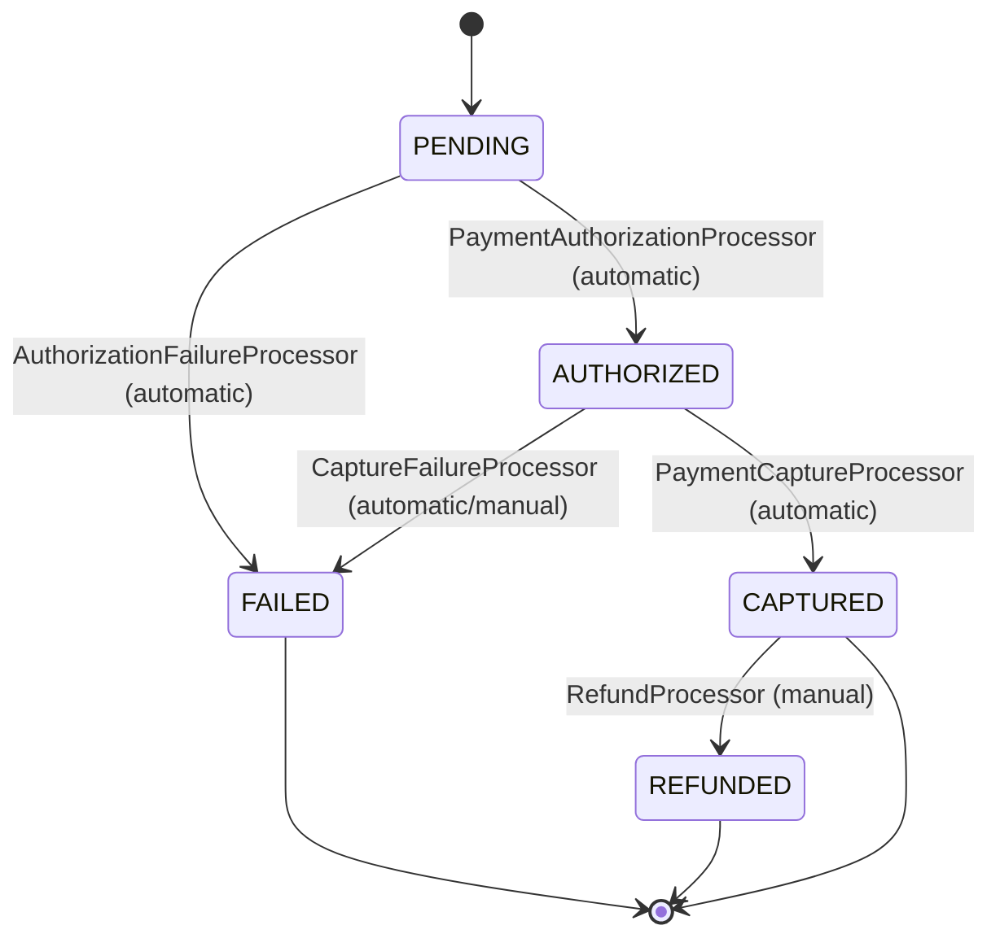
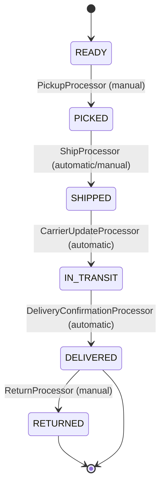

# Functional Requirements

This document defines entities, workflows, processors/criteria, pseudo-code, and API rules for the order/payment/shipment domain. It is intended to be the authoritative functional specification for the prototype services.

## 1. Summary
- There are three primary domain entities: Order, Payment, Shipment.
- POST operations persist entities and return only a generated technicalId. The persisted entity begins its workflow (a process method is invoked by the orchestration engine, e.g. Cyoda).
- GET operations by technicalId return the full stored entity.
- All processors must be idempotent and emit domain events when state changes.
- The system must handle expected failure scenarios (authorization failures, inventory shortages, partial shipments) and define clear terminal states.

---

## 2. Entity Definitions
Note: business identifiers (orderId, paymentId, shipmentId) are provided by clients or external systems and are distinct from internal technicalId. technicalId is not a persisted field inside the business payload but is returned by POST and stored in the database record.

Order
- orderId: String (business order number visible to users)
- customerId: String (link to customer)
- items: Array of { sku: String, quantity: Integer, price: Number } (line items)
- totalAmount: Number (calculated total; currency conversion already applied if required)
- currency: String (ISO 4217 code)
- shippingAddress: Object (line1, line2?, city, postalCode, country, etc.)
- status: String (enum; workflow-driven state)
- createdAt: String (ISO 8601 timestamp)
- updatedAt: String (ISO 8601 timestamp)
- metadata: Object (optional free-form)

Payment
- paymentId: String (business/provider id if any)
- orderId: String (linked business orderId)
- amount: Number
- currency: String
- method: String (card, wallet, bank_transfer, etc.)
- status: String (enum; workflow-driven state)
- providerResponse: Object (raw provider result/trace)
- createdAt: String (ISO 8601 timestamp)
- updatedAt: String (ISO 8601 timestamp)

Shipment
- shipmentId: String (business/carrier id if any)
- orderId: String (linked business orderId)
- items: Array of { sku: String, quantity: Integer }
- trackingNumber: String (optional)
- carrier: String (optional, e.g. "CarrierX")
- status: String (enum; workflow-driven state)
- createdAt: String (ISO 8601 timestamp)
- updatedAt: String (ISO 8601 timestamp)

---

## 3. Status enums (recommended canonical values)
These are recommended canonical statuses. Implementation may add logging reasons and timestamps per-state transition.

Order status (examples)
- NEW (initial)
- VALIDATING
- VALIDATED
- INVENTORY_RESERVED
- INVENTORY_FAILED
- PAYMENT_PENDING
- PAYMENT_AUTHORIZED
- PAYMENT_CAPTURED
- CONFIRMED (order confirmed for fulfillment)
- FULFILLMENT_CREATED
- COMPLETED (terminal)
- CANCELLED (terminal)
- FAILED (terminal, generic)

Payment status (examples)
- PENDING (initial)
- AUTHORIZED
- CAPTURED
- REFUNDED
- FAILED (terminal)
- VOIDED

Shipment status (examples)
- READY (initial)
- PICKED
- SHIPPED
- IN_TRANSIT
- DELIVERED (terminal)
- RETURNED (terminal)
- CANCELLED (terminal)

---

## 4. Workflows
Workflows explain the expected transitions, success/failure handling, and decision points.

### Order workflow (high level)
1. POST creates an Order with status NEW and persists it. The engine invokes the order processing pipeline.
2. VALIDATING: Validate items exist, totals match, address format, customer eligibility.
   - On validation failure -> CANCELLED (or specific validation failure state) and emit event.
3. RESERVE INVENTORY: Attempt to reserve inventory for the order lines.
   - On full reservation -> INVENTORY_RESERVED.
   - On partial reservation -> INVENTORY_RESERVED (partial) and mark which lines are backordered; or set INVENTORY_FAILED if no reservation possible.
   - On reservation failure -> INVENTORY_FAILED -> CANCELLED (or create backorder depending on business rules).
   - Inventory reservation must be idempotent and use a reservation token that can expire.
4. PAYMENT: Create Payment entity automatically (CreatePaymentProcessor) or wait for an externally POSTed Payment. Order moves to PAYMENT_PENDING when a payment exists for the order and the payment process begins.
   - If method requires authorization then capture later, follow Payment workflow below.
   - If the payment is authorized/captured immediately, mark as PAYMENT_CAPTURED or CONFIRMED accordingly.
5. CONFIRMATION/FULFILLMENT: When payment is captured or otherwise confirmed per business rules, mark order CONFIRMED and create Shipment(s) (FULFILLMENT_CREATED).
6. FULFILLMENT: Create shipments and move shipment workflows forward. Partial shipments are allowed; order status should reflect partial/complete fulfillment.
7. COMPLETION: When all shipments are DELIVERED -> COMPLETED.
8. CANCELLATION: Manual cancel or automatic cancellation on unrecoverable failures (inventory/payment). If capture had occurred and order is cancelled, trigger refund flow on Payment.

Mermaid (recommended diagram):


```mermaid
stateDiagram-v2
    [*] --> NEW
    NEW --> VALIDATING : ValidateOrderProcessor (automatic)
    VALIDATING --> VALIDATED : success
    VALIDATING --> CANCELLED : validationFailure
    VALIDATED --> RESERVING_INVENTORY : AllocateInventoryProcessor (automatic)
    RESERVING_INVENTORY --> INVENTORY_RESERVED : success
    RESERVING_INVENTORY --> INVENTORY_FAILED : reservationFailed
    INVENTORY_FAILED --> CANCELLED : automatic or business-rule
    INVENTORY_RESERVED --> PAYMENT_PENDING : CreatePaymentProcessor (automatic) or waits for external Payment
    PAYMENT_PENDING --> PAYMENT_AUTHORIZED : PaymentAuthorizedCriterion
    PAYMENT_PENDING --> CANCELLED : paymentFailed (automatic) or manual
    PAYMENT_AUTHORIZED --> PAYMENT_CAPTURED : PaymentCaptureProcessor (automatic or manual)
    PAYMENT_CAPTURED --> CONFIRMED : ConfirmOrderProcessor (automatic)
    CONFIRMED --> FULFILLMENT_CREATED : CreateShipmentProcessor (automatic)
    FULFILLMENT_CREATED --> COMPLETED : AllShipmentsDeliveredCriterion
    CONFIRMED --> CANCELLED : ManualCancelProcessor (manual)
    CANCELLED --> [*]
    COMPLETED --> [*]
```

Notes:
- A partial-reservation branch must be supported: create shipments only for reserved items; backorder or cancel the rest depending on business rules.
- Payment may be created and processed external to the order lifecycle; processors must reconcile external payments (idempotency and correlation by paymentId/orderId).

### Payment workflow (corrected)
1. PENDING (initial when payment record created)
2. Attempt Authorization
   - On success -> AUTHORIZED
   - On failure -> FAILED (terminal). The order should react to FAILED (may retry or cancel order per policy)
3. Capture (can occur immediately as an auth+capture, or later while in AUTHORIZED)
   - On capture success -> CAPTURED
   - On capture failure -> FAILED (or retriable failure leading to manual intervention)
4. REFUND/VOID as needed (manual operations) -> REFUNDED / VOIDED

Mermaid:


```mermaid
stateDiagram-v2
    [*] --> PENDING
    PENDING --> AUTHORIZED : PaymentAuthorizationProcessor (automatic)
    PENDING --> FAILED : AuthorizationFailureProcessor (automatic)
    AUTHORIZED --> CAPTURED : PaymentCaptureProcessor (automatic)
    AUTHORIZED --> FAILED : CaptureFailureProcessor (automatic/manual)
    CAPTURED --> REFUNDED : RefundProcessor (manual)
    FAILED --> [*]
    REFUNDED --> [*]
    CAPTURED --> [*]
```

Notes:
- Some payment methods will be auth+capture in one step; PaymentAuthorizationProcessor should set AUTHORIZED and if provider indicates immediate capture it may set CAPTURED.
- Payment processors should store raw provider response and include error codes to drive retry/cancellation logic.

### Shipment workflow
1. READY (created by order processing)
2. PICKED (warehouse picks items)
3. SHIPPED (carrier pickup and tracking assigned)
4. IN_TRANSIT (carrier updates)
5. DELIVERED (terminal)
6. RETURNED (terminal or post-delivery return)

Mermaid:


```mermaid
stateDiagram-v2
    [*] --> READY
    READY --> PICKED : PickupProcessor (manual)
    PICKED --> SHIPPED : ShipProcessor (automatic/manual)
    SHIPPED --> IN_TRANSIT : CarrierUpdateProcessor (automatic)
    IN_TRANSIT --> DELIVERED : DeliveryConfirmationProcessor (automatic)
    DELIVERED --> RETURNED : ReturnProcessor (manual)
    RETURNED --> [*]
    DELIVERED --> [*]
```

Notes:
- Partial shipments are permitted for orders: multiple shipments can be created and tracked independently.

---

## 5. Processors and Criteria (catalog)
Order processors (examples)
- ValidateOrderProcessor
- AllocateInventoryProcessor (should produce reservation token and support expiry)
- CreatePaymentProcessor
- ConfirmOrderProcessor
- CreateShipmentProcessor
- CompleteOrderProcessor
- ManualCancelProcessor
- ReconcileExternalPaymentProcessor (to reconcile payments created outside the system)

Order criteria
- OrderValidationCriterion
- InventoryAvailableCriterion
- PaymentAuthorizedCriterion
- AllShipmentsDeliveredCriterion

Payment processors
- PaymentAuthorizationProcessor
- PaymentCaptureProcessor
- AuthorizationFailureProcessor
- CaptureFailureProcessor
- RefundProcessor
- ReconcilePaymentProcessor

Payment criteria
- PaymentAuthorizedCriterion
- PaymentCaptureNeededCriterion

Shipment processors
- PickupProcessor
- ShipProcessor
- CarrierUpdateProcessor
- DeliveryConfirmationProcessor
- ReturnProcessor

Shipment criteria
- ShipmentReadyCriterion
- AllItemsPickedCriterion

Operational requirements for processors
- Idempotency: each processor must be safely re-run (e.g. duplicate webhook or retry should not cause double capture, duplicate reservation, etc.).
- Retries: define a retry policy per processor; transient failures should be retried with exponential backoff; permanent failures should move to a failure state and emit alerts.
- Emit events: each state change should publish an event for other subsystems (inventory, notifications, accounting).

---

## 6. Pseudo-code examples (improved to cover edge cases)
ValidateOrderProcessor

```java
class ValidateOrderProcessor {
  void process(Order order) {
    order.status = "VALIDATING";
    persist(order);

    boolean valid = true;
    // verify address, items not empty, totals match
    if (order.items == null || order.items.isEmpty()) valid = false;
    if (!totalsMatch(order)) valid = false;
    if (!addressValid(order.shippingAddress)) valid = false;

    if (!valid) {
      order.status = "CANCELLED";
      emitEvent("OrderValidationFailed", order);
    } else {
      order.status = "VALIDATED";
    }
    persist(order);
  }
}
```

AllocateInventoryProcessor

```java
class AllocateInventoryProcessor {
  void process(Order order) {
    // idempotent reservation: use orderId as idempotency key to avoid double reservation

    ReservationResult result = InventoryService.reserve(order.orderId, order.items);
    if (result.success && result.fullyReserved) {
      order.status = "INVENTORY_RESERVED";
      order.metadata.put("reservationToken", result.token);
    } else if (result.success && result.partiallyReserved) {
      order.status = "INVENTORY_RESERVED"; // mark which lines are reserved vs backordered
      order.metadata.put("partialReservation", result.details);
    } else {
      order.status = "INVENTORY_FAILED";
      // business rule: either cancel or place on backorder queue
    }
    persist(order);
    emitEvent("InventoryReservation", order);
  }
}
```

CreatePaymentProcessor

```java
class CreatePaymentProcessor {
  void process(Order order) {
    // idempotent create: check if a payment already exists for order with same amount
    if (paymentExistsForOrder(order.orderId)) {
      order.status = "PAYMENT_PENDING";
      persist(order);
      return;
    }

    Payment payment = new Payment(...); // amount = order.totalAmount
    persist(payment); // Cyoda will start Payment workflow

    order.status = "PAYMENT_PENDING";
    persist(order);
    emitEvent("PaymentCreated", payment);
  }
}
```

PaymentAuthorizationProcessor

```java
class PaymentAuthorizationProcessor {
  void process(Payment p) {
    p.status = "PENDING";
    persist(p);

    PaymentResult r = PaymentGateway.authorize(p);
    p.providerResponse = r.raw;

    if (r.success && r.authorized) {
      p.status = "AUTHORIZED";
      if (r.captured) { // some gateways return auth+capture
        p.status = "CAPTURED";
      }
    } else {
      p.status = "FAILED";
    }

    persist(p);
    emitEvent("PaymentStatusChanged", p);
  }
}
```

CreateShipmentProcessor

```java
class CreateShipmentProcessor {
  void process(Order order) {
    // create shipments only for reserved items
    List<Shipment> shipments = buildShipmentsFromOrder(order);
    for (Shipment s : shipments) {
      persist(s); // triggers Shipment workflow
      emitEvent("ShipmentCreated", s);
    }

    order.status = "FULFILLMENT_CREATED";
    persist(order);
  }
}
```

Notes:
- All persistence calls should be atomic for each entity; use transactions where multiple related updates are required.
- Processors should limit side effects and favor publishing events for downstream actions.

---

## 7. API Endpoints Design Rules
General rules
- POSTs MUST persist entities and return only the internal technicalId in response. The request payload should contain business ids (orderId/paymentId/shipmentId) where supplied.
- The POST operation triggers the workflow (a process method executed by the orchestration engine).
- Provide GET by technicalId for each entity created via POST. No GET-by-condition endpoints unless explicitly requested.
- POSTs must be idempotent: repeated POST with the same client-provided idempotency key or business id should not create duplicate persisted business records. The server should detect duplicates and return the existing technicalId.
- Clients MUST use idempotency keys for retrying POST requests (recommended header e.g. Idempotency-Key).

Order POST (creates Order -> triggers order workflow)
Request example
{
  "orderId":"O-1001",
  "customerId":"C-123",
  "items":[{"sku":"SKU-1","quantity":2,"price":10.0}],
  "currency":"USD",
  "shippingAddress": {"line1":"...", "city":"...", "postalCode":"..."}
}

Response example
{
  "technicalId":"<generated-technical-id>"
}

GET Order by technicalId
Response (full stored Order)
{
  "technicalId":"<id>",
  "orderId":"O-1001",
  "customerId":"C-123",
  "items":[...],
  "totalAmount":20.0,
  "currency":"USD",
  "status":"INVENTORY_RESERVED",
  "createdAt":"2025-08-20T12:00:00Z"
}

Payment POST (optional; payments can be created by Order processors)
Request example
{
  "paymentId":"P-900",
  "orderId":"<orderId>",
  "method":"card",
  "amount":20.0,
  "currency":"USD"
}

Response example
{
  "technicalId":"<generated-technical-id>"
}

GET Payment by technicalId returns full Payment object.

Shipment POST (usually created by Order processing but UI can create)
Request example
{
  "shipmentId":"S-500",
  "orderId":"O-1001",
  "items":[{"sku":"SKU-1","quantity":2}],
  "carrier":"CarrierX"
}

Response example
{
  "technicalId":"<generated-technical-id>"
}

GET Shipment by technicalId returns full Shipment object.

---

## 8. Error handling and operational notes
- Each POST must validate the request payload and respond with appropriate HTTP status codes (400 for bad payload, 409 for duplicate business id when not idempotent, 202/201 for accepted/created with technicalId as defined).
- Processors that call external services (payment gateway, inventory) must implement timeouts, retries with exponential backoff, circuit breakers and clear mapping of transient vs fatal errors.
- Reservation tokens from inventory should have an expiry and be released on order cancellation or failure.
- Payment capture must guard against double capture; use provider-provided transaction ids and persist provider responses for reconciliation.
- Audit/log: store a history of status transitions with timestamps and reasons.

---

## 9. Optional additions
If required later:
- Orchestration Job entity for bulk imports or nightly reconciliation (with its own workflow and status enum).
- Exact state name adjustments to match specific UI terminology (if provided), but keep mapping documented.

---

## 10. Recap of rules
- POST returns only technicalId and starts workflow.
- GET by technicalId returns full object.
- Idempotent POST behavior and idempotency-key recommended.
- Processors: idempotent, retries, emit events, persist provider responses.
- Partial shipments/backorders and refunds are supported by the workflows above.


