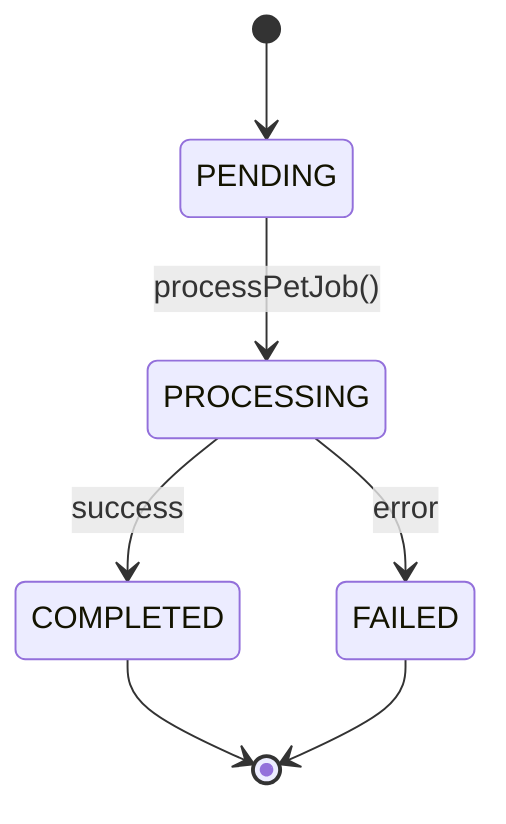
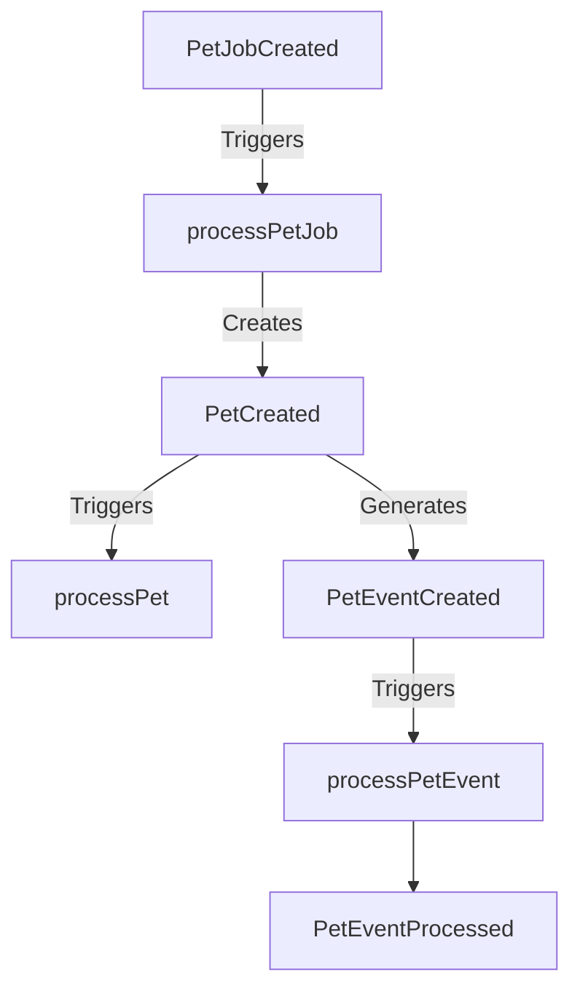
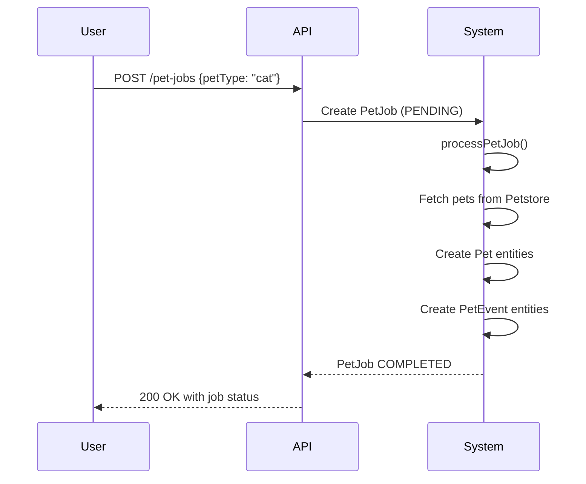

Certainly! Here is the well-formatted final version of the functional requirements for the 'Purrfect Pets' API app using Event-Driven Architecture:

### 1. Entity Definitions

```
PetJob:  (orchestration entity)
- jobId: String (unique identifier for the ingestion job)
- petType: String (type of pet to process, e.g., cat, dog, all)
- status: StatusEnum (PENDING, PROCESSING, COMPLETED, FAILED)

Pet:
- petId: String (unique identifier from Petstore API)
- name: String (pet's name)
- category: String (species/category e.g., cat, dog)
- status: StatusEnum (AVAILABLE, PENDING, SOLD)

PetEvent:
- eventId: String (unique event identifier)
- petId: String (linked pet)
- eventType: String (e.g., CREATED, UPDATED, PROCESSED)
- timestamp: DateTime (event occurrence time)
- status: StatusEnum (RECORDED, PROCESSED)
```

### 2. Process Method Flows

```
processPetJob() Flow:
1. Initial State: PetJob created with PENDING status
2. Validation: Validate petType and job parameters
3. Processing: Fetch and ingest Petstore API data for specified petType
4. Pet creation: Create immutable Pet entities with AVAILABLE status
5. Event recording: Generate PetEvent entities for each new Pet
6. Completion: Update PetJob status to COMPLETED or FAILED
7. Notification: Log or notify system of job completion

processPet() Flow:
1. Initial State: Pet entity persisted with AVAILABLE status
2. Validation: Validate pet data integrity
3. Indexing/Enrichment: Optional data enhancement or tagging
4. Completion: Confirm pet data ready for retrieval

processPetEvent() Flow:
1. Initial State: PetEvent created with RECORDED status
2. Processing: Analyze event (e.g., update stats, trigger further actions)
3. Completion: Update PetEvent status to PROCESSED
```

### 3. API Endpoints (JSON Request/Response Examples)

- **POST /pet-jobs**  
  Create a PetJob to trigger ingestion  
  Request:  
  ```json
  {
    "petType": "cat"
  }
  ```  
  Response:  
  ```json
  {
    "jobId": "job-123",
    "petType": "cat",
    "status": "PENDING"
  }
  ```

- **GET /pets?category=cat&status=AVAILABLE**  
  Retrieve pets filtered by category and status  
  Response:  
  ```json
  [
    {
      "petId": "pet-001",
      "name": "Whiskers",
      "category": "cat",
      "status": "AVAILABLE"
    }
  ]
  ```

- **POST /pets**  
  (For immutably adding new pet state, typically created internally by ingestion)  
  Request:  
  ```json
  {
    "petId": "pet-001",
    "name": "Whiskers",
    "category": "cat",
    "status": "AVAILABLE"
  }
  ```  
  Response:  
  ```json
  {
    "petId": "pet-001",
    "status": "AVAILABLE"
  }
  ```

### 4. Visual Representations

**PetJob lifecycle state diagram:**


```mermaid
stateDiagram-v2
    [*] --> PENDING
    PENDING --> PROCESSING : processPetJob()
    PROCESSING --> COMPLETED : success
    PROCESSING --> FAILED : error
    COMPLETED --> [*]
    FAILED --> [*]
```

**Event-driven processing chain:**


```mermaid
graph TD
    PetJobCreated -->|Triggers| processPetJob
    processPetJob -->|Creates| PetCreated
    PetCreated -->|Triggers| processPet
    PetCreated -->|Generates| PetEventCreated
    PetEventCreated -->|Triggers| processPetEvent
    processPetEvent --> PetEventProcessed
```

**User interaction sequence flow:**


```mermaid
sequenceDiagram
    participant User
    participant API
    participant System

    User->>API: POST /pet-jobs {petType: "cat"}
    API->>System: Create PetJob (PENDING)
    System->>System: processPetJob()
    System->>System: Fetch pets from Petstore
    System->>System: Create Pet entities
    System->>System: Create PetEvent entities
    System-->>API: PetJob COMPLETED
    API-->>User: 200 OK with job status
```

---

Please let me know if you need any further assistance or modifications!