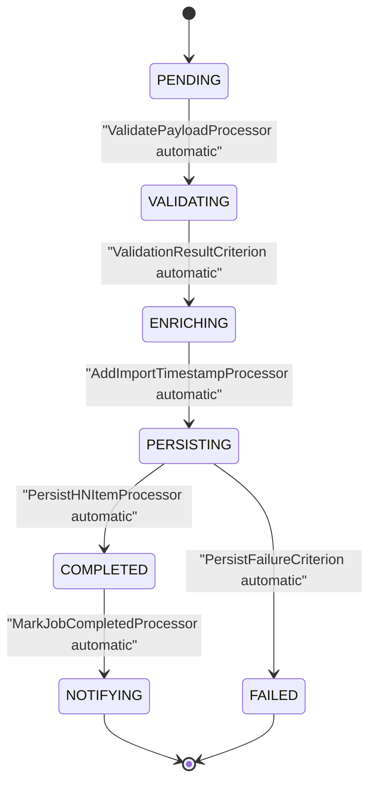
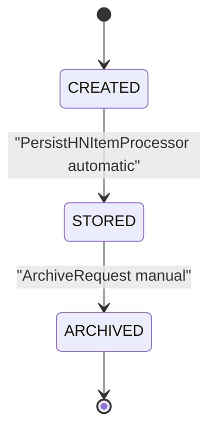
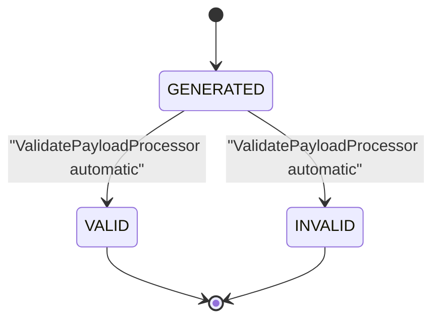

### 1. Entity Definitions
```
HN_Item:
- rawJson: JSON (original Hacker News JSON payload as received)
- id: Integer (HN item id, required)
- type: String (HN item type, required)
- importTimestamp: String (ISO8601 timestamp added when stored)

ImportJob:
- payload: JSON (HN JSON to ingest; POSTing an ImportJob triggers processing)
- createdBy: String (caller id or system)
- status: String (PENDING, IN_PROGRESS, COMPLETED, FAILED)
- resultItemId: Integer (HN id created when successful)
- errorMessage: String (details on failure)

Validation_Result:
- isValid: Boolean (true when required fields present)
- missingFields: List(String) (which required fields are missing)
- errorMessage: String (human readable error)
```

### 2. Entity workflows

ImportJob workflow:
1. Initial State: Job created with PENDING status (POST creates ImportJob event)
2. Validation: Automatic validation of payload presence of id and type
3. Enrichment: Add importTimestamp to payload
4. Persistence: Persist HN_Item
5. Completion: Mark job COMPLETED or FAILED and attach resultItemId or errorMessage
6. Notification: Optional notify caller about result (automatic)


```mermaid
stateDiagram-v2
    [*] --> PENDING
    PENDING --> VALIDATING : "ValidatePayloadProcessor automatic"
    VALIDATING --> ENRICHING : "ValidationResultCriterion automatic"
    ENRICHING --> PERSISTING : "AddImportTimestampProcessor automatic"
    PERSISTING --> COMPLETED : "PersistHNItemProcessor automatic"
    PERSISTING --> FAILED : "PersistFailureCriterion automatic"
    COMPLETED --> NOTIFYING : "MarkJobCompletedProcessor automatic"
    NOTIFYING --> [*] 
    FAILED --> [*]
```

Processors and criteria for ImportJob:
- Processors: ValidatePayloadProcessor, AddImportTimestampProcessor, PersistHNItemProcessor, MarkJobCompletedProcessor, NotifyCallerProcessor
- Criteria: ValidationResultCriterion (checks id & type), PersistFailureCriterion (detects persist errors)

HN_Item workflow:
1. Initial State: Created (by PersistHNItemProcessor)
2. Stored: Item is available for retrieval (automatic)
3. Archived (optional manual state for retention management)


```mermaid
stateDiagram-v2
    [*] --> CREATED
    CREATED --> STORED : "PersistHNItemProcessor automatic"
    STORED --> ARCHIVED : "ArchiveRequest manual"
    ARCHIVED --> [*]
```

Processors and criteria for HN_Item:
- Processors: PersistHNItemProcessor, ArchiveProcessor
- Criteria: ArchiveRequestCriterion (manual trigger to archive)

Validation_Result workflow (transient, used inside ImportJob):
1. Produced during validation
2. If isValid true -> triggers enrichment
3. If isValid false -> triggers job failure


```mermaid
stateDiagram-v2
    [*] --> GENERATED
    GENERATED --> VALID : "ValidatePayloadProcessor automatic"
    GENERATED --> INVALID : "ValidatePayloadProcessor automatic"
    VALID --> [*]
    INVALID --> [*]
```

Processors and criteria for Validation_Result:
- Processors: ValidatePayloadProcessor
- Criteria: MissingFieldsCriterion

### 3. Pseudo code for processor classes

ValidatePayloadProcessor
```
input: ImportJob.job
output: Validation_Result
if job.payload contains id and type:
    return Validation_Result(isValid=true)
else:
    return Validation_Result(isValid=false, missingFields=[...], errorMessage=...)
```

AddImportTimestampProcessor
```
input: ImportJob.job, Validation_Result (isValid=true)
job.payload.importTimestamp = current_iso8601()
proceed to PersistHNItemProcessor
```

PersistHNItemProcessor
```
input: ImportJob.job (enriched payload)
attempt persist HN_Item with rawJson=payload and fields id,type,importTimestamp
if success:
    update ImportJob.status = COMPLETED
    ImportJob.resultItemId = payload.id
else:
    update ImportJob.status = FAILED
    ImportJob.errorMessage = error
```

MarkJobCompletedProcessor
```
input: ImportJob
set status COMPLETED, record resultItemId, trigger NotifyCallerProcessor
```

### 4. API Endpoints Design Rules

Notes:
- Posting an ImportJob triggers Cyoda to start the ImportJob workflow automatically.
- POST endpoints return only technicalId.
- Retrieval of stored HN item by its HN id is provided (user requested).

Endpoints

1) Create ImportJob (starts processing)
Request:
```json
POST /import-jobs
{
  "payload": { /* full HN JSON */ },
  "createdBy": "caller-id"
}
```
Response (must return only technicalId):
```json
{
  "technicalId": "job-12345"
}
```

2) Get ImportJob by technicalId
```json
GET /import-jobs/{technicalId}
Response:
{
  "technicalId": "job-12345",
  "payload": { /* original payload */ },
  "createdBy": "caller-id",
  "status": "COMPLETED",
  "resultItemId": 123,
  "errorMessage": null
}
```

3) Retrieve HN item by id (user requirement: return original JSON)
```json
GET /items/by-id/{id}
Response:
{ /* the stored rawJson exactly as saved, including importTimestamp field */ }
```

Behavior rules summary:
- POST /import-jobs triggers Cyoda workflow: validation -> enrichment -> persistence -> completion.
- HN_Item is created by the workflow (not by client POST); GET by id returns the original JSON with importTimestamp included.
- Errors produce Validation_Result entries used to mark the ImportJob FAILED and set errorMessage.