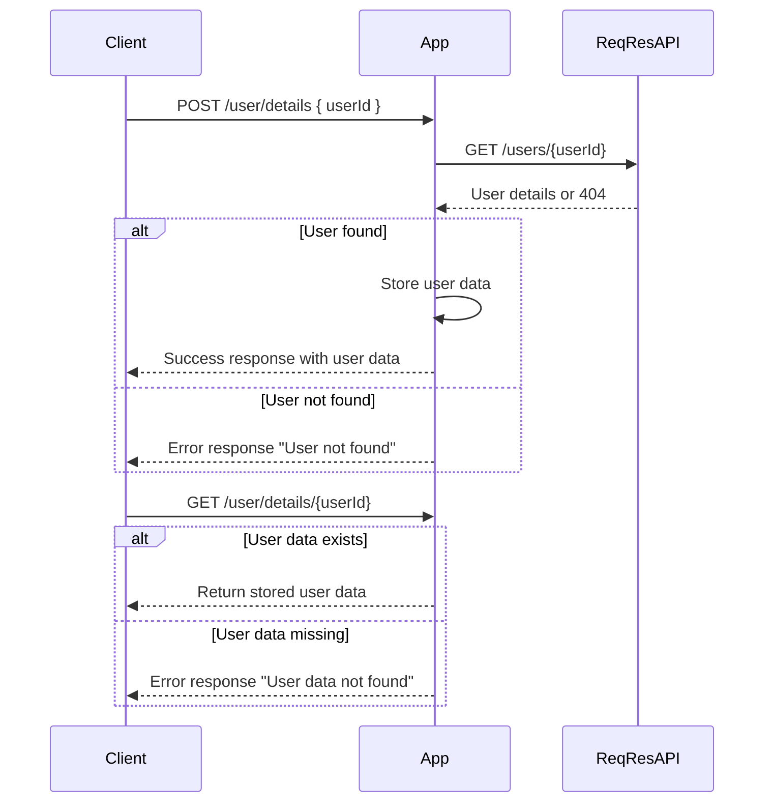

# Functional Requirements

## API Endpoints

### 1. POST /user/details
- **Purpose:** Accept a user ID, retrieve user details from the external ReqRes API, process the response, and store the result in the application for later retrieval.
- **Request:**
  ```json
  {
    "userId": 2
  }
  ```
- **Response (Success - user found):**
  ```json
  {
    "status": "success",
    "data": {
      "id": 2,
      "email": "janet.weaver@reqres.in",
      "first_name": "Janet",
      "last_name": "Weaver",
      "avatar": "https://reqres.in/img/faces/2-image.jpg"
    }
  }
  ```
- **Response (Failure - user not found or invalid ID):**
  ```json
  {
    "status": "error",
    "message": "User not found"
  }
  ```

### 2. GET /user/details/{userId}
- **Purpose:** Return the user information previously retrieved and stored by the POST endpoint.
- **Response (Success):**
  ```json
  {
    "id": 2,
    "email": "janet.weaver@reqres.in",
    "first_name": "Janet",
    "last_name": "Weaver",
    "avatar": "https://reqres.in/img/faces/2-image.jpg"
  }
  ```
- **Response (Failure - data not found in app):**
  ```json
  {
    "status": "error",
    "message": "User data not found. Please POST to /user/details first."
  }
  ```

---

## User-App Interaction Sequence Diagram


```mermaid
sequenceDiagram
    participant Client
    participant App
    participant ReqResAPI

    Client->>App: POST /user/details { userId }
    App->>ReqResAPI: GET /users/{userId}
    ReqResAPI-->>App: User details or 404
    alt User found
        App->>App: Store user data
        App-->>Client: Success response with user data
    else User not found
        App-->>Client: Error response "User not found"
    end

    Client->>App: GET /user/details/{userId}
    alt User data exists
        App-->>Client: Return stored user data
    else User data missing
        App-->>Client: Error response "User data not found"
    end
```