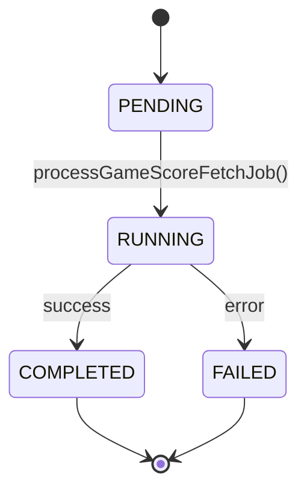
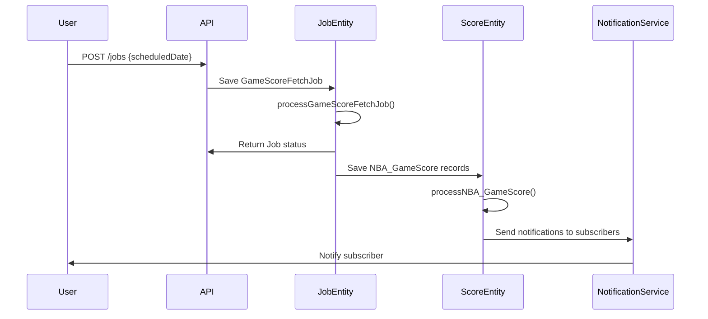

### 1. Entity Definitions

``` 
GameScoreFetchJob:
- id: UUID (unique identifier of the job)
- scheduledDate: LocalDate (date for which NBA scores are fetched)
- status: JobStatusEnum (PENDING, RUNNING, COMPLETED, FAILED)
- createdAt: Timestamp (job creation time)
- updatedAt: Timestamp (last update time)

NBA_GameScore:
- gameId: String (unique NBA game identifier)
- date: LocalDate (game date)
- homeTeam: String (home team name)
- awayTeam: String (away team name)
- homeScore: Integer (home team score)
- awayScore: Integer (away team score)
- status: ScoreStatusEnum (RECEIVED, PROCESSED)

Subscriber:
- id: UUID (unique subscriber identifier)
- contactInfo: String (email or phone number for notifications)
- teamPreferences: List<String> (teams subscriber wants notifications about)
- status: SubscriberStatusEnum (ACTIVE, INACTIVE)
```

---

### 2. Process Method Flows

**processGameScoreFetchJob() Flow:**
1. Initial State: Job created with PENDING status  
2. Validation: Confirm scheduledDate is valid and in the past or today  
3. Data Fetch: Call external NBA API to retrieve game scores for scheduledDate  
4. Persistence: Save/update NBA_GameScore entities for each game  
5. Completion: Update Job status to COMPLETED or FAILED  
6. Trigger Notifications: For each NBA_GameScore saved/updated, notify relevant subscribers  

**processNBA_GameScore() Flow:**
1. Initial State: NBA_GameScore saved with RECEIVED status  
2. Processing: Check if score data is complete and valid  
3. Update status to PROCESSED  
4. Trigger notifications for subscribers interested in the teams of the game  

**processSubscriber() Flow:**
1. Initial State: Subscriber created or updated with ACTIVE status  
2. Validation: Ensure contactInfo and preferences are correct  
3. Save status or update subscriber data  
4. No further automatic processing unless triggered by GameScore events  

---

### 3. API Endpoints and Request/Response Formats

**POST /jobs**  
_Create a new GameScoreFetchJob (triggers processGameScoreFetchJob)_  
Request:  
```json
{
  "scheduledDate": "2024-06-01"
}
```  
Response:  
```json
{
  "id": "uuid",
  "scheduledDate": "2024-06-01",
  "status": "PENDING",
  "createdAt": "timestamp",
  "updatedAt": "timestamp"
}
```

**GET /gamescores?date=YYYY-MM-DD**  
_Get all NBA game scores for a specific date_  
Response:  
```json
[
  {
    "gameId": "game123",
    "date": "2024-06-01",
    "homeTeam": "Lakers",
    "awayTeam": "Warriors",
    "homeScore": 110,
    "awayScore": 108,
    "status": "PROCESSED"
  }
]
```

**POST /subscribers**  
_Create or update a subscriber (triggers processSubscriber)_  
Request:  
```json
{
  "contactInfo": "user@example.com",
  "teamPreferences": ["Lakers", "Warriors"]
}
```  
Response:  
```json
{
  "id": "uuid",
  "contactInfo": "user@example.com",
  "teamPreferences": ["Lakers", "Warriors"],
  "status": "ACTIVE"
}
```

---

### 4. Mermaid Diagrams

**Entity Lifecycle State Diagram for GameScoreFetchJob**


```mermaid
stateDiagram-v2
    [*] --> PENDING
    PENDING --> RUNNING : processGameScoreFetchJob()
    RUNNING --> COMPLETED : success
    RUNNING --> FAILED : error
    COMPLETED --> [*]
    FAILED --> [*]
```

**Event-Driven Processing Chain**

```mermaid
graph TD
    JobCreated[GameScoreFetchJob Created]
    JobProcessed[processGameScoreFetchJob()]
    ScoresSaved[NBA_GameScore Saved]
    ScoresProcessed[processNBA_GameScore()]
    Notifications[Send Notifications]
    
    JobCreated --> JobProcessed
    JobProcessed --> ScoresSaved
    ScoresSaved --> ScoresProcessed
    ScoresProcessed --> Notifications
```

**User Interaction Sequence Flow**


```mermaid
sequenceDiagram
    participant User
    participant API
    participant JobEntity
    participant ScoreEntity
    participant NotificationService
    
    User->>API: POST /jobs {scheduledDate}
    API->>JobEntity: Save GameScoreFetchJob
    JobEntity->>JobEntity: processGameScoreFetchJob()
    JobEntity->>API: Return Job status
    JobEntity->>ScoreEntity: Save NBA_GameScore records
    ScoreEntity->>ScoreEntity: processNBA_GameScore()
    ScoreEntity->>NotificationService: Send notifications to subscribers
    NotificationService->>User: Notify subscriber
```

---

Please let me know if you'd like me to start implementation or clarify any part!