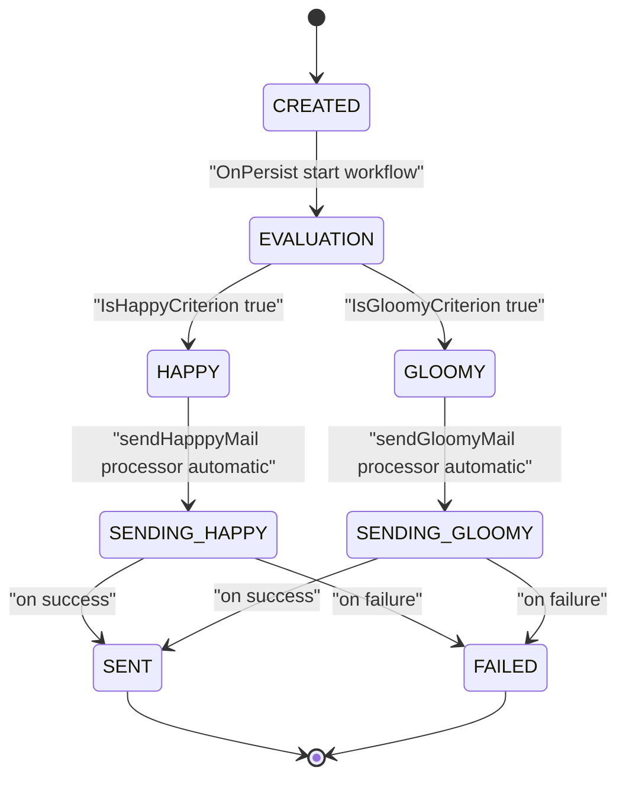

# Functional Requirements (Final)

## Purpose

This document defines the functional requirements and up-to-date logic for the Mail workflow application. The system persists Mail entities and, using event-driven workflow logic, evaluates and routes mails to appropriate processors that perform sending. This document is authoritative for implementation.

---

## Summary

- Single domain entity: Mail
  - Fields: `isHappy` (Boolean), `mailList` (List<String>)
- Two criteria classes to decide routing: `IsHappyCriterion`, `IsGloomyCriterion`
- Two processor classes to send mail: `sendHapppyMail` (note: exact name preserved) and `sendGloomyMail`
- Language / platform: Java

---

## 1. Entity Definitions

Mail (persistent representation)
- technicalId: String (datastore generated, returned by POST)
- isHappy: Boolean
  - Interpretation: `true` → happy mail processing; `false` or `null` → gloomy mail processing (explicit rule below)
- mailList: List<String> (recipient email addresses)
- status: Enum [CREATED, EVALUATION, SENDING_HAPPY, SENDING_GLOOMY, SENT, FAILED]
- createdAt: ISO8601 timestamp
- updatedAt: ISO8601 timestamp
- error: String|null (error details when status == FAILED)
- retryCount: Integer (for send retries)

Validation rules on persistence (POST):
- `mailList` must be present and contain at least one non-empty string. If invalid, service should return 400 and not persist.
- Email address format validation is recommended; invalid addresses should either be rejected at creation or recorded and filtered before sending. Implementation choice must be documented.

Null handling for `isHappy`:
- `isHappy == true` → IsHappyCriterion evaluates true.
- `isHappy == false` or `isHappy == null` → IsGloomyCriterion evaluates true. This makes gloomy the default when the flag is not explicitly true.

---

## 2. Workflow / State Machine

High-level flow:
1. CREATED — The Mail is persisted in the datastore.
   - Persistence is an event that triggers the workflow automatically.
2. EVALUATION — System evaluates criteria to choose a branch.
   - `IsHappyCriterion` and `IsGloomyCriterion` are evaluated (mutually exclusive by the rules above).
3. Branching:
   - HAPPY → `SENDING_HAPPY` state: schedule or call `sendHapppyMail.process(mail)`
   - GLOOMY → `SENDING_GLOOMY` state: schedule or call `sendGloomyMail.process(mail)`
4. SENDING → on processor success set `SENT`; on final failure set `FAILED` (with error details).
5. SENT / FAILED → terminal states for the workflow.

State diagram (Mermaid syntax):


```mermaid
stateDiagram-v2
    [*] --> CREATED
    CREATED --> EVALUATION : "OnPersist start workflow"
    EVALUATION --> HAPPY : "IsHappyCriterion true"
    EVALUATION --> GLOOMY : "IsGloomyCriterion true"
    HAPPY --> SENDING_HAPPY : "sendHapppyMail processor automatic"
    GLOOMY --> SENDING_GLOOMY : "sendGloomyMail processor automatic"
    SENDING_HAPPY --> SENT : "on success"
    SENDING_GLOOMY --> SENT : "on success"
    SENDING_HAPPY --> FAILED : "on failure"
    SENDING_GLOOMY --> FAILED : "on failure"
    SENT --> [*]
    FAILED --> [*]
```

Notes on evaluation:
- Criteria evaluation should be atomic and idempotent for a given Mail state.
- Exactly one branch must be selected per the null-handling rule above.

---

## 3. Criteria Classes (Java)

Behavior and signatures (preserve class names exactly):

- IsHappyCriterion
  - Purpose: return `true` when mail should be processed as happy.
  - Logic:
    - return Boolean.TRUE.equals(mail.getIsHappy());

- IsGloomyCriterion
  - Purpose: return `true` when mail should be processed as gloomy.
  - Logic:
    - return !Boolean.TRUE.equals(mail.getIsHappy()); // includes null

Both criteria should be pure (no side effects) and deterministic. They should be safe to call multiple times.

---

## 4. Processor Classes (Java)

Preserve exact processor class names as specified by the original requirements.

- sendHapppyMail
  - Purpose: send mails for the HAPPY branch.
  - Behavior:
    - Validate/normalize `mailList` (deduplicate addresses).
    - Send messages (synchronously or enqueue to a delivery subsystem).
    - On full success: set Mail.status = SENT, set updatedAt, persist.
    - On partial/final failure: increment retryCount, set error details; if retries exhausted set status = FAILED and persist.
    - Must record errors and make behavior idempotent where possible.

- sendGloomyMail
  - Purpose: send mails for the GLOOMY branch.
  - Behavior: same responsibilities as sendHapppyMail but for gloomy content.

Processor implementation notes:
- Processors should support configurable retry policy (max attempts, backoff). On each failed attempt persist intermediate status so GET reflects current state.
- Sending should be transactional with status updates where possible. If sending is asynchronous (deferred to message queue), the queue acknowledgment should drive final status transitions.
- Processors must tolerate being called more than once for the same technicalId (idempotency).

Pseudo-signature (example):

```java
public class sendHapppyMail {
    public void process(Mail mail) {
        // validate mailList
        // attempt send, record success or failure
        // update persisted Mail status and timestamps
    }
}
```

---

## 5. System Behavior and Non-functional Rules

- Event-driven: persisting (CREATE) a Mail must trigger workflow start automatically. The system is responsible for invoking evaluation + processor transitions.
- Idempotency: the workflow must tolerate retries and duplicate events. Criteria must be side-effect free.
- Observability: record timestamps, retry counts, error messages, and optionally logs/traces per mail to aid debugging.
- Concurrency: ensure two concurrent processing attempts on the same Mail coordinate (e.g., optimistic locking) to avoid duplicated sends.
- Security: validate incoming payloads, sanitize fields, and protect endpoints.

---

## 6. API Endpoints

All endpoints follow rules from the original specification (POST triggers workflow and returns only technicalId; GET endpoints are for retrieval only).

1) Create Mail (POST /mails)
- Request JSON:
  - { "isHappy": Boolean, "mailList": ["a@example.com"] }
- Behavior:
  - Validate payload (mailList must be non-empty).
  - Persist Mail (datastore generates `technicalId`, record createdAt/updatedAt/status=CREATED).
  - Immediately trigger the workflow (EVALUATION, then processor scheduling).
  - Response: HTTP 201 with body: { "technicalId": "string" }
    - The response must contain only the `technicalId` field (no other data).

2) Retrieve Mail by technicalId (GET /mails/{technicalId})
- Response JSON (example):
  - {
      "technicalId": "string",
      "isHappy": true|false|null,
      "mailList": ["a@example.com"],
      "status": "CREATED|EVALUATION|SENDING_HAPPY|SENDING_GLOOMY|SENT|FAILED",
      "createdAt": "ISO8601",
      "updatedAt": "ISO8601",
      "error": "string|null",
      "retryCount": 0
    }
- Behavior: read-only; returns current persisted snapshot.

3) List mails (optional) GET /mails
- Optional pagination. Read-only listing of stored Mail records.

API rules reminders:
- POST returns only `technicalId`.
- GET endpoints return persisted application results only.

---

## 7. Error Handling and Retries

- Retry policy should be configurable; track `retryCount` in the persistent record.
- On transient send failures, processors should retry up to maxAttempts, with backoff. During retries the Mail status should indicate SENDING_*.
- On final failure, set status = FAILED and set `error` message and `updatedAt`.

---

## 8. Implementation Notes and Constraints

- Preserve the exact provided processor class name `sendHapppyMail` (with three p characters) to match existing references.
- Criteria class names: `IsHappyCriterion`, `IsGloomyCriterion`.
- Implement optimistic locking or another concurrency control to prevent double-sends.
- If email delivery is delegated to an external service, ensure delivery acknowledgements map to status transitions.

---

## 9. Acceptance Criteria

- Creating a Mail via POST persists the Mail and returns only a `technicalId`.
- The system automatically evaluates criteria and invokes the correct processor based on `isHappy` (null treated as not happy).
- Processors set final status to SENT or FAILED and persist error details on failure.
- GET by `technicalId` returns the persisted record including status and timestamps.

---

If you want, I can also produce example Java POJOs, service interfaces, and sample controller endpoints consistent with these requirements.