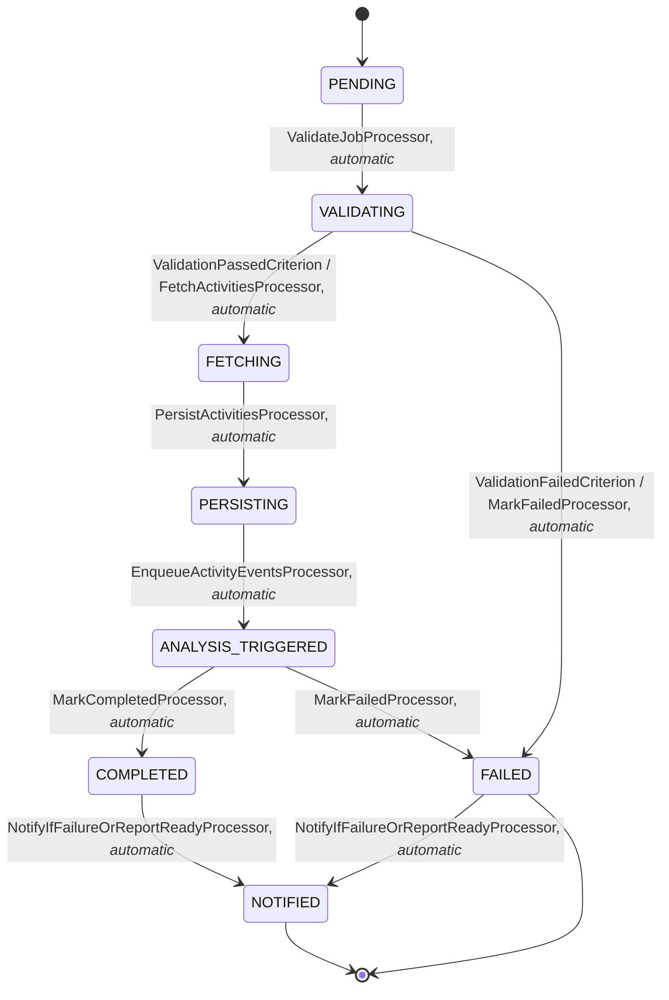
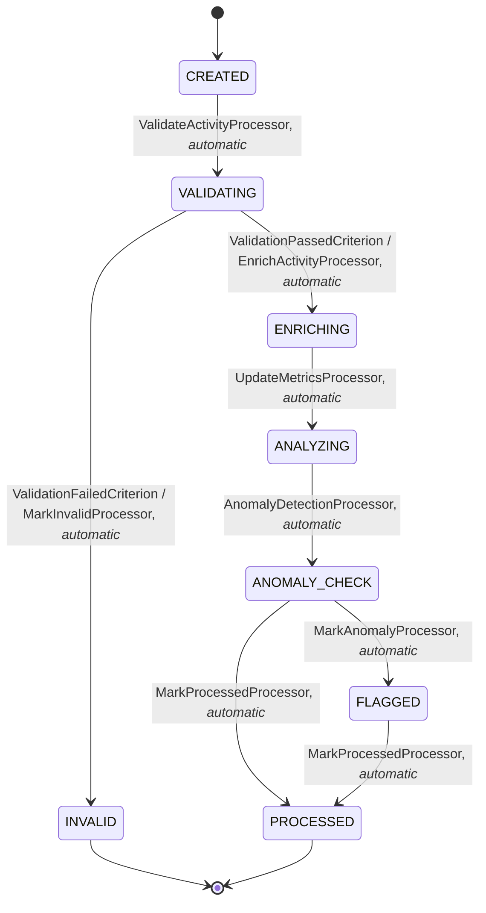
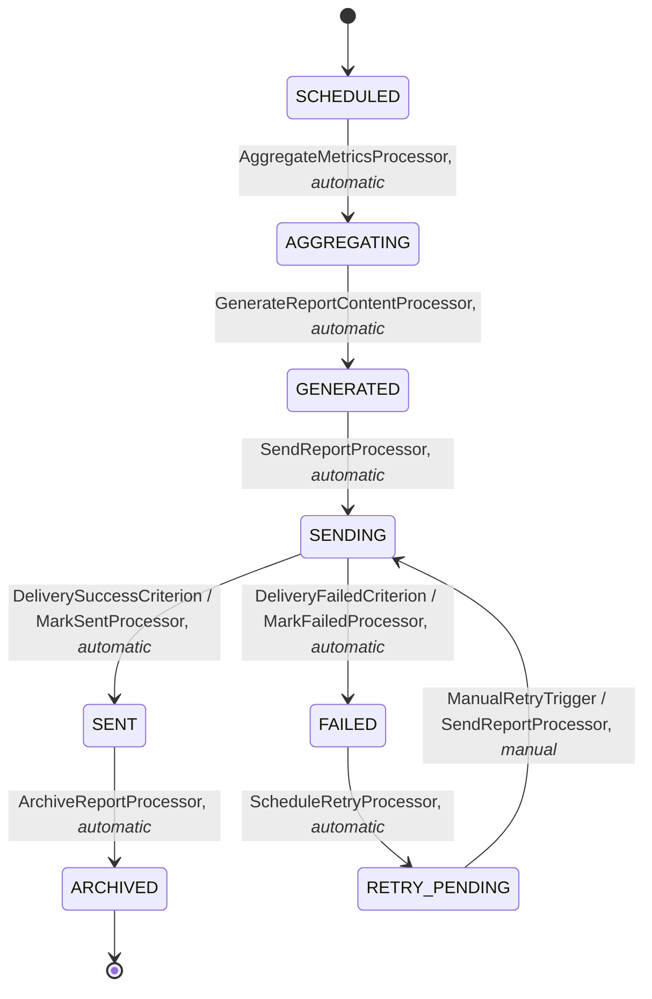

### 1. Entity Definitions
```
IngestionJob:
- jobId: String (business id for this ingestion request)
- runDate: String (ISO date the job should ingest for)
- timezone: String (timezone context for runDate)
- source: String (data source identifier, e.g., Fakerest)
- status: String (PENDING / RUNNING / COMPLETED / FAILED)
- startedAt: String (timestamp)
- finishedAt: String (timestamp)
- summary: Object (high level stats after run)
- initiatedBy: String (system or user)

Activity:
- activityId: String (source activity id)
- userId: String (user identifier)
- timestamp: String (ISO timestamp of activity)
- type: String (activity type / name)
- metadata: Object (free-form activity details)
- source: String (origin system)
- processed: Boolean (whether downstream analysis completed)
- anomalyFlag: Boolean (true if flagged)

Report:
- reportDate: String (ISO date the report summarizes)
- generatedAt: String (timestamp)
- summary: Object (textual summary)
- metrics: Object (aggregated KPIs e.g., totals, per-type counts)
- anomalies: Array (list of flagged anomalies)
- recipients: Array (list of admin emails)
- deliveryStatus: String (PENDING/SENT/FAILED)
- archivedAt: String (timestamp)
```

### 2. Entity workflows

IngestionJob workflow:
1. Initial State: PENDING when POSTed (or scheduled)
2. Validation: validate runDate, source, connectivity
3. Fetching: call Fakerest API to fetch activities for runDate
4. Persisting: create Activity entities (each creation is an EVENT)
5. Analysis Trigger: on persist of Activities, start Activity workflows
6. Completion: mark COMPLETED or FAILED, store summary and metrics
7. Notification: optional admin notification if failure


```mermaid
stateDiagram-v2
    [*] --> PENDING
    PENDING --> VALIDATING : ValidateJobProcessor, *automatic*
    VALIDATING --> FETCHING : ValidationPassedCriterion / FetchActivitiesProcessor, *automatic*
    VALIDATING --> FAILED : ValidationFailedCriterion / MarkFailedProcessor, *automatic*
    FETCHING --> PERSISTING : PersistActivitiesProcessor, *automatic*
    PERSISTING --> ANALYSIS_TRIGGERED : EnqueueActivityEventsProcessor, *automatic*
    ANALYSIS_TRIGGERED --> COMPLETED : MarkCompletedProcessor, *automatic*
    ANALYSIS_TRIGGERED --> FAILED : MarkFailedProcessor, *automatic*
    COMPLETED --> NOTIFIED : NotifyIfFailureOrReportReadyProcessor, *automatic*
    NOTIFIED --> [*]
    FAILED --> NOTIFIED : NotifyIfFailureOrReportReadyProcessor, *automatic*
    FAILED --> [*]
```

Processors and criteria for IngestionJob:
- Processors: ValidateJobProcessor, FetchActivitiesProcessor, PersistActivitiesProcessor, MarkCompletedProcessor, NotifyIfFailureOrReportReadyProcessor
- Criteria: ValidationPassedCriterion, ValidationFailedCriterion

Activity workflow:
1. Initial State: CREATED when persisted by IngestionJob (this create is an EVENT)
2. Validation/Enrichment: check required fields and enrich (e.g., user lookup)
3. Analysis: update aggregate counters and feed Report metrics
4. Anomaly Detection: apply anomaly rules or statistical checks
5. Mark Processed: processed=true and persist anomaly flag


```mermaid
stateDiagram-v2
    [*] --> CREATED
    CREATED --> VALIDATING : ValidateActivityProcessor, *automatic*
    VALIDATING --> ENRICHING : ValidationPassedCriterion / EnrichActivityProcessor, *automatic*
    VALIDATING --> INVALID : ValidationFailedCriterion / MarkInvalidProcessor, *automatic*
    ENRICHING --> ANALYZING : UpdateMetricsProcessor, *automatic*
    ANALYZING --> ANOMALY_CHECK : AnomalyDetectionProcessor, *automatic*
    ANOMALY_CHECK --> PROCESSED : MarkProcessedProcessor, *automatic*
    ANOMALY_CHECK --> FLAGGED : MarkAnomalyProcessor, *automatic*
    FLAGGED --> PROCESSED : MarkProcessedProcessor, *automatic*
    INVALID --> [*]
    PROCESSED --> [*]
```

Processors and criteria for Activity:
- Processors: ValidateActivityProcessor, EnrichActivityProcessor, UpdateMetricsProcessor, AnomalyDetectionProcessor, MarkProcessedProcessor
- Criteria: ValidationPassedCriterion, ValidationFailedCriterion, AnomalyThresholdCriterion

Report workflow:
1. Initial State: SCHEDULED (daily scheduled job creates Report entity for reportDate)
2. Aggregation: collect metrics from Activities for reportDate
3. Generation: produce summary and assemble anomalies and charts
4. Delivery: attempt to send report to recipients
5. Completion: mark SENT or FAILED and archive


```mermaid
stateDiagram-v2
    [*] --> SCHEDULED
    SCHEDULED --> AGGREGATING : AggregateMetricsProcessor, *automatic*
    AGGREGATING --> GENERATED : GenerateReportContentProcessor, *automatic*
    GENERATED --> SENDING : SendReportProcessor, *automatic*
    SENDING --> SENT : DeliverySuccessCriterion / MarkSentProcessor, *automatic*
    SENDING --> FAILED : DeliveryFailedCriterion / MarkFailedProcessor, *automatic*
    SENT --> ARCHIVED : ArchiveReportProcessor, *automatic*
    FAILED --> RETRY_PENDING : ScheduleRetryProcessor, *automatic*
    RETRY_PENDING --> SENDING : ManualRetryTrigger / SendReportProcessor, *manual*
    ARCHIVED --> [*]
```

Processors and criteria for Report:
- Processors: AggregateMetricsProcessor, GenerateReportContentProcessor, SendReportProcessor, MarkSentProcessor, ArchiveReportProcessor, ScheduleRetryProcessor
- Criteria: DeliverySuccessCriterion, DeliveryFailedCriterion, ReportReadyCriterion

### 3. Pseudo code for processor classes (concise)

ValidateJobProcessor:
```
function process(job) {
  if missing runDate or source unreachable then mark job.validationPassed = false
  else mark job.validationPassed = true
}
```

FetchActivitiesProcessor:
```
function process(job) {
  activities = call Fakerest API for job.runDate
  if response error then throw
  return activities
}
```

PersistActivitiesProcessor:
```
function process(job, activities) {
  for each a in activities:
    create Activity entity with processed=false
    // Cyoda will start Activity workflow on persist
}
```

ValidateActivityProcessor:
```
function process(activity) {
  if missing userId or timestamp then set activity.valid=false
  else set activity.valid=true
}
```

EnrichActivityProcessor:
```
function process(activity) {
  lookup user metadata if available
  populate activity.metadata.enriched = true
}
```

AnomalyDetectionProcessor:
```
function process(activity) {
  metrics = fetch recent metrics for user/type
  if anomalyThresholdBroken(metrics, activity) then activity.anomalyFlag = true
}
```

AggregateMetricsProcessor:
```
function process(report) {
  collect activities for report.reportDate
  compute totals, per-type counts, top users, trends
  store in report.metrics
}
```

SendReportProcessor:
```
function process(report) {
  payload = render(report.summary, report.metrics, report.anomalies)
  for recipient in report.recipients send email
  set report.deliveryStatus = SENT or FAILED
}
```

MarkSentProcessor / MarkFailedProcessor: set deliveryStatus and timestamps.

### 4. API Endpoints Design Rules and JSON formats

Rules applied:
- POST endpoints trigger entity creation events and return only technicalId.
- Orchestration entity: IngestionJob has POST + GET by technicalId.
- GET endpoints only retrieve stored results.
- GET by condition not included (not requested).

Endpoints:

1) Create Ingestion Job (manual trigger)
POST /jobs/ingest
Request:
```json
{
  "jobId": "ingest-2025-08-20",
  "runDate": "2025-08-19",
  "timezone": "UTC",
  "source": "fakerest",
  "initiatedBy": "system"
}
```
Response:
```json
{
  "technicalId": "tech-abc-123"
}
```

2) Get Ingestion Job by technicalId
GET /jobs/ingest/{technicalId}
Response:
```json
{
  "jobId": "ingest-2025-08-19",
  "runDate": "2025-08-19",
  "timezone": "UTC",
  "source": "fakerest",
  "status": "COMPLETED",
  "startedAt": "2025-08-19T00:00:10Z",
  "finishedAt": "2025-08-19T00:02:03Z",
  "summary": {"activitiesFetched": 123, "errors": 0},
  "initiatedBy": "system"
}
```

3) Get Activity by technicalId
GET /activities/{technicalId}
Response:
```json
{
  "activityId": "a-987",
  "userId": "u-55",
  "timestamp": "2025-08-19T12:34:56Z",
  "type": "login",
  "metadata": {"ip":"1.2.3.4"},
  "source": "fakerest",
  "processed": true,
  "anomalyFlag": false
}
```

4) Get Report by technicalId
GET /reports/{technicalId}
Response:
```json
{
  "reportDate": "2025-08-19",
  "generatedAt": "2025-08-20T01:00:00Z",
  "summary": "Daily activity summary",
  "metrics": {"totalActivities": 123, "perType": {"login":50,"purchase":10}},
  "anomalies": [{"activityId":"a-999","reason":"spike in purchases"}],
  "recipients": ["admin@example.com"],
  "deliveryStatus": "SENT",
  "archivedAt": "2025-08-20T01:05:00Z"
}
```

If you want, I can: 
- expand to include User entity, Alert entity, Schedule entity (up to 10 total), 
- add GET by condition endpoints (e.g., activities by user/date), 
or
- produce a sequence diagram for a full daily run. Which would you like next?