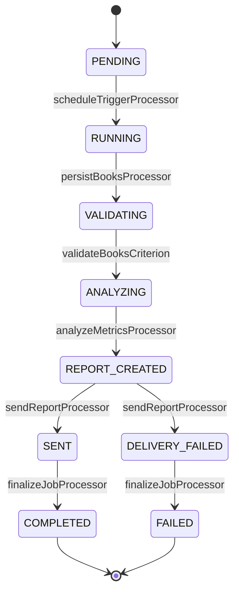
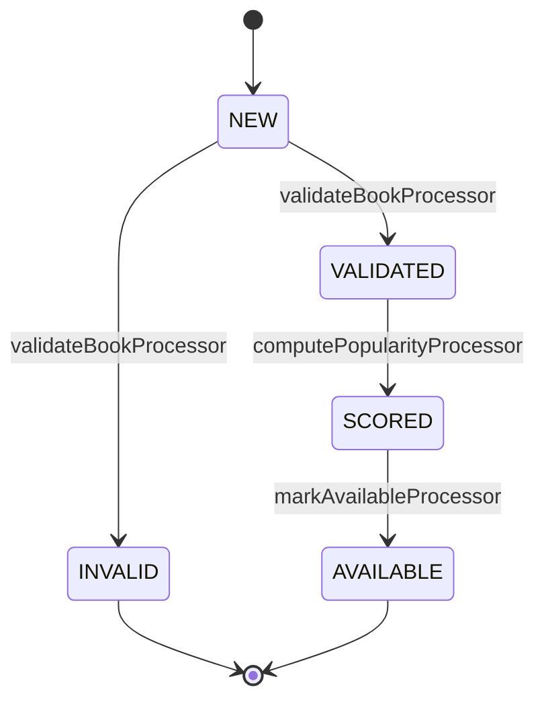
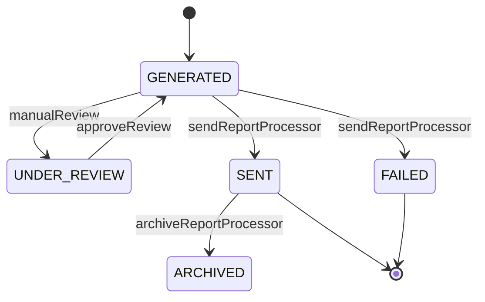
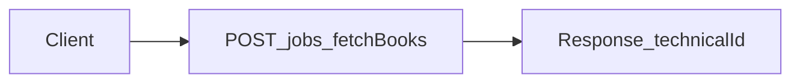
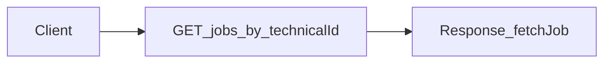
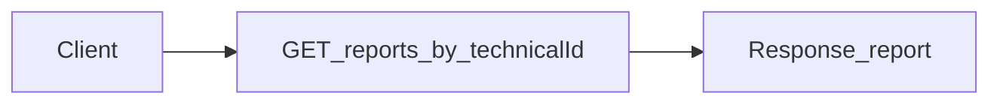
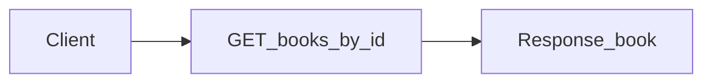

### 1. Entity Definitions
```
Book:
- id: Integer (API source id)
- title: String (book title)
- description: String (full description)
- pageCount: Integer (number of pages)
- excerpt: String (short excerpt)
- publishDate: DateTime (publication date)
- retrievedAt: DateTime (when fetched)
- sourceStatus: String (ok/missing/invalid)
- popularityScore: Double (computed score for ranking)

FetchJob:
- name: String (human name for the job)
- runDay: String (e.g., Wednesday)
- runTime: String (HH:mm with timezone context)
- timezone: String (timezone to interpret runTime)
- recurrence: String (weekly)
- recipients: Array of String (email list for reports)
- lastRunAt: DateTime
- nextRunAt: DateTime
- status: String (scheduled/paused/running/failed)
- triggeredBy: String (manual/schedule)
- parameters: Object (e.g., topNPopular)

WeeklyReport:
- weekStartDate: DateTime
- weekEndDate: DateTime
- totalBooks: Integer
- totalPages: Integer
- avgPages: Double
- topTitles: Array of Object (id, title, pageCount)
- popularTitles: Array of Object (id, title, descriptionSnippet, excerptSnippet)
- publicationSummary: Object (newest, oldest, countsByYear)
- generationTimestamp: DateTime
- reportStatus: String (generated/sent/failed)
- deliveryInfo: Object (recipients, emailStatus)
```

### 2. Entity workflows

FetchJob workflow:
1. Initial State: FetchJob created (scheduled or manual) -> PENDING
2. Trigger: On scheduled time or manual trigger -> RUNNING (automatic)
3. Fetching: Emit fetch events that persist Book entities -> RUNNING
4. Post-Fetch Validation: Check fetched records -> VALIDATING
5. Analysis: If validation ok, compute metrics and assemble WeeklyReport -> ANALYZING
6. Report Generation: Create WeeklyReport entity -> REPORT_CREATED
7. Delivery: Send email to recipients -> SENT or DELIVERY_FAILED
8. Completion: Update job lastRunAt/nextRunAt -> COMPLETED or FAILED
Manual transitions: manual trigger to RUNNING, pause/resume job
Automatic transitions: scheduled run, automatic creation of Book and WeeklyReport entities


```mermaid
stateDiagram-v2
    [*] --> PENDING
    PENDING --> RUNNING : scheduleTriggerProcessor
    RUNNING --> VALIDATING : persistBooksProcessor
    VALIDATING --> ANALYZING : validateBooksCriterion
    ANALYZING --> REPORT_CREATED : analyzeMetricsProcessor
    REPORT_CREATED --> SENT : sendReportProcessor
    REPORT_CREATED --> DELIVERY_FAILED : sendReportProcessor
    SENT --> COMPLETED : finalizeJobProcessor
    DELIVERY_FAILED --> FAILED : finalizeJobProcessor
    COMPLETED --> [*]
    FAILED --> [*]
```

FetchJob workflow processors and criteria:
- Processors (4)
  - scheduleTriggerProcessor (kicks off at scheduled time or manual)
  - persistBooksProcessor (fetches API and persists Book entities)
  - analyzeMetricsProcessor (aggregates and creates WeeklyReport)
  - sendReportProcessor (emails report and sets deliveryInfo)
  - finalizeJobProcessor (updates lastRunAt/nextRunAt)
- Criteria (2)
  - validateBooksCriterion (checks data completeness / sourceStatus)
  - deliverySuccessCriterion (checks mail delivery result)

Book workflow:
1. Initial State: Book persisted by FetchJob -> NEW
2. Validation: run validation processors -> VALIDATED or INVALID
3. Scoring: compute popularityScore -> SCORED
4. Indexed for report: available for analysis -> AVAILABLE
Manual transitions: mark book as excluded/manual correction
Automatic transitions: validation and scoring triggered by persistence


```mermaid
stateDiagram-v2
    [*] --> NEW
    NEW --> VALIDATED : validateBookProcessor
    VALIDATED --> SCORED : computePopularityProcessor
    SCORED --> AVAILABLE : markAvailableProcessor
    NEW --> INVALID : validateBookProcessor
    INVALID --> [*]
    AVAILABLE --> [*]
```

Book processors and criteria:
- Processors (3)
  - validateBookProcessor (checks required fields and sets sourceStatus)
  - computePopularityProcessor (computes popularityScore based on rules)
  - markAvailableProcessor (flags book for inclusion in reports)
- Criteria (1)
  - isBookValidCriterion (true if required fields present for metrics)

WeeklyReport workflow:
1. Initial State: WeeklyReport created by analyzeMetricsProcessor -> GENERATED
2. Review: Optional manual review by analyst -> UNDER_REVIEW (manual)
3. Delivery: sendReportProcessor invoked -> SENT or FAILED
4. Archive: after successful send -> ARCHIVED


```mermaid
stateDiagram-v2
    [*] --> GENERATED
    GENERATED --> UNDER_REVIEW : manualReview
    UNDER_REVIEW --> GENERATED : approveReview
    GENERATED --> SENT : sendReportProcessor
    SENT --> ARCHIVED : archiveReportProcessor
    SENT --> [*]
    GENERATED --> FAILED : sendReportProcessor
    FAILED --> [*]
```

WeeklyReport processors and criteria:
- Processors (3)
  - assembleSummaryProcessor (formats summaryText and attachments)
  - sendReportProcessor (emails report and updates deliveryInfo)
  - archiveReportProcessor (marks report archived and stores audit)
- Criteria (1)
  - isReportCompleteCriterion (checks presence of required report fields)

### 3. Pseudo code for processor classes

persistBooksProcessor
```
class persistBooksProcessor {
  process(fetchJob) {
    response = callFakeRestApi() // fetch list of books
    for each item in response {
      book = mapToBookEntity(item)
      book.retrievedAt = now()
      book.sourceStatus = determineStatus(item)
      persist(book) // persistence triggers Book workflow automatically in Cyoda
    }
  }
}
```

validateBookProcessor
```
class validateBookProcessor {
  process(book) {
    if missing title or pageCount or publishDate {
      book.sourceStatus = invalid
      persist(book)
      return
    }
    book.sourceStatus = ok
    persist(book)
  }
}
```

computePopularityProcessor
```
class computePopularityProcessor {
  process(book, params) {
    score = normalize(pageCount) * 0.7 + recencyScore(publishDate) * 0.3
    book.popularityScore = score
    persist(book)
  }
}
```

analyzeMetricsProcessor
```
class analyzeMetricsProcessor {
  process(fetchJob) {
    books = queryBooksAvailableAt(fetchJob.lastRunAt, now) // or all time
    metrics = computeTotalsAndAverages(books)
    topTitles = selectTopNBy(books, popularityScore, fetchJob.parameters.topNPopular)
    report = WeeklyReport(metrics..., topTitles..., generationTimestamp=now())
    persist(report) // triggers WeeklyReport workflow
  }
}
```

sendReportProcessor
```
class sendReportProcessor {
  process(report, recipients) {
    emailResult = sendEmail(recipients, report.summaryText, report.attachment)
    report.deliveryInfo = emailResult
    report.reportStatus = emailResult.success ? sent : failed
    persist(report)
  }
}
```

### 4. API Endpoints Design Rules

Rules applied:
- Orchestration entity FetchJob has POST (creates a scheduled/manual run) and GET by technicalId
- WeeklyReport GET by technicalId allowed (reports created by system). No POST for Book (Books are created by FetchJob processing)
- POST responses return only technicalId
- GET returns stored entity representation (including technicalId)

Endpoints (examples)

1) Create/Trigger Fetch Job (POST)
- POST /jobs/fetchBooks
- Request body JSON:
{
  "name": "Weekly Book Fetch",
  "runDay": "Wednesday",
  "runTime": "08:00",
  "timezone": "UTC",
  "recurrence": "weekly",
  "recipients": ["analytics@company.com"],
  "parameters": {"topNPopular": 5},
  "triggeredBy": "schedule"
}
- Response body JSON:
{ "technicalId": "job-abc-123" }

Visual flow:

```mermaid
flowchart LR
    Client --> POST_jobs_fetchBooks
    POST_jobs_fetchBooks --> Response_technicalId
```

2) Get FetchJob status/result by technicalId (GET)
- GET /jobs/fetchBooks/{technicalId}
- Response body JSON: (full FetchJob fields + technicalId)
{
  "technicalId": "job-abc-123",
  "name": "...",
  "runDay": "...",
  "runTime": "...",
  "timezone": "...",
  "recurrence": "...",
  "recipients": ["..."],
  "lastRunAt": "...",
  "nextRunAt": "...",
  "status": "completed"
}

Visual flow:

```mermaid
flowchart LR
    Client --> GET_jobs_by_technicalId
    GET_jobs_by_technicalId --> Response_fetchJob
```

3) Get WeeklyReport by technicalId (GET)
- GET /reports/weekly/{technicalId}
- Response body JSON: (WeeklyReport fields + technicalId)
{
  "technicalId": "report-xyz-789",
  "weekStartDate": "...",
  "weekEndDate": "...",
  "totalBooks": 120,
  "totalPages": 45000,
  "avgPages": 375,
  "topTitles": [ { "id": 1, "title": "X", "pageCount": 500 } ],
  "popularTitles": [ { "id": 1, "title": "X", "descriptionSnippet": "...", "excerptSnippet": "..." } ],
  "generationTimestamp": "...",
  "reportStatus": "sent",
  "deliveryInfo": { "recipients": ["analytics@company.com"], "emailStatus": "delivered" }
}

Visual flow:

```mermaid
flowchart LR
    Client --> GET_reports_by_technicalId
    GET_reports_by_technicalId --> Response_report
```

4) Get Book by source id (GET)
- GET /books/{id}
- Response body JSON: Book entity fields (no technicalId because Book is created via processing)
{
  "id": 1,
  "title": "...",
  "description": "...",
  "pageCount": 300,
  "excerpt": "...",
  "publishDate": "...",
  "retrievedAt": "...",
  "sourceStatus": "ok",
  "popularityScore": 0.85
}

Visual flow:

```mermaid
flowchart LR
    Client --> GET_books_by_id
    GET_books_by_id --> Response_book
```

Notes and decisions for you to confirm
- Popularity rule: default composite score (pageCount weighted + recency). Confirm if you prefer top N by pageCount instead.
- Report range: default uses full snapshot at run time. Confirm if you prefer delta (only new/updated since lastRunAt).
- Delivery: default email summary + CSV attachment. Confirm recipient list and preferred format.

If you confirm the popularity rule, report range (snapshot vs delta), and recipients/format, I will refine processor details and criteria names for direct modeling in Cyoda.