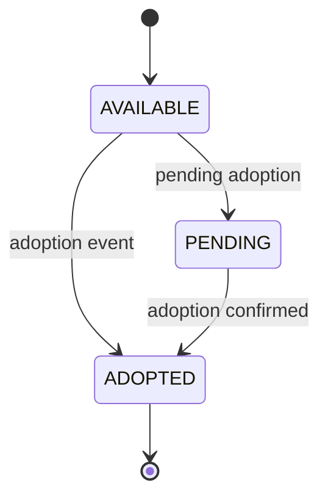
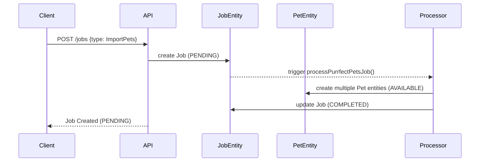

### 1. Entity Definitions

``` 
PurrfectPetsJob:
- jobId: String (unique identifier for the job)
- type: String (job type, e.g., "ImportPets", "UpdatePetStatus")
- payload: Object (JSON payload with job-specific data)
- status: StatusEnum (PENDING, PROCESSING, COMPLETED, FAILED)

Pet:
- petId: String (unique identifier for the pet)
- name: String (pet's name)
- species: String (e.g., Cat, Dog, Bird)
- breed: String (pet's breed)
- age: Integer (pet's age in years)
- status: StatusEnum (AVAILABLE, ADOPTED, PENDING)
```

---

### 2. Process Method Flows

**processPurrfectPetsJob() Flow:**

1. Initial State: Job created with `PENDING` status  
2. Validation: Verify job type and payload structure  
3. Processing:  
   - If `ImportPets`: fetch Petstore API data and save new `Pet` entities with status `AVAILABLE`  
   - If `UpdatePetStatus`: update pet status by creating new pet state entity (immutable pattern)  
4. Completion: Update job status to `COMPLETED` on success or `FAILED` on error  
5. Notification: Log job result and optionally notify external systems  

**processPet() Flow:**

1. Initial State: Pet entity created with status (e.g., `AVAILABLE`)  
2. Validation: Check required fields (name, species, breed)  
3. Processing: Business logic such as verifying age constraints, assigning adoption status  
4. Completion: Confirm pet entity persistence with final status  
5. Notification: Log pet addition/update event  

---

### 3. API Endpoints Design

| Method | Endpoint            | Description                              | Request Body                         | Response                     |
|--------|---------------------|--------------------------------------|------------------------------------|------------------------------|
| POST   | /jobs               | Create a new PurrfectPetsJob (triggers event) | `{ "type": "ImportPets", "payload": {...} }` | `{ "jobId": "...", "status": "PENDING" }` |
| POST   | /pets               | Add new pet or new pet state (triggers event) | `{ "name": "Whiskers", "species": "Cat", "breed": "Siamese", "age": 3, "status": "AVAILABLE" }` | `{ "petId": "...", "status": "AVAILABLE" }` |
| GET    | /pets               | List all pets with current status     | N/A                                | `[ { "petId": "...", "name": "...", ... } ]`  |
| GET    | /jobs/{jobId}       | Get job status and result              | N/A                                | `{ "jobId": "...", "status": "COMPLETED", "details": {...} }` |

---

### 4. Request/Response JSON Examples

**POST /jobs**

Request:  
```json
{
  "type": "ImportPets",
  "payload": {}
}
```

Response:  
```json
{
  "jobId": "job123",
  "status": "PENDING"
}
```

**POST /pets**

Request:  
```json
{
  "name": "Mittens",
  "species": "Cat",
  "breed": "Tabby",
  "age": 2,
  "status": "AVAILABLE"
}
```

Response:  
```json
{
  "petId": "pet567",
  "status": "AVAILABLE"
}
```

---

### Mermaid Diagrams

**Entity Lifecycle State Diagram for Job**


```mermaid
stateDiagram-v2
    [*] --> PENDING
    PENDING --> PROCESSING : processPurrfectPetsJob()
    PROCESSING --> COMPLETED : success
    PROCESSING --> FAILED : error
    COMPLETED --> [*]
    FAILED --> [*]
```

**Entity Lifecycle State Diagram for Pet**


```mermaid
stateDiagram-v2
    [*] --> AVAILABLE
    AVAILABLE --> ADOPTED : adoption event
    AVAILABLE --> PENDING : pending adoption
    PENDING --> ADOPTED : adoption confirmed
    ADOPTED --> [*]
```

**Event-Driven Processing Chain**


```mermaid
sequenceDiagram
    participant Client
    participant API
    participant JobEntity
    participant PetEntity
    participant Processor

    Client->>API: POST /jobs {type: ImportPets}
    API->>JobEntity: create Job (PENDING)
    JobEntity-->>Processor: trigger processPurrfectPetsJob()
    Processor->>PetEntity: create multiple Pet entities (AVAILABLE)
    Processor->>JobEntity: update Job (COMPLETED)
    API-->>Client: Job Created (PENDING)
```

---

If you need any further assistance or adjustments, please feel free to ask!