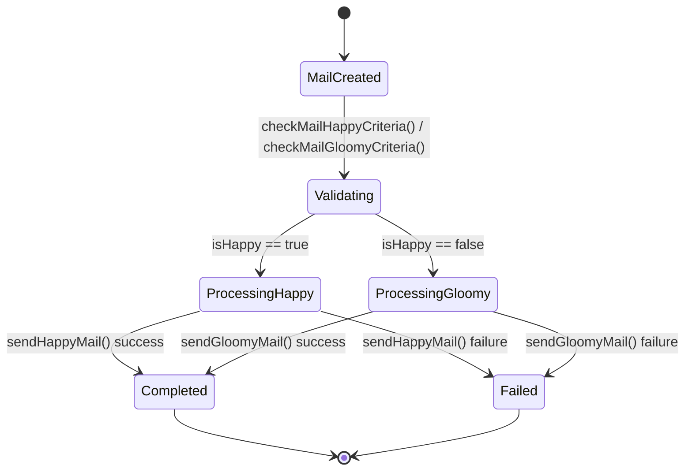
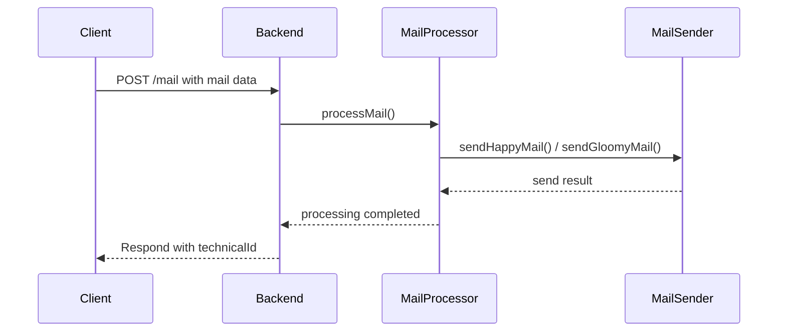

### 1. Entity Definitions

```
Mail:
- isHappy: Boolean (Defines if the mail is happy or gloomy)
- mailList: List<String> (List of recipient email addresses)
```

---

### 2. Process Method Flows

```
processMail() Flow:
1. Initial State: Mail entity created with isHappy and mailList set
2. Validation: 
   - If explicitly requested, checkMailHappyCriteria() validates if mail is happy
   - If explicitly requested, checkMailGloomyCriteria() validates if mail is gloomy
3. Processing:
   - If isHappy == true, sendHappyMail() processor sends mails to mailList
   - If isHappy == false, sendGloomyMail() processor sends mails to mailList
4. Completion: Mail sending results recorded (success/failure logged)
5. Notification: Optionally notify about sending status (e.g., via events or logs)
```

---

### 3. API Endpoints Design

| Endpoint                          | Description                                  | Request Body                                   | Response                        |
|----------------------------------|----------------------------------------------|------------------------------------------------|--------------------------------|
| POST /mail                       | Create a new mail entity and trigger processing | `{ "isHappy": true/false, "mailList": ["email1", "email2"] }` | `{ "technicalId": "uuid-string" }` |
| GET /mail/{technicalId}          | Retrieve stored mail entity by technicalId   | N/A                                            | `{ "isHappy": true/false, "mailList": ["email1", "email2"] }` |
| (Optional) GET /mail?isHappy=...| Retrieve mails filtered by isHappy status    | N/A                                            | `[ { "isHappy": ..., "mailList": [...] }, ... ]` |

---

### 4. Request/Response Formats

**POST /mail**

Request:
```json
{
  "isHappy": true,
  "mailList": [
    "recipient1@example.com",
    "recipient2@example.com"
  ]
}
```

Response:
```json
{
  "technicalId": "123e4567-e89b-12d3-a456-426614174000"
}
```

**GET /mail/{technicalId}**

Response:
```json
{
  "isHappy": true,
  "mailList": [
    "recipient1@example.com",
    "recipient2@example.com"
  ]
}
```

**GET /mail?isHappy=true (optional)**

Response:
```json
[
  {
    "isHappy": true,
    "mailList": [
      "recipient1@example.com"
    ]
  },
  {
    "isHappy": true,
    "mailList": [
      "recipient2@example.com"
    ]
  }
]
```

---

### 5. Mermaid Diagrams

**Mail Entity Lifecycle**


```mermaid
stateDiagram-v2
    [*] --> MailCreated
    MailCreated --> Validating : checkMailHappyCriteria() / checkMailGloomyCriteria()
    Validating --> ProcessingHappy : isHappy == true
    Validating --> ProcessingGloomy : isHappy == false
    ProcessingHappy --> Completed : sendHappyMail() success
    ProcessingHappy --> Failed : sendHappyMail() failure
    ProcessingGloomy --> Completed : sendGloomyMail() success
    ProcessingGloomy --> Failed : sendGloomyMail() failure
    Completed --> [*]
    Failed --> [*]
```

**Event-Driven Processing Chain**


```mermaid
sequenceDiagram
    participant Client
    participant Backend
    participant MailProcessor
    participant MailSender

    Client->>Backend: POST /mail with mail data
    Backend->>MailProcessor: processMail()
    MailProcessor->>MailSender: sendHappyMail() / sendGloomyMail()
    MailSender-->>MailProcessor: send result
    MailProcessor-->>Backend: processing completed
    Backend-->>Client: Respond with technicalId
```

---

This completes the confirmed functional requirements for your Happy Mails application based on Event-Driven Architecture principles. If you need further refinement or additional features, please let me know!