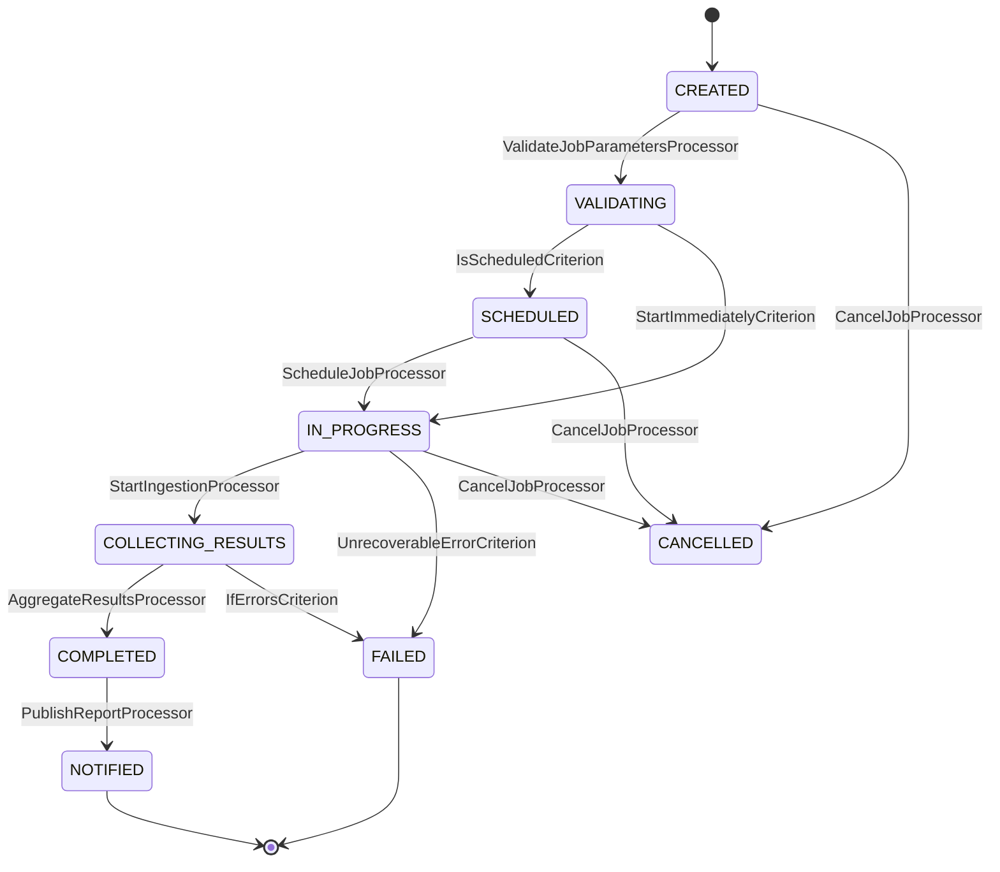
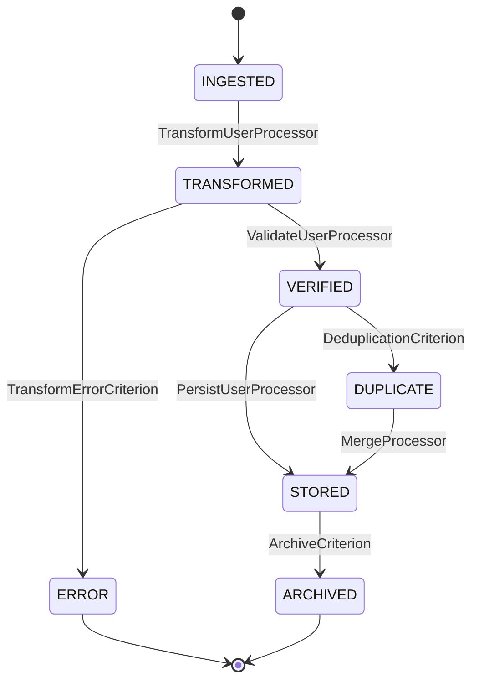
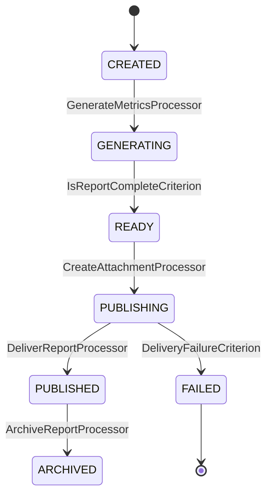

# Functional Requirements

## Overview
This document defines the current functional requirements, entities, workflows, processors, and API design rules for the batch ingestion, user normalization, and monthly reporting prototype. All logic below is intended to be the up-to-date single source of truth for implementation.

---

## 1. Entity Definitions
All timestamps are ISO-8601 strings (UTC by default unless timezone provided). All entities expose a `technicalId` (system-generated) and may include domain IDs (e.g., `externalId`).

### BatchJob
- technicalId: String (e.g. `job_12345`, system-generated)
- jobName: String (friendly name for the run)
- scheduledFor: String? (ISO datetime when job should run; nullable for immediate/manual runs)
- timezone: String (job timezone, e.g. `UTC`)
- adminEmails: List<String> (recipients for reports)
- status: String (CREATED, VALIDATING, SCHEDULED, IN_PROGRESS, COLLECTING_RESULTS, COMPLETED, FAILED, NOTIFIED, CANCELLED)
- createdAt: String (ISO datetime)
- startedAt: String? (ISO datetime)
- finishedAt: String? (ISO datetime)
- processedUserCount: Integer? (summary metric populated after ingestion)
- errorMessage: String? (last error message or null)
- attempts: Integer (number of run attempts, default 0)

Notes:
- `status` reflects the workflow state machine (see workflows).
- `scheduledFor` + `timezone` determine whether job is scheduled or should start immediately.

### UserRecord
- technicalId: String (e.g. `user_987`, system-generated)
- externalId: Integer? (id from external system, when present)
- firstName: String?
- lastName: String?
- email: String?
- sourcePayload: String (raw JSON fetched from source)
- transformedAt: String? (ISO datetime)
- normalized: Boolean? (true if standardization/normalization succeeded)
- storedAt: String? (ISO datetime when persisted to canonical store)
- lastSeen: String? (ISO datetime for deduplication/last activity)
- status: String (INGESTED, TRANSFORMED, VERIFIED, DUPLICATE, STORED, ARCHIVED, ERROR)
- errorMessage: String? (if normalization or validation failed)

Notes:
- `status` is required and reflects processing progress for a single record.
- `normalized` true implies name/email normalization has been applied.

### MonthlyReport
- technicalId: String (e.g. `report_2025-09`, system-generated)
- month: String (YYYY-MM, the report month)
- generatedAt: String? (ISO datetime)
- totalUsers: Integer?
- newUsers: Integer?
- changedUsers: Integer?
- reportUrl: String? (storage link or path for the generated artifact)
- status: String (CREATED, GENERATING, READY, PUBLISHING, PUBLISHED, FAILED, ARCHIVED)
- deliveredTo: List<String> (emails to which the report was/should be delivered)
- deliveryStatus: String? (SENT, FAILED, PARTIAL)
- errorMessage: String? (if delivery or generation failed)

Notes:
- `month` is the canonical key for monthly reports; `technicalId` should include the month for easy lookup.

---

## 2. Workflows
Each entity has an explicit state machine. The status enumerations above are authoritative.

### BatchJob workflow (states)
1. CREATED (persisted via POST -> workflow starts)
2. VALIDATING (automatic validation of request parameters)
3. SCHEDULED (if scheduledFor is in the future)
4. IN_PROGRESS (started immediately or at scheduled time)
5. COLLECTING_RESULTS (ingestion/processing finished, aggregating results)
6. COMPLETED (successful end)
7. FAILED (terminal on unrecoverable error)
8. NOTIFIED (report published and admin notified; transient/post-completion state)
9. CANCELLED (manual cancellation before or during processing)

State diagram (mermaid):


```mermaid
stateDiagram-v2
    [*] --> CREATED
    CREATED --> VALIDATING : ValidateJobParametersProcessor
    VALIDATING --> SCHEDULED : IsScheduledCriterion
    VALIDATING --> IN_PROGRESS : StartImmediatelyCriterion
    SCHEDULED --> IN_PROGRESS : ScheduleJobProcessor
    IN_PROGRESS --> COLLECTING_RESULTS : StartIngestionProcessor
    IN_PROGRESS --> FAILED : UnrecoverableErrorCriterion
    COLLECTING_RESULTS --> COMPLETED : AggregateResultsProcessor
    COLLECTING_RESULTS --> FAILED : IfErrorsCriterion
    COMPLETED --> NOTIFIED : PublishReportProcessor
    NOTIFIED --> [*]
    FAILED --> [*]
    CREATED --> CANCELLED : CancelJobProcessor
    SCHEDULED --> CANCELLED : CancelJobProcessor
    IN_PROGRESS --> CANCELLED : CancelJobProcessor
```

Processors: ValidateJobParametersProcessor, ScheduleJobProcessor, StartIngestionProcessor, AggregateResultsProcessor, PublishReportProcessor, CancelJobProcessor

Criteria: IsScheduledCriterion, StartImmediatelyCriterion, IfErrorsCriterion, UnrecoverableErrorCriterion

Important behavior and rules:
- Creating a BatchJob via POST returns immediately with a `technicalId` and `status = CREATED`.
- Validation moves the job to VALIDATING; validation failures set status = FAILED and populate `errorMessage`.
- If scheduledFor is in the future, status moves to SCHEDULED and the scheduler is responsible for transitioning to IN_PROGRESS at the scheduled time.
- Manual start can force a SCHEDULED job to IN_PROGRESS.
- IN_PROGRESS implies processors will create UserRecord entities and update `processedUserCount` progressively.
- A single BatchJob may be retried (increment `attempts`) on transient failures; after a configurable max attempts move to FAILED.

### UserRecord workflow (states)
1. INGESTED: created from source payload (StartIngestionProcessor)
2. TRANSFORMED: normalization and enrichment applied
3. VERIFIED: passed validation (email format, required fields)
4. DUPLICATE: detected as duplicate of an existing user
5. STORED: persisted to canonical store (after merge if duplicate)
6. ARCHIVED: older/expired records archived according to retention
7. ERROR: processing error that requires manual or automated remediation

State diagram (mermaid):


```mermaid
stateDiagram-v2
    [*] --> INGESTED
    INGESTED --> TRANSFORMED : TransformUserProcessor
    TRANSFORMED --> VERIFIED : ValidateUserProcessor
    TRANSFORMED --> ERROR : TransformErrorCriterion
    VERIFIED --> STORED : PersistUserProcessor
    VERIFIED --> DUPLICATE : DeduplicationCriterion
    DUPLICATE --> STORED : MergeProcessor
    STORED --> ARCHIVED : ArchiveCriterion
    ERROR --> [*]
    ARCHIVED --> [*]
```

Processors: TransformUserProcessor, ValidateUserProcessor, PersistUserProcessor, MergeProcessor

Criteria: DeduplicationCriterion, ArchiveCriterion, TransformErrorCriterion

Important rules:
- Duplicate detection must consider email (canonicalized) and externalId; deduplication policy is merge-on-match by default.
- ValidateUserProcessor must mark records with invalid email or missing required fields as ERROR (and include an `errorMessage`).
- Successful verification sets `normalized = true` and `status = VERIFIED`.
- PersistUserProcessor must perform an upsert/merge for existing externalId/email and set `storedAt`.

### MonthlyReport workflow (states)
1. CREATED: report metadata record created (usually by AggregateResultsProcessor)
2. GENERATING: computing metrics and assembling attachment
3. READY: report artifact available and ready to publish
4. PUBLISHING: report being delivered to recipients
5. PUBLISHED: delivery succeeded
6. FAILED: generation or delivery failed
7. ARCHIVED: old reports archived

State diagram (mermaid):


```mermaid
stateDiagram-v2
    [*] --> CREATED
    CREATED --> GENERATING : GenerateMetricsProcessor
    GENERATING --> READY : IsReportCompleteCriterion
    READY --> PUBLISHING : CreateAttachmentProcessor
    PUBLISHING --> PUBLISHED : DeliverReportProcessor
    PUBLISHING --> FAILED : DeliveryFailureCriterion
    PUBLISHED --> ARCHIVED : ArchiveReportProcessor
    FAILED --> [*]
```

Processors: GenerateMetricsProcessor, CreateAttachmentProcessor, DeliverReportProcessor, ArchiveReportProcessor

Criteria: IsReportCompleteCriterion, DeliveryFailureCriterion

Important rules:
- `month` is the canonical report key. Generated reports should use `report_<YYYY-MM>` as `technicalId` when possible.
- Delivery should be idempotent; on partial failure set `deliveryStatus = PARTIAL` and record failed recipients in `errorMessage` or a delivery log.

---

## 3. Processor Pseudocode (up-to-date concise versions)
These pseudocode snippets reflect the latest logic and status transitions.

TransformUserProcessor

```java
void process(UserRecord u) {
  // sourcePayload must be preserved
  u.firstName = normalizeName(extract(u.sourcePayload, "firstName"));
  u.lastName = normalizeName(extract(u.sourcePayload, "lastName"));
  u.email = canonicalizeEmail(extract(u.sourcePayload, "email"));
  u.transformedAt = now();
  u.normalized = true; // set optimistically; validation may flip status
  u.status = "TRANSFORMED";
  emit(u);
}
```

ValidateUserProcessor

```java
void process(UserRecord u) {
  if (!isValidEmail(u.email) || missingRequiredFields(u)) {
    u.status = "ERROR";
    u.errorMessage = buildValidationMessage(u);
    emit(u);
    return;
  }
  u.normalized = true;
  u.status = "VERIFIED";
  emit(u);
}
```

PersistUserProcessor

```java
void process(UserRecord u) {
  Optional<UserRecord> existing = findByExternalIdOrEmail(u.externalId, u.email);
  if (existing.present()) {
    u = mergeRecords(existing.get(), u); // MergeProcessor logic may be delegated
  }
  store(u);
  u.storedAt = now();
  u.status = "STORED";
  updateMetricsCounter();
  emit(u);
}
```

StartIngestionProcessor (invoked by BatchJob)

```java
void process(BatchJob job) {
  List<Json> raw = fetchFakerestUsers();
  for (Json r : raw) {
    UserRecord u = new UserRecord();
    u.sourcePayload = r.toString();
    u.status = "INGESTED";
    u.createdAt = now();
    emit(u);
  }
  job.processedUserCount = raw.size();
  emit(job);
}
```

AggregateResultsProcessor / GenerateMetricsProcessor

```java
void process(BatchJob job) {
  MonthlyReport rep = new MonthlyReport();
  rep.month = job.scheduledFor != null ? job.scheduledFor.substring(0,7) : now().substring(0,7);
  rep.totalUsers = countUsersForMonth(rep.month);
  rep.newUsers = countNewUsers(rep.month);
  rep.changedUsers = countChangedUsers(rep.month);
  rep.generatedAt = now();
  rep.status = "CREATED"; // immediately move to GENERATING via processor
  persist(rep);
  emit(rep);
}
```

DeliverReportProcessor

```java
void process(MonthlyReport r, BatchJob job) {
  r.reportUrl = uploadAttachment(r);
  r.status = "PUBLISHING";
  persist(r);

  DeliveryResult result = deliverToRecipients(r.reportUrl, job.adminEmails);
  r.deliveredTo = result.successfulRecipients;
  r.deliveryStatus = result.overallStatus; // SENT, PARTIAL, FAILED
  r.errorMessage = result.errorDetails; // optional
  r.status = result.overallStatus.equals("SENT") ? "PUBLISHED" : "FAILED";
  r.generatedAt = r.generatedAt == null ? now() : r.generatedAt;
  persist(r);
}
```

---

## 4. API Endpoints Design Rules (updated)
- Only BatchJob is created via POST. Creating a BatchJob produces a `technicalId` and starts the workflow asynchronously.
- UserRecord and MonthlyReport are created/updated by processors only; they provide GET endpoints (by `technicalId`) and query endpoints (by filters such as month).
- POST responses must return only `{ "technicalId": "..." }` for simplicity and to decouple creation from execution.
- All GET responses should include the authoritative `status` and timestamps.
- Endpoints should be idempotent where applicable (for example, retries of the same BatchJob creation with same client-supplied idempotency key should not create duplicate jobs).

POST create BatchJob example

Request body:
```json
{
  "jobName": "Monthly user ingest",
  "scheduledFor": "2025-09-01T00:00:00Z",
  "timezone": "UTC",
  "adminEmails": ["admin@example.com"]
}
```
Response:
```json
{ "technicalId": "job_12345" }
```

GET BatchJob by technicalId example

Response:
```json
{
  "technicalId": "job_12345",
  "jobName": "Monthly user ingest",
  "scheduledFor": "2025-09-01T00:00:00Z",
  "timezone": "UTC",
  "adminEmails": ["admin@example.com"],
  "status": "COMPLETED",
  "createdAt": "2025-09-01T00:00:00Z",
  "startedAt": "2025-09-01T00:00:05Z",
  "finishedAt": "2025-09-01T00:02:30Z",
  "processedUserCount": 1000,
  "errorMessage": null
}
```

GET UserRecord by technicalId example

Response:
```json
{
  "technicalId": "user_987",
  "externalId": 987,
  "firstName": "John",
  "lastName": "Doe",
  "email": "john.doe@example.com",
  "transformedAt": "2025-09-01T00:00:10Z",
  "storedAt": "2025-09-01T00:00:12Z",
  "normalized": true,
  "status": "STORED"
}
```

GET MonthlyReport by technicalId example

Response:
```json
{
  "technicalId": "report_2025-09",
  "month": "2025-09",
  "generatedAt": "2025-09-01T00:01:00Z",
  "totalUsers": 1000,
  "newUsers": 50,
  "changedUsers": 20,
  "reportUrl": "s3://reports/report_2025-09.pdf",
  "status": "PUBLISHED",
  "deliveredTo": ["admin@example.com"],
  "deliveryStatus": "SENT"
}
```

Additional endpoint considerations:
- Provide GET /reports?month=YYYY-MM to retrieve reports by month.
- Provide GET /users?email=... or ?externalId=... for lookup convenience.
- Provide GET /jobs?status=... for operational monitoring.

---

## 5. Error handling, retries and idempotency
- Transient errors should be retried up to a configurable max attempts. On each retry, increment `attempts`.
- Persistent/validation errors should set entity status to `ERROR` or `FAILED` with `errorMessage` and stop automatic retries.
- All external side-effects (email delivery, S3 upload) must be implemented in an idempotent way or be guarded by an idempotency key.

---

## 6. Retention & Archival (summary)
- UserRecords: archived after configurable retention (default: 24 months after `lastSeen`) and status set to `ARCHIVED`.
- MonthlyReports: archived after configurable retention (default: 36 months) and status set to `ARCHIVED`.
- BatchJob records: retain for operational period (default: 12 months) then optionally archive/delete according to compliance needs.

---

## 7. Conventions and naming
- technicalId prefixes: job_, user_, report_
- Status strings are UPPER_SNAKE_CASE and must match the enumerations in this document.
- Timestamps are ISO-8601.

---

## 8. Extension options (what can be refined next)
- Expand fields for audit (who triggered job, correlationIds, requestId)
- Add GET endpoints with filtering/ pagination for each entity (jobs, users, reports)
- Add notifications/ webhooks for state changes
- Add retention policies and automated archival processors

If you want any of these refined (or more detailed API schemas, error codes, or sequence diagrams) tell me which and I will expand them.
