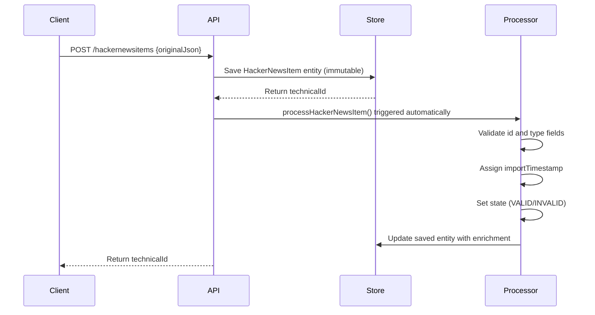

### 1. Entity Definitions

```
HackerNewsItem:
- id: Long (unique identifier of the Hacker News item)
- type: String (type of the item, e.g., story, comment)
- originalJson: String (the full original JSON of the item in Firebase HN API format)
- importTimestamp: String (ISO 8601 timestamp when the item was imported; stored separately from originalJson)
- state: String (VALID if id and type are present, INVALID otherwise)
```

### 2. Process Method Flows

```
processHackerNewsItem() Flow:
1. Initial State: HackerNewsItem entity is created (immutable) with originalJson payload.
2. Validation: Check if `id` and `type` fields are present in originalJson.
3. Enrichment: Assign importTimestamp (current timestamp in ISO 8601 format).
4. State Assignment:  
   - If `id` and `type` are present → state = VALID  
   - Otherwise → state = INVALID
5. Persistence: Save the enriched HackerNewsItem entity with importTimestamp and state.
6. Outcome: Entity is stored and available for retrieval by its id.
```

### 3. API Endpoints Design

- **POST /hackernewsitems**  
  - Purpose: Create (save) a new HackerNewsItem entity.  
  - Input: JSON containing the original Hacker News item JSON.  
  - Output: JSON containing only the generated `technicalId` (datastore-specific ID).  
  - Behavior: Triggers `processHackerNewsItem()` event automatically.

- **GET /hackernewsitems/{technicalId}**  
  - Purpose: Retrieve stored HackerNewsItem by its `technicalId`.  
  - Output: JSON containing:  
    - originalJson  
    - state  
    - importTimestamp

- **GET /hackernewsitems/byid/{id}**  
  - Purpose: Retrieve stored HackerNewsItem by Hacker News `id` field.  
  - Output: same structure as GET by technicalId.

### 4. Request/Response Formats

**POST /hackernewsitems**

Request JSON:  
```json
{
  "originalJson": "{...}"  // JSON string of the Hacker News item in Firebase format
}
```

Response JSON:  
```json
{
  "technicalId": "string"  // Datastore-generated unique identifier
}
```

---

**GET /hackernewsitems/{technicalId}**

Response JSON:  
```json
{
  "originalJson": "{...}",  // Original JSON as string
  "state": "VALID" | "INVALID",
  "importTimestamp": "2024-06-01T12:34:56Z"
}
```

---

**GET /hackernewsitems/byid/{id}**

Response JSON:  
```json
{
  "originalJson": "{...}",  // Original JSON as string
  "state": "VALID" | "INVALID",
  "importTimestamp": "2024-06-01T12:34:56Z"
}
```

### 5. Event-Driven Processing Chain Diagram


```mermaid
sequenceDiagram
    participant Client
    participant API
    participant Store
    participant Processor

    Client->>API: POST /hackernewsitems {originalJson}
    API->>Store: Save HackerNewsItem entity (immutable)
    Store-->>API: Return technicalId
    API->>Processor: processHackerNewsItem() triggered automatically
    Processor->>Processor: Validate id and type fields
    Processor->>Processor: Assign importTimestamp
    Processor->>Processor: Set state (VALID/INVALID)
    Processor->>Store: Update saved entity with enrichment
    API-->>Client: Return technicalId
```

---

### Summary

- One entity: **HackerNewsItem**  
- Immutable creation only; no updates or deletes  
- POST endpoint to create HackerNewsItem triggers `processHackerNewsItem()` event for validation and enrichment  
- GET endpoints allow retrieval by `technicalId` and by Hacker News `id`  
- Import timestamp is stored in ISO 8601 format  
- State is assigned as VALID or INVALID based on presence of required fields `id` and `type`  

This finalized specification is ready for direct use in documentation and implementation.