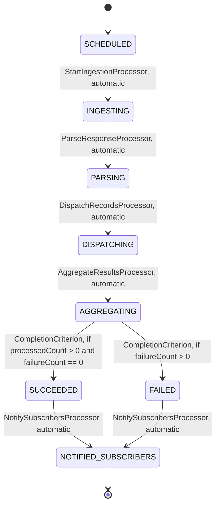
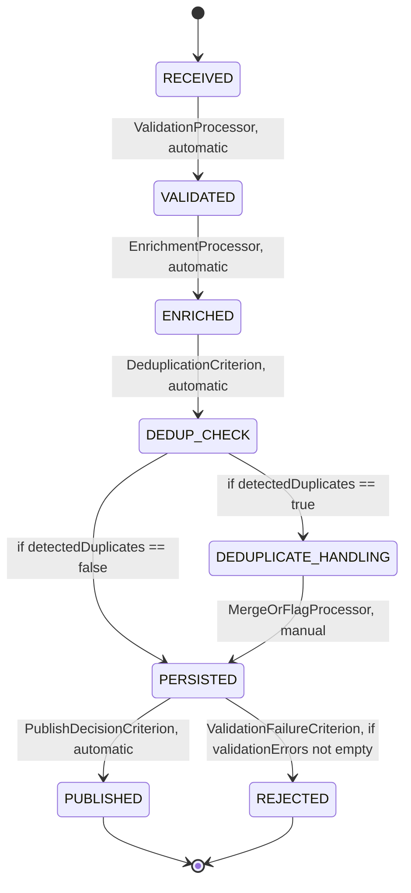
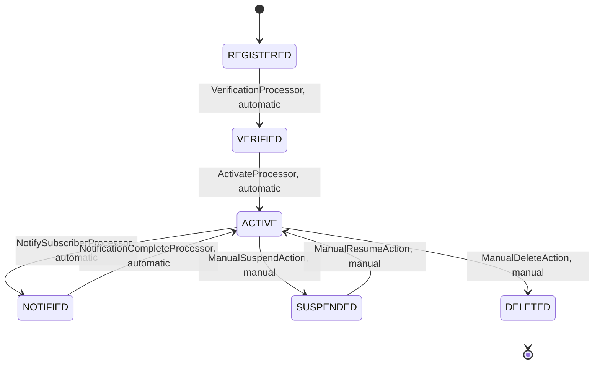
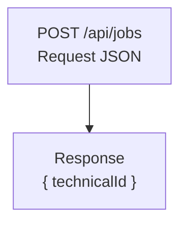
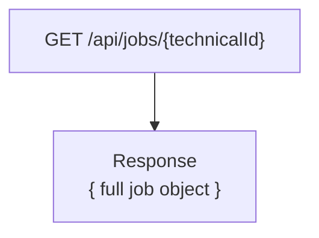
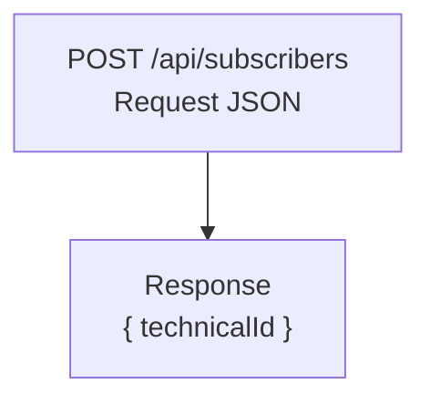
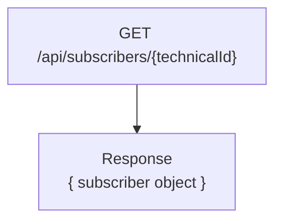
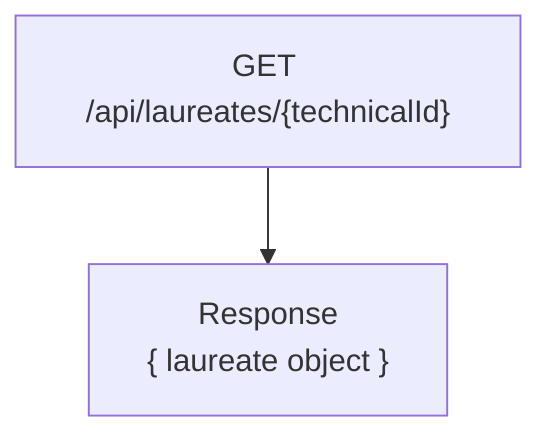
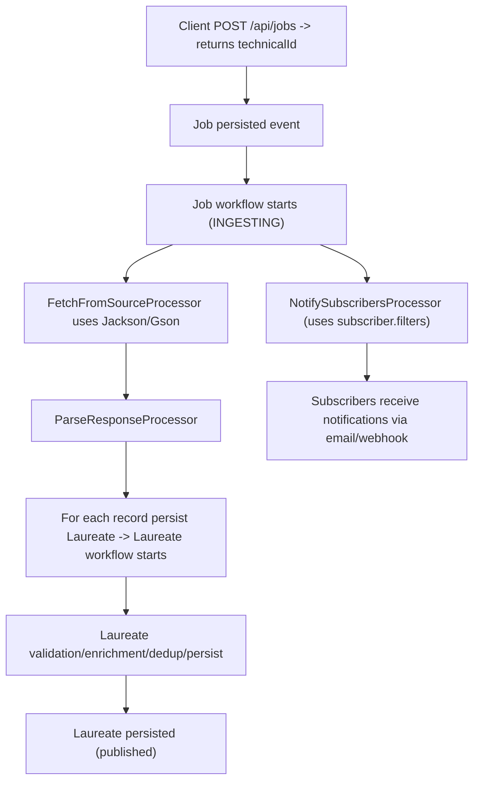

### Entity Definitions
```
Job:
- name: String (human-friendly name for the job)
- sourceUrl: String (API endpoint to ingest data from, default https://public.opendatasoft.com/api/explore/v2.1/catalog/datasets/nobel-prize-laureates/records)
- schedule: String (cron expression or interval descriptor used by scheduler)
- triggerType: String (scheduled | manual | webhook)
- maxRecords: Integer (max records to fetch per run)
- status: String (current workflow status: SCHEDULED, INGESTING, SUCCEEDED, FAILED, NOTIFIED_SUBSCRIBERS, etc.)
- scheduledAt: String (ISO-8601 timestamp when job was scheduled to run)
- startedAt: String (ISO-8601 timestamp when ingestion started)
- finishedAt: String (ISO-8601 timestamp when ingestion finished)
- processedCount: Integer (number of laureate records processed in this run)
- successCount: Integer (number of successfully processed laureates)
- failureCount: Integer (number of failed laureate records)
- resultSummary: String (short human summary of results)
- errorDetails: String (detailed error information when FAILED)
- subscriberIds: List<String> (list of Subscriber technicalIds to notify; empty = notify all active subscribers)
- rawResponse: Object (raw JSON payload returned from the source; useful for replay/debug)
- createdAt: String (ISO-8601)
- updatedAt: String (ISO-8601)

Laureate:
- externalId: Integer (id from OpenDataSoft dataset)
- firstname: String
- surname: String
- born: String (date ISO-8601 or original string)
- died: String (date ISO-8601 or null)
- borncountry: String
- borncountrycode: String
- borncity: String
- gender: String
- year: String (award year as string)
- category: String
- motivation: String
- affiliation_name: String
- affiliation_city: String
- affiliation_country: String
- calculatedAgeAtAward: Integer (derived/enriched field, null if not computable)
- normalizedCountryCode: String (enriched/standardized country code)
- detectedDuplicates: Boolean (true if deduplication found a match)
- validationErrors: List<String> (validation failures if any)
- sourceJobTechnicalId: String (Job.technicalId that created this laureate)
- rawPayload: Object (original JSON record)
- persistedAt: String (ISO-8601)
- published: Boolean (true when ready for consumers)
- createdAt: String (ISO-8601)
- updatedAt: String (ISO-8601)

Subscriber:
- name: String (display name)
- contactType: String (email | webhook | slack | other)
- contactAddress: String (email address or webhook URL)
- active: Boolean (true if notifications should be sent)
- filters: Object (optional filtering rules, e.g., { categories: [Chemistry], years: [2010,2011], countries: [Japan] })
- retryPolicy: Object (optional; how many retries for failed notifications and backoff)
- lastNotifiedAt: String (ISO-8601)
- createdAt: String (ISO-8601)
- updatedAt: String (ISO-8601)
```

---

## Entity Workflows

Important EDA concept applied: Each entity add/persist operation is an EVENT that triggers automated processing. When an entity is persisted, Cyoda starts that entity's workflow which will call actions (Processors) and Criteria (Criteria classes).

### Job workflow:
1. Initial State: Job is created with status SCHEDULED (manual or automatic persistence via POST)
2. Trigger: On schedule or manual/webhook trigger Job moves to INGESTING automatically
3. Ingestion: Fetch records from sourceUrl (asynchronous)
4. Parse & Dispatch: Parse JSON (Jackson/Gson recommended), for each record persist Laureate entity (each persist triggers Laureate workflow)
5. Post-processing: Aggregate results, update successCount/failureCount
6. Completion: If ingestion and processing succeeded set status SUCCEEDED; otherwise FAILED
7. Notification: Notify subscribers (NOTIFIED_SUBSCRIBERS) independent of SUCCEEDED/FAILED
8. Terminal: NOTIFIED_SUBSCRIBERS -> end

Mermaid state diagram for Job:

```mermaid
stateDiagram-v2
    [*] --> SCHEDULED
    SCHEDULED --> INGESTING : StartIngestionProcessor, automatic
    INGESTING --> PARSING : ParseResponseProcessor, automatic
    PARSING --> DISPATCHING : DispatchRecordsProcessor, automatic
    DISPATCHING --> AGGREGATING : AggregateResultsProcessor, automatic
    AGGREGATING --> SUCCEEDED : CompletionCriterion, if processedCount > 0 and failureCount == 0
    AGGREGATING --> FAILED : CompletionCriterion, if failureCount > 0
    SUCCEEDED --> NOTIFIED_SUBSCRIBERS : NotifySubscribersProcessor, automatic
    FAILED --> NOTIFIED_SUBSCRIBERS : NotifySubscribersProcessor, automatic
    NOTIFIED_SUBSCRIBERS --> [*]
```

Processors and Criterion classes needed for Job:
- StartIngestionProcessor
  - Pseudo:
    - validate schedule and sourceUrl
    - set startedAt
    - set status=INGESTING
    - enqueue async ingestion task
- FetchFromSourceProcessor
  - Pseudo:
    - use HTTP client to GET sourceUrl
    - store rawResponse
    - handle pagination/limit using maxRecords
    - on HTTP error, record errorDetails and mark FAILED
- ParseResponseProcessor
  - Pseudo:
    - parse JSON using Jackson or Gson
    - map dataset records to Laureate raw payloads
- DispatchRecordsProcessor
  - Pseudo:
    - for each parsed record call LaureateRepository.persist(record) -> this persistence triggers Laureate workflow events
    - increment processedCount
- AggregateResultsProcessor
  - Pseudo:
    - compile successCount/failureCount from individual processing results
    - set finishedAt
- CompletionCriterion (Java Criterion class)
  - Pseudo:
    - evaluate if failureCount > 0 -> route to FAILED else SUCCEEDED
- NotifySubscribersProcessor
  - Pseudo:
    - query subscribers (subscriberIds if provided else all active)
    - for each subscriber evaluate subscriber.filters (if present) against job summary or processed laureates
    - send notification via email/webhook asynchronously
    - honor retryPolicy on failures
    - set status NOTIFIED_SUBSCRIBERS
    - log notification results

Notes:
- Use asynchronous processing for ingestion and notification.
- Use Jackson or Gson to parse responses.
- Job scheduling can be implemented using Quartz or Spring Scheduler (config handled by platform).

---

### Laureate workflow:
1. Initial State: Upon persisting a Laureate record the workflow starts in RECEIVED
2. Validation: ValidationProcessor ensures required fields exist and basic formats are correct
3. Enrichment: EnrichmentProcessor adds calculatedAgeAtAward, normalizes country codes, etc.
4. Deduplication: DeduplicationCriterion checks if equivalent laureate already exists
   - If duplicate: mark detectedDuplicates true and route to DEDUPLICATE_HANDLING
   - If not duplicate: route to PERSISTED
5. Persistence: Save/merge into Laureate datastore record
6. Publish Decision: If valid and not rejected mark published true and state PUBLISHED
7. Terminal: PUBLISHED or REJECTED

Mermaid state diagram for Laureate:

```mermaid
stateDiagram-v2
    [*] --> RECEIVED
    RECEIVED --> VALIDATED : ValidationProcessor, automatic
    VALIDATED --> ENRICHED : EnrichmentProcessor, automatic
    ENRICHED --> DEDUP_CHECK : DeduplicationCriterion, automatic
    DEDUP_CHECK --> DEDUPLICATE_HANDLING : if detectedDuplicates == true
    DEDUP_CHECK --> PERSISTED : if detectedDuplicates == false
    DEDUPLICATE_HANDLING --> PERSISTED : MergeOrFlagProcessor, manual
    PERSISTED --> PUBLISHED : PublishDecisionCriterion, automatic
    PERSISTED --> REJECTED : ValidationFailureCriterion, if validationErrors not empty
    PUBLISHED --> [*]
    REJECTED --> [*]
```

Processors and Criterion classes needed for Laureate:
- ValidationProcessor
  - Pseudo:
    - required fields: externalId, firstname or surname, year, category, motivation, borncountry or borncity
    - check date formats for born/died
    - append to validationErrors if invalid
    - if serious errors set validationErrors and route to REJECTED
- EnrichmentProcessor
  - Pseudo:
    - calculate calculatedAgeAtAward if born and year present
    - normalize borncountrycode (use mapping or external library)
    - trim/normalize name fields
    - add normalizedCountryCode
- DeduplicationCriterion
  - Pseudo:
    - lookup existing laureates by combination (externalId or firstname+surname+year+category)
    - if match found mark detectedDuplicates true
- MergeOrFlagProcessor
  - Pseudo:
    - if duplicate, either merge affiliations and motivations or flag as duplicate based on business rule
    - record which fields were merged
- PublishDecisionCriterion
  - Pseudo:
    - if validationErrors empty and the record was persisted successfully set published true
- PersistLaureateProcessor
  - Pseudo:
    - persist enriched laureate to datastore
    - set persistedAt

Notes:
- Each persisted Laureate triggers downstream events (e.g., analytics, notifications) if published true.
- Keep rawPayload to enable replay/debug and reprocessing.

---

### Subscriber workflow:
1. Initial State: Subscriber created via POST -> REGISTERED
2. Verification: If contactType requires verification (e.g., email) run VerificationProcessor (automatic email or manual confirmation)
3. Activation: Once verified set active true -> ACTIVE
4. Notification Lifecycle: When a Job reaches NOTIFIED_SUBSCRIBERS, subscriber receives notification via NotifySubscriberProcessor
5. Suspension/Deletion: Manual transitions to SUSPENDED or DELETED by user

Mermaid state diagram for Subscriber:

```mermaid
stateDiagram-v2
    [*] --> REGISTERED
    REGISTERED --> VERIFIED : VerificationProcessor, automatic
    VERIFIED --> ACTIVE : ActivateProcessor, automatic
    ACTIVE --> NOTIFIED : NotifySubscriberProcessor, automatic
    NOTIFIED --> ACTIVE : NotificationCompleteProcessor, automatic
    ACTIVE --> SUSPENDED : ManualSuspendAction, manual
    SUSPENDED --> ACTIVE : ManualResumeAction, manual
    ACTIVE --> DELETED : ManualDeleteAction, manual
    DELETED --> [*]
```

Processors and Criterion classes needed for Subscriber:
- VerificationProcessor
  - Pseudo:
    - for email: send verification code and wait for confirmation (could be manual)
    - for webhook: perform handshake (HTTP POST) and expect 2xx
    - set verified flag or leave pending
- ActivateProcessor
  - Pseudo:
    - set active true if verification succeeded
    - set createdAt/updatedAt
- NotifySubscriberProcessor
  - Pseudo:
    - evaluate subscriber.filters against the notification payload (job summary and/or individual laureates)
    - if match, send notification using contactType (email or HTTP POST)
    - respect retryPolicy on failure
    - update lastNotifiedAt
- ManualSuspendAction / ManualResumeAction / ManualDeleteAction
  - Pseudo:
    - allow user to manually change active flag or delete subscriber record

Notes:
- Subscribers do not participate in workflow orchestration besides receiving notifications; however, they are lifecycle-managed (registered -> verified -> active).

---

## APIs Design Rules & Endpoints

Design rules applied:
- POST endpoints: Entity creation triggers events and should return only entity technicalId (a datastore-assigned field). Nothing else.
- GET endpoints: Only for retrieving stored application results.
- GET by technicalId: Present for entities created via POST endpoints.
- GET by condition: Only if explicitly requested (not requested here).
- If orchestration entity exists (Job), it MUST have POST and GET by technicalId.
- Business entities (Laureate) are created by Job.process method (no external POST required). Subscribers will have POST to allow registration (so they can receive notifications).

Endpoints:

1) Create Job
- POST /api/jobs
- Request JSON:
{
  "name": "Daily Nobel Laureates Ingestion",
  "sourceUrl": "https://public.opendatasoft.com/api/explore/v2.1/catalog/datasets/nobel-prize-laureates/records",
  "schedule": "0 0 * * *",
  "triggerType": "scheduled",
  "maxRecords": 1000,
  "subscriberIds": []
}
- Response JSON (must return only technicalId):
{
  "technicalId": "job_123e4567"
}

Mermaid visualization:

```mermaid
flowchart TB
    JobCreate["POST /api/jobs<br/>Request JSON"] --> JobCreateResponse["Response<br/>{ technicalId }"]
```

2) Get Job by technicalId
- GET /api/jobs/{technicalId}
- Response JSON (full stored job entity and current status):
{
  "technicalId": "job_123e4567",
  "name": "Daily Nobel Laureates Ingestion",
  "sourceUrl": "https://public.opendatasoft.com/api/explore/v2.1/catalog/datasets/nobel-prize-laureates/records",
  "schedule": "0 0 * * *",
  "triggerType": "scheduled",
  "maxRecords": 1000,
  "status": "NOTIFIED_SUBSCRIBERS",
  "scheduledAt": "2025-08-15T00:00:00Z",
  "startedAt": "2025-08-15T00:00:01Z",
  "finishedAt": "2025-08-15T00:01:30Z",
  "processedCount": 25,
  "successCount": 25,
  "failureCount": 0,
  "resultSummary": "25 laureates processed successfully",
  "errorDetails": null,
  "subscriberIds": []
}

Mermaid visualization:

```mermaid
flowchart TB
    JobGet["GET /api/jobs/{technicalId}"] --> JobGetResponse["Response<br/>{ full job object }"]
```

3) Register Subscriber
- POST /api/subscribers
- Request JSON:
{
  "name": "Nobel Alerts",
  "contactType": "webhook",
  "contactAddress": "https://example.com/webhook",
  "filters": {
    "categories": ["Chemistry"],
    "years": ["2010"]
  },
  "retryPolicy": { "maxRetries": 3, "backoffMs": 2000 }
}
- Response JSON:
{
  "technicalId": "sub_89ab12cd"
}

Mermaid visualization:

```mermaid
flowchart TB
    SubCreate["POST /api/subscribers<br/>Request JSON"] --> SubCreateResponse["Response<br/>{ technicalId }"]
```

4) Get Subscriber by technicalId
- GET /api/subscribers/{technicalId}
- Response JSON:
{
  "technicalId": "sub_89ab12cd",
  "name": "Nobel Alerts",
  "contactType": "webhook",
  "contactAddress": "https://example.com/webhook",
  "active": true,
  "filters": {
    "categories": ["Chemistry"],
    "years": ["2010"]
  },
  "retryPolicy": { "maxRetries": 3, "backoffMs": 2000 },
  "lastNotifiedAt": "2025-08-15T00:02:00Z"
}

Mermaid visualization:

```mermaid
flowchart TB
    SubGet["GET /api/subscribers/{technicalId}"] --> SubGetResponse["Response<br/>{ subscriber object }"]
```

5) Get Laureate by technicalId (read-only retrieval of processed results)
- GET /api/laureates/{technicalId}
- Response JSON (example):
{
  "technicalId": "laur_345f6ab9",
  "externalId": 853,
  "firstname": "Akira",
  "surname": "Suzuki",
  "born": "1930-09-12",
  "died": null,
  "borncountry": "Japan",
  "borncountrycode": "JP",
  "borncity": "Mukawa",
  "gender": "male",
  "year": "2010",
  "category": "Chemistry",
  "motivation": "for palladium-catalyzed cross couplings in organic synthesis",
  "affiliation_name": "Hokkaido University",
  "affiliation_city": "Sapporo",
  "affiliation_country": "Japan",
  "calculatedAgeAtAward": 80,
  "normalizedCountryCode": "JP",
  "published": true,
  "sourceJobTechnicalId": "job_123e4567"
}

Mermaid visualization:

```mermaid
flowchart TB
    LaurGet["GET /api/laureates/{technicalId}"] --> LaurGetResponse["Response<br/>{ laureate object }"]
```

Notes on endpoints:
- POST endpoints return only technicalId.
- POST /api/jobs triggers the Job workflow automatically (per EDA pattern).
- Persisting Laureate entities is performed by Job.process method (i.e., Job workflow dispatches these events). Clients do not POST laureates directly.
- Subscribers can be created by POST to register recipients for notifications.

---

## Required Processors and Criteria Summary (cross-entity)
- Job:
  - StartIngestionProcessor
  - FetchFromSourceProcessor (uses HTTP client, handles pagination, limit)
  - ParseResponseProcessor (Jackson/Gson)
  - DispatchRecordsProcessor (persist Laureate records)
  - AggregateResultsProcessor
  - CompletionCriterion
  - NotifySubscribersProcessor (asynchronous notifications; honor retryPolicy)
- Laureate:
  - ValidationProcessor
  - EnrichmentProcessor (calculate age, normalize country codes)
  - DeduplicationCriterion
  - MergeOrFlagProcessor
  - PersistLaureateProcessor
  - PublishDecisionCriterion
- Subscriber:
  - VerificationProcessor
  - ActivateProcessor
  - NotifySubscriberProcessor
  - ManualSuspendAction / ManualResumeAction / ManualDeleteAction

Example pseudo-code for key processors:

- StartIngestionProcessor
```
void process(Job job) {
  job.startedAt = now();
  job.status = "INGESTING";
  enqueue(() -> new FetchFromSourceProcessor().process(job));
}
```

- FetchFromSourceProcessor
```
void process(Job job) {
  HttpResponse r = httpClient.get(job.sourceUrl + "?limit=" + job.maxRecords);
  if (r.status != 200) {
    job.errorDetails = r.body;
    job.status = "FAILED";
    enqueue(() -> new NotifySubscribersProcessor().process(job));
    return;
  }
  job.rawResponse = parseJson(r.body);
  enqueue(() -> new ParseResponseProcessor().process(job));
}
```

- ParseResponseProcessor / DispatchRecordsProcessor
```
void process(Job job) {
  List<JsonNode> records = extractRecords(job.rawResponse);
  for (JsonNode rec : records) {
    Laureate l = mapToLaureate(rec);
    // Persisting laureate triggers Laureate workflow (Validation -> Enrichment -> Dedup -> Persist)
    laureateRepository.persist(l, job.technicalId);
  }
  enqueue(() -> new AggregateResultsProcessor().process(job));
}
```

- NotifySubscribersProcessor
```
void process(Job job) {
  List<Subscriber> subs = (job.subscriberIds != empty) ? subscriberRepo.findByIds(job.subscriberIds) : subscriberRepo.findAllActive();
  for (Subscriber s : subs) {
    if (matchesFilters(s.filters, job)) {
      sendNotificationAsync(s, job.summary);
    }
  }
  job.status = "NOTIFIED_SUBSCRIBERS";
  job.updatedAt = now();
}
```

---

## Event Flow Summary (visual)

```mermaid
flowchart TB
    ClientPOSTJob["Client POST /api/jobs -> returns technicalId"] --> JobPersisted["Job persisted event"]
    JobPersisted --> JobWorkflow["Job workflow starts (INGESTING)"]
    JobWorkflow --> FetchProcessor["FetchFromSourceProcessor uses Jackson/Gson"]
    FetchProcessor --> ParseProcessor["ParseResponseProcessor"]
    ParseProcessor --> ForEachRecord["For each record persist Laureate -> Laureate workflow starts"]
    ForEachRecord --> LaureateWorkflow["Laureate validation/enrichment/dedup/persist"]
    LaureateWorkflow --> PersistedLaureate["Laureate persisted (published)"]
    JobWorkflow --> NotifyProcessor["NotifySubscribersProcessor (uses subscriber.filters)"]
    NotifyProcessor --> SubscriberNotify["Subscribers receive notifications via email/webhook"]
```

---

## Additional Notes & Preserved Technical References
- Data Source API endpoint (as provided): https://public.opendatasoft.com/api/explore/v2.1/catalog/datasets/nobel-prize-laureates/records
- JSON parsing libraries recommended: Jackson or Gson
- Scheduling libraries suggested: Quartz or Spring Scheduler
- Use asynchronous processing for ingestion and notifications.
- Provide error handling and logging per state transition.
- Job lifecycle must follow the explicit sequence SCHEDULED -> INGESTING -> (SUCCEEDED | FAILED) -> NOTIFIED_SUBSCRIBERS.
- Entity persistence triggers the process method (Event-Driven Architecture). Each persist event starts the entity workflow.

---

Questions (up to 3):
1. For Laureate validation, which fields should be strictly required (e.g., externalId, year, category) and which can be optional (e.g., borncity, affiliation_city)?
2. For Subscriber filters, do you want support for complex boolean logic (AND/OR) or only simple list matching (categories, years, countries)?
3. For Job notifications, should failed jobs include full errorDetails in subscriber notifications or only a short summary?

Please review the generated entities and workflows. If you need any changes, please let me know. Feel free to click Approve if this requirement meets your expectations or if you are ready to proceed.