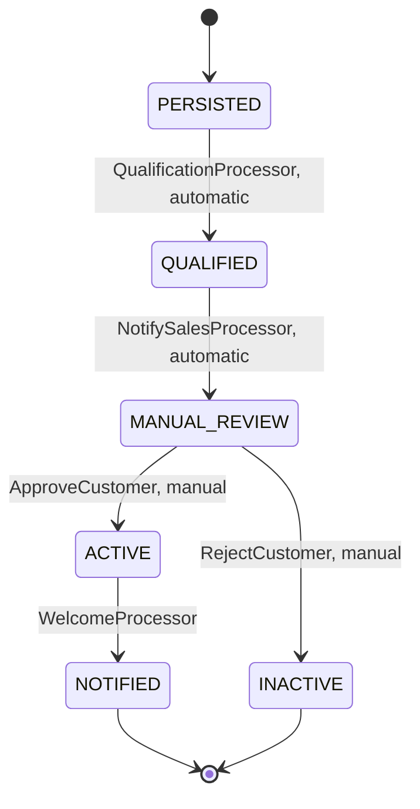
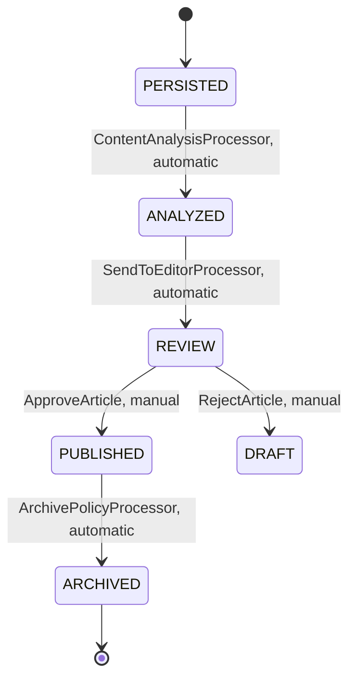
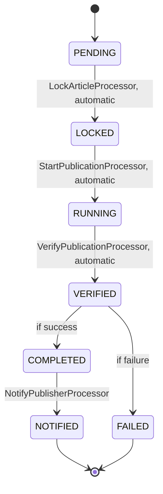

### Note
You did not specify entities count, so I defaulted to 3 entities (CRM + CMS + orchestration). If you want up to 10, tell me which additional entities to add.

### 1. Entity Definitions
```
Customer:
- customerId: string (business identifier)
- name: string (full name)
- email: string (contact email)
- phone: string (contact phone)
- status: string (lead|active|inactive - track lifecycle)
- createdAt: datetime (when persisted)

Article:
- articleId: string (business identifier)
- title: string (headline)
- body: text (content)
- authorId: string (reference to Customer or User)
- tags: list (keywords)
- status: string (draft|review|published|archived)
- createdAt: datetime (when persisted)

PublicationJob:
- jobName: string (human name for job)
- targetArticleId: string (articleId to process)
- scheduledAt: datetime (when to run)
- priority: integer (job priority)
- status: string (PENDING|RUNNING|COMPLETED|FAILED)
- createdAt: datetime (when persisted)
```

### 2. Entity workflows

Customer workflow:
1. Initial State: PERSISTED (event on POST)
2. Qualification: Automatic checks for contact validity
3. Manual Review: Sales rep can move to ACTIVE or mark INACTIVE
4. Completion: Final status set and notifications sent


```mermaid
stateDiagram-v2
    [*] --> PERSISTED
    PERSISTED --> QUALIFIED : QualificationProcessor, automatic
    QUALIFIED --> MANUAL_REVIEW : NotifySalesProcessor, automatic
    MANUAL_REVIEW --> ACTIVE : ApproveCustomer, manual
    MANUAL_REVIEW --> INACTIVE : RejectCustomer, manual
    ACTIVE --> NOTIFIED : WelcomeProcessor
    NOTIFIED --> [*]
    INACTIVE --> [*]
```

Processors:
- QualificationProcessor (validate email/phone)
- NotifySalesProcessor (create task/notification)
- WelcomeProcessor (send welcome message)

Criteria:
- ContactValidCriterion (email/phone present & valid)
- IsLeadCriterion (status indicates lead)

Pseudo:
QualificationProcessor:
```
if ContactValidCriterion(entity) then set entity.status = "QUALIFIED" else set entity.status="INACTIVE"
```

Article workflow:
1. Initial State: PERSISTED (event on POST)
2. Editorial Review: automatic plagiarism & metadata checks
3. Review: manual editor approval/reject
4. Publication: automatic publication on approval (triggers PublicationJob optionally)
5. Archival: manual/automatic archive


```mermaid
stateDiagram-v2
    [*] --> PERSISTED
    PERSISTED --> ANALYZED : ContentAnalysisProcessor, automatic
    ANALYZED --> REVIEW : SendToEditorProcessor, automatic
    REVIEW --> PUBLISHED : ApproveArticle, manual
    REVIEW --> DRAFT : RejectArticle, manual
    PUBLISHED --> ARCHIVED : ArchivePolicyProcessor, automatic
    ARCHIVED --> [*]
```

Processors:
- ContentAnalysisProcessor (spellcheck, metadata, taxonomy)
- SendToEditorProcessor (notify editor)
- ArchivePolicyProcessor (schedule archive)

Criteria:
- AnalysisPassCriterion (content meets thresholds)

Pseudo:
ContentAnalysisProcessor:
```
run checks -> set article.status = "REVIEW" if AnalysisPassCriterion else set article.status="DRAFT"
```

PublicationJob workflow:
1. Initial State: PENDING (POST creates job event)
2. LockArticle: ensure article not being edited
3. ExecutePublication: publish content to channels
4. Verification: confirm publish success
5. Completion: mark COMPLETED or FAILED and notify stakeholders


```mermaid
stateDiagram-v2
    [*] --> PENDING
    PENDING --> LOCKED : LockArticleProcessor, automatic
    LOCKED --> RUNNING : StartPublicationProcessor, automatic
    RUNNING --> VERIFIED : VerifyPublicationProcessor, automatic
    VERIFIED --> COMPLETED : if success
    VERIFIED --> FAILED : if failure
    COMPLETED --> NOTIFIED : NotifyPublisherProcessor
    NOTIFIED --> [*]
    FAILED --> [*]
```

Processors:
- LockArticleProcessor
- StartPublicationProcessor
- VerifyPublicationProcessor
- NotifyPublisherProcessor

Criteria:
- ArticlePublishableCriterion (article.status == PUBLISHED and passes checks)
- PublishSuccessCriterion (verification result)

Pseudo:
StartPublicationProcessor:
```
if ArticlePublishableCriterion(job.targetArticleId) then publish channels and set job.status = "RUNNING" else set job.status="FAILED"
```

### 3. Pseudo code for processor classes
(See brief pseudo above per processor; processors perform checks, set entity.status, emit notifications, and optionally create follow-up events/jobs in Cyoda.)

### 4. API Endpoints Design Rules

Rules applied:
- POST endpoints create entities and return only technicalId.
- GET by technicalId returns stored results.
- All entity POSTs trigger Cyoda workflows automatically.

Endpoints (examples):

1) Create Customer
POST /customers
Request:
```json
{
  "customerId":"CUST-001",
  "name":"ACME Inc",
  "email":"contact@acme.example",
  "phone":"+123456789"
}
```
Response (only technicalId):
```json
{ "technicalId":"tid-customer-0001" }
```
GET /customers/{technicalId}
Response:
```json
{
  "technicalId":"tid-customer-0001",
  "customerId":"CUST-001",
  "name":"ACME Inc",
  "email":"contact@acme.example",
  "status":"QUALIFIED",
  "createdAt":"2025-08-29T12:00:00Z"
}
```

2) Create Article
POST /articles
Request:
```json
{
  "articleId":"ART-001",
  "title":"Launch Post",
  "body":"...",
  "authorId":"CUST-001",
  "tags":["launch","product"]
}
```
Response:
```json
{ "technicalId":"tid-article-0001" }
```
GET /articles/{technicalId} — returns article with current status and analysis results.

3) Create PublicationJob (orchestration)
POST /publication-jobs
Request:
```json
{
  "jobName":"Publish_ART-001",
  "targetArticleId":"ART-001",
  "scheduledAt":"2025-08-29T13:00:00Z",
  "priority":5
}
```
Response:
```json
{ "technicalId":"tid-job-0001" }
```
GET /publication-jobs/{technicalId} — returns job status, logs, and result.

Would you like additional entities (e.g., User, Comment, Campaign, MediaAsset) or more detailed criteria/processors for any workflow?