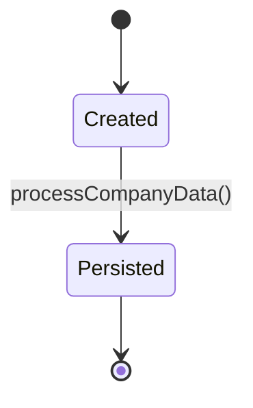
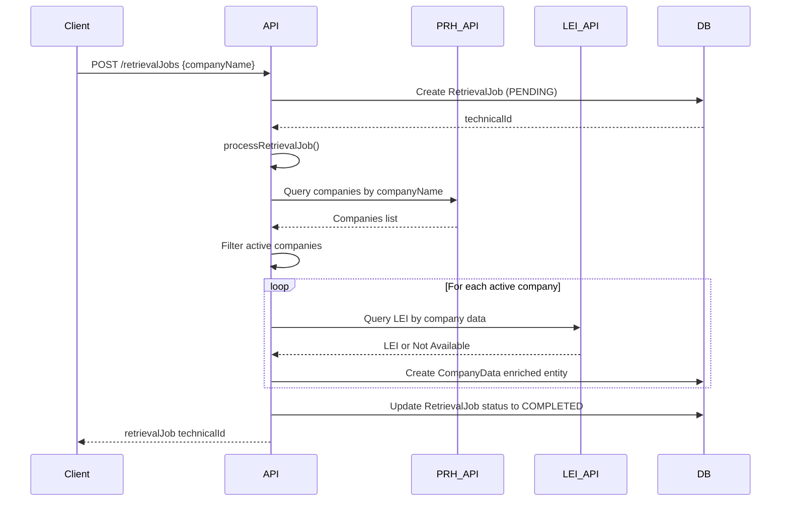
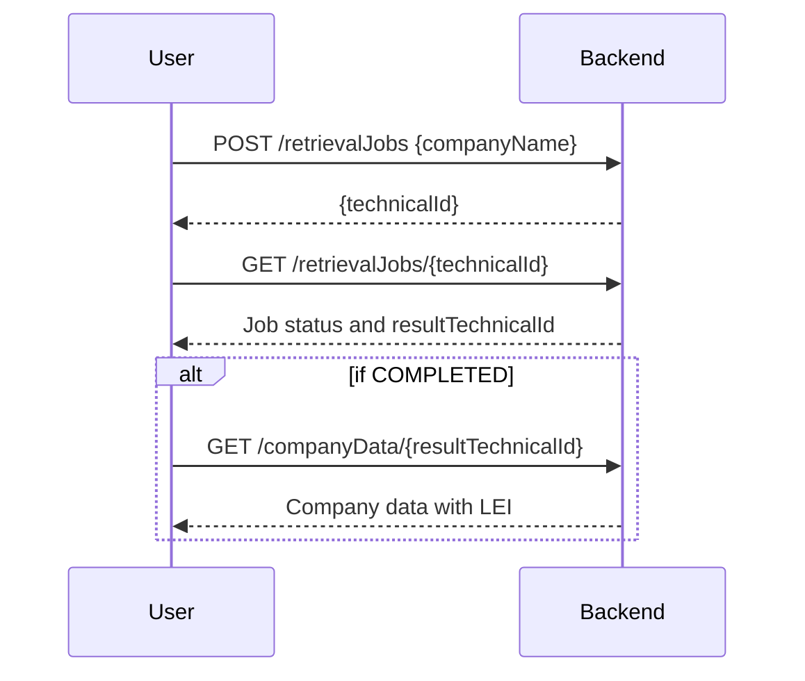

### 1. Entity Definitions

``` 
RetrievalJob:
- companyName: String (The company name or partial name input for search)
- requestTimestamp: String (ISO 8601 timestamp when the job was created)
- status: String (Job status: PENDING, PROCESSING, COMPLETED, FAILED)
- resultTechnicalId: String (Reference to the enrichment result entity, nullable initially)

CompanyData:
- businessId: String (Finnish company business ID)
- companyName: String (Official company name)
- companyType: String (Type of the company)
- registrationDate: String (ISO 8601 date of registration)
- status: String (Active or Inactive)
- lei: String (Legal Entity Identifier, or "Not Available" if missing)
- retrievalJobId: String (Reference to the RetrievalJob technicalId that triggered this data creation)
```

---

### 2. Process Method Flows

```
processRetrievalJob() Flow:
1. Initial State: RetrievalJob created with status PENDING and companyName input.
2. Validation: Validate companyName is not empty or null.
3. Processing: 
   - Query PRH Avoindata API with the companyName.
   - Filter out inactive companies from the results.
   - For each active company, query the LEI registry to enrich data.
   - Create CompanyData entities for each enriched company record.
4. Completion:
   - If all steps succeed, update RetrievalJob status to COMPLETED.
   - If any step fails, update RetrievalJob status to FAILED.
5. Notification: (Optional) Trigger notifications or logs about job completion.

processCompanyData() Flow:
1. Initial State: CompanyData created with enrichment data.
2. Validation: Ensure required fields (businessId, companyName, status) are present.
3. Processing: Persist CompanyData immutably; no updates/deletes.
4. Completion: Confirm persistence success.
```

---

### 3. API Endpoints Design

| HTTP Method | Endpoint                  | Purpose                              | Request Body                          | Response Body                |
|-------------|---------------------------|------------------------------------|-------------------------------------|-----------------------------|
| POST        | `/retrievalJobs`           | Create a RetrievalJob               | `{ "companyName": "string" }`       | `{ "technicalId": "string" }` |
| GET         | `/retrievalJobs/{id}`      | Get RetrievalJob status and metadata| N/A                                 | RetrievalJob JSON with status and resultTechnicalId |
| GET         | `/companyData/{id}`        | Get CompanyData by technicalId      | N/A                                 | CompanyData JSON             |
| GET (optional) | `/companyData?businessId=xxx` | Get CompanyData by businessId (if requested)| N/A                        | List of CompanyData JSON     |

---

### 4. Request/Response Formats

**POST /retrievalJobs Request**

```json
{
  "companyName": "Nokia"
}
```

**POST /retrievalJobs Response**

```json
{
  "technicalId": "uuid-generated-job-id"
}
```

**GET /retrievalJobs/{id} Response**

```json
{
  "technicalId": "uuid-generated-job-id",
  "companyName": "Nokia",
  "requestTimestamp": "2024-06-01T12:00:00Z",
  "status": "COMPLETED",
  "resultTechnicalId": "uuid-companydata-group-id"
}
```

**GET /companyData/{id} Response**

```json
{
  "businessId": "1234567-8",
  "companyName": "Nokia Oyj",
  "companyType": "Limited Company",
  "registrationDate": "1865-05-12",
  "status": "Active",
  "lei": "529900T8BM49AURSDO55",
  "retrievalJobId": "uuid-generated-job-id"
}
```

---

### 5. Visual Representations

**Entity lifecycle state diagram for RetrievalJob**


```mermaid
stateDiagram-v2
    [*] --> Pending
    Pending --> Processing : processRetrievalJob()
    Processing --> Completed : success
    Processing --> Failed : error
    Completed --> [*]
    Failed --> [*]
```

**Entity lifecycle state diagram for CompanyData**


```mermaid
stateDiagram-v2
    [*] --> Created
    Created --> Persisted : processCompanyData()
    Persisted --> [*]
```

**Event-driven processing chain**


```mermaid
sequenceDiagram
    participant Client
    participant API
    participant PRH_API
    participant LEI_API
    participant DB

    Client->>API: POST /retrievalJobs {companyName}
    API->>DB: Create RetrievalJob (PENDING)
    DB-->>API: technicalId
    API->>API: processRetrievalJob()
    API->>PRH_API: Query companies by companyName
    PRH_API-->>API: Companies list
    API->>API: Filter active companies
    loop For each active company
        API->>LEI_API: Query LEI by company data
        LEI_API-->>API: LEI or Not Available
        API->>DB: Create CompanyData enriched entity
    end
    API->>DB: Update RetrievalJob status to COMPLETED
    API-->>Client: retrievalJob technicalId
```

**User interaction sequence flow**


```mermaid
sequenceDiagram
    participant User
    participant Backend

    User->>Backend: POST /retrievalJobs {companyName}
    Backend-->>User: {technicalId}
    User->>Backend: GET /retrievalJobs/{technicalId}
    Backend-->>User: Job status and resultTechnicalId
    alt if COMPLETED
        User->>Backend: GET /companyData/{resultTechnicalId}
        Backend-->>User: Company data with LEI
    end
```

---

This completes the functional requirements specification for your Finnish Companies Data Retrieval and Enrichment Application using Event-Driven Architecture principles. Please let me know if you need any adjustments or additions!