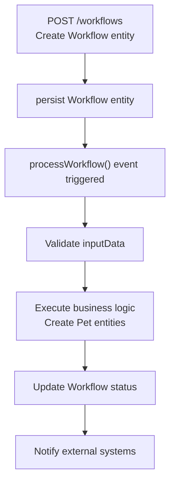
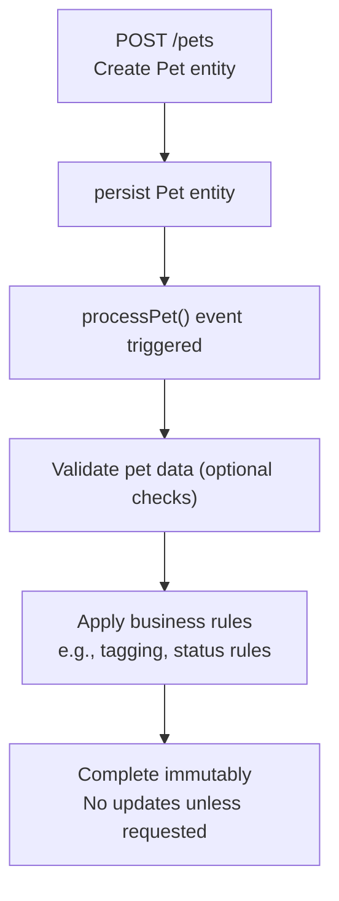

# Functional Requirements for "Purrfect Pets" API App

---

## 1. Entity Definitions

```
Workflow:
- name: String (Name of the workflow)
- description: String (Description of the workflow purpose)
- status: String (Current status of the workflow, e.g., PENDING, RUNNING, COMPLETED, FAILED)
- inputData: String (Input data or parameters for the workflow)

Pet:
- name: String (Name of the pet)
- category: String (Category/type of pet, e.g., Cat, Dog)
- status: String (Status of the pet, e.g., available, pending, sold)
- photoUrls: String (Comma-separated URLs of pet photos)
- tags: String (Comma-separated tags related to the pet)
```

---

## 2. Process Method Flows

```
processWorkflow() Flow:
1. Initial State: Workflow is created with status PENDING.
2. Validation: Validate inputData and workflow parameters.
3. Execution: Trigger processing of related entities (e.g., creating Pet entities based on input).
4. Status Update: Update workflow status to RUNNING during processing.
5. Completion: Upon successful processing, update status to COMPLETED or FAILED if errors occur.
6. Notification: Optionally notify external systems or log completion.

processPet() Flow:
1. Initial State: New Pet entity is created and persisted with given status.
2. Validation: If requested, run checks such as checkPetStatusValid() or checkPetCategoryExists().
3. Processing: Trigger any business logic such as tagging, photo URL validation, or status transition rules.
4. Completion: Pet data is stored immutably, no updates or deletes unless explicitly requested.
```

---

## 3. API Endpoints Design

- **POST /workflows**
  - Purpose: Create a new `Workflow` entity.
  - Behavior: Triggers `processWorkflow()` event.
  - Response:
    ```json
    {
      "technicalId": "string"
    }
    ```

- **GET /workflows/{technicalId}**
  - Purpose: Retrieve a stored `Workflow` by technicalId.
  - Response: Full Workflow entity data (all fields except technicalId).

- **POST /pets**
  - Purpose: Create a new `Pet` entity.
  - Behavior: Triggers `processPet()` event.
  - Response:
    ```json
    {
      "technicalId": "string"
    }
    ```

- **GET /pets/{technicalId}**
  - Purpose: Retrieve a stored `Pet` by technicalId.
  - Response: Full Pet entity data (all fields except technicalId).

- **GET /pets?status={status}** (optional, only if explicitly requested)
  - Purpose: Retrieve pets filtered by status.
  - Response: List of Pet entities matching the status.

---

## 4. Request/Response JSON Structures

**POST /workflows Request**
```json
{
  "name": "String",
  "description": "String",
  "status": "String",
  "inputData": "String"
}
```

**POST /workflows Response**
```json
{
  "technicalId": "string"
}
```

**GET /workflows/{technicalId} Response**
```json
{
  "name": "String",
  "description": "String",
  "status": "String",
  "inputData": "String"
}
```

**POST /pets Request**
```json
{
  "name": "String",
  "category": "String",
  "status": "String",
  "photoUrls": "String",
  "tags": "String"
}
```

**POST /pets Response**
```json
{
  "technicalId": "string"
}
```

**GET /pets/{technicalId} Response**
```json
{
  "name": "String",
  "category": "String",
  "status": "String",
  "photoUrls": "String",
  "tags": "String"
}
```

**GET /pets?status={status} Response**
```json
[
  {
    "name": "String",
    "category": "String",
    "status": "String",
    "photoUrls": "String",
    "tags": "String"
  }
]
```

---

## 5. Event-Driven Processing Flow Diagrams


```mermaid
graph TD
  A["POST /workflows<br>Create Workflow entity"]
  B["persist Workflow entity"]
  C["processWorkflow() event triggered"]
  D["Validate inputData"]
  E["Execute business logic<br>Create Pet entities"]
  F["Update Workflow status"]
  G["Notify external systems"]

  A --> B
  B --> C
  C --> D
  D --> E
  E --> F
  F --> G
```


```mermaid
graph TD
  P["POST /pets<br>Create Pet entity"]
  Q["persist Pet entity"]
  R["processPet() event triggered"]
  S["Validate pet data (optional checks)"]
  T["Apply business rules<br>e.g., tagging, status rules"]
  U["Complete immutably<br>No updates unless requested"]

  P --> Q
  Q --> R
  R --> S
  S --> T
  T --> U
```

---

This finalized specification respects Event-Driven Architecture principles, favors immutable entity creation, and aligns with Cyoda platform event processing. It is ready for direct use in documentation or implementation.