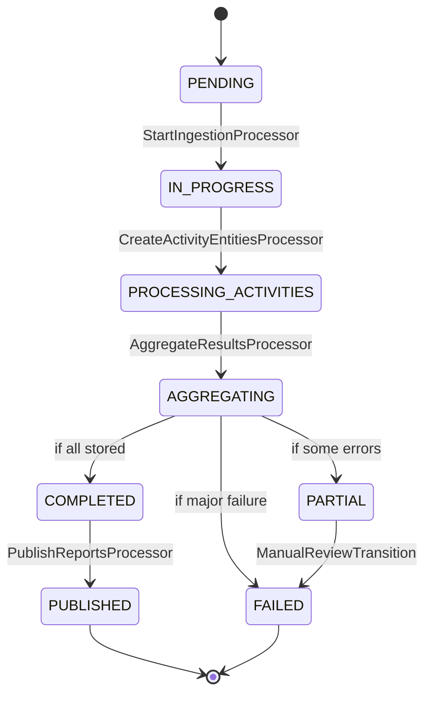
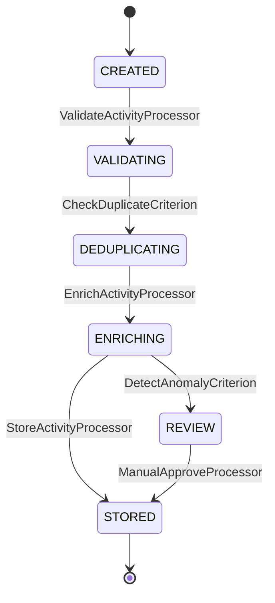
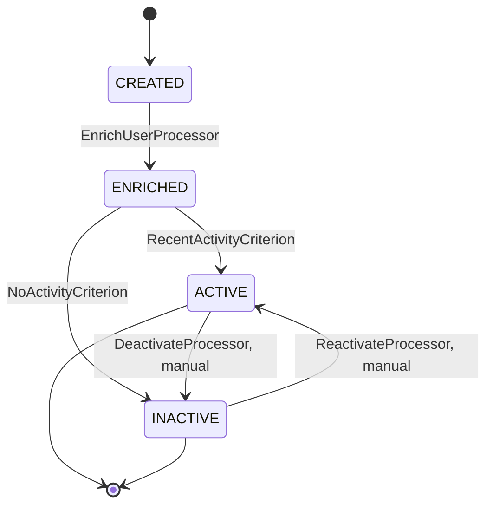

### 1. Entity Definitions
```
User:
- userId: String (external user id from Fakerest)
- name: String (display name)
- email: String (contact)
- status: String (active/inactive)
- createdAt: String (ISO timestamp)
- lastSeenAt: String (ISO timestamp)

Activity:
- activityId: String (external activity id)
- userId: String (link to User)
- type: String (activity type)
- startTime: String (ISO timestamp)
- endTime: String (ISO timestamp)
- durationSec: Number (computed)
- sourceFetchedAt: String (ISO timestamp)
- dedupHint: String (fingerprint)
- anomalyFlag: Boolean (true if anomalous)

IngestionRun:
- runId: String (user-supplied job id)
- scheduledAt: String (scheduled time)
- startedAt: String (actual start)
- finishedAt: String (end time)
- status: String (PENDING/IN_PROGRESS/COMPLETED/FAILED/PARTIAL)
- recordsFetched: Number
- recordsStored: Number
- errorsSummary: String
```

### 2. Entity workflows

IngestionRun workflow:
1. Initial State: PENDING when POSTed to Cyoda
2. Start: system triggers fetch from Fakerest
3. Processing: create Activity entities for each fetched record (persist => triggers Activity workflows)
4. Finalize: aggregate results, set COMPLETED/FAILED/PARTIAL
5. Publish: optional publish step (automatic) or manual retry

```mermaid
stateDiagram-v2
    [*] --> PENDING
    PENDING --> IN_PROGRESS : StartIngestionProcessor
    IN_PROGRESS --> PROCESSING_ACTIVITIES : CreateActivityEntitiesProcessor
    PROCESSING_ACTIVITIES --> AGGREGATING : AggregateResultsProcessor
    AGGREGATING --> COMPLETED : if all stored
    AGGREGATING --> PARTIAL : if some errors
    AGGREGATING --> FAILED : if major failure
    COMPLETED --> PUBLISHED : PublishReportsProcessor
    PARTIAL --> FAILED : ManualReviewTransition
    PUBLISHED --> [*]
    FAILED --> [*]
```
Processors: StartIngestionProcessor, CreateActivityEntitiesProcessor, AggregateResultsProcessor, PublishReportsProcessor  
Criteria: HasFetchedRecordsCriterion, AllRecordsStoredCriterion

Activity workflow:
1. Initial: CREATED when persisted by IngestionRun
2. Validation: validate fields
3. Deduplication: check fingerprint; if duplicate mark/skipped
4. Enrichment: compute duration, map types
5. Storage: mark STORED
6. Anomaly handling: if anomaly set anomalyFlag and move to REVIEW

```mermaid
stateDiagram-v2
    [*] --> CREATED
    CREATED --> VALIDATING : ValidateActivityProcessor
    VALIDATING --> DEDUPLICATING : CheckDuplicateCriterion
    DEDUPLICATING --> ENRICHING : EnrichActivityProcessor
    ENRICHING --> STORED : StoreActivityProcessor
    ENRICHING --> REVIEW : DetectAnomalyCriterion
    REVIEW --> STORED : ManualApproveProcessor
    STORED --> [*]
```
Processors: ValidateActivityProcessor, EnrichActivityProcessor, StoreActivityProcessor, ManualApproveProcessor  
Criteria: ValidActivityCriterion, CheckDuplicateCriterion, DetectAnomalyCriterion

User workflow:
1. Initial: CREATED when first Activity references user (auto-create)
2. Enrichment: populate profile fields if available
3. Activation: set ACTIVE if recent activity
4. Deactivation: set INACTIVE after retention period (manual override possible)

```mermaid
stateDiagram-v2
    [*] --> CREATED
    CREATED --> ENRICHED : EnrichUserProcessor
    ENRICHED --> ACTIVE : RecentActivityCriterion
    ENRICHED --> INACTIVE : NoActivityCriterion
    ACTIVE --> INACTIVE : DeactivateProcessor, manual
    INACTIVE --> ACTIVE : ReactivateProcessor, manual
    ACTIVE --> [*]
    INACTIVE --> [*]
```
Processors: EnrichUserProcessor, DeactivateProcessor, ReactivateProcessor  
Criteria: RecentActivityCriterion, NoActivityCriterion

### 3. Pseudo code for processor classes (concise)
StartIngestionProcessor.run(run):
- fetch = Fakerest.fetch(since=run.scheduledAt)
- run.recordsFetched = fetch.count
- for r in fetch: persist Activity with sourceFetchedAt
- mark run.startedAt

ValidateActivityProcessor.run(activity):
- if missing required fields set activity.invalid=true and log
- else pass

EnrichActivityProcessor.run(activity):
- activity.durationSec = parse(endTime)-parse(startTime)
- activity.dedupHint = hash(userId+type+startTime)
- map type to normalized category

StoreActivityProcessor.run(activity):
- if not duplicate then save to Activities store and set STORED

AggregateResultsProcessor.run(run):
- compute recordsStored, errorsSummary, set finishedAt and status

PublishReportsProcessor.run(run):
- build daily summaries per user and mark publish status

### 4. API Endpoints Design Rules

- POST /ingestionRuns
  - Purpose: create an IngestionRun (triggers ingestion workflow)
  - Request JSON:
```mermaid
mermaid
flowchart LR
  A[ "request body" ]
  B[ "POST /ingestionRuns" ]
  C[ "response body" ]
  A --> B
  B --> C
```
  - Example request body:
    { "runId":"run-2025-08-20", "scheduledAt":"2025-08-20T02:00:00Z" }
  - Response body (must return only technicalId):
    { "technicalId":"<generated-id>" }

- GET /ingestionRuns/{technicalId}
  - Returns stored IngestionRun record JSON (full entity)

- GET /activities/{technicalId}
  - Returns Activity by technicalId (stored result)

- GET /users/{technicalId}
  - Returns User by technicalId

Notes:
- Only POST is for orchestration entity IngestionRun. Activities and Users are created by the process methods when IngestionRun runs.
- All POST responses return only technicalId per rule.