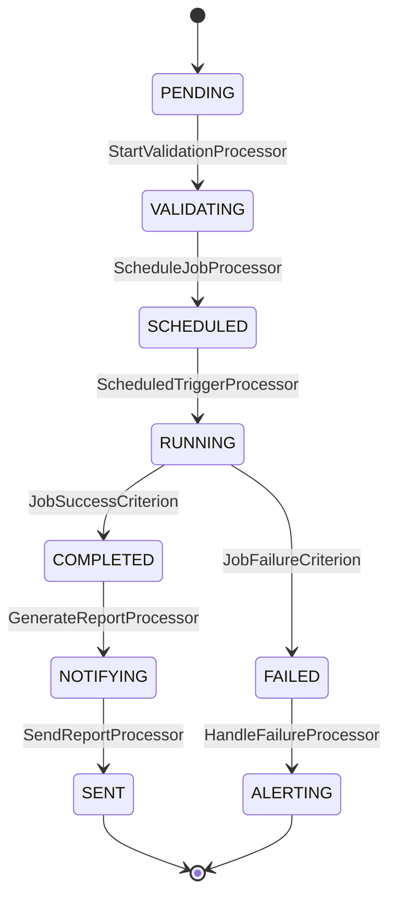
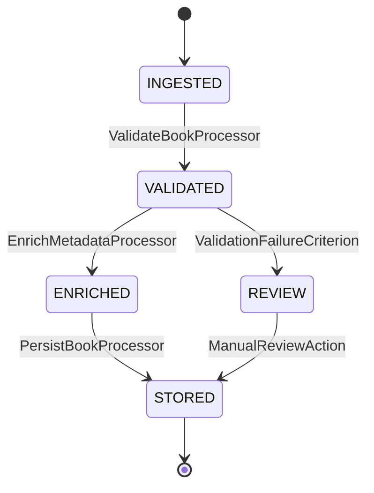
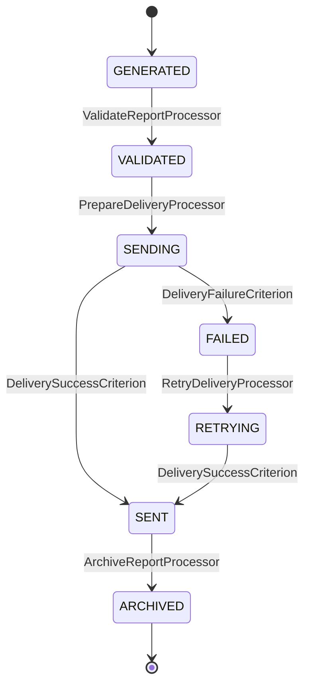

### 1. Entity Definitions
(Max 3 entities used by default)

```
WeeklyJob:
- name: String (human name for the scheduled job)
- recurrenceDay: String (weekday for run, e.g., Wednesday)
- runTime: String (time of day in HH:MM format)
- timezone: String (timezone for scheduling)
- apiEndpoint: String (source API base URL)
- lastRunAt: String (timestamp of last run)
- nextRunAt: String (timestamp of next scheduled run)
- recipients: Array[String] (emails to send report to)
- failurePolicy: String (retry policy description)
- status: String (PENDING/RUNNING/COMPLETED/FAILED)

Book:
- id: Integer (book id from source API)
- title: String (book title)
- description: String (full description)
- pageCount: Integer (number of pages)
- excerpt: String (short excerpt)
- publishDate: String (ISO date of publication)
- fetchTimestamp: String (when record was fetched)
- popularityScore: Number (derived score)
- isPopular: Boolean (derived flag)

Report:
- reportId: String (business id for the report)
- periodStart: String (ISO date start of the reporting window)
- periodEnd: String (ISO date end of the reporting window)
- generatedAt: String (timestamp)
- totalBooks: Integer (count analyzed)
- totalPageCount: Integer (sum of page counts)
- titleInsights: String (text summary of title trends)
- popularTitles: Array[Object] (list of book references with title, description, excerpt, pageCount, publishDate)
- format: String (inline or attachment)
- status: String (GENERATED/SENT/FAILED)
- sentAt: String (timestamp when emailed)
```

### 2. Entity workflows

WeeklyJob workflow:
1. Initial State: Job created with PENDING status (POST to create job triggers this event)
2. Validation: Validate schedule, recipients, and apiEndpoint (automatic)
3. Scheduling: Persist nextRunAt and wait until scheduled time (automatic)
4. Execution: Trigger ingestion (automatic when schedule arrives) -> Job moves to RUNNING
5. Completion: If ingestion and report generation succeed -> COMPLETED, otherwise FAILED
6. Notification: If COMPLETED, send report and update status to SENT; if FAILED, apply failurePolicy (retry/alert)


```mermaid
stateDiagram-v2
    [*] --> PENDING
    PENDING --> VALIDATING : StartValidationProcessor
    VALIDATING --> SCHEDULED : ScheduleJobProcessor
    SCHEDULED --> RUNNING : ScheduledTriggerProcessor
    RUNNING --> COMPLETED : JobSuccessCriterion
    RUNNING --> FAILED : JobFailureCriterion
    COMPLETED --> NOTIFYING : GenerateReportProcessor
    NOTIFYING --> SENT : SendReportProcessor
    FAILED --> ALERTING : HandleFailureProcessor
    SENT --> [*]
    ALERTING --> [*]
```

WeeklyJob processors and criteria:
- Processors:
  - StartValidationProcessor: check recipients non-empty, runTime and timezone valid
  - ScheduleJobProcessor: compute nextRunAt
  - ScheduledTriggerProcessor: create ingestion event (persist trigger) at runtime
  - GenerateReportProcessor: aggregate metrics and create Report entity
  - SendReportProcessor: prepare and email report
  - HandleFailureProcessor: apply retry policy and notify owners
- Criteria:
  - JobSuccessCriterion: verifies ingestion + report created without errors
  - JobFailureCriterion: detects errors/exceptions during run

Book workflow:
1. Initial State: Book created/updated with INGESTED when fetched from source (automatic during job run)
2. Validation: Validate fields (id present, publishDate parseable) (automatic)
3. Enrichment: Compute popularityScore and isPopular (automatic)
4. Stored: Marked STORED/READY for reporting (automatic)
5. Flag/Manual Review: Optionally moved to REVIEW if validation fails (manual)


```mermaid
stateDiagram-v2
    [*] --> INGESTED
    INGESTED --> VALIDATED : ValidateBookProcessor
    VALIDATED --> ENRICHED : EnrichMetadataProcessor
    ENRICHED --> STORED : PersistBookProcessor
    VALIDATED --> REVIEW : ValidationFailureCriterion
    REVIEW --> STORED : ManualReviewAction
    STORED --> [*]
```

Book processors and criteria:
- Processors:
  - ValidateBookProcessor: check required fields and publishDate format
  - EnrichMetadataProcessor: compute popularityScore (rules from WeeklyJob or criteria)
  - PersistBookProcessor: write canonical Book record and set fetchTimestamp
  - ManualReviewAction: UI/manual step to correct book data
- Criteria:
  - ValidationFailureCriterion: triggers if required fields missing or invalid
  - PopularityCriterion: used by EnrichMetadataProcessor to mark isPopular (e.g., top N by pageCount or weighted score)

Report workflow:
1. Initial State: Report created with GENERATED when GenerateReportProcessor runs (automatic)
2. Review: Quick validation of content and recipients (automatic)
3. Delivery: Send email to recipients (automatic)
4. Completion: Mark SENT or FAILED (automatic)
5. Archive: Optionally mark ARCHIVED after retention period (automatic/manual)


```mermaid
stateDiagram-v2
    [*] --> GENERATED
    GENERATED --> VALIDATED : ValidateReportProcessor
    VALIDATED --> SENDING : PrepareDeliveryProcessor
    SENDING --> SENT : DeliverySuccessCriterion
    SENDING --> FAILED : DeliveryFailureCriterion
    SENT --> ARCHIVED : ArchiveReportProcessor
    FAILED --> RETRYING : RetryDeliveryProcessor
    RETRYING --> SENT : DeliverySuccessCriterion
    ARCHIVED --> [*]
```

Report processors and criteria:
- Processors:
  - ValidateReportProcessor: ensure popularTitles present and totals computed
  - PrepareDeliveryProcessor: render inline content and optional attachment
  - RetryDeliveryProcessor: retry per policy
  - ArchiveReportProcessor: mark for long-term storage
- Criteria:
  - DeliverySuccessCriterion: checks email service accepted message
  - DeliveryFailureCriterion: detects permanent delivery failure

### 3. Pseudo code for processor classes

StartValidationProcessor
```
function execute(job) {
  if job.recipients empty throw ValidationError
  if runTime invalid throw ValidationError
  job.status = SCHEDULED
  job.nextRunAt = computeNextRun(job.recurrenceDay, job.runTime, job.timezone)
  persist(job)
}
```

ScheduledTriggerProcessor
```
function execute(job) {
  // triggered by scheduler when nextRunAt reached
  job.status = RUNNING
  persist(job)
  // create an ingestion event: this persists Book ingestion actions (implicit)
  IngestionEvent.create({jobId: job.id, source: job.apiEndpoint})
}
```

ValidateBookProcessor
```
function execute(book) {
  if book.id is null or book.title empty or publishDate invalid
    book.state = REVIEW
    persist(book)
    return
  book.state = VALIDATED
  persist(book)
}
```

EnrichMetadataProcessor
```
function execute(book, context) {
  // simple popularity: pageCount normalized + recency weight
  score = normalize(pageCount) + recencyWeight(publishDate)
  book.popularityScore = score
  book.isPopular = score >= context.popularityThreshold
  persist(book)
}
```

GenerateReportProcessor
```
function execute(job) {
  books = queryBooksForPeriod(job.lastRunAt, job.nextRunAt)
  totalPages = sum(books.pageCount)
  popular = selectTopN(books, n=5 by popularityScore)
  report = Report.create({
    periodStart: job.lastRunAt,
    periodEnd: job.nextRunAt,
    generatedAt: now(),
    totalBooks: books.length,
    totalPageCount: totalPages,
    titleInsights: generateSummary(books),
    popularTitles: map(popular, pickFields)
  })
  persist(report)
  job.status = COMPLETED
  persist(job)
}
```

SendReportProcessor
```
function execute(report, job) {
  mail = renderEmail(report, job.recipients)
  result = sendEmail(mail)
  if result.success {
    report.status = SENT
    report.sentAt = now()
  } else {
    report.status = FAILED
  }
  persist(report)
}
```

### 4. API Endpoints Design Rules

Notes:
- Only WeeklyJob is created via POST (orchestration entity). Creating WeeklyJob triggers Cyoda workflows automatically.
- GET endpoints exist to retrieve stored Books and Reports (read-only).
- POST responses return only technicalId.

POST create job
- URL: POST /jobs
- Request:
```json
{
  "name": "Weekly Book Summary",
  "recurrenceDay": "Wednesday",
  "runTime": "09:00",
  "timezone": "UTC",
  "apiEndpoint": "https://fakerestapi.azurewebsites.net",
  "recipients": ["analytics@example.com"],
  "failurePolicy": "retry 3 times then alert"
}
```
- Response (only technicalId):
```json
{
  "technicalId": "job_8f1a2c"
}
```

GET job by technicalId
- URL: GET /jobs/{technicalId}
- Response:
```json
{
  "technicalId": "job_8f1a2c",
  "name": "Weekly Book Summary",
  "recurrenceDay": "Wednesday",
  "runTime": "09:00",
  "timezone": "UTC",
  "apiEndpoint": "https://fakerestapi.azurewebsites.net",
  "recipients": ["analytics@example.com"],
  "failurePolicy": "retry 3 times then alert",
  "lastRunAt": "2025-08-20T09:00:00Z",
  "nextRunAt": "2025-08-27T09:00:00Z",
  "status": "SCHEDULED"
}
```

GET report by technicalId
- URL: GET /reports/{technicalId}
- Response:
```json
{
  "technicalId": "report_2025_08_27",
  "reportId": "2025-08-27_weekly",
  "periodStart": "2025-08-20",
  "periodEnd": "2025-08-26",
  "generatedAt": "2025-08-27T09:01:00Z",
  "totalBooks": 124,
  "totalPageCount": 28940,
  "titleInsights": "Total titles stable; March publications high",
  "popularTitles": [
    {"id":17,"title":"The Art of Testing","description":"Comprehensive...","excerpt":"In this chapter...","pageCount":420,"publishDate":"2023-05-12"}
  ],
  "format": "inline",
  "status": "SENT",
  "sentAt": "2025-08-27T09:02:00Z"
}
```

GET book by technicalId
- URL: GET /books/{technicalId}
- Response:
```json
{
  "technicalId": "book_17",
  "id": 17,
  "title": "The Art of Testing",
  "description": "Comprehensive guide to testing...",
  "pageCount": 420,
  "excerpt": "In this chapter we explore...",
  "publishDate": "2023-05-12",
  "fetchTimestamp": "2025-08-27T09:00:10Z",
  "popularityScore": 92.3,
  "isPopular": true
}
```

Guidelines recap:
- POST endpoints trigger events (only WeeklyJob POST required).
- GET endpoints only retrieve stored results.
- POST returns only technicalId.
- Cyoda will start workflows automatically when WeeklyJob is persisted; Book and Report entities are produced and processed via those workflows.

If you want, I can:
- refine the popularity rule into exact business logic (top N, threshold, or weighted score),
- expand to more entities (e.g., IngestionEvent, Notification) up to 10,
- or provide sample report content templates. Which would you like next?