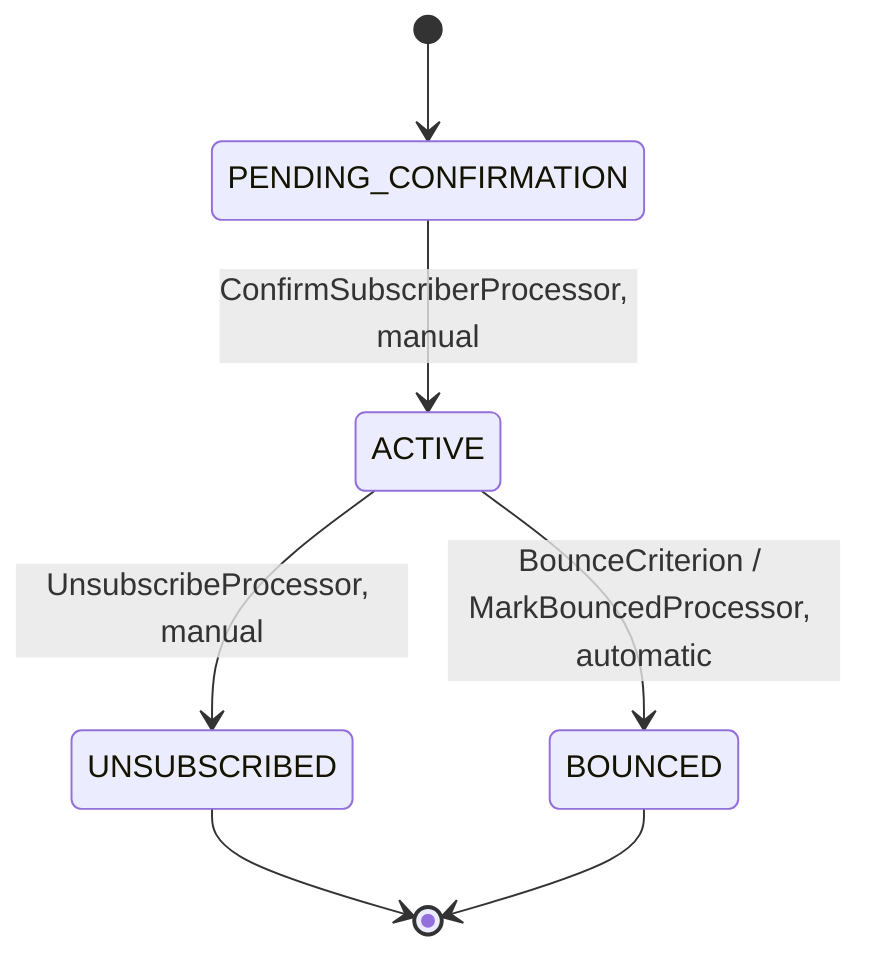
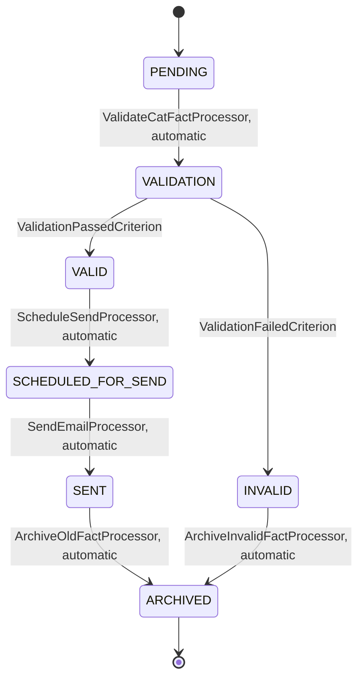
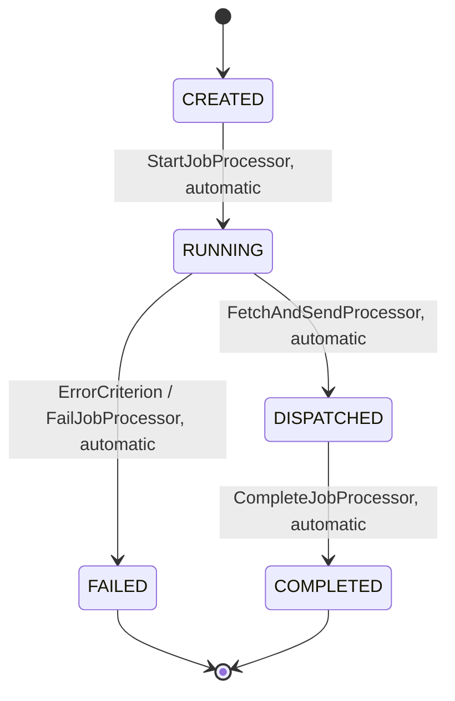

### 1. Entity Definitions
```
Subscriber:
- email: String (subscriber email, unique)
- name: String (optional display name)
- subscribedAt: String (ISO timestamp when signup occurred)
- status: String (PENDING_CONFIRMATION / ACTIVE / UNSUBSCRIBED / BOUNCED)
- interactionsCount: Integer (total recorded interactions with cat facts)

CatFact:
- text: String (cat fact content)
- source: String (API endpoint or source id)
- fetchedAt: String (ISO timestamp when fact was retrieved)
- validationStatus: String (PENDING / VALID / INVALID)
- sendCount: Integer (how many times this fact was sent)
- engagementScore: Number (aggregate metric from opens/clicks)

WeeklySendJob:
- scheduledFor: String (ISO date/time when the weekly job should run)
- createdAt: String (ISO timestamp)
- runAt: String (ISO timestamp when job actually started)
- catFactTechnicalId: String (reference to CatFact created by this job)
- status: String (CREATED / RUNNING / DISPATCHED / COMPLETED / FAILED)
- errorMessage: String (optional, populated on failure)
```

### 2. Entity workflows

Subscriber workflow:
1. Initial State: PENDING_CONFIRMATION created when user signs up (POST Subscriber)
2. Confirmation: User confirms subscription (manual) → moves to ACTIVE
3. Active: Receives weekly emails automatically
4. Unsubscribe: User requests unsubscribe (manual) → UNSUBSCRIBED
5. Bounce handling: System can set BOUNCED (automatic) if emails fail repeatedly


```mermaid
stateDiagram-v2
    [*] --> PENDING_CONFIRMATION
    PENDING_CONFIRMATION --> ACTIVE : ConfirmSubscriberProcessor, manual
    ACTIVE --> UNSUBSCRIBED : UnsubscribeProcessor, manual
    ACTIVE --> BOUNCED : BounceCriterion / MarkBouncedProcessor, automatic
    UNSUBSCRIBED --> [*]
    BOUNCED --> [*]
```

Subscriber processors & criteria:
- ConfirmSubscriberProcessor (manual-triggered): mark status ACTIVE, record confirmedAt
- UnsubscribeProcessor (manual): mark status UNSUBSCRIBED
- BounceCriterion: detects repeated hard bounces for email
- MarkBouncedProcessor: mark status BOUNCED and stop sends

CatFact workflow:
1. Initial State: PENDING created by WeeklySendJob (system)
2. Validation: Validate content and length → VALID or INVALID (automatic)
3. ScheduledForSend: VALID facts assigned to a WeeklySendJob for dispatch
4. Sent: After emails delivered, increment sendCount and update engagement metrics
5. Archived: Old facts archived (automatic/manual)


```mermaid
stateDiagram-v2
    [*] --> PENDING
    PENDING --> VALIDATION : ValidateCatFactProcessor, automatic
    VALIDATION --> VALID : ValidationPassedCriterion
    VALIDATION --> INVALID : ValidationFailedCriterion
    VALID --> SCHEDULED_FOR_SEND : ScheduleSendProcessor, automatic
    SCHEDULED_FOR_SEND --> SENT : SendEmailProcessor, automatic
    SENT --> ARCHIVED : ArchiveOldFactProcessor, automatic
    INVALID --> ARCHIVED : ArchiveInvalidFactProcessor, automatic
    ARCHIVED --> [*]
```

CatFact processors & criteria:
- ValidateCatFactProcessor: check non-empty, length, profanity rules
- ValidationPassedCriterion / ValidationFailedCriterion: decide VALID/INVALID
- ScheduleSendProcessor: attach catFact to WeeklySendJob (set catFactTechnicalId)
- SendEmailProcessor: send to subscribers and increment sendCount
- ArchiveOldFactProcessor: mark archived older than retentionPeriod

WeeklySendJob workflow:
1. Initial State: CREATED when scheduled (POST WeeklySendJob)
2. Running: At scheduledFor time job transitions to RUNNING (automatic scheduler)
3. Dispatching: RUNNING uses FetchCatFactProcessor to create CatFact then SendEmailProcessor to dispatch
4. Dispatched: Emails sent (DISPATCHED)
5. Completion: COMPLETED or FAILED


```mermaid
stateDiagram-v2
    [*] --> CREATED
    CREATED --> RUNNING : StartJobProcessor, automatic
    RUNNING --> DISPATCHED : FetchAndSendProcessor, automatic
    DISPATCHED --> COMPLETED : CompleteJobProcessor, automatic
    RUNNING --> FAILED : ErrorCriterion / FailJobProcessor, automatic
    FAILED --> [*]
    COMPLETED --> [*]
```

WeeklySendJob processors & criteria:
- StartJobProcessor: verifies schedule and marks runAt
- FetchAndSendProcessor: calls Cat Fact API, persists CatFact, triggers CatFact workflow, then triggers SendEmailProcessor
- CompleteJobProcessor: mark status COMPLETED and record dispatchedAt
- ErrorCriterion: detects failures (API error, email failures)
- FailJobProcessor: set status FAILED and populate errorMessage

### 3. Pseudo code for processor classes

Note: processors are invoked automatically by Cyoda when entity is persisted or a transition occurs.

FetchCatFactProcessor (invoked by WeeklySendJob RUNNING)
```pseudo
class FetchCatFactProcessor {
  process(job) {
    response = callCatFactApiRandom()
    catFact = new CatFact(text=response.fact, source='catfact.ninja', fetchedAt=now(), validationStatus='PENDING', sendCount=0, engagementScore=0)
    persistEntity(catFact) // triggers CatFact workflow
    job.catFactTechnicalId = catFact.technicalId
    persistEntity(job)
  }
}
```

ValidateCatFactProcessor (invoked by CatFact PENDING)
```pseudo
class ValidateCatFactProcessor {
  process(catFact) {
    if catFact.text is empty or length > 1000 then
      catFact.validationStatus = 'INVALID'
    else
      catFact.validationStatus = 'VALID'
    persistEntity(catFact)
  }
}
```

SendEmailProcessor (invoked by CatFact SCHEDULED_FOR_SEND or by FetchAndSendProcessor)
```pseudo
class SendEmailProcessor {
  process(catFact) {
    subscribers = querySubscribersWhere(status='ACTIVE')
    for each s in subscribers:
      sendEmail(s.email, subject='Weekly Cat Fact', body=catFact.text)
      // optionally record per-subscriber metric asynchronously
    catFact.sendCount += 1
    persistEntity(catFact)
  }
}
```

ConfirmSubscriberProcessor (manual)
```pseudo
class ConfirmSubscriberProcessor {
  process(subscriber) {
    subscriber.status = 'ACTIVE'
    persistEntity(subscriber)
  }
}
```

FailJobProcessor
```pseudo
class FailJobProcessor {
  process(job, error) {
    job.status = 'FAILED'
    job.errorMessage = error.message
    persistEntity(job)
  }
}
```

Criteria examples:
- ValidationPassedCriterion: catFact.validationStatus == 'VALID'
- ErrorCriterion: any exception thrown during processors or non-2xx API response
- BounceCriterion: email provider reports >=3 hard bounces in window

### 4. API Endpoints Design Rules

Rules applied:
- POST endpoints create entities (trigger events). They return only technicalId.
- All created entities have GET by technicalId to retrieve stored results.
- No GET by condition unless explicitly requested.

Endpoints:

1) Create Subscriber (signup)
POST /subscribers
Request:
```json
{
  "email": "alice@example.com",
  "name": "Alice"
}
```
Response (201):
```json
{
  "technicalId": "generated-uuid-1234"
}
```
GET subscriber by technicalId:
GET /subscribers/{technicalId}
Response (200):
```json
{
  "technicalId": "generated-uuid-1234",
  "email": "alice@example.com",
  "name": "Alice",
  "subscribedAt": "2025-09-01T10:00:00Z",
  "status": "PENDING_CONFIRMATION",
  "interactionsCount": 0
}
```

2) Create WeeklySendJob (schedule or trigger a weekly run)
POST /weekly-send-jobs
Request:
```json
{
  "scheduledFor": "2025-09-07T09:00:00Z"
}
```
Response (201):
```json
{
  "technicalId": "job-uuid-5678"
}
```
GET job by technicalId:
GET /weekly-send-jobs/{technicalId}
Response (200):
```json
{
  "technicalId": "job-uuid-5678",
  "scheduledFor": "2025-09-07T09:00:00Z",
  "createdAt": "2025-09-01T10:00:00Z",
  "runAt": "2025-09-07T09:00:05Z",
  "catFactTechnicalId": "catfact-uuid-999",
  "status": "COMPLETED",
  "errorMessage": null
}
```

3) Get CatFact by technicalId (read-only)
GET /catfacts/{technicalId}
Response (200):
```json
{
  "technicalId": "catfact-uuid-999",
  "text": "Cats sleep 70% of their lives.",
  "source": "catfact.ninja",
  "fetchedAt": "2025-09-07T09:00:01Z",
  "validationStatus": "VALID",
  "sendCount": 1,
  "engagementScore": 12.5
}
```

Notes and business rules summary:
- Subscriber POST triggers a SUBSCRIBER entity persisted → Subscriber workflow starts (confirmation emails may be sent).
- Weekly send scheduling is an orchestration entity (WeeklySendJob). Creating it triggers Cyoda to run the job at scheduledFor, which uses FetchCatFactProcessor to persist a CatFact entity — that persistence triggers the CatFact workflow (validation → scheduling → send).
- Reporting (counts, interactions) is derived from persisted CatFact and Subscriber fields and can be exposed via GET endpoints or aggregated reports (not defined as extra endpoints here).
- POST responses must contain only technicalId per rules.

If you want, we can:
- add a separate Interaction entity to record per-email open/click events,
- add GET-by-condition endpoints (for example list all active subscribers),
- or expand retention and archiving policies. Which would you like to refine next?

---

Example Ready-to-Copy User Response (pick one and paste)

- Option A — confirm final:
  I confirm: keep the CatFact weekly send design as-is; this is the final version.

- Option B — request one refinement:
  Please add an Interaction entity to record opens/clicks and add GET /subscribers?status=ACTIVE to list active subscribers.