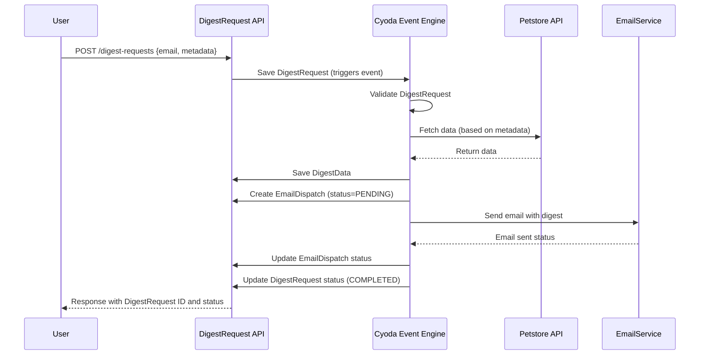
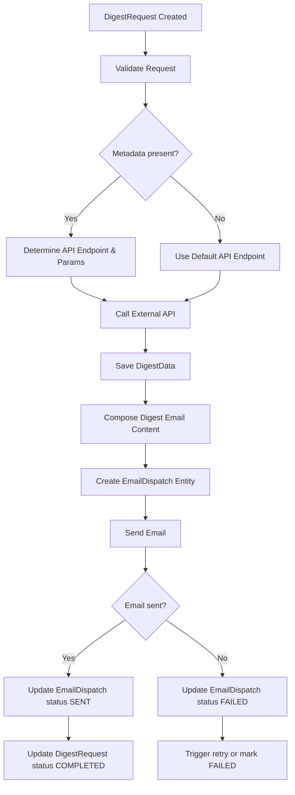
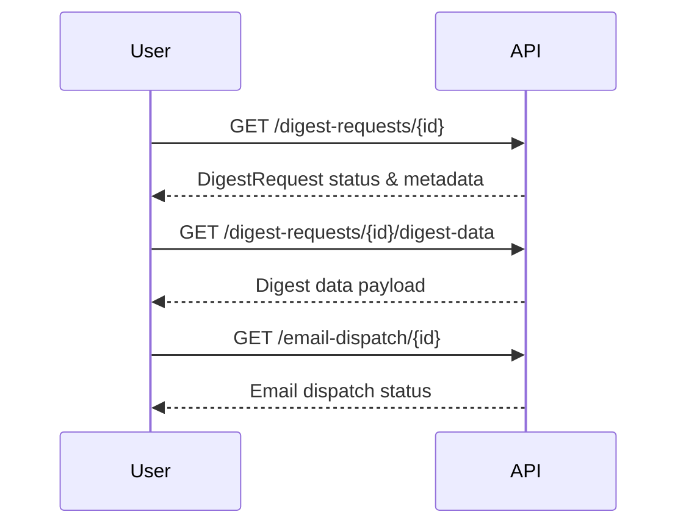

# Functional Requirements for Digest Request Processing System (Event-Driven Architecture)

## 1. Business Entities

- **DigestRequest**  
  Fields:  
  - `id` (UUID)  
  - `email` (String)  
  - `metadata` (Map<String, String>)  
  - `status` (Enum: RECEIVED, PROCESSING, COMPLETED, FAILED)  
  - `createdAt` (Timestamp)  
  - `updatedAt` (Timestamp)  

- **DigestData**  
  Fields:  
  - `id` (UUID)  
  - `digestRequestId` (UUID)  
  - `dataPayload` (JSON or String)  
  - `createdAt` (Timestamp)  

- **EmailDispatch**  
  Fields:  
  - `id` (UUID)  
  - `digestRequestId` (UUID)  
  - `emailTo` (String)  
  - `emailContent` (String)  
  - `status` (Enum: PENDING, SENT, FAILED)  
  - `sentAt` (Timestamp)  

## 2. API Endpoints

### POST Endpoints (add/update entities & trigger events)

- **POST /digest-requests**  
  Purpose: Register a new digest request, triggers event to start processing  
  Request:  
  ```json
  {
    "email": "user@example.com",
    "metadata": {
      "key1": "value1",
      "key2": "value2"
    }
  }
  ```  
  Response:  
  ```json
  {
    "id": "uuid",
    "status": "RECEIVED"
  }
  ```

- **POST /email-dispatch/{id}/status**  
  Purpose: Update email dispatch status (optional, for internal use or callbacks)  
  Request:  
  ```json
  {
    "status": "SENT" // or FAILED
  }
  ```  
  Response:  
  ```json
  {
    "id": "uuid",
    "status": "SENT"
  }
  ```

### GET Endpoints (retrieve results only)

- **GET /digest-requests/{id}**  
  Purpose: Retrieve digest request status and metadata  
  Response:  
  ```json
  {
    "id": "uuid",
    "email": "user@example.com",
    "metadata": {...},
    "status": "COMPLETED",
    "createdAt": "timestamp",
    "updatedAt": "timestamp"
  }
  ```

- **GET /digest-requests/{id}/digest-data**  
  Purpose: Retrieve the fetched data for a specific digest request  
  Response:  
  ```json
  {
    "digestRequestId": "uuid",
    "dataPayload": {...}
  }
  ```

- **GET /email-dispatch/{id}**  
  Purpose: Retrieve email dispatch status  
  Response:  
  ```json
  {
    "id": "uuid",
    "emailTo": "user@example.com",
    "status": "SENT",
    "sentAt": "timestamp"
  }
  ```

## 3. Event Processing Workflows

- **On DigestRequest saved (Event: DigestRequestCreated/Updated)**  
  1. Validate the request data.  
  2. Initiate external API call to https://petstore.swagger.io/ (endpoint decided by metadata or default).  
  3. Save retrieved data as DigestData entity.  
  4. Compose digest content (HTML/plain text).  
  5. Create EmailDispatch entity with status=PENDING.  
  6. Trigger email sending process, update EmailDispatch status accordingly.  
  7. Update DigestRequest status through the workflow stages.

- **On EmailDispatch status update**  
  1. Update EmailDispatch status (SENT/FAILED).  
  2. If SENT, finalize DigestRequest status to COMPLETED.  
  3. If FAILED, trigger retry logic or mark DigestRequest as FAILED.

## 4. Request/Response Formats

Refer to the API endpoints section above for JSON request and response examples.

---

## Mermaid Diagrams

### User to Digest Request Creation and Event-Driven Processing Flow


```mermaid
sequenceDiagram
    participant User
    participant API as DigestRequest API
    participant Cyoda as Cyoda Event Engine
    participant ExternalAPI as Petstore API
    participant EmailService

    User->>API: POST /digest-requests {email, metadata}
    API->>Cyoda: Save DigestRequest (triggers event)
    Cyoda->>Cyoda: Validate DigestRequest
    Cyoda->>ExternalAPI: Fetch data (based on metadata)
    ExternalAPI-->>Cyoda: Return data
    Cyoda->>API: Save DigestData
    Cyoda->>API: Create EmailDispatch (status=PENDING)
    Cyoda->>EmailService: Send email with digest
    EmailService-->>Cyoda: Email sent status
    Cyoda->>API: Update EmailDispatch status
    Cyoda->>API: Update DigestRequest status (COMPLETED)
    API-->>User: Response with DigestRequest ID and status
```

### Event-Driven Workflow Chain for Digest Request Processing


```mermaid
flowchart TD
    A[DigestRequest Created] --> B[Validate Request]
    B --> C{Metadata present?}
    C -->|Yes| D[Determine API Endpoint & Params]
    C -->|No| E[Use Default API Endpoint]
    D --> F[Call External API]
    E --> F
    F --> G[Save DigestData]
    G --> H[Compose Digest Email Content]
    H --> I[Create EmailDispatch Entity]
    I --> J[Send Email]
    J --> K{Email sent?}
    K -->|Yes| L[Update EmailDispatch status SENT]
    K -->|No| M[Update EmailDispatch status FAILED]
    L --> N[Update DigestRequest status COMPLETED]
    M --> O[Trigger retry or mark FAILED]
```

### User Interaction Pattern (Retrieving Status and Results)


```mermaid
sequenceDiagram
    participant User
    participant API

    User->>API: GET /digest-requests/{id}
    API-->>User: DigestRequest status & metadata

    User->>API: GET /digest-requests/{id}/digest-data
    API-->>User: Digest data payload

    User->>API: GET /email-dispatch/{id}
    API-->>User: Email dispatch status
```