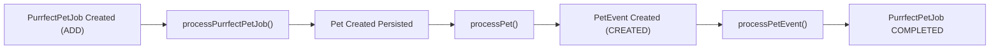
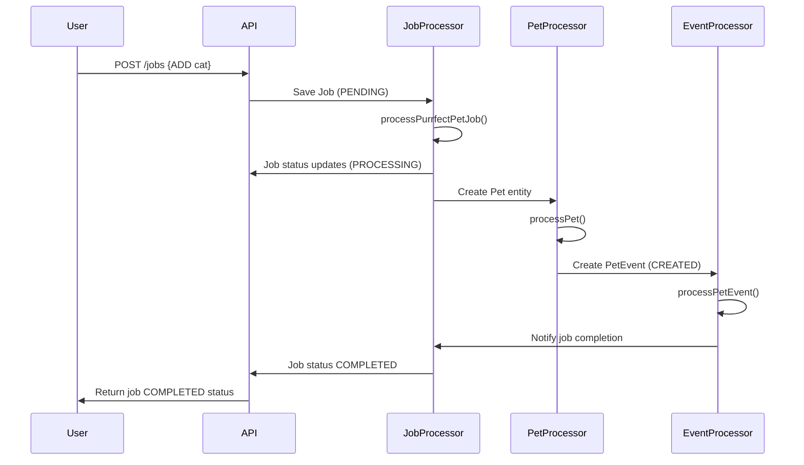

### 1. Entity Definitions

``` 
PurrfectPetJob:  
- id: UUID (unique identifier for the job/event)  
- petType: String (type of pet, e.g., cat, dog, bird)  
- action: String (operation requested, e.g., ADD, SEARCH)  
- payload: JSON (data related to the pet or query parameters)  
- status: StatusEnum (PENDING, PROCESSING, COMPLETED, FAILED)  

Pet:  
- id: UUID (unique pet identifier)  
- name: String (pet's name)  
- type: String (pet type/species)  
- age: Integer (pet's age)  
- adoptionStatus: String (AVAILABLE, ADOPTED)  
- status: StatusEnum (CREATED, ACTIVE, ARCHIVED)  

PetEvent:  
- id: UUID (unique event identifier)  
- petId: UUID (reference to Pet)  
- eventType: String (CREATED, UPDATED, ADOPTED)  
- timestamp: DateTime (event creation time)  
- status: StatusEnum (RECORDED, PROCESSED)  
```

---

### 2. Process Method Flows

```
processPurrfectPetJob() Flow:
1. Initial State: Job created with PENDING status
2. Validation: Validate petType and action values
3. Dispatch: Depending on action, invoke relevant processing (e.g., addPet, searchPets)
4. Update: Change job status to PROCESSING during work, then COMPLETED or FAILED
5. Event Creation: If a pet is added or updated, create corresponding PetEvent entity
6. Notification: Optionally notify external systems or clients

processPet() Flow:
1. Initial State: Pet entity persisted with CREATED status
2. Enrichment: Add default values or validate fields if needed
3. Activation: Update status to ACTIVE after successful processing
4. Event Generation: Create PetEvent with eventType=CREATED
5. Completion: Finalize processing and mark Pet as ready for queries

processPetEvent() Flow:
1. Initial State: PetEvent saved with RECORDED status
2. Processing: Handle event logic such as updating adoption status or triggering notifications
3. Status Update: Mark PetEvent as PROCESSED after successful handling
```

---

### 3. API Endpoints (POST triggers events, GET retrieves results)

| Method | Endpoint                | Description                          | Request Body Sample                              | Response Sample                             |
|--------|-------------------------|----------------------------------|-------------------------------------------------|--------------------------------------------|
| POST   | /jobs                   | Create a PurrfectPetJob           | `{ "petType": "cat", "action": "ADD", "payload": {...} }` | `{ "id": "...", "status": "PENDING" }`     |
| POST   | /pets                   | Add a new Pet (immutable creation) | `{ "name": "Whiskers", "type": "cat", "age": 2 }`          | `{ "id": "...", "status": "CREATED" }`     |
| POST   | /pets/events            | Record PetEvent                   | `{ "petId": "...", "eventType": "ADOPTED", "timestamp": "..." }` | `{ "id": "...", "status": "RECORDED" }`    |
| GET    | /pets                   | Retrieve list of pets             | N/A                                             | `[ { "id": "...", "name": "Whiskers", "type": "cat", ... } ]` |
| GET    | /jobs/{id}              | Retrieve job status and result    | N/A                                             | `{ "id": "...", "status": "COMPLETED", "result": {...} }` |

---

### 4. Request/Response JSON Examples

**POST /jobs**  
Request:  
```json
{
  "petType": "cat",
  "action": "ADD",
  "payload": {
    "name": "Mittens",
    "age": 1
  }
}
```
Response:  
```json
{
  "id": "job-uuid-1234",
  "status": "PENDING"
}
```

**POST /pets**  
Request:  
```json
{
  "name": "Mittens",
  "type": "cat",
  "age": 1
}
```
Response:  
```json
{
  "id": "pet-uuid-5678",
  "status": "CREATED"
}
```

---

### Mermaid Diagrams

**Entity lifecycle state diagram for PurrfectPetJob**


```mermaid
stateDiagram-v2
    [*] --> PENDING
    PENDING --> PROCESSING : processPurrfectPetJob()
    PROCESSING --> COMPLETED : success
    PROCESSING --> FAILED : error
    COMPLETED --> [*]
    FAILED --> [*]
```

**Event-driven processing chain for adding a pet**


```mermaid
flowchart LR
    JobCreated["PurrfectPetJob Created (ADD)"] --> processJob["processPurrfectPetJob()"]
    processJob --> PetCreated["Pet Created Persisted"]
    PetCreated --> processPet["processPet()"]
    processPet --> PetEventCreated["PetEvent Created (CREATED)"]
    PetEventCreated --> processPetEvent["processPetEvent()"]
    processPetEvent --> JobCompleted["PurrfectPetJob COMPLETED"]
```

**User interaction sequence flow**


```mermaid
sequenceDiagram
    participant User
    participant API
    participant JobProcessor
    participant PetProcessor
    participant EventProcessor

    User->>API: POST /jobs {ADD cat}
    API->>JobProcessor: Save Job (PENDING)
    JobProcessor->>JobProcessor: processPurrfectPetJob()
    JobProcessor->>API: Job status updates (PROCESSING)
    JobProcessor->>PetProcessor: Create Pet entity
    PetProcessor->>PetProcessor: processPet()
    PetProcessor->>EventProcessor: Create PetEvent (CREATED)
    EventProcessor->>EventProcessor: processPetEvent()
    EventProcessor->>JobProcessor: Notify job completion
    JobProcessor->>API: Job status COMPLETED
    API->>User: Return job COMPLETED status
```

---

If you'd like me to proceed with implementation or refine any part, just let me know!