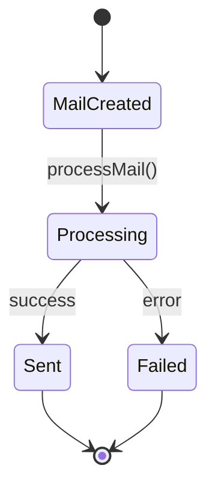
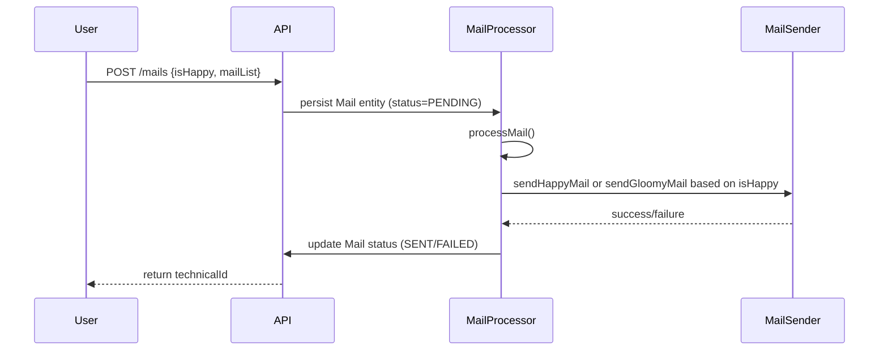

### 1. Entity Definitions

``` 
Mail:
- isHappy: Boolean (Indicates if the mail is happy or gloomy)
- mailList: List<String> (List of recipient email addresses)
- status: MailStatusEnum (Entity lifecycle state: PENDING, SENT, FAILED)
```

### 2. Process Method Flows

```
processMail() Flow:
1. Initial State: Mail created with status = PENDING
2. Validation: Validate mailList is not empty; validate isHappy is not null
3. Processing:
   - If isHappy == true, invoke sendHappyMail processor to send happy mail content
   - If isHappy == false, invoke sendGloomyMail processor to send gloomy mail content
4. Completion: Update status to SENT if mail sent successfully, or FAILED if errors occur
5. Notification: (Optional) Log or notify system of mail sending result
```

### 3. API Endpoints Design

| HTTP Method | Endpoint             | Purpose                                      | Request Body                                       | Response Body                      |
|-------------|----------------------|----------------------------------------------|--------------------------------------------------|----------------------------------|
| POST        | /mails               | Create a new Mail entity and trigger processing | `{ "isHappy": true, "mailList": ["a@b.com"] }`   | `{ "technicalId": "uuid" }`       |
| GET         | /mails/{technicalId} | Retrieve Mail entity status and details       | N/A                                              | `{ "isHappy": true, "mailList": [...], "status": "SENT" }` |

- No update or delete endpoints to preserve immutability and event history.
- Sending mails happens automatically on Mail creation.

### 4. Request/Response Formats

**POST /mails Request**

```json
{
  "isHappy": true,
  "mailList": ["recipient1@example.com", "recipient2@example.com"]
}
```

**POST /mails Response**

```json
{
  "technicalId": "123e4567-e89b-12d3-a456-426614174000"
}
```

**GET /mails/{technicalId} Response**

```json
{
  "isHappy": true,
  "mailList": ["recipient1@example.com", "recipient2@example.com"],
  "status": "SENT"
}
```

---

### Visual Representations

**Entity Lifecycle State Diagram**


```mermaid
stateDiagram-v2
    [*] --> MailCreated
    MailCreated --> Processing : processMail()
    Processing --> Sent : success
    Processing --> Failed : error
    Sent --> [*]
    Failed --> [*]
```

**Event-Driven Processing Chain**

```mermaid
graph LR
    A[Mail Created (POST /mails)] --> B[processMail() invoked]
    B --> C{isHappy?}
    C -->|true| D[sendHappyMail Processor]
    C -->|false| E[sendGloomyMail Processor]
    D --> F[Update status to SENT]
    E --> F
    F --> G[Notify or log result]
```

**User Interaction Sequence Flow**


```mermaid
sequenceDiagram
    participant User
    participant API
    participant MailProcessor
    participant MailSender

    User->>API: POST /mails {isHappy, mailList}
    API->>MailProcessor: persist Mail entity (status=PENDING)
    MailProcessor->>MailProcessor: processMail()
    MailProcessor->>MailSender: sendHappyMail or sendGloomyMail based on isHappy
    MailSender-->>MailProcessor: success/failure
    MailProcessor->>API: update Mail status (SENT/FAILED)
    API-->>User: return technicalId
```

---

This completes the finalized functional requirements for your happy/gloomy mail sending application using an Event-Driven Architecture approach on Cyoda platform.