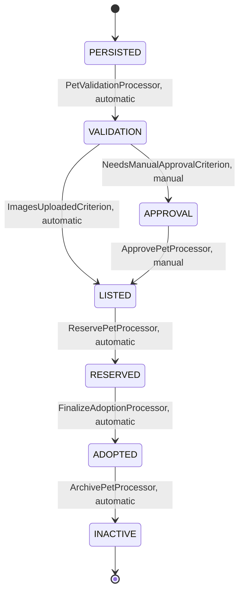
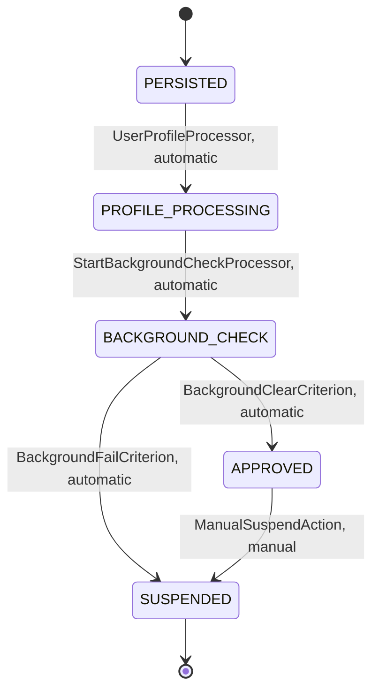
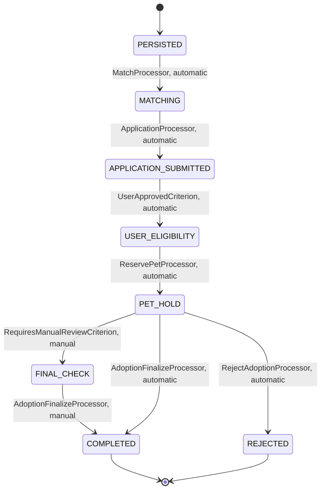

### 1. Entity Definitions

```
Pet:
- petId: String (business identifier from source, e.g., external Petstore id)
- name: String (pet name)
- type: String (cat, dog, etc.)
- breed: String (breed description)
- ageMonths: Integer (age in months)
- description: String (short bio)
- images: List<String> (URLs or references to images)
- status: String (current availability status, for info only)

User:
- userId: String (business identifier)
- fullName: String (user full name)
- email: String (contact email)
- phone: String (contact phone)
- address: String (postal address)
- preferences: String (pet preferences)
- status: String (profile status for info only)

Adoption:
- adoptionRequestId: String (business identifier)
- petId: String (link to Pet.petId)
- userId: String (link to User.userId)
- requestedDate: String (ISO date)
- pickupWindow: String (preferred pickup window)
- outcomeNotes: String (admin notes)
- status: String (current adoption lifecycle status)
```

### 2. Entity workflows

Pet workflow:
1. Initial State: PERSISTED (Pet persisted triggers Cyoda Pet workflow)
2. VALIDATION: Ensure required fields and images present (automatic)
3. APPROVAL: Manual review by admin if validation flagged
4. LISTED: Pet becomes AVAILABLE for adoption (automatic after approval)
5. RESERVED: When a user starts an adoption for this pet (automatic)
6. ADOPTED: Adoption completed (automatic)
7. INACTIVE: Post-adoption archival (automatic)


```mermaid
stateDiagram-v2
    [*] --> PERSISTED
    PERSISTED --> VALIDATION : PetValidationProcessor, automatic
    VALIDATION --> APPROVAL : NeedsManualApprovalCriterion, manual
    VALIDATION --> LISTED : ImagesUploadedCriterion, automatic
    APPROVAL --> LISTED : ApprovePetProcessor, manual
    LISTED --> RESERVED : ReservePetProcessor, automatic
    RESERVED --> ADOPTED : FinalizeAdoptionProcessor, automatic
    ADOPTED --> INACTIVE : ArchivePetProcessor, automatic
    INACTIVE --> [*]
```

Pet workflow processors & criteria:
- Processors: PetValidationProcessor, ImageProcessingProcessor, ApprovePetProcessor, ReservePetProcessor, ArchivePetProcessor
- Criteria: NeedsManualApprovalCriterion, ImagesUploadedCriterion

User workflow:
1. Initial State: PERSISTED (user created)
2. PROFILE_PROCESSING: Enrich/normalize profile (automatic)
3. BACKGROUND_CHECK: Automated background/eligibility check (automatic)
4. APPROVED: If checks pass (automatic)
5. SUSPENDED: Manual administrative suspension (manual)


```mermaid
stateDiagram-v2
    [*] --> PERSISTED
    PERSISTED --> PROFILE_PROCESSING : UserProfileProcessor, automatic
    PROFILE_PROCESSING --> BACKGROUND_CHECK : StartBackgroundCheckProcessor, automatic
    BACKGROUND_CHECK --> APPROVED : BackgroundClearCriterion, automatic
    BACKGROUND_CHECK --> SUSPENDED : BackgroundFailCriterion, automatic
    APPROVED --> SUSPENDED : ManualSuspendAction, manual
    SUSPENDED --> [*]
```

User workflow processors & criteria:
- Processors: UserProfileProcessor, StartBackgroundCheckProcessor, NotifyUserProcessor
- Criteria: BackgroundClearCriterion, BackgroundFailCriterion

Adoption workflow (orchestration entity):
1. Initial State: PERSISTED (adoption request created via POST)
2. MATCHING: Verify pet availability and match user preferences (automatic)
3. APPLICATION_SUBMITTED: Collect application details (automatic)
4. USER_ELIGIBILITY: Ensure user is APPROVED (criterion)
5. PET_HOLD: Reserve pet for applicant (automatic)
6. FINAL_CHECK: Final admin review if needed (manual)
7. COMPLETED: Adoption finalized (automatic)
8. REJECTED: Adoption denied (automatic/manual)


```mermaid
stateDiagram-v2
    [*] --> PERSISTED
    PERSISTED --> MATCHING : MatchProcessor, automatic
    MATCHING --> APPLICATION_SUBMITTED : ApplicationProcessor, automatic
    APPLICATION_SUBMITTED --> USER_ELIGIBILITY : UserApprovedCriterion, automatic
    USER_ELIGIBILITY --> PET_HOLD : ReservePetProcessor, automatic
    PET_HOLD --> FINAL_CHECK : RequiresManualReviewCriterion, manual
    FINAL_CHECK --> COMPLETED : AdoptionFinalizeProcessor, manual
    PET_HOLD --> COMPLETED : AdoptionFinalizeProcessor, automatic
    PET_HOLD --> REJECTED : RejectAdoptionProcessor, automatic
    COMPLETED --> [*]
    REJECTED --> [*]
```

Adoption workflow processors & criteria:
- Processors: MatchProcessor, ApplicationProcessor, ReservePetProcessor, AdoptionFinalizeProcessor, RejectAdoptionProcessor
- Criteria: PetAvailableCriterion, UserApprovedCriterion, RequiresManualReviewCriterion

### 3. Pseudo code for processor classes

PetValidationProcessor (pseudo)
```
class PetValidationProcessor {
  void process(Pet pet) {
    if (pet.name == null || pet.type == null) markNeedsManualApproval(pet)
    if (pet.images empty) markNeedsManualApproval(pet)
    else generateImageThumbnails(pet)
    updateStatus(pet, VALIDATED)
  }
}
```

ReservePetProcessor (pseudo)
```
class ReservePetProcessor {
  void process(Adoption adoption) {
    if (PetAvailableCriterion.isSatisfied(adoption.petId)) {
      lockPet(adoption.petId)
      updateAdoptionStatus(adoption, PET_HOLD)
      notifyUser(adoption.userId)
    } else {
      updateAdoptionStatus(adoption, REJECTED)
    }
  }
}
```

MatchProcessor (pseudo)
```
class MatchProcessor {
  void process(Adoption adoption) {
    Pet pet = findPet(adoption.petId)
    User user = findUser(adoption.userId)
    if (pet == null) updateStatus(adoption, REJECTED)
    else if (user.preferences match pet) updateStatus(adoption, MATCHED)
    else updateStatus(adoption, MATCHED)
  }
}
```

UserProfileProcessor (pseudo)
```
class UserProfileProcessor {
  void process(User user) {
    normalizeContact(user)
    sendVerificationEmail(user.email)
    updateStatus(user, PROFILE_PROCESSING)
  }
}
```

Notes: Criteria are simple boolean checks, e.g., PetAvailableCriterion checks pet.status == AVAILABLE; UserApprovedCriterion verifies user workflow reached APPROVED.

### 4. API Endpoints Design Rules

General rules:
- POST creates entity and triggers Cyoda workflow; POST response returns only technicalId.
- Every POST-created entity must have GET by technicalId to retrieve stored result.
- GET endpoints are read-only.

Endpoints (request/response examples)

1) Create Pet (POST /pets)
Request:
```json
{
  "petId":"P123",
  "name":"Mittens",
  "type":"cat",
  "breed":"Tabby",
  "ageMonths":24,
  "description":"Playful tabby",
  "images":["https://.../1.jpg"]
}
```
Response (only technicalId):
```json
{ "technicalId":"tech-pet-0001" }
```
Get Pet by technicalId (GET /pets/{technicalId}) response:
```json
{
  "technicalId":"tech-pet-0001",
  "petId":"P123",
  "name":"Mittens",
  "type":"cat",
  "breed":"Tabby",
  "ageMonths":24,
  "description":"Playful tabby",
  "images":["https://.../1.jpg"],
  "status":"LISTED"
}
```

2) Create User (POST /users)
Request:
```json
{
  "userId":"U456",
  "fullName":"Alex Doe",
  "email":"alex@example.com",
  "phone":"555-0100",
  "address":"123 Main St",
  "preferences":"small cats"
}
```
Response:
```json
{ "technicalId":"tech-user-0001" }
```
Get User by technicalId (GET /users/{technicalId}) response:
```json
{
  "technicalId":"tech-user-0001",
  "userId":"U456",
  "fullName":"Alex Doe",
  "email":"alex@example.com",
  "status":"APPROVED"
}
```

3) Create Adoption request (POST /adoptions)
Request:
```json
{
  "adoptionRequestId":"A789",
  "petId":"P123",
  "userId":"U456",
  "requestedDate":"2025-09-01",
  "pickupWindow":"2025-09-05 to 2025-09-07"
}
```
Response:
```json
{ "technicalId":"tech-adopt-0001" }
```
Get Adoption by technicalId (GET /adoptions/{technicalId}) response:
```json
{
  "technicalId":"tech-adopt-0001",
  "adoptionRequestId":"A789",
  "petId":"P123",
  "userId":"U456",
  "status":"PET_HOLD",
  "pickupWindow":"2025-09-05 to 2025-09-07"
}
```

Notes and next steps:
- Cyoda will start each entity workflow automatically when POST persists the entity.
- If you want more entities (Favorites, Reviews, Notifications) or to change the number of processors/criteria, tell me which entities to include (max 10).