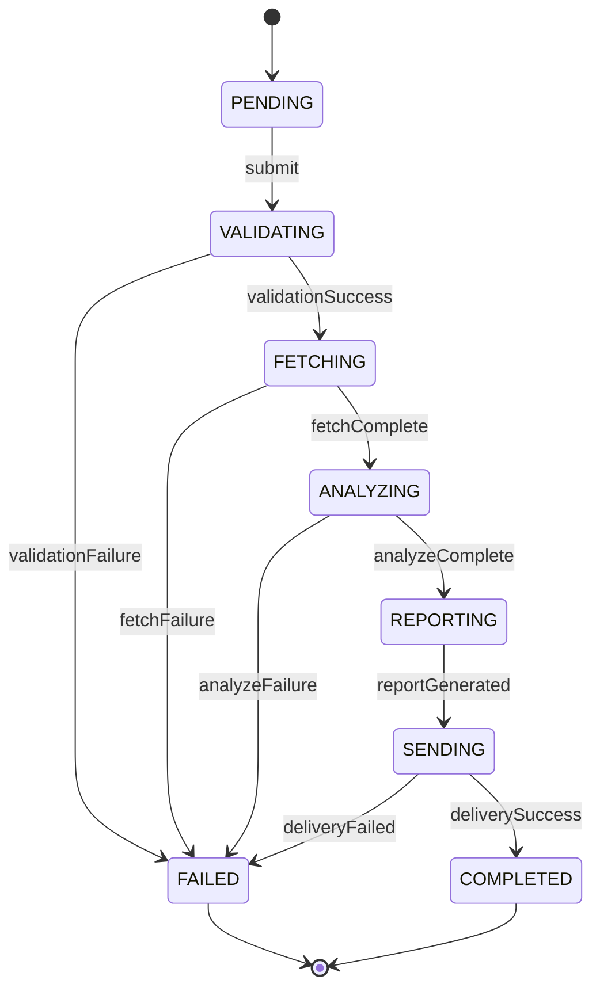
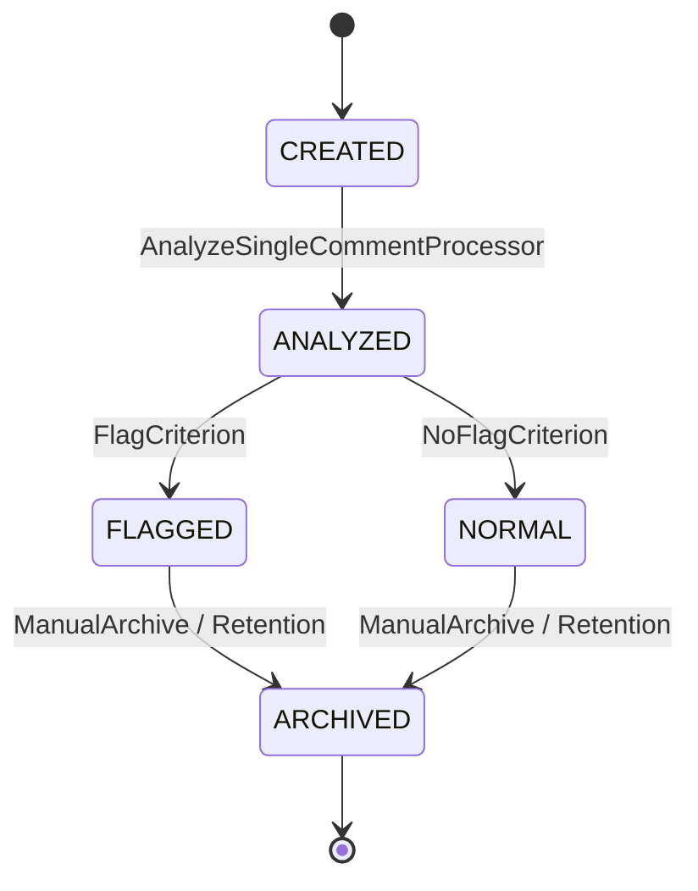
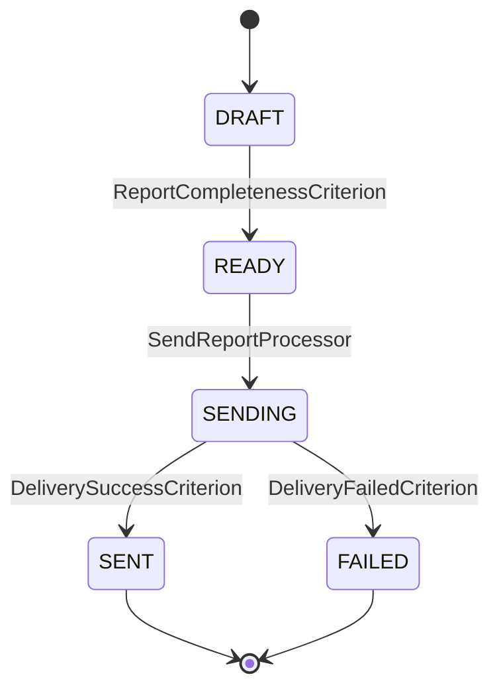

# Functional Requirements — Comment Ingestion & Reporting

This document describes the canonical functional requirements, entities, workflows, processors, pseudo-code and API design for the Comment Ingestion & Reporting prototype. It reconciles and updates inconsistencies in earlier drafts and reflects the latest logic for states, identifiers, processor responsibilities, error handling and API behavior.

Change log:
- Consolidated and clarified identifiers (technicalId vs businessId).
- Made job lifecycle state-machine explicit and consistent with the defined states.
- Aligned processor and criterion names with pseudocode and responsibilities.
- Added error handling, retry guidance and idempotency rules in processor pseudocode.
- Clarified API request/response shapes, status codes, and pagination for comments/report retrieval.

Notes:
- All timestamps are ISO 8601 strings (UTC) unless otherwise noted.
- "technicalId" is the system-generated unique identifier used to look up persisted entities. "businessId" is an optional human-friendly identifier when needed.

---

## 1. Entity Definitions

Entities are stored with both a system-generated technicalId (string) and relevant domain fields.

### IngestionJob

- technicalId: String (system id, e.g. "job_abc123")
- businessId: String (optional human id)
- postId: Integer (id of the post to ingest comments for)
- requestedByEmail: String (email that requested the report / primary recipient)
- recipients: Array[String] (additional email recipients)
- schedule: String | null (cron expression or special values: "RUN_ONCE")
- state: String (enum: PENDING / VALIDATING / FETCHING / ANALYZING / REPORTING / SENDING / COMPLETED / FAILED)
- statusMessage: String | null (human readable last status/error info)
- attempts: Integer (number of orchestration attempts / retries)
- createdAt: String (ISO 8601 timestamp)
- startedAt: String | null (timestamp when job first advanced from PENDING)
- completedAt: String | null (timestamp when job reached COMPLETED or FAILED)
- resultReportTechnicalId: String | null (link to Report.technicalId)
- metadata: Object (free-form for internal orchestration metadata)

Notes:
- Use `state` for the detailed workflow stage. A compact `summaryStatus` can be derived client-side if needed (e.g. IN_PROGRESS vs COMPLETED/FAILED).

### Comment

- technicalId: String (system id for comment record)
- sourceCommentId: Integer (original comment id from provider)
- postId: Integer (links to post / IngestionJob.postId)
- authorName: String | null
- authorEmail: String | null
- body: String
- receivedAt: String (source timestamp or ingestion timestamp)
- sentimentScore: Number | null (range -1.0 .. +1.0, null until analyzed)
- keywords: Array[String] (extracted keywords)
- flags: Array[String] (e.g., TOXIC, DUPLICATE, SPAM)
- state: String (CREATED / ANALYZED / FLAGGED / NORMAL / ARCHIVED)
- createdAt: String
- analyzedAt: String | null
- archivedAt: String | null

Notes:
- sentimentScore null indicates analysis not yet performed.

### Report

- technicalId: String (system id, e.g. "report_xyz")
- businessId: String | null (optional human id)
- postId: Integer
- generatedAt: String (ISO 8601)
- summary: String
- metrics: Object (counts, sentimentTotals, topKeywords, exampleCounts)
- highlights: Array[Object] (sample comments / alerts; include commentTechnicalId where applicable)
- recipients: Array[String]
- deliveryStatus: String (PENDING / SENT / FAILED)
- deliveryAttempts: Integer
- deliveryLastAttemptAt: String | null
- deliveryFailureReason: String | null
- storageLocation: String | null (link to stored artifact e.g. S3 path)

Notes:
- Report stores both business-facing summary and technical links for traceability.

---

## 2. Workflows

Workflows are specified as state machines. The `state` field on each entity must reflect the current state.

### IngestionJob workflow (detailed)

1. Created in state PENDING when POSTed (job created and queued)
2. VALIDATING — inputs validated (permissions, postId exists, recipients valid). Validation failures set state=FAILED with a statusMessage and completedAt.
3. FETCHING — external API calls to fetch comments; persisted Comment entities created in state CREATED.
4. ANALYZING — run analysis tasks over fetched comments (sentiment, keywords, flags). Comments progress to ANALYZED / FLAGGED / NORMAL.
5. REPORTING — aggregate comments, generate Report (state DRAFT internally) and persist it.
6. SENDING — deliver report (email). On success -> state COMPLETED; on final failure -> state FAILED.
7. COMPLETION — set completedAt and resultReportTechnicalId if report generated.

Mermaid diagram (state machine):


```mermaid
stateDiagram-v2
    [*] --> PENDING
    PENDING --> VALIDATING : submit
    VALIDATING --> FETCHING : validationSuccess
    VALIDATING --> FAILED : validationFailure
    FETCHING --> ANALYZING : fetchComplete
    FETCHING --> FAILED : fetchFailure
    ANALYZING --> REPORTING : analyzeComplete
    ANALYZING --> FAILED : analyzeFailure
    REPORTING --> SENDING : reportGenerated
    SENDING --> COMPLETED : deliverySuccess
    SENDING --> FAILED : deliveryFailed
    FAILED --> [*]
    COMPLETED --> [*]
```

Notes:
- Intermediate states such as VALIDATING, FETCHING, ANALYZING, REPORTING and SENDING are recorded in `state` to provide finer-grained observability.
- A retry policy may re-attempt transient failures (see Non-functional requirements).

Processors/Criteria used by orchestration:
- JobValidationProcessor (ValidateJobCriterion)
- FetchCommentsProcessor
- FetchCompleteCriterion
- AnalyzeCommentsProcessor
- GenerateReportProcessor
- SendReportProcessor
- DeliveryFailedCriterion / DeliverySuccessCriterion
- RetryPolicy / BackoffStrategy (shared infra behavior)


### Comment workflow

1. CREATED when persisted by FetchCommentsProcessor
2. ANALYZED when sentiment/keyword/flag enrichment completed
3. FLAGGED or NORMAL depending on flagging criteria
4. ARCHIVED manually or by retention policy

Mermaid diagram:


```mermaid
stateDiagram-v2
    [*] --> CREATED
    CREATED --> ANALYZED : AnalyzeSingleCommentProcessor
    ANALYZED --> FLAGGED : FlagCriterion
    ANALYZED --> NORMAL : NoFlagCriterion
    FLAGGED --> ARCHIVED : ManualArchive / Retention
    NORMAL --> ARCHIVED : ManualArchive / Retention
    ARCHIVED --> [*]
```

Processors/Criteria:
- AnalyzeSingleCommentProcessor
- FlagCriterion (may include TOXIC, SPAM, DUPLICATE checks)
- NoFlagCriterion
- ManualArchive / RetentionPolicy


### Report workflow

1. DRAFT after generation (Report persisted with deliveryStatus=PENDING)
2. READY if completeness check passes
3. SENDING when SendReportProcessor attempts delivery
4. SENT or FAILED as final state

Mermaid diagram:


```mermaid
stateDiagram-v2
    [*] --> DRAFT
    DRAFT --> READY : ReportCompletenessCriterion
    READY --> SENDING : SendReportProcessor
    SENDING --> SENT : DeliverySuccessCriterion
    SENDING --> FAILED : DeliveryFailedCriterion
    SENT --> [*]
    FAILED --> [*]
```

Processors/Criteria:
- ReportCompletenessCriterion
- SendReportProcessor
- DeliverySuccessCriterion
- DeliveryFailedCriterion

---

## 3. Processor pseudocode (updated, includes error handling and idempotency)

General rules for processors:
- Be idempotent: re-processing the same job or comment should not create duplicates. Use technicalId and unique constraints where appropriate.
- Persist intermediate progress: update entity.state, attempts and timestamps.
- Use exponential backoff and a maxAttempts policy for retriable failures.
- On permanent failures set state=FAILED and populate statusMessage / failure reason.

FetchCommentsProcessor:

```
process(job):
  set job.state = FETCHING; job.startedAt = job.startedAt or now(); persist job

  try:
    resp = ExternalApi.fetchComments(postId=job.postId, page=1...)
    for externalComment in resp.items:
      # idempotent persist: upsert by sourceCommentId + postId
      comment = find Comment where sourceCommentId=externalComment.id and postId=job.postId
      if not comment:
        comment = new Comment(...)
        comment.state = CREATED
        comment.createdAt = now()
        persist comment
      else:
        # update fields if changed
        update comment fields if needed
        persist comment

    set job.state = ANALYZING or next desired state
    persist job
  except transientError:
    job.attempts += 1
    if job.attempts < MAX_FETCH_ATTEMPTS:
      schedule retry with backoff
      persist job
    else:
      job.state = FAILED
      job.statusMessage = "fetch error: " + error.message
      job.completedAt = now()
      persist job
      raise
```

AnalyzeCommentsProcessor:

```
process(job or commentBatch):
  set job.state = ANALYZING; persist job

  comments = query Comments where postId = job.postId and sentimentScore is null and state = CREATED
  for c in comments:
    try:
      # idempotent assignments
      c.sentimentScore = Sentiment.analyze(c.body)
      c.keywords = Keyword.extract(c.body)
      if Toxicity.check(c.body): c.flags.add("TOXIC")
      if Spam.check(c.body): c.flags.add("SPAM")
      # other flagging (duplicates) may examine other comments
      c.analyzedAt = now()
      c.state = (c.flags.size > 0) ? FLAGGED : ANALYZED
      persist c
    except transientError:
      # log and schedule per-comment retry if applicable
      continue

  # after processing batch, persist progress and optionally trigger report generation
```

GenerateReportProcessor:

```
process(job):
  set job.state = REPORTING; persist job

  comments = query Comments where postId = job.postId and state in (ANALYZED, FLAGGED, NORMAL)
  metrics = aggregate(comments)  # counts, sentiment totals/averages, topKeywords, flagged counts
  report = new Report(
    technicalId = generateId(),
    postId = job.postId,
    generatedAt = now(),
    summary = buildSummary(metrics),
    metrics = metrics,
    highlights = selectHighlights(comments),
    recipients = dedupe(job.recipients + job.requestedByEmail),
    deliveryStatus = PENDING
  )
  persist report

  job.resultReportTechnicalId = report.technicalId
  persist job
```

SendReportProcessor:

```
process(report):
  report.deliveryAttempts += 1
  report.deliveryLastAttemptAt = now()
  persist report

  content = render(report)
  ok = Email.send(report.recipients, content)
  if ok:
    report.deliveryStatus = SENT
    persist report
  else:
    if report.deliveryAttempts < MAX_DELIVERY_ATTEMPTS:
      schedule retry with backoff
      persist report
    else:
      report.deliveryStatus = FAILED
      report.deliveryFailureReason = "email send failed after attempts"
      persist report
```

Notes on idempotency and deduplication:
- All external writes (Comments, Reports, IngestionJob updates) should be implemented as upserts keyed by unique constraints (sourceCommentId + postId, report.technicalId, job.technicalId).
- When re-processing a job, processors must detect already-processed records and skip or update safely.

---

## 4. API Endpoints Design Rules

General API rules:
- All POST operations that start async orchestration return 202 Accepted and a body containing the entity technicalId.
- GET operations return 200 and the entity representation if found; 404 if not found.
- Use standard HTTP codes for errors (400 validation, 401/403 auth, 429 rate-limit, 500 server error).
- All request/response payloads use JSON and timestamps are ISO 8601.

### POST /jobs
Create an orchestration IngestionJob. Returns minimal response (technicalId) and starts async processing.

Request JSON:
```
{
  "postId": 1,
  "requestedByEmail": "owner@example.com",
  "recipients": ["a@x.com"],
  "schedule": null  # or a cron expression or "RUN_ONCE"
}
```

Response: 202 Accepted
```
{
  "technicalId": "job_abc123",
  "state": "PENDING"
}
```

Validation rules (server side):
- postId required and must be a positive integer
- requestedByEmail must be a valid email
- recipients may be empty but if present each must be a valid email
- schedule must be null, "RUN_ONCE" or a valid cron expression supported by the scheduler
- idempotency-key header is supported for clients to ensure single job creation for repeated requests

### GET /jobs/{technicalId}
Retrieve job details and state.

Response 200:
```
{
  "technicalId": "job_abc123",
  "postId": 1,
  "state": "COMPLETED",
  "createdAt": "...",
  "startedAt": "...",
  "completedAt": "...",
  "resultReportTechnicalId": "report_xyz",
  "statusMessage": null
}
```

### GET /comments?postId={postId}&page={n}&pageSize={s}
List comments for a post. Support pagination and filtering.

Response 200:
```
{
  "items": [ /* Comment objects */ ],
  "page": 1,
  "pageSize": 50,
  "total": 123
}
```

### GET /comments/{technicalId}
Return single Comment object by technicalId.

### GET /reports/{technicalId}
Return stored Report object; include storageLocation or link if available for download.

Response 200:
```
{
  "technicalId": "report_xyz",
  "postId": 1,
  "generatedAt": "...",
  "summary": "...",
  "metrics": { ... },
  "highlights": [ ... ],
  "recipients": [ ... ],
  "deliveryStatus": "SENT"
}
```

### POST /jobs/{technicalId}/retry
Optional admin endpoint to retry a FAILED job. Enforces idempotent retry logic and increments attempts.

---

## 5. Non-functional & Operational Requirements

- Timestamps: ISO 8601 UTC.
- Idempotency: client may supply Idempotency-Key HTTP header for POST /jobs. Server must enforce.
- Retry policy: transient errors retried with exponential backoff; configurable max attempts per processor (e.g., 3-5).
- Observability: every state transition should emit an event/log with jobTechnicalId and state.
- Security: APIs require authenticated calls and validate the requester is authorized to request reports for a post.
- Retention: comments older than retention window (configurable) may be archived and set state=ARCHIVED.
- Rate limiting: enforce per-tenant/service quotas on job creation and send attempts.
- Data consistency: upserts used where external source ids exist to avoid duplicates.

---

## 6. Implementation Notes and Clarifications

- Use `state` on IngestionJob to represent fine-grained orchestration status. The earlier file listed only a small set of statuses — this document expands that into explicit workflow states. Clients should treat COMPLETED and FAILED as terminal states and treat others as "in progress".
- `resultReportTechnicalId` is used to link to the generated report; the Report entity contains its own `technicalId` and optional `businessId`.
- Comment `state` uses ANALYZED vs FLAGGED vs NORMAL to support downstream filtering.
- Delivery is retried for transient email errors; permanent bounces should result in FAILED after max attempts and include a failure reason.

---

If you want, I can also:
- Add OpenAPI / Swagger request/response examples for each endpoint.
- Produce a sequence diagram for the orchestration showing event triggers between processors/services.
- Output this document in a different file path or include it alongside a schema JSON.

