### 1. Entity Definitions
```
Pet:
- id: String (domain identifier assigned by owner/system)
- name: String (pet name)
- species: String (species, e.g., cat, dog)
- breed: String (breed or mix information)
- ageMonths: Integer (age in months)
- gender: String (male/female/unknown)
- status: String (listing status: DRAFT, PENDING_REVIEW, AVAILABLE, ADOPTED, ARCHIVED)
- images: List<String> (URLs or image identifiers)
- tags: List<String> (searchable tags)
- description: String (free text description)
- shelterId: String (reference to Shelter)
- ownerUserId: String (reference to User who listed the pet)
- createdAt: String (ISO8601 timestamp)
- updatedAt: String (ISO8601 timestamp)

User:
- id: String (domain identifier)
- name: String (full name)
- email: String (contact email)
- phone: String (contact phone)
- address: String (free text or structured address)
- role: String (user role: guest/user/owner/admin)
- verified: Boolean (has user passed verification)
- createdAt: String (ISO8601 timestamp)
- updatedAt: String (ISO8601 timestamp)

AdoptionRequest:
- id: String (domain identifier)
- petId: String (reference to Pet)
- requesterUserId: String (reference to User creating request)
- status: String (REQUESTED, UNDER_REVIEW, APPROVED, REJECTED, CANCELLED, COMPLETED)
- notes: String (optional applicant notes)
- createdAt: String (ISO8601 timestamp)
- updatedAt: String (ISO8601 timestamp)

Category:
- id: String (domain identifier)
- name: String (category/tag name)
- description: String (optional description)
- createdAt: String (ISO8601 timestamp)
- updatedAt: String (ISO8601 timestamp)

Review:
- id: String (domain identifier)
- petId: String (reference to Pet)
- userId: String (reference to User)
- rating: Integer (1-5 scale)
- comment: String (text)
- createdAt: String (ISO8601 timestamp)

Shelter:
- id: String (domain identifier)
- name: String (shelter or rescue name)
- location: String (address or coordinates)
- contactEmail: String
- contactPhone: String
- createdAt: String (ISO8601 timestamp)
- updatedAt: String (ISO8601 timestamp)

Appointment:
- id: String (domain identifier)
- petId: String (reference to Pet)
- userId: String (reference to User)
- type: String (visit type: meet, grooming, vet, foster_transfer)
- scheduledAt: String (ISO8601 datetime)
- status: String (REQUESTED, CONFIRMED, COMPLETED, CANCELLED)
- notes: String (optional)
- createdAt: String (ISO8601 timestamp)
- updatedAt: String (ISO8601 timestamp)

Favorite:
- id: String (domain identifier)
- petId: String (reference to Pet)
- userId: String (reference to User)
- createdAt: String (ISO8601 timestamp)

Job:
- id: String (domain identifier)
- jobType: String (INGEST_PETSTORE_DATA, SEND_NOTIFICATIONS, CLEANUP, SYNC_SHELTERS)
- parameters: Map<String,Object> (job-specific parameters, e.g., sourceUrl)
- status: String (PENDING, RUNNING, COMPLETED, FAILED)
- startedAt: String (ISO8601 timestamp)
- finishedAt: String (ISO8601 timestamp)
- resultSummary: String (brief result)
```

### 2. Entity workflows

Pet workflow:
1. Initial State: DRAFT — Owner creates a Pet listing (manual via POST/listing or created by process method)
2. Submit for Review: Transition to PENDING_REVIEW — Owner triggers submission (manual)
3. Review: Admin inspects listing — Admin approves or rejects (manual)
4. Approved: Transition to AVAILABLE — System marks pet visible (automatic after approval)
5. Adoption Requested: Transition to HOLD_FOR_ADOPTION or ADOPTION_PROCESS (automatic when AdoptionRequest APPROVED)
6. Adopted: Transition to ADOPTED — System marks final state (automatic)
7. Archived: Transition to ARCHIVED — Manual/automatic cleanup for old/inactive listings

Pet state diagram

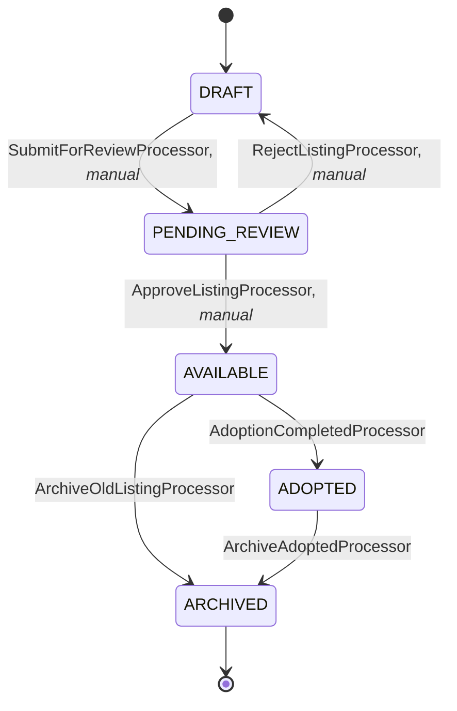
```mermaid
stateDiagram-v2
    [*] --> DRAFT
    DRAFT --> PENDING_REVIEW : SubmitForReviewProcessor, *manual*
    PENDING_REVIEW --> AVAILABLE : ApproveListingProcessor, *manual*
    PENDING_REVIEW --> DRAFT : RejectListingProcessor, *manual*
    AVAILABLE --> ADOPTED : AdoptionCompletedProcessor
    AVAILABLE --> ARCHIVED : ArchiveOldListingProcessor
    ADOPTED --> ARCHIVED : ArchiveAdoptedProcessor
    ARCHIVED --> [*]
```

Processors and criteria for Pet:
- SubmitForReviewProcessor (pseudo Java):
  - validate listing fields (name, species, images)
  - set status = PENDING_REVIEW
  - persist and emit event
- ApproveListingProcessor:
  - check IsOwnerVerifiedCriterion
  - set status = AVAILABLE
  - set published timestamp
  - notify owner and subscribers
- RejectListingProcessor:
  - set status = DRAFT
  - record rejectionReason
  - notify owner
- AdoptionCompletedProcessor:
  - check IsPetAvailableCriterion
  - set status = ADOPTED
  - notify owner and requester
- ArchiveOldListingProcessor:
  - if lastUpdated older than threshold and status not AVAILABLE then set ARCHIVED

Example pseudo code
```
class ApproveListingProcessor implements Processor {
  void process(EntityContext ctx) {
    Pet pet = ctx.getEntity(Pet.class);
    if (!new IsOwnerVerifiedCriterion().test(pet)) {
      throw new BusinessException("owner not verified");
    }
    pet.status = "AVAILABLE";
    pet.updatedAt = now();
    ctx.save(pet);
    ctx.emitEvent("PetMadeAvailable", pet);
  }
}
```

Pet criteria:
- IsOwnerVerifiedCriterion — checks User.verified == true
- IsPetAvailableCriterion — checks pet.status == AVAILABLE

User workflow:
1. Initial State: CREATED — User created via POST (signup)
2. Verification: Transition to VERIFIED — System or admin verifies identity (manual or automatic)
3. Active: VERIFIED users can perform actions (automatic after verification)
4. Suspended/Deleted: Manual admin actions

User state diagram

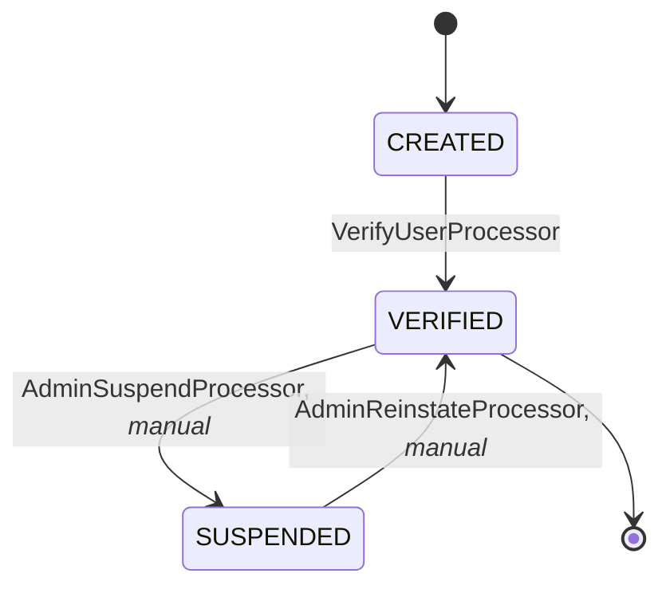
```mermaid
stateDiagram-v2
    [*] --> CREATED
    CREATED --> VERIFIED : VerifyUserProcessor
    VERIFIED --> SUSPENDED : AdminSuspendProcessor, *manual*
    SUSPENDED --> VERIFIED : AdminReinstateProcessor, *manual*
    VERIFIED --> [*]
```

Processors and criteria for User:
- VerifyUserProcessor:
  - send verification email/SMS
  - on callback set verified = true
- AdminSuspendProcessor / AdminReinstateProcessor:
  - manual admin actions to change role/state

AdoptionRequest workflow:
1. Initial State: REQUESTED — User creates AdoptionRequest (POST triggers event)
2. Pre-Validation: System runs checks (auto: pet availability, user verification)
3. Under Review: If pre-validation passes, request moves to UNDER_REVIEW (automatic)
4. Admin Decision:
   - APPROVED (manual) → triggers AdoptionApprovedProcessor
   - REJECTED (manual) → triggers AdoptionRejectedProcessor
5. Completion:
   - If APPROVED and adoption completed, mark COMPLETED and set Pet.ADOPTED (automatic)
   - If CANCELLED by user, mark CANCELLED (manual)
6. Failure: FAILED on system errors

AdoptionRequest state diagram

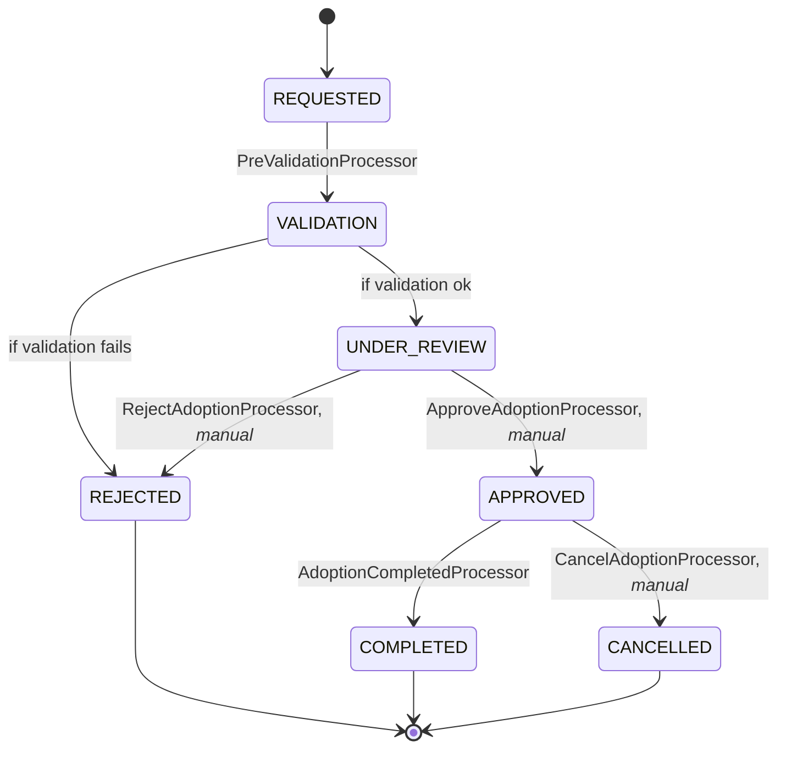
```mermaid
stateDiagram-v2
    [*] --> REQUESTED
    REQUESTED --> VALIDATION : PreValidationProcessor
    VALIDATION --> UNDER_REVIEW : if validation ok
    VALIDATION --> REJECTED : if validation fails
    UNDER_REVIEW --> APPROVED : ApproveAdoptionProcessor, *manual*
    UNDER_REVIEW --> REJECTED : RejectAdoptionProcessor, *manual*
    APPROVED --> COMPLETED : AdoptionCompletedProcessor
    APPROVED --> CANCELLED : CancelAdoptionProcessor, *manual*
    REJECTED --> [*]
    COMPLETED --> [*]
    CANCELLED --> [*]
```

Processors and criteria for AdoptionRequest:
- PreValidationProcessor:
  - check IsPetAvailableCriterion
  - check IsUserVerifiedCriterion
  - if fails set status REJECTED and record reasons
- ApproveAdoptionProcessor:
  - manual admin approval
  - set status = APPROVED
  - emit event AdoptionApproved
- AdoptionCompletedProcessor:
  - set AdoptionRequest.status = COMPLETED
  - set Pet.status = ADOPTED using AdoptionCompletedProcessor
  - notify both parties

Example pseudo code
```
class PreValidationProcessor implements Processor {
  void process(EntityContext ctx) {
    AdoptionRequest req = ctx.getEntity(AdoptionRequest.class);
    if (!new IsPetAvailableCriterion().test(req.petId)) {
      req.status = "REJECTED";
      req.notes = "pet not available";
      ctx.save(req);
      return;
    }
    if (!new IsUserVerifiedCriterion().test(req.requesterUserId)) {
      req.status = "REJECTED";
      req.notes = "user not verified";
      ctx.save(req);
      return;
    }
    req.status = "UNDER_REVIEW";
    ctx.save(req);
    ctx.emitEvent("AdoptionRequestUnderReview", req);
  }
}
```

Category workflow:
1. Initial State: CREATED
2. Active: Admin marks category active
3. Deprecated: Manual deprecation (ARCHIVED)

Category state diagram

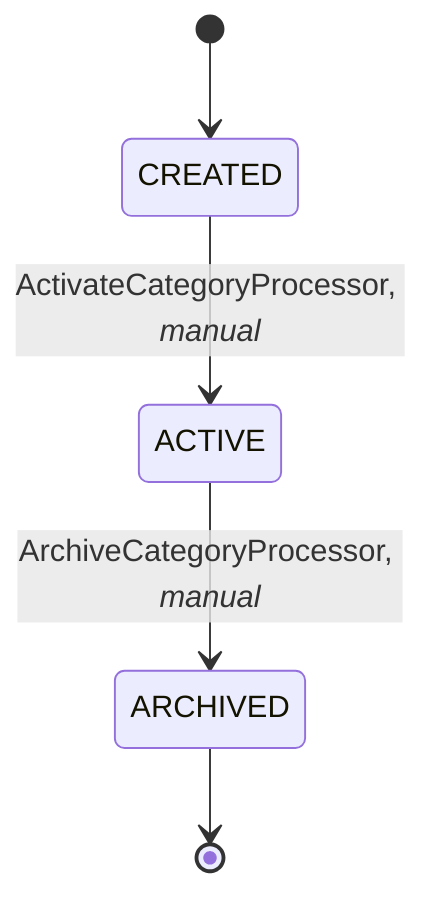
```mermaid
stateDiagram-v2
    [*] --> CREATED
    CREATED --> ACTIVE : ActivateCategoryProcessor, *manual*
    ACTIVE --> ARCHIVED : ArchiveCategoryProcessor, *manual*
    ARCHIVED --> [*]
```

Processors/criteria:
- ActivateCategoryProcessor: validate no conflicts
- ArchiveCategoryProcessor: check no active pet references (CategoryInUseCriterion)

Review workflow:
1. Initial State: SUBMITTED — User posts review (POST or process method)
2. Moderation: Auto-moderation checks (ProfanityCheckCriterion)
3. Published: If passes, PUBLISHED (automatic) else FLAGGED for manual review
4. Removed: Admin removes flagged reviews

Review state diagram

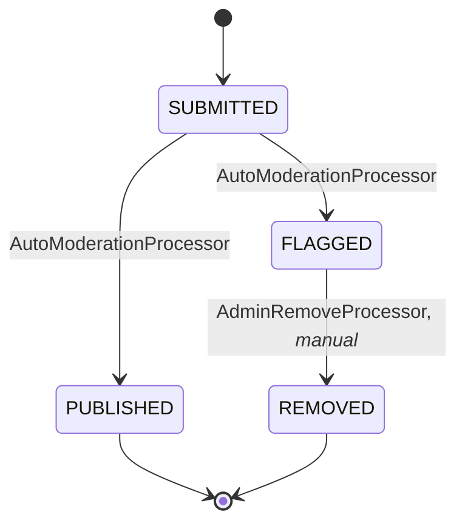
```mermaid
stateDiagram-v2
    [*] --> SUBMITTED
    SUBMITTED --> PUBLISHED : AutoModerationProcessor
    SUBMITTED --> FLAGGED : AutoModerationProcessor
    FLAGGED --> REMOVED : AdminRemoveProcessor, *manual*
    PUBLISHED --> [*]
    REMOVED --> [*]
```

Processors/criteria:
- AutoModerationProcessor: ProfanityCheckCriterion, SpamCriterion
- AdminRemoveProcessor: manual deletion

Shelter workflow:
1. Initial State: CREATED
2. Verified: Admin verifies shelter
3. Active: Shelters can host listings
4. Inactive/Archived: Manual/cleanup

Shelter state diagram

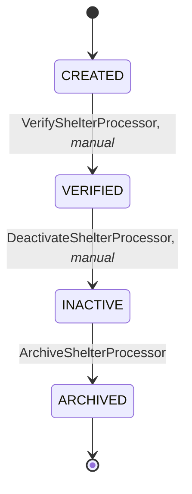
```mermaid
stateDiagram-v2
    [*] --> CREATED
    CREATED --> VERIFIED : VerifyShelterProcessor, *manual*
    VERIFIED --> INACTIVE : DeactivateShelterProcessor, *manual*
    INACTIVE --> ARCHIVED : ArchiveShelterProcessor
    ARCHIVED --> [*]
```

Processors/criteria:
- VerifyShelterProcessor: check contact, location validation
- DeactivateShelterProcessor: manual admin

Appointment workflow:
1. Initial State: REQUESTED — User requests appointment (POST triggers event)
2. Pre-check: Check pet availability and schedule conflicts (automatic)
3. Confirmed: Owner/admin confirms (manual)
4. Completed or Cancelled: After scheduled time or cancellation

Appointment state diagram

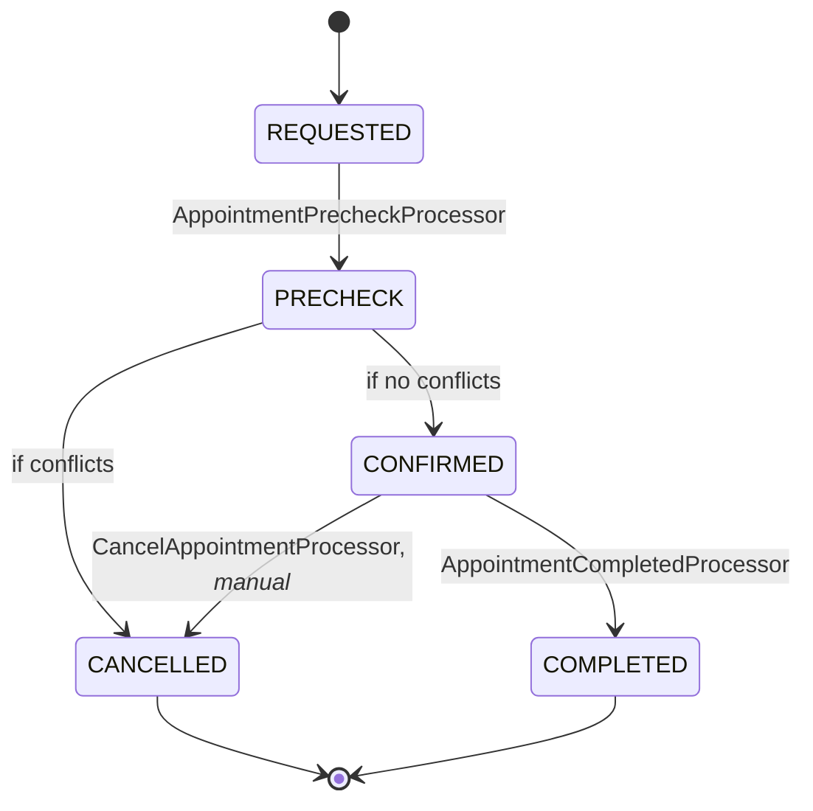
```mermaid
stateDiagram-v2
    [*] --> REQUESTED
    REQUESTED --> PRECHECK : AppointmentPrecheckProcessor
    PRECHECK --> CONFIRMED : if no conflicts
    PRECHECK --> CANCELLED : if conflicts
    CONFIRMED --> COMPLETED : AppointmentCompletedProcessor
    CONFIRMED --> CANCELLED : CancelAppointmentProcessor, *manual*
    CANCELLED --> [*]
    COMPLETED --> [*]
```

Processors/criteria:
- AppointmentPrecheckProcessor: check schedule conflicts, IsPetAvailableCriterion
- AppointmentCompletedProcessor: record attendance, emit events for followup

Favorite workflow:
1. Initial State: CREATED — User favorites a pet (POST)
2. Active: persisted; used for notifications and lists
3. Removed: User unfavorites (manual)

Favorite state diagram

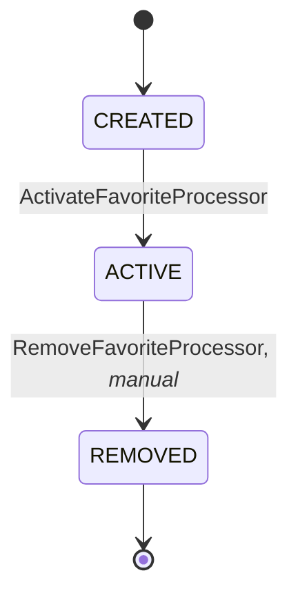
```mermaid
stateDiagram-v2
    [*] --> CREATED
    CREATED --> ACTIVE : ActivateFavoriteProcessor
    ACTIVE --> REMOVED : RemoveFavoriteProcessor, *manual*
    REMOVED --> [*]
```

Processors/criteria:
- ActivateFavoriteProcessor: ensure no duplicate favorites
- RemoveFavoriteProcessor: manual removal

Job workflow (orchestration entity for ingestion and batch tasks):
1. Initial State: PENDING — Job created via POST (e.g., INGEST_PETSTORE_DATA)
2. Validation: Validate job parameters (automatic)
3. Running: Execute processors (automatic)
4. Success/Failure: COMPLETED or FAILED depending on outcome
5. Notifications/Side effects: Emit events (automatic)

Job state diagram

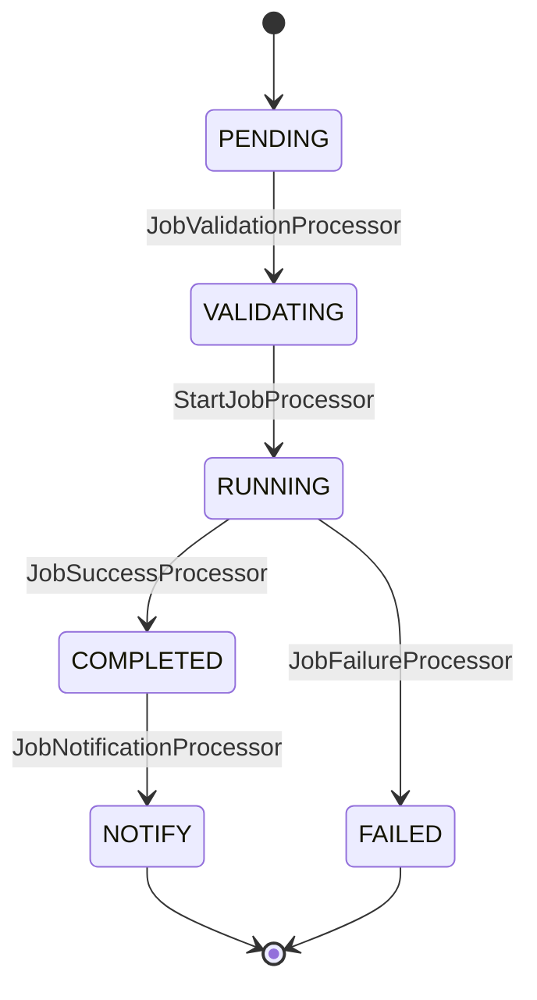
```mermaid
stateDiagram-v2
    [*] --> PENDING
    PENDING --> VALIDATING : JobValidationProcessor
    VALIDATING --> RUNNING : StartJobProcessor
    RUNNING --> COMPLETED : JobSuccessProcessor
    RUNNING --> FAILED : JobFailureProcessor
    COMPLETED --> NOTIFY : JobNotificationProcessor
    NOTIFY --> [*]
    FAILED --> [*]
```

Processors and criteria for Job:
- JobValidationProcessor: ensures parameters exist; for INGEST_PETSTORE_DATA ensure parameters.sourceUrl or use default Petstore API
- StartJobProcessor: branch by jobType:
  - INGEST_PETSTORE_DATA: call external Petstore API, transform data into Pet entities, persist each Pet (persistence triggers Pet workflow)
  - SEND_NOTIFICATIONS: batch send messages
  - CLEANUP: run archival processors
- JobSuccessProcessor / JobFailureProcessor: set status and resultSummary
- JobNotificationProcessor: summarize job and notify admin

Example pseudo code for INGEST job
```
class PetstoreIngestProcessor implements Processor {
  void process(EntityContext ctx) {
    Job job = ctx.getEntity(Job.class);
    String source = job.parameters.getOrDefault("sourceUrl","https://petstore.swagger.io/v2/pet");
    List<Map> items = fetchFromPetstore(source);
    for (Map item : items) {
      Pet p = transformToPet(item);
      persistEntity(p); // persistence triggers Pet workflow and will create technicalId
    }
    job.status = "COMPLETED";
    job.resultSummary = "ingested " + items.size();
    ctx.save(job);
  }
}
```

Criteria used for Job:
- HasRequiredParametersCriterion
- ExternalEndpointReachableCriterion

---

### API Endpoints Design (rules applied)
- POST endpoints: creating an entity triggers an event; POST must return only technicalId.
- GET endpoints: ONLY for retrieving stored application results (GET by technicalId required for all entities created via POST).
- GET by condition: provided only if explicitly requested by user (not added by default).
- If an orchestration entity exists (Job) it has POST and GET by technicalId.
- Business logic: Any external data fetch or batch processing should be triggered via POST Job endpoints (e.g., INGEST_PETSTORE_DATA).

API endpoints proposed (per entity created via client calls):
- POST /jobs
  - Creates Job (orchestration) — returns technicalId only
  - GET /jobs/{technicalId} — retrieves job result/status
- POST /pets
  - Creates Pet listing (owner listing) — returns technicalId only (creates domain Pet entity and triggers Pet workflow)
  - GET /pets/{technicalId} — retrieve persisted Pet record
- POST /users
  - Creates User — returns technicalId only
  - GET /users/{technicalId} — retrieve persisted User record
- POST /adoptionRequests
  - Creates AdoptionRequest — returns technicalId only
  - GET /adoptionRequests/{technicalId} — retrieve persisted AdoptionRequest record
- POST /appointments
  - Creates Appointment — returns technicalId only
  - GET /appointments/{technicalId} — retrieve persisted Appointment
- POST /favorites
  - Creates Favorite — returns technicalId only
  - GET /favorites/{technicalId} — retrieve persisted Favorite
- GET endpoints for read-only collections (optional):
  - GET /pets?status=AVAILABLE (optional GET all)
  - GET /users/{technicalId}
  - GET /jobs/{technicalId}

Note: Category, Review, Shelter may be created via POST as needed. If you want POST endpoints for them, they will follow the same rule (return only technicalId and have GET by technicalId).

Request/Response Formats (JSON)

- POST /jobs
  - Request:
    {
      "jobType": "INGEST_PETSTORE_DATA",
      "parameters": {
        "sourceUrl": "https://petstore.swagger.io/v2/pet",
        "batchSize": 100
      }
    }
  - Response:
    {
      "technicalId": "job-<uuid>"
    }

- GET /jobs/{technicalId}
  - Response:
    {
      "technicalId": "job-<uuid>",
      "id": "<job domain id>",
      "jobType": "INGEST_PETSTORE_DATA",
      "parameters": {...},
      "status": "COMPLETED",
      "startedAt": "<ISO8601>",
      "finishedAt": "<ISO8601>",
      "resultSummary": "ingested 123 pets"
    }

- POST /pets
  - Request:
    {
      "id": "pet-123",
      "name": "Mittens",
      "species": "cat",
      "breed": "Tabby",
      "ageMonths": 18,
      "gender": "female",
      "images": ["https://.../img1.jpg"],
      "tags": ["playful","indoor"],
      "description": "Loves naps",
      "shelterId": "shelter-1",
      "ownerUserId": "user-42"
    }
  - Response:
    {
      "technicalId": "petrec-<uuid>"
    }

- GET /pets/{technicalId}
  - Response:
    {
      "technicalId": "petrec-<uuid>",
      "id": "pet-123",
      "name": "Mittens",
      "species": "cat",
      "breed": "Tabby",
      "ageMonths": 18,
      "gender": "female",
      "status": "AVAILABLE",
      "images": [...],
      "tags": [...],
      "description": "...",
      "shelterId": "shelter-1",
      "ownerUserId": "user-42",
      "createdAt": "...",
      "updatedAt": "..."
    }

- POST /users
  - Request:
    {
      "id": "user-42",
      "name": "Alice",
      "email": "alice@example.com",
      "phone": "+1555123456",
      "address": "123 Pet Lane",
      "role": "owner"
    }
  - Response:
    {
      "technicalId": "userrec-<uuid>"
    }

- GET /users/{technicalId}
  - Response:
    {
      "technicalId": "userrec-<uuid>",
      "id": "user-42",
      "name": "Alice",
      "email": "alice@example.com",
      "phone": "...",
      "address": "...",
      "role": "owner",
      "verified": false,
      "createdAt": "...",
      "updatedAt": "..."
    }

- POST /adoptionRequests
  - Request:
    {
      "id": "req-1",
      "petId": "pet-123",
      "requesterUserId": "user-99",
      "notes": "I have a fenced yard"
    }
  - Response:
    {
      "technicalId": "adoptreq-<uuid>"
    }

- GET /adoptionRequests/{technicalId}
  - Response:
    {
      "technicalId": "adoptreq-<uuid>",
      "id": "req-1",
      "petId": "pet-123",
      "requesterUserId": "user-99",
      "status": "UNDER_REVIEW",
      "notes": "...",
      "createdAt": "...",
      "updatedAt": "..."
    }

- POST /appointments
  - Request:
    {
      "id": "appt-1",
      "petId": "pet-123",
      "userId": "user-99",
      "type": "meet",
      "scheduledAt": "2025-09-01T10:00:00Z",
      "notes": "Short meet and greet"
    }
  - Response:
    {
      "technicalId": "appt-<uuid>"
    }

- GET /appointments/{technicalId}
  - Response:
    {
      "technicalId": "appt-<uuid>",
      "id": "appt-1",
      "petId": "pet-123",
      "userId": "user-99",
      "type": "meet",
      "scheduledAt": "...",
      "status": "CONFIRMED",
      "createdAt": "...",
      "updatedAt": "..."
    }

- POST /favorites
  - Request:
    {
      "id": "fav-1",
      "petId": "pet-123",
      "userId": "user-99"
    }
  - Response:
    {
      "technicalId": "fav-<uuid>"
    }

- GET /favorites/{technicalId}
  - Response:
    {
      "technicalId": "fav-<uuid>",
      "id": "fav-1",
      "petId": "pet-123",
      "userId": "user-99",
      "createdAt": "..."
    }

Visualize request/response flows using Mermaid (examples)

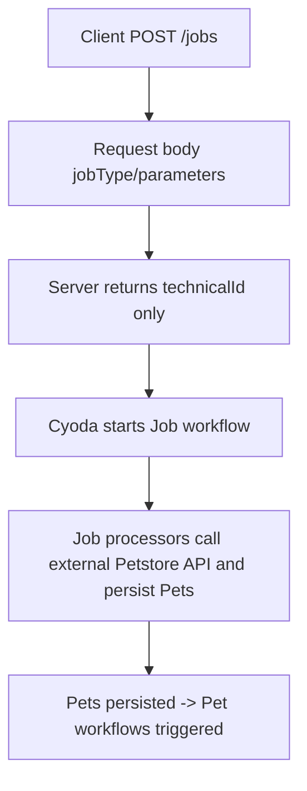
```mermaid
flowchart TD
    A["Client POST /jobs"] --> B["Request body jobType/parameters"]
    B --> C["Server returns technicalId only"]
    C --> D["Cyoda starts Job workflow"]
    D --> E["Job processors call external Petstore API and persist Pets"]
    E --> F["Pets persisted -> Pet workflows triggered"]
```

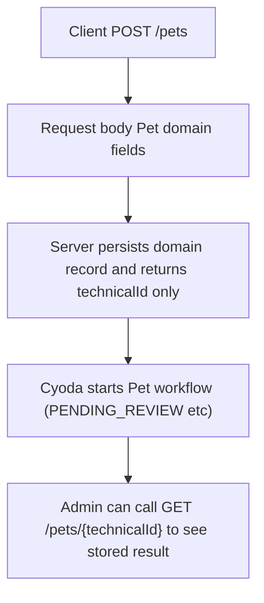
```mermaid
flowchart TD
    A["Client POST /pets"] --> B["Request body Pet domain fields"]
    B --> C["Server persists domain record and returns technicalId only"]
    C --> D["Cyoda starts Pet workflow (PENDING_REVIEW etc)"]
    D --> E["Admin can call GET /pets/{technicalId} to see stored result"]
```

Implementation notes and mapping to EDA concepts:
- Every POST that persists an entity emits an event. Cyoda (or equivalent orchestration runner) will invoke the entity.process method (represented by the processors above).
- The heavy lifting (validation, external calls, transformations) occurs inside processors triggered by persistence events.
- Orchestration Job is the recommended way to call external APIs (Petstore API) and perform bulk ingestion. The Job should fetch, transform, and persist Pet domain objects; each Pet persistence triggers its own workflow.
- Processor and Criterion classes are implemented in Java (example pseudo code provided). Use a Processor interface and Criterion interface:
  - interface Processor { void process(EntityContext ctx); }
  - interface Criterion { boolean test(EntityContext ctx); }
- All POST endpoints return only a technicalId in the response. The technicalId is the datastore record id that maps to the persisted entity and is used for subsequent GET calls.

Required Java classes (high level list):
- Processors:
  - SubmitForReviewProcessor
  - ApproveListingProcessor
  - RejectListingProcessor
  - AdoptionCompletedProcessor
  - PreValidationProcessor
  - ApproveAdoptionProcessor
  - PetstoreIngestProcessor (used by Job)
  - JobValidationProcessor
  - StartJobProcessor
  - JobSuccessProcessor
  - JobFailureProcessor
  - AppointmentPrecheckProcessor
  - AutoModerationProcessor
- Criteria:
  - IsOwnerVerifiedCriterion
  - IsPetAvailableCriterion
  - HasRequiredParametersCriterion
  - ExternalEndpointReachableCriterion
  - ProfanityCheckCriterion
  - CategoryInUseCriterion

Persistence and event model:
- Persist domain entity -> persistence layer returns technicalId -> system emits EntityCreated event (technicalId + entity type) -> Cyoda picks up event and starts corresponding workflow (invoking processors/criteria).
- GET endpoints read persisted results by technicalId.

Security and roles:
- Enforce role checks in processors where manual actions are required (ApproveListingProcessor must verify admin role).
- Sensitive operations (user verification, admin approve/reject) are manual transitions and require authentication/authorization.

Please review the generated entities and workflows. If you need any changes, please let me know. Feel free to click Approve if this requirement meets your expectations or if you are ready to proceed.