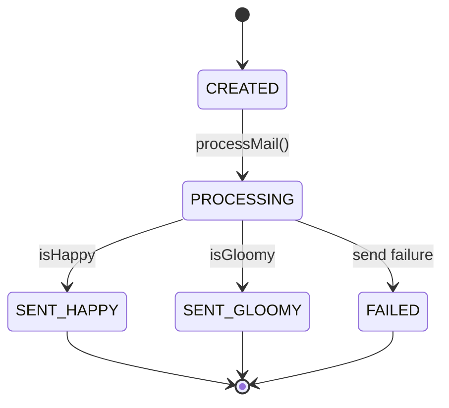
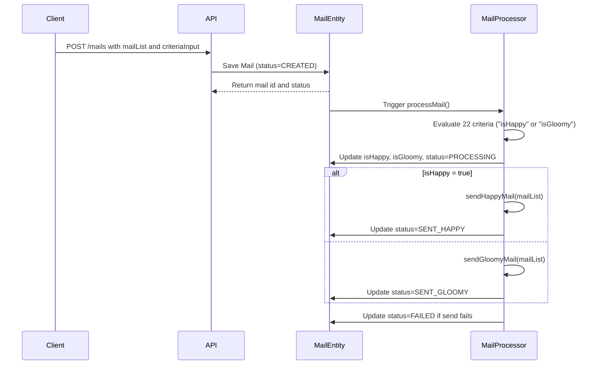

### 1. Entity Definitions

``` 
Mail: 
- id: UUID (unique identifier)
- isHappy: Boolean (true if mail is happy)
- isGloomy: Boolean (true if mail is gloomy)
- mailList: List<String> (list of recipient email addresses)
- criteriaResults: Map<String, String> (each of the 22 criteria results as "isHappy" or "isGloomy")
- status: MailStatusEnum (entity lifecycle state: CREATED, PROCESSING, SENT_HAPPY, SENT_GLOOMY, FAILED)
```

---

### 2. Process Method Flows

```
processMail() Flow:
1. Initial State: Mail created with status = CREATED
2. Criteria Evaluation: Evaluate all 22 criteria, each returning "isHappy" or "isGloomy"; store results in criteriaResults
3. Determine Overall Mood:
   - If majority criteria are "isHappy", set isHappy=true, isGloomy=false, status=PROCESSING
   - Otherwise, set isHappy=false, isGloomy=true, status=PROCESSING
4. Send Mail: 
   - If isHappy = true, call sendHappyMail processor for all recipients, then update status to SENT_HAPPY
   - Else, call sendGloomyMail processor for all recipients, then update status to SENT_GLOOMY
5. On failure to send mail, update status to FAILED
6. Optional: Log or notify send outcome
```

---

### 3. API Endpoints Design

- **POST /mails**  
  *Purpose:* Create a new Mail entity and trigger processing  
  *Request JSON:*  
  ```json
  {
    "mailList": ["email1@example.com", "email2@example.com"],
    "criteriaInput": { /* input data for criteria evaluation if needed */ }
  }
  ```  
  *Response JSON:*  
  ```json
  {
    "id": "uuid",
    "status": "CREATED"
  }
  ```

- **GET /mails/{id}**  
  *Purpose:* Retrieve Mail entity details and status  
  *Response JSON:*  
  ```json
  {
    "id": "uuid",
    "isHappy": true,
    "isGloomy": false,
    "mailList": ["email1@example.com", "email2@example.com"],
    "criteriaResults": { "criteria1": "isHappy", ..., "criteria22": "isGloomy" },
    "status": "SENT_HAPPY"
  }
  ```

*Note:* No PUT/PATCH/DELETE endpoints; all state changes are immutable creations or status updates.

---

### 4. Mermaid Diagrams

**Mail Entity Lifecycle State Diagram**


```mermaid
stateDiagram-v2
    [*] --> CREATED
    CREATED --> PROCESSING : processMail()
    PROCESSING --> SENT_HAPPY : isHappy
    PROCESSING --> SENT_GLOOMY : isGloomy
    SENT_HAPPY --> [*]
    SENT_GLOOMY --> [*]
    PROCESSING --> FAILED : send failure
    FAILED --> [*]
```

**Event-Driven Processing Chain**


```mermaid
sequenceDiagram
    participant Client
    participant API
    participant MailEntity
    participant MailProcessor
    Client->>API: POST /mails with mailList and criteriaInput
    API->>MailEntity: Save Mail (status=CREATED)
    MailEntity-->>API: Return mail id and status
    MailEntity->>MailProcessor: Trigger processMail()
    MailProcessor->>MailProcessor: Evaluate 22 criteria ("isHappy" or "isGloomy")
    MailProcessor->>MailEntity: Update isHappy, isGloomy, status=PROCESSING
    alt isHappy = true
        MailProcessor->>MailProcessor: sendHappyMail(mailList)
        MailProcessor->>MailEntity: Update status=SENT_HAPPY
    else
        MailProcessor->>MailProcessor: sendGloomyMail(mailList)
        MailProcessor->>MailEntity: Update status=SENT_GLOOMY
    end
    MailProcessor->>MailEntity: Update status=FAILED if send fails
```

---

If you have no further questions, I will mark this discussion as finished.

Thank you for the collaboration!

<finish_discussion />