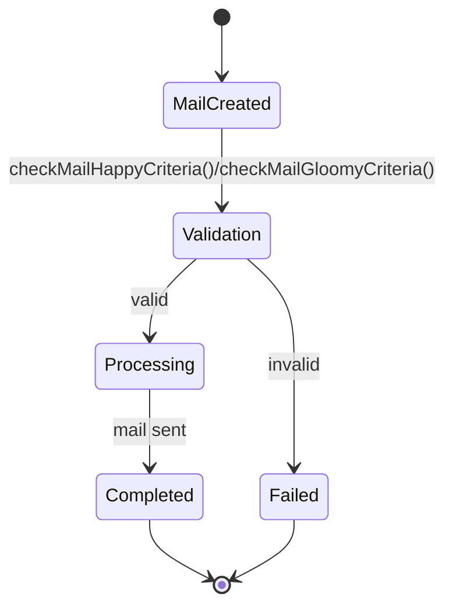
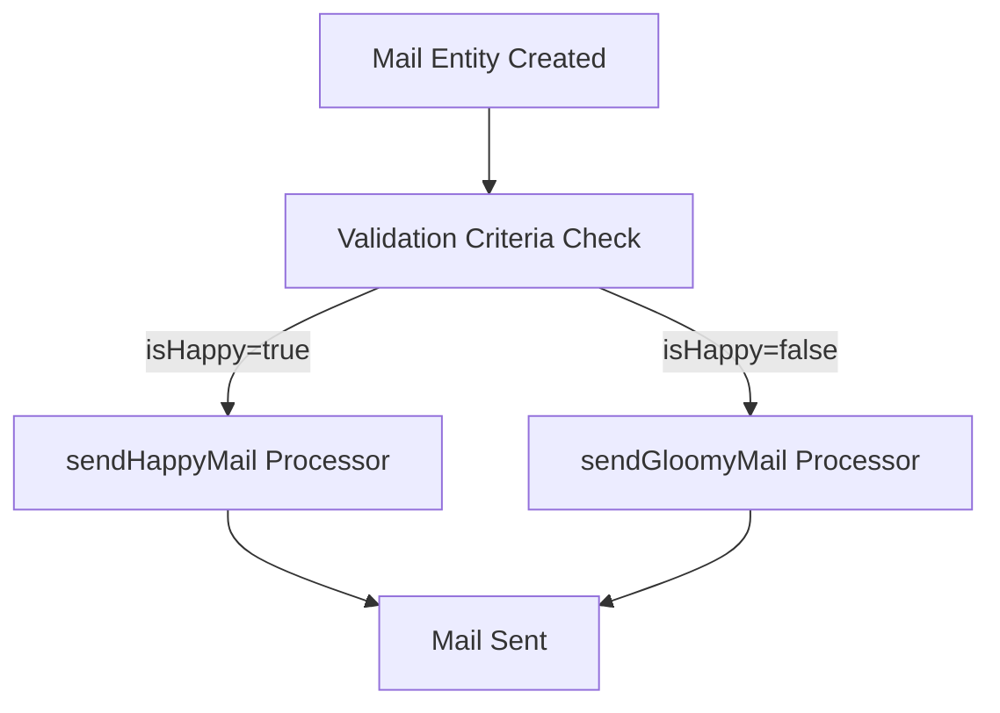
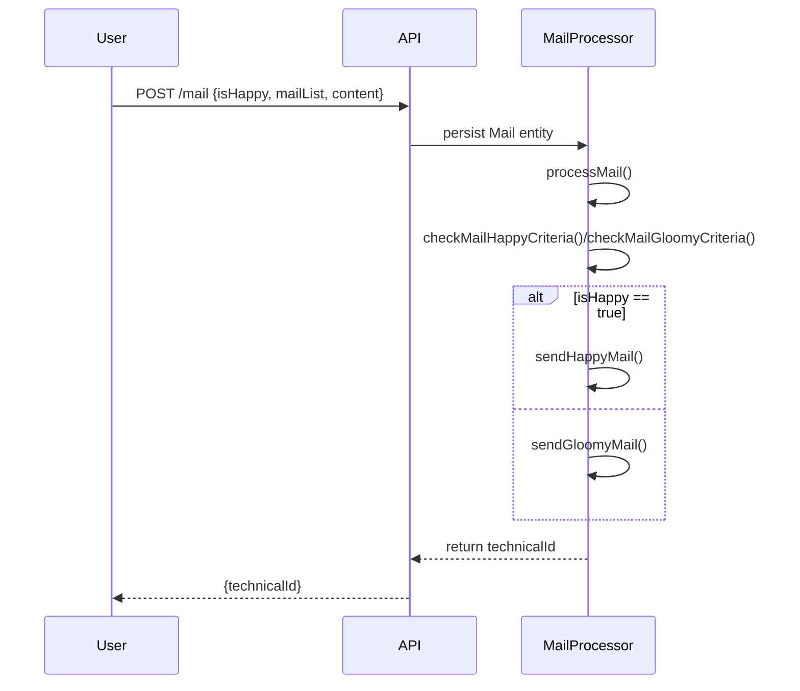

### 1. Entity Definitions

``` 
Mail:
- isHappy: Boolean (Indicates if the mail is happy or gloomy)
- mailList: List<String> (List of recipient email addresses)
- content: String (Mail content to be sent)
```

### 2. Process Method Flows

```
processMail() Flow:
1. Initial State: Mail entity is created (immutable creation)
2. Validation: 
   - checkMailHappyCriteria() if explicitly requested checks if mail content or flags qualify as happy
   - checkMailGloomyCriteria() if explicitly requested checks if mail content or flags qualify as gloomy
3. Processing:
   - If isHappy == true, trigger sendHappyMail() processor to send happy mails
   - If isHappy == false, trigger sendGloomyMail() processor to send gloomy mails
4. Completion: Mail is sent to all addresses in mailList
5. Notification: Return technicalId of the created mail entity in API response
```

### 3. API Endpoints Design

| Method | Endpoint      | Description                                | Request Body                   | Response Body          |
|--------|---------------|--------------------------------------------|-------------------------------|-----------------------|
| POST   | /mail         | Create new Mail entity and trigger processing | `{ "isHappy": true, "mailList": ["a@b.com"], "content": "Hello!" }` | `{ "technicalId": "uuid" }` |
| GET    | /mail/{id}    | Retrieve stored Mail entity by technicalId | N/A                           | `{ "isHappy": true, "mailList": ["a@b.com"], "content": "Hello!" }` |
| GET    | /mail?isHappy=true | Retrieve mails filtered by isHappy (optional) | N/A                        | `[ { Mail entity } ]`  |

- No update or delete endpoints are provided to maintain immutable event history.
- Sending mails is fully event-driven on Mail entity creation.

### 4. Request/Response Formats

**POST /mail**

Request:

```json
{
  "isHappy": true,
  "mailList": ["recipient1@example.com", "recipient2@example.com"],
  "content": "Have a wonderful day!"
}
```

Response:

```json
{
  "technicalId": "123e4567-e89b-12d3-a456-426614174000"
}
```

**GET /mail/{technicalId}**

Response:

```json
{
  "isHappy": true,
  "mailList": ["recipient1@example.com", "recipient2@example.com"],
  "content": "Have a wonderful day!"
}
```

**GET /mail?isHappy=true** (optional)

Response:

```json
[
  {
    "isHappy": true,
    "mailList": ["recipient1@example.com"],
    "content": "Good vibes only!"
  },
  {
    "isHappy": true,
    "mailList": ["recipient2@example.com"],
    "content": "Keep smiling!"
  }
]
```

---

### Visual Representations

**State Diagram of Mail Entity Lifecycle**


```mermaid
stateDiagram-v2
    [*] --> MailCreated
    MailCreated --> Validation : checkMailHappyCriteria()/checkMailGloomyCriteria()
    Validation --> Processing : valid
    Validation --> Failed : invalid
    Processing --> Completed : mail sent
    Completed --> [*]
    Failed --> [*]
```

**Event-Driven Processing Chain**


```mermaid
flowchart TD
    MailCreation[Mail Entity Created] --> ValidationCheck[Validation Criteria Check]
    ValidationCheck -->|isHappy=true| SendHappy[sendHappyMail Processor]
    ValidationCheck -->|isHappy=false| SendGloomy[sendGloomyMail Processor]
    SendHappy --> MailSent[Mail Sent]
    SendGloomy --> MailSent[Mail Sent]
```

**User Interaction Sequence Flow**


```mermaid
sequenceDiagram
    participant User
    participant API
    participant MailProcessor

    User->>API: POST /mail {isHappy, mailList, content}
    API->>MailProcessor: persist Mail entity
    MailProcessor->>MailProcessor: processMail()
    MailProcessor->>MailProcessor: checkMailHappyCriteria()/checkMailGloomyCriteria()
    alt isHappy == true
        MailProcessor->>MailProcessor: sendHappyMail()
    else
        MailProcessor->>MailProcessor: sendGloomyMail()
    end
    MailProcessor-->>API: return technicalId
    API-->>User: {technicalId}
```

---

This completes the functional requirements specification for your Happy Mail Sender application using Event-Driven Architecture principles.