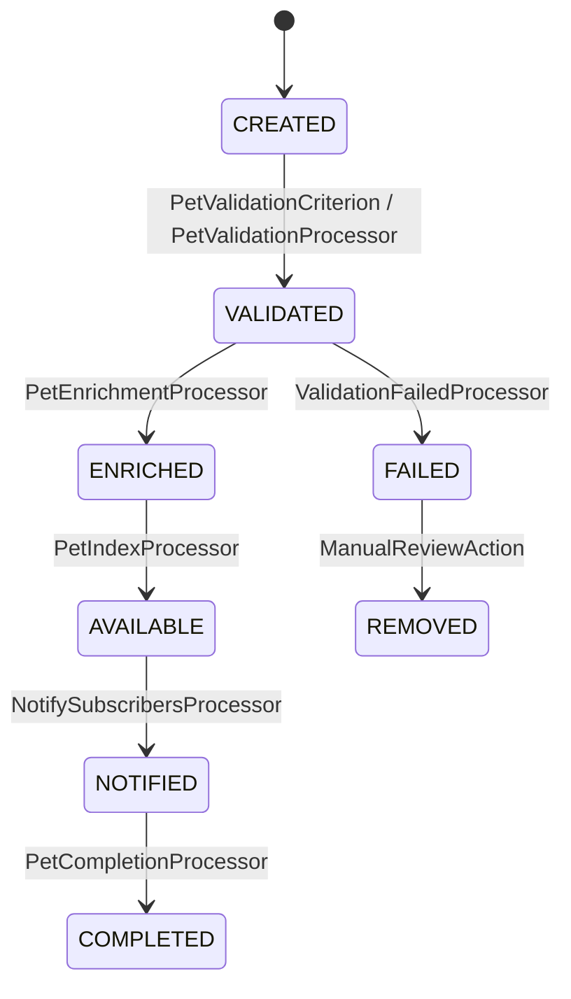
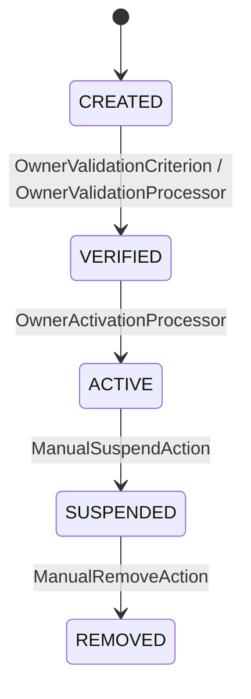
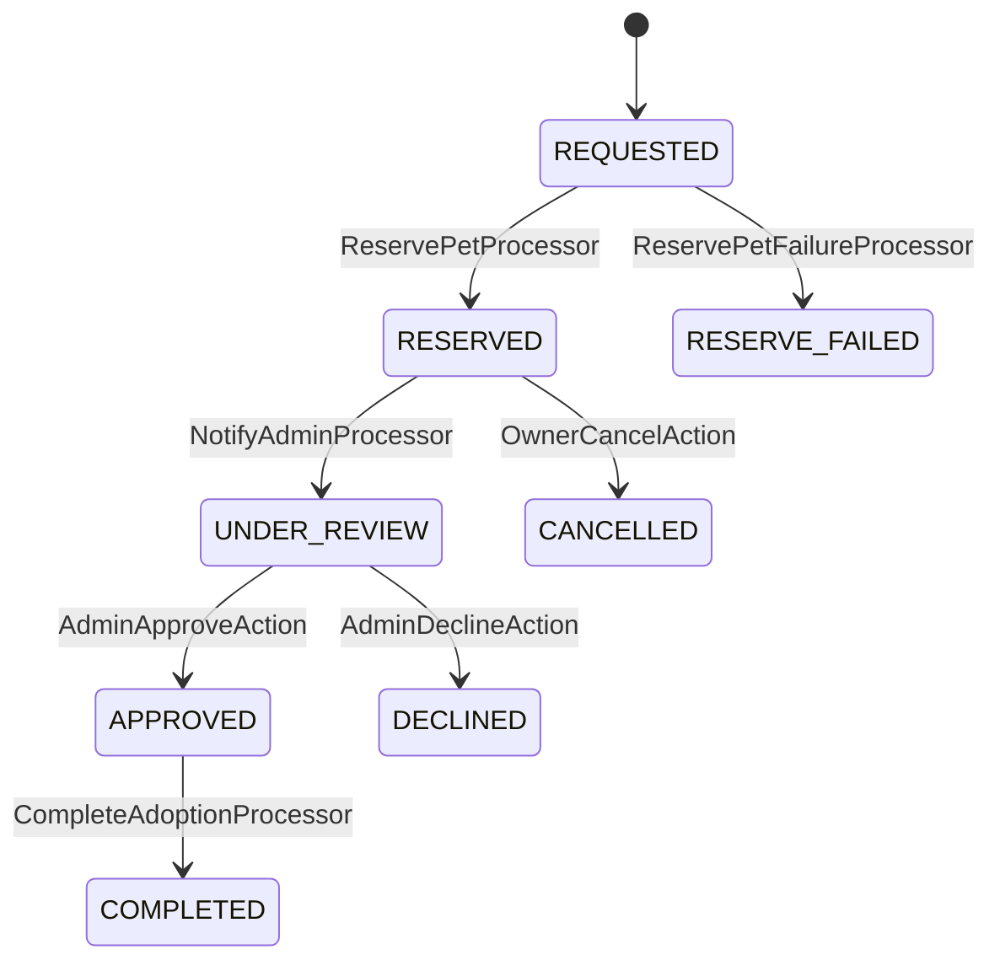
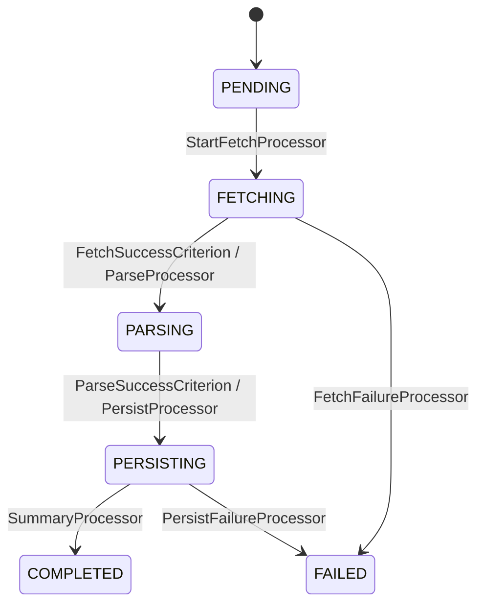

### 1. Entity Definitions
```
Pet:
- id: String (domain id from source if present)
- name: String (pet name)
- species: String (cat/dog/etc)
- breed: String (breed description)
- age: Integer (years or months as integer)
- gender: String (male/female/unknown)
- color: String (visual color)
- description: String (free text)
- photos: Array(String) (URLs)
- status: String (available/pending/adopted/removed)
- location: String (shelter or city)
- tags: Array(String) (features for filtering)
- source_metadata: Object (raw source info)

Owner:
- id: String (external id if any)
- name: String (owner full name)
- email: String (contact email)
- phone: String (contact phone)
- address: String (postal address)
- favorites: Array(String) (pet ids)
- role: String (user/admin/staff)
- verified: Boolean (contact verified flag)

AdoptionRequest:
- id: String (domain id)
- pet_id: String (target pet)
- owner_id: String (requesting owner)
- request_date: String (ISO timestamp)
- status: String (requested/under_review/approved/declined/completed/cancelled)
- notes: String (applicant notes)
- preferred_pickup_date: String (ISO date)
- decision_by: String (admin id)
- decision_date: String (ISO timestamp)

PetSyncJob:
- id: String (job id)
- source: String (Petstore or other source)
- start_time: String (ISO timestamp)
- end_time: String (ISO timestamp)
- status: String (pending/fetching/parsing/persisting/completed/failed)
- fetched_count: Integer (number of pets fetched)
- error_message: String (if failed)
- config: Object (filters, paging, mapping rules)
```

Note: up to 10 entities allowed. I used 4 to represent domain and orchestration (PetSyncJob) so Petstore ingestion is captured. Tell me if you want fewer or more.

### 2. Entity workflows

Pet workflow:
1. Initial State: Pet persisted (created by PetSyncJob or manual ingest) -> CREATED
2. Validation: System runs validation on essential fields -> VALIDATED or FAILED
3. Enrichment: Enrich with tags, normalize breed, link source_metadata -> ENRICHED
4. Publishing: Index and mark availability -> AVAILABLE or PENDING (if adoption reserved)
5. Notification: Notify subscribers on newly AVAILABLE pets -> NOTIFIED
6. Terminal: COMPLETED (stable) or REMOVED


```mermaid
stateDiagram-v2
    [*] --> CREATED
    CREATED --> VALIDATED : PetValidationCriterion / PetValidationProcessor
    VALIDATED --> ENRICHED : PetEnrichmentProcessor
    ENRICHED --> AVAILABLE : PetIndexProcessor
    AVAILABLE --> NOTIFIED : NotifySubscribersProcessor
    NOTIFIED --> COMPLETED : PetCompletionProcessor
    VALIDATED --> FAILED : ValidationFailedProcessor
    FAILED --> REMOVED : ManualReviewAction
```

Processors and criteria (Pet):
- Criteria: PetValidationCriterion
- Processors: PetValidationProcessor, PetEnrichmentProcessor, PetIndexProcessor, NotifySubscribersProcessor, PetCompletionProcessor

Owner workflow:
1. Initial State: Owner created via POST -> CREATED
2. Validation: Check contact/email uniqueness -> VERIFIED or ACTION_REQUIRED
3. Activation: After verification -> ACTIVE
4. Suspension/Removal: Manual admin actions -> SUSPENDED/REMOVED


```mermaid
stateDiagram-v2
    [*] --> CREATED
    CREATED --> VERIFIED : OwnerValidationCriterion / OwnerValidationProcessor
    VERIFIED --> ACTIVE : OwnerActivationProcessor
    ACTIVE --> SUSPENDED : ManualSuspendAction
    SUSPENDED --> REMOVED : ManualRemoveAction
```

Processors and criteria (Owner):
- Criteria: OwnerValidationCriterion
- Processors: OwnerValidationProcessor, SendVerificationProcessor, OwnerActivationProcessor

AdoptionRequest workflow:
1. Initial State: Request created by user -> REQUESTED
2. Auto-Reserve: Attempt to reserve pet if available -> RESERVED or RESERVE_FAILED
3. Review: Admin reviews request -> UNDER_REVIEW (manual)
4. Decision: Admin APPROVE -> APPROVED or DECLINE -> DECLINED
5. Completion: On approved pickup and confirmation -> COMPLETED
6. Cancellation: Owner can cancel before completion -> CANCELLED


```mermaid
stateDiagram-v2
    [*] --> REQUESTED
    REQUESTED --> RESERVED : ReservePetProcessor
    RESERVED --> UNDER_REVIEW : NotifyAdminProcessor
    UNDER_REVIEW --> APPROVED : AdminApproveAction
    UNDER_REVIEW --> DECLINED : AdminDeclineAction
    APPROVED --> COMPLETED : CompleteAdoptionProcessor
    REQUESTED --> RESERVE_FAILED : ReservePetFailureProcessor
    RESERVED --> CANCELLED : OwnerCancelAction
```

Processors and criteria (AdoptionRequest):
- Criteria: RequestValidationCriterion, PetAvailableCriterion
- Processors: RequestValidationProcessor, ReservePetProcessor, NotifyAdminProcessor, CompleteAdoptionProcessor, ReservePetFailureProcessor

PetSyncJob workflow (orchestration entity — POST to start):
1. Initial State: Job created -> PENDING
2. Fetching: Call Petstore API, gather payloads -> FETCHING
3. Parsing: Parse and map payloads to Pet entities -> PARSING
4. Persisting: Persist Pet entities (each Persist triggers Pet workflow) -> PERSISTING
5. Summary: Update fetched_count and finalize -> COMPLETED or FAILED


```mermaid
stateDiagram-v2
    [*] --> PENDING
    PENDING --> FETCHING : StartFetchProcessor
    FETCHING --> PARSING : FetchSuccessCriterion / ParseProcessor
    PARSING --> PERSISTING : ParseSuccessCriterion / PersistProcessor
    PERSISTING --> COMPLETED : SummaryProcessor
    PERSISTING --> FAILED : PersistFailureProcessor
    FETCHING --> FAILED : FetchFailureProcessor
```

Processors and criteria (PetSyncJob):
- Criteria: FetchSuccessCriterion, ParseSuccessCriterion
- Processors: StartFetchProcessor, ParseProcessor, PersistProcessor, SummaryProcessor, PersistFailureProcessor

### 3. Pseudo code for processor classes (high-level)

PetEnrichmentProcessor
```
class PetEnrichmentProcessor {
  process(pet) {
    // normalize breed to canonical form
    pet.breed = normalizeBreed(pet.breed)
    pet.tags = generateTags(pet)
    return pet
  }
}
```

PetValidationProcessor
```
class PetValidationProcessor {
  process(pet) {
    if missing(pet.name) or missing(pet.species) then throw ValidationError
    pet.status = pet.status or available
    return pet
  }
}
```

PersistProcessor (used by PetSyncJob)
```
class PersistProcessor {
  process(jobPayload) {
    for each item in jobPayload.items:
      pet = mapToPet(item)
      saved = saveEntity(pet) // persistence triggers Cyoda Pet workflow
      job.fetched_count++
    return jobSummary
  }
}
```

ReservePetProcessor
```
class ReservePetProcessor {
  process(request) {
    if pet.status != available then mark request as reserve_failed
    else set pet.status = pending
         link reservation to request.id
    return updated request
  }
}
```

StartFetchProcessor
```
class StartFetchProcessor {
  process(job) {
    response = fetch(job.config.sourceUrl)
    if response.success then emit parsed payload to ParseProcessor
    else mark job.failed with message
  }
}
```

(Other processors follow same pattern: validate inputs, act on domain objects, update state, produce events that trigger next processors.)

### 4. API Endpoints Design Rules

Rules applied:
- POST endpoints create events (return only technicalId)
- GET endpoints retrieve stored results
- POST endpoints present: PetSyncJob, Owner, AdoptionRequest
- GET by technicalId present for Pet, Owner, AdoptionRequest, PetSyncJob
- GET all optional: GET /pets supports listing with filters

Endpoints and JSON examples

1) Start a pet sync job (orchestration)
- POST /jobs/pet-sync
Request:
```json
{
  "source": "petstore",
  "config": {
    "sourceUrl": "https://petstore.example/api/pets",
    "filters": {"species": "cat"}
  }
}
```
Response (must return only technicalId):
```json
{
  "technicalId": "job_123456"
}
```
Retrieve job by technicalId:
- GET /jobs/{technicalId}
Response:
```json
{
  "technicalId": "job_123456",
  "id": "job_123456",
  "source": "petstore",
  "status": "completed",
  "fetched_count": 120,
  "start_time": "2025-08-20T10:00:00Z",
  "end_time": "2025-08-20T10:01:30Z",
  "error_message": null
}
```

2) Create Owner (user signup)
- POST /owners
Request:
```json
{
  "name": "Alex Smith",
  "email": "alex@example.com",
  "phone": "+1234567890",
  "address": "123 Cat Lane"
}
```
Response:
```json
{
  "technicalId": "owner_98765"
}
```
Retrieve owner:
- GET /owners/{technicalId}
Response:
```json
{
  "technicalId": "owner_98765",
  "id": "owner_98765",
  "name": "Alex Smith",
  "email": "alex@example.com",
  "verified": false,
  "favorites": []
}
```

3) Create Adoption Request
- POST /adoption-requests
Request:
```json
{
  "pet_id": "pet_555",
  "owner_id": "owner_98765",
  "preferred_pickup_date": "2025-09-01",
  "notes": "I have a fenced yard and other pets"
}
```
Response:
```json
{
  "technicalId": "req_222"
}
```
Retrieve adoption request:
- GET /adoption-requests/{technicalId}
Response:
```json
{
  "technicalId": "req_222",
  "id": "req_222",
  "pet_id": "pet_555",
  "owner_id": "owner_98765",
  "status": "under_review",
  "request_date": "2025-08-20T12:00:00Z"
}
```

4) Retrieve Pet
- GET /pets/{technicalId}
Response:
```json
{
  "technicalId": "pet_555",
  "id": "pet_555",
  "name": "Mittens",
  "species": "cat",
  "breed": "Tabby",
  "status": "available",
  "photos": ["https://.../1.jpg"]
}
```

Notes on API design:
- POST endpoints return only technicalId as required.
- Business entities (Pet) are primarily created/persisted by PetSyncJob process; they are retrievable via GET.
- AdoptionRequest POST triggers reservation processors and may change Pet status automatically via Cyoda workflows.
- All entity creations produce events in Cyoda that start their respective workflows.

Next steps / Questions for you
- Do you want Pet entities to also be creatable manually via POST (admin UI), or only via PetSyncJob?
- Who are primary actors (public user, registered owner, admin, shelter staff)? This affects manual transitions.
- Want automated expiring reservations after X days? If yes, what X?
Tell me which of the above you'd like changed or expanded (I can expand entities up to 10).