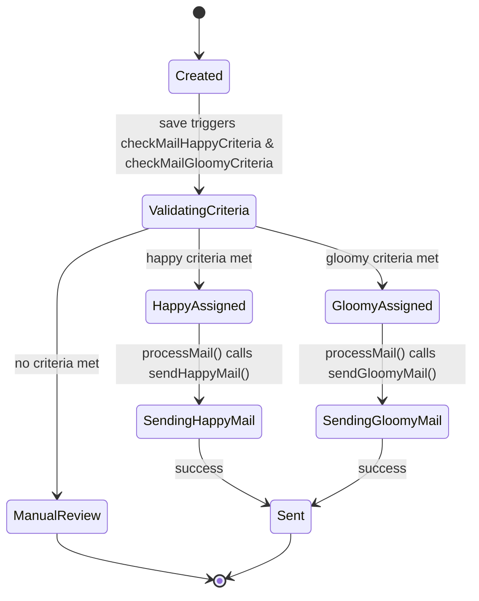
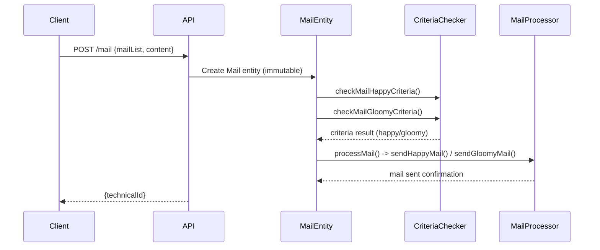
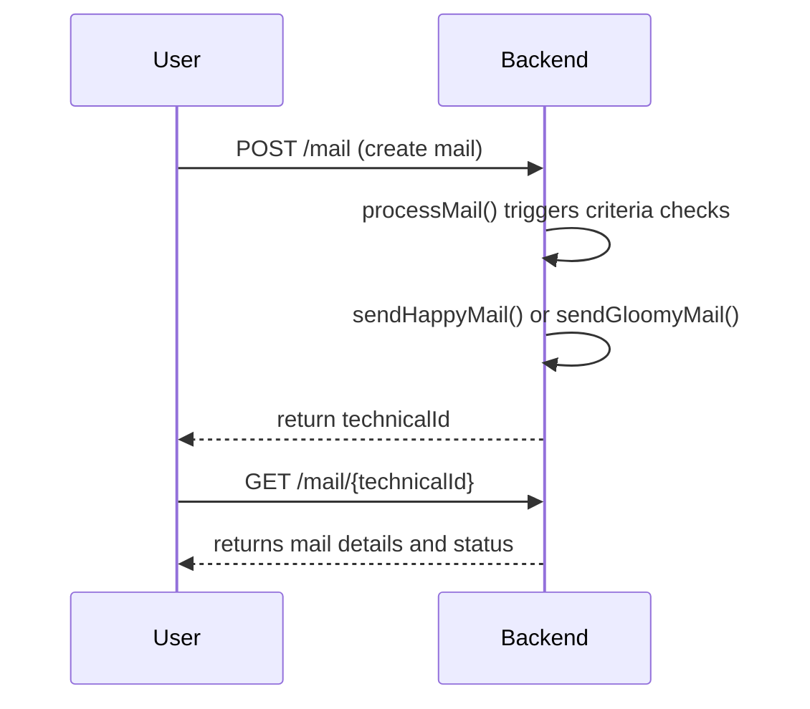

### 1. Entity Definitions

``` 
Mail:
- isHappy: Boolean (Indicates if mail is happy (true) or gloomy (false))
- mailList: List<String> (List of recipient email addresses)
- content: String (Mail content to be sent)
- moodCriteriaChecked: Boolean (Flag indicating if criteria validation has been performed)
```

---

### 2. Process Method Flows

```
processMail() Flow:
1. Initial State: Mail entity created with provided `content`, `mailList` and no `isHappy` assigned yet.
2. Validation: Trigger checkMailHappyCriteria() and checkMailGloomyCriteria() to evaluate mail mood.
3. Mood Assignment:
   - If happy criteria met → set isHappy = true
   - Else if gloomy criteria met → set isHappy = false
   - Else reject or flag mail for manual processing (optional).
4. Processing:
   - If isHappy == true → invoke sendHappyMail() processor to send happy mail.
   - If isHappy == false → invoke sendGloomyMail() processor to send gloomy mail.
5. Completion: Mark mail as processed, immutable state preserved.
6. Notification: (Optional) Log or notify of mail sending completion.
```

---

### 3. API Endpoints Design

- **POST /mail**  
  - Creates a new `Mail` entity (immutable creation).  
  - Triggers `processMail()` event automatically.  
  - Request body contains `mailList` and `content`.  
  - Response returns only `technicalId` of created Mail.

- **GET /mail/{technicalId}**  
  - Retrieves stored Mail entity and its final state (incl. `isHappy` and status).

- **GET /mail?isHappy=true|false** (optional, only if requested)  
  - Retrieves mails filtered by happy/gloomy status.

*No update or delete endpoints provided, following EDA immutability principle.*

---

### 4. Request / Response Formats

**POST /mail Request**

```json
{
  "mailList": ["recipient1@example.com", "recipient2@example.com"],
  "content": "Your friendly happy mail content here."
}
```

**POST /mail Response**

```json
{
  "technicalId": "generated-unique-id"
}
```

**GET /mail/{technicalId} Response**

```json
{
  "technicalId": "generated-unique-id",
  "mailList": ["recipient1@example.com", "recipient2@example.com"],
  "content": "Your friendly happy mail content here.",
  "isHappy": true,
  "moodCriteriaChecked": true,
  "status": "SENT"
}
```

---

### 5. Mermaid Diagrams

**Mail Entity Lifecycle**


```mermaid
stateDiagram-v2
    [*] --> Created
    Created --> ValidatingCriteria : save triggers checkMailHappyCriteria & checkMailGloomyCriteria
    ValidatingCriteria --> HappyAssigned : happy criteria met
    ValidatingCriteria --> GloomyAssigned : gloomy criteria met
    ValidatingCriteria --> ManualReview : no criteria met
    HappyAssigned --> SendingHappyMail : processMail() calls sendHappyMail()
    GloomyAssigned --> SendingGloomyMail : processMail() calls sendGloomyMail()
    SendingHappyMail --> Sent : success
    SendingGloomyMail --> Sent : success
    ManualReview --> [*]
    Sent --> [*]
```

**Event-Driven Processing Chain**


```mermaid
sequenceDiagram
    participant Client
    participant API
    participant MailEntity
    participant CriteriaChecker
    participant MailProcessor
    Client->>API: POST /mail {mailList, content}
    API->>MailEntity: Create Mail entity (immutable)
    MailEntity->>CriteriaChecker: checkMailHappyCriteria()
    MailEntity->>CriteriaChecker: checkMailGloomyCriteria()
    CriteriaChecker-->>MailEntity: criteria result (happy/gloomy)
    MailEntity->>MailProcessor: processMail() -> sendHappyMail() / sendGloomyMail()
    MailProcessor-->>MailEntity: mail sent confirmation
    API-->>Client: {technicalId}
```

**User Interaction Sequence**


```mermaid
sequenceDiagram
    participant User
    participant Backend
    User->>Backend: POST /mail (create mail)
    Backend->>Backend: processMail() triggers criteria checks
    Backend->>Backend: sendHappyMail() or sendGloomyMail()
    Backend-->>User: return technicalId
    User->>Backend: GET /mail/{technicalId}
    Backend-->>User: returns mail details and status
```

---

If you need any further clarifications or adjustments, please let me know!