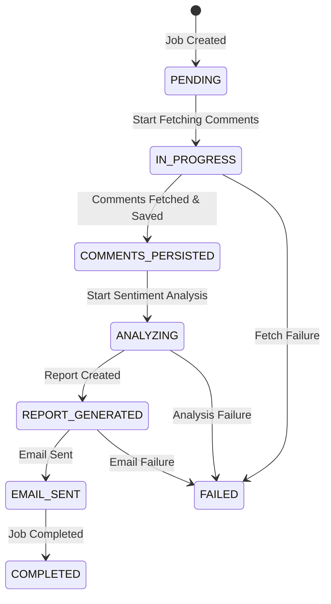
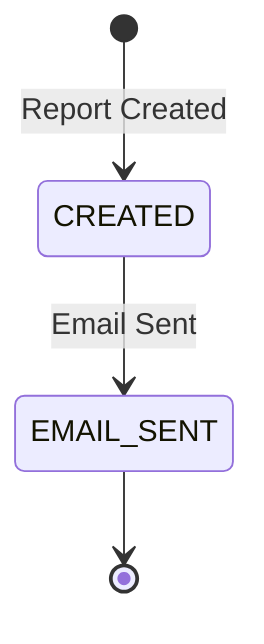
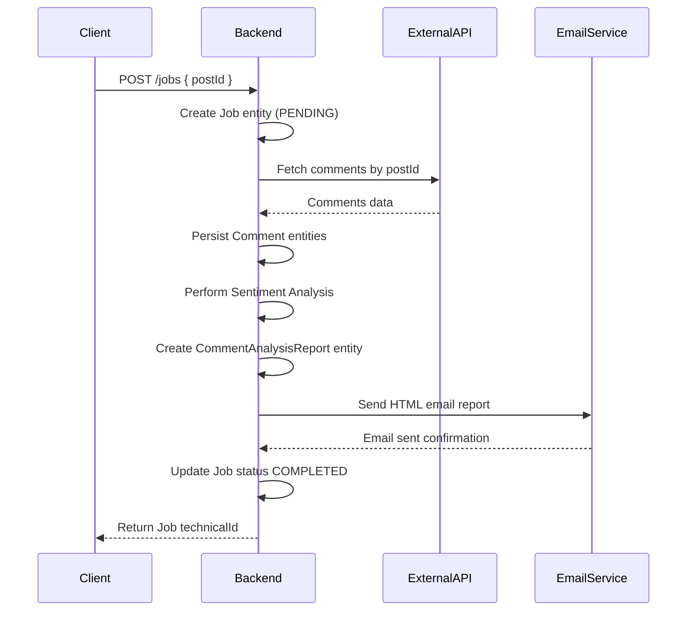

# Functional Requirements Specification

---

## 1. Entity Definitions

```
Job:
- postId: Long (Identifier of the post to fetch comments for)
- status: String (Job processing status: PENDING, IN_PROGRESS, COMPLETED, FAILED)
- createdAt: String (Timestamp of job creation)

Comment:
- postId: Long (Identifier of the post this comment belongs to)
- commentId: Long (Identifier of the comment as per external API)
- name: String (Name of the comment author)
- email: String (Email of the comment author)
- body: String (Comment content)

CommentAnalysisReport:
- postId: Long (Identifier of the post analyzed)
- sentimentSummary: String (Summary of sentiment analysis results)
- htmlReport: String (The HTML formatted email body for the report)
- createdAt: String (Timestamp of report creation)
```

---

## 2. Entity Workflows

### Job workflow

1. Initial State: Job created with status = PENDING  
2. Processing: Fetch comments from `https://jsonplaceholder.typicode.com/comments?postId={postId}`  
3. On success: Persist all fetched Comment entities  
4. Trigger sentiment analysis on fetched comments  
5. Generate CommentAnalysisReport entity with sentiment and HTML report  
6. Update Job status to COMPLETED  
7. Send the HTML report via email (triggered by CommentAnalysisReport creation)  
8. On any failure: Update Job status to FAILED  


```mermaid
stateDiagram-v2
    [*] --> PENDING: Job Created
    PENDING --> IN_PROGRESS: Start Fetching Comments
    IN_PROGRESS --> COMMENTS_PERSISTED: Comments Fetched & Saved
    COMMENTS_PERSISTED --> ANALYZING: Start Sentiment Analysis
    ANALYZING --> REPORT_GENERATED: Report Created
    REPORT_GENERATED --> EMAIL_SENT: Email Sent
    EMAIL_SENT --> COMPLETED: Job Completed
    IN_PROGRESS --> FAILED: Fetch Failure
    ANALYZING --> FAILED: Analysis Failure
    REPORT_GENERATED --> FAILED: Email Failure
```

---

### Comment workflow

- Created immutably when fetched by Job process  
- Stored for further analysis and retrieval only  

---

### CommentAnalysisReport workflow

1. Created after analysis completes  
2. Triggers sending the HTML email report automatically  
3. Can be retrieved by API for viewing past reports  


```mermaid
stateDiagram-v2
    [*] --> CREATED: Report Created
    CREATED --> EMAIL_SENT: Email Sent
    EMAIL_SENT --> [*]
```

---

## 3. API Endpoints

### POST /jobs

- Description: Create a Job to fetch and analyze comments by postId  
- Request body:

```json
{
  "postId": 1
}
```

- Response body:

```json
{
  "technicalId": "string"
}
```

---

### GET /jobs/{technicalId}

- Description: Retrieve Job details by technicalId  
- Response body:

```json
{
  "postId": 1,
  "status": "COMPLETED",
  "createdAt": "2024-06-01T12:00:00Z"
}
```

---

### GET /comments/{technicalId}

- Description: Retrieve Comment details by technicalId  
- Response body: Comment entity fields as stored

---

### GET /commentAnalysisReports/{technicalId}

- Description: Retrieve CommentAnalysisReport details by technicalId  
- Response body:

```json
{
  "postId": 1,
  "sentimentSummary": "Mostly positive",
  "htmlReport": "<html>...</html>",
  "createdAt": "2024-06-01T12:30:00Z"
}
```

---

## 4. Request/Response Flow Visualization


```mermaid
sequenceDiagram
    participant Client
    participant Backend
    participant ExternalAPI
    participant EmailService

    Client->>Backend: POST /jobs { postId }
    Backend->>Backend: Create Job entity (PENDING)
    Backend->>ExternalAPI: Fetch comments by postId
    ExternalAPI-->>Backend: Comments data
    Backend->>Backend: Persist Comment entities
    Backend->>Backend: Perform Sentiment Analysis
    Backend->>Backend: Create CommentAnalysisReport entity
    Backend->>EmailService: Send HTML email report
    EmailService-->>Backend: Email sent confirmation
    Backend->>Backend: Update Job status COMPLETED
    Backend-->>Client: Return Job technicalId
```

---

This specification preserves all provided business logic, technical details, and event-driven architecture principles exactly as confirmed. It is ready for direct use in documentation or implementation.

Please click **Approve** if this specification meets your expectations and you are ready to proceed to the next step.