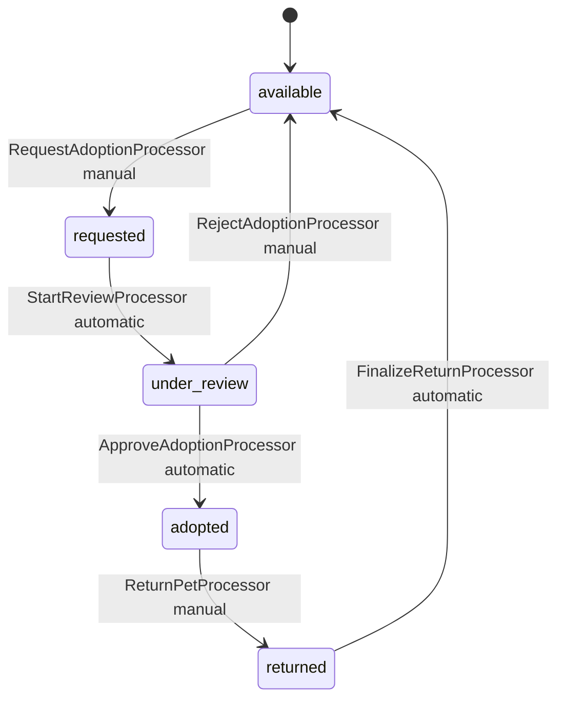
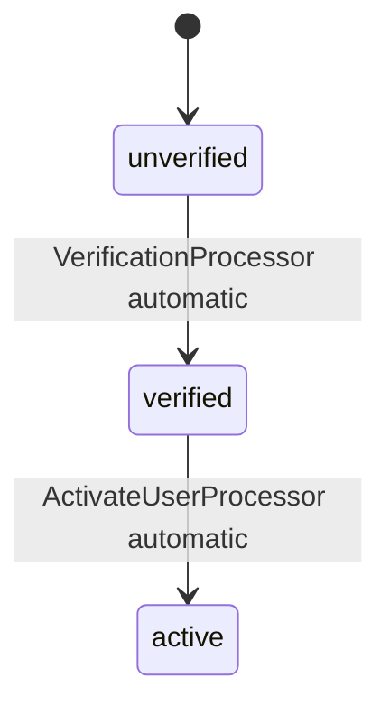
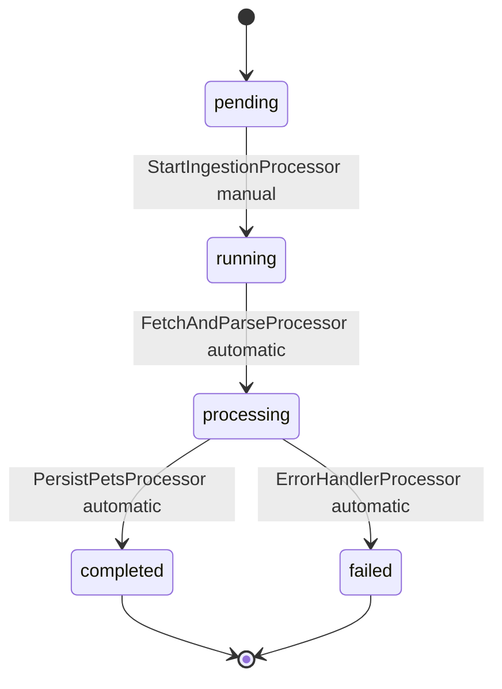
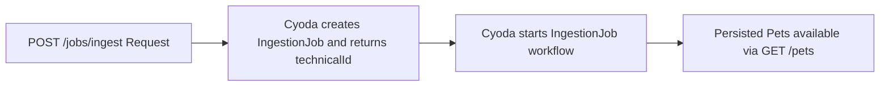

### 1. Entity Definitions
```
Pet:
- id: string (business id)
- name: string (pet name)
- species: string (cat/dog/etc)
- breed: string (breed info)
- age: integer (years)
- gender: string (M/F/unknown)
- photos: array (urls)
- status: string (available/requested/under_review/adopted/returned)
- tags: array (search tags)
- description: string (free text)

User:
- id: string (business id)
- name: string
- email: string
- phone: string
- address: string
- role: string (customer/staff)
- favorites: array (pet ids)

IngestionJob:
- id: string (business id)
- sourceUrl: string (Petstore source)
- requestedBy: string (user id)
- requestedAt: datetime
- status: string (pending/running/completed/failed)
- importedCount: integer
- errors: array (messages)
```

### 2. Entity workflows

Pet workflow:
1. Initial State: created (by ingestion or manual) -> status available
2. Adoption Requested: user requests adoption (manual)
3. Review: staff reviews request (manual) or auto-checks eligibility
4. Adopted / Rejected: on approval -> adopted (automatic), on rejection -> available (automatic)
5. Returned: if adoption reversed -> returned -> available


```mermaid
stateDiagram-v2
    [*] --> available
    available --> requested : RequestAdoptionProcessor manual
    requested --> under_review : StartReviewProcessor automatic
    under_review --> adopted : ApproveAdoptionProcessor automatic
    under_review --> available : RejectAdoptionProcessor manual
    adopted --> returned : ReturnPetProcessor manual
    returned --> available : FinalizeReturnProcessor automatic
```

Processors/Criterion: RequestAdoptionProcessor, StartReviewProcessor, ApproveAdoptionProcessor, RejectAdoptionProcessor, ReturnPetProcessor, EligibilityCriterion.

User workflow:
1. Created: user created (via process or external) -> unverified
2. Verify: Email/phone verification (manual/automatic)
3. Active: verified -> active


```mermaid
stateDiagram-v2
    [*] --> unverified
    unverified --> verified : VerificationProcessor automatic
    verified --> active : ActivateUserProcessor automatic
```

Processors/Criterion: VerificationProcessor, ActivateUserProcessor, UniqueEmailCriterion.

IngestionJob workflow:
1. Created: pending
2. Running: ingestion starts (automatic)
3. Processing: create Pet entities (automatic)
4. Completed/Failed: finished


```mermaid
stateDiagram-v2
    [*] --> pending
    pending --> running : StartIngestionProcessor manual
    running --> processing : FetchAndParseProcessor automatic
    processing --> completed : PersistPetsProcessor automatic
    processing --> failed : ErrorHandlerProcessor automatic
    completed --> [*]
    failed --> [*]
```

Processors/Criterion: StartIngestionProcessor, FetchAndParseProcessor, PersistPetsProcessor, ErrorHandlerProcessor, SourceReachableCriterion.

### 3. Pseudo code for processor classes (concise)

IngestionProcessor:
```
class FetchAndParseProcessor {
  process(job) {
    data = fetch(job.sourceUrl)
    pets = parse(data)
    for p in pets { validate(p); emit event PersistPet(p) }
    job.importedCount = pets.size
    job.status = completed
  }
}
```

PersistPetsProcessor:
```
class PersistPetsProcessor {
  process(petEvent) {
    if UniquePetCriterion(petEvent) then save Pet
    else log duplicate
  }
}
```

ApproveAdoptionProcessor:
```
class ApproveAdoptionProcessor {
  process(pet, user) {
    if EligibilityCriterion(user, pet) then pet.status=adopted; notify user
    else pet.status=available; notify staff
  }
}
```

### 4. API Endpoints Design Rules & JSON formats

Rules summary:
- Only IngestionJob has POST (orchestration). POST returns only technicalId.
- GET endpoints: /pets (list), /pets/{technicalId}, /users/{technicalId}, /jobs/{technicalId}
- No other POSTs for business entities; they are created by processors triggered by events.

POST create ingestion job (returns technicalId only)
Request:
```json
{ "sourceUrl":"https://petstore.example/api/pets", "requestedBy":"user123" }
```
Response (body only):
```json
{ "technicalId":"job-0001" }
```

GET job by technicalId response:
```json
{ "id":"job-0001","sourceUrl":"...","status":"completed","importedCount":12 }
```

Mermaid visualization of POST/GET:

```mermaid
flowchart LR
    A["POST /jobs/ingest Request"] --> B["Cyoda creates IngestionJob and returns technicalId"]
    B --> C["Cyoda starts IngestionJob workflow"]
    C --> D["Persisted Pets available via GET /pets"]
```

Questions to finalize: do you want user self-registration via POST (adds User POST) or keep Users created only by ingestion/manual staff actions?