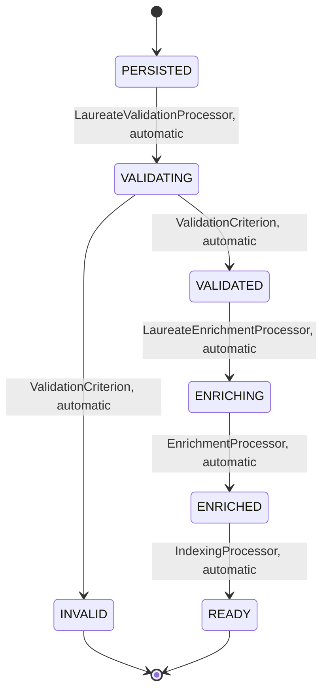
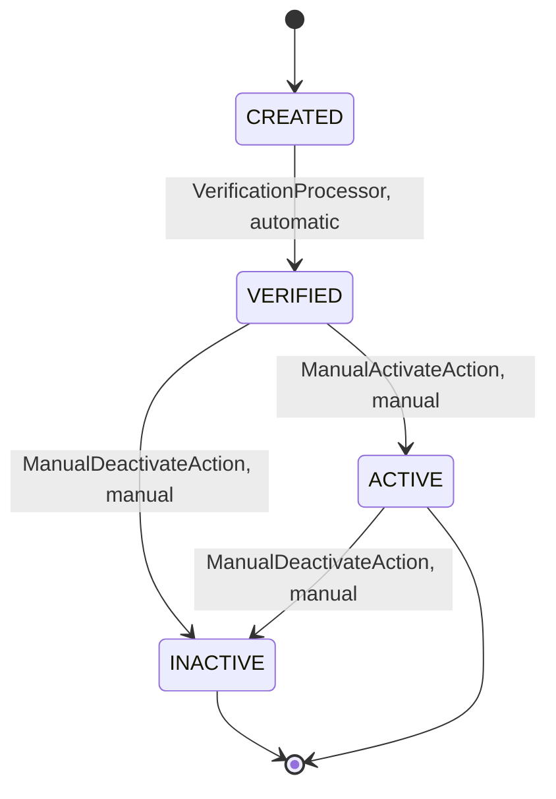

### 1. Entity Definitions
```
Job:
- jobId: String (business id for the job)
- sourceUrl: String (API endpoint to ingest)
- scheduledAt: String (ISO datetime when job should run)
- status: String (SCHEDULED, INGESTING, SUCCEEDED, FAILED, NOTIFIED_SUBSCRIBERS)
- startedAt: String (ISO datetime)
- finishedAt: String (ISO datetime)
- summary: String (short run result / error)

Laureate:
- id: Integer (original laureate id from source)
- firstname: String
- surname: String
- gender: String
- born: String (date)
- died: String (date or null)
- borncountry: String
- borncountrycode: String
- borncity: String
- year: String (award year)
- category: String
- motivation: String
- affiliation_name: String
- affiliation_city: String
- affiliation_country: String
- age_at_award: Integer (enrichment result)
- validated: String (VALIDATED or INVALID)
- normalized_country_code: String

Subscriber:
- subscriberId: String (business id)
- name: String
- contact_email: String
- webhook_url: String
- active: Boolean
- delivery_preference: String (email or webhook)
```

### 2. Entity workflows

Job workflow:
1. Initial State: SCHEDULED (created via POST -> event triggers process)
2. Start Ingestion: move to INGESTING (automatic)
3. Fetch & Parse: ingest data, create Laureate entities (automatic)
4. Finalize: set SUCCEEDED or FAILED (automatic)
5. Notify: move to NOTIFIED_SUBSCRIBERS after sending notifications (automatic)


```mermaid
stateDiagram-v2
    [*] --> SCHEDULED
    SCHEDULED --> INGESTING : ScheduleJobProcessor, automatic
    INGESTING --> SUCCEEDED : IngestDataProcessor, automatic
    INGESTING --> FAILED : IngestDataProcessor, automatic
    SUCCEEDED --> NOTIFIED_SUBSCRIBERS : NotifySubscribersProcessor, automatic
    FAILED --> NOTIFIED_SUBSCRIBERS : NotifySubscribersProcessor, automatic
    NOTIFIED_SUBSCRIBERS --> [*]
```

Processors/Criterions needed for Job:
- ScheduleJobProcessor
- IngestDataProcessor
- NotifySubscribersProcessor
- ApiAvailableCriterion
- NewDataFoundCriterion

Laureate workflow:
1. Initial State: PERSISTED (created by Job process)
2. Validation: VALIDATING -> VALIDATED or INVALID (automatic)
3. Enrichment: ENRICHING -> ENRICHED (automatic)
4. Indexing/Ready: READY (automatic)


```mermaid
stateDiagram-v2
    [*] --> PERSISTED
    PERSISTED --> VALIDATING : LaureateValidationProcessor, automatic
    VALIDATING --> INVALID : ValidationCriterion, automatic
    VALIDATING --> VALIDATED : ValidationCriterion, automatic
    VALIDATED --> ENRICHING : LaureateEnrichmentProcessor, automatic
    ENRICHING --> ENRICHED : EnrichmentProcessor, automatic
    ENRICHED --> READY : IndexingProcessor, automatic
    INVALID --> [*]
    READY --> [*]
```

Processors/Criterions needed for Laureate:
- LaureateValidationProcessor
- LaureateEnrichmentProcessor
- IndexingProcessor
- DuplicateCheckCriterion
- FieldFormatCriterion

Subscriber workflow:
1. Initial State: CREATED (POST creates subscriber)
2. Verification: VERIFIED (manual or automatic if webhook/email checked)
3. ACTIVE or INACTIVE (manual toggle)


```mermaid
stateDiagram-v2
    [*] --> CREATED
    CREATED --> VERIFIED : VerificationProcessor, automatic
    VERIFIED --> ACTIVE : ManualActivateAction, manual
    VERIFIED --> INACTIVE : ManualDeactivateAction, manual
    ACTIVE --> INACTIVE : ManualDeactivateAction, manual
    INACTIVE --> [*]
    ACTIVE --> [*]
```

Processors/Criterions needed for Subscriber:
- VerificationProcessor
- DeliveryTestProcessor
- ActiveSubscriberCriterion

### 3. Pseudo code for processor classes
- ScheduleJobProcessor
```
process(job):
  if ApiAvailableCriterion.check(job.sourceUrl) == false:
    job.status = FAILED
    job.summary = "Source unreachable"
    persist(job)
    return
  job.status = INGESTING
  persist(job)
  emit ingest event (job)
```
- IngestDataProcessor
```
process(job):
  response = fetch(job.sourceUrl)
  if response.error:
    job.status = FAILED
    job.summary = response.error
    persist(job)
    return
  records = parse(response)
  for rec in records:
    persist Laureate(rec)  // triggers Laureate workflow in Cyoda
  job.status = SUCCEEDED
  persist(job)
```
- LaureateValidationProcessor
```
process(laureate):
  if missing required fields or bad formats:
    laureate.validated = INVALID
  else:
    laureate.validated = VALIDATED
  persist(laureate)
```
- LaureateEnrichmentProcessor
```
process(laureate):
  laureate.age_at_award = computeAge(laureate.born, laureate.year)
  laureate.normalized_country_code = normalizeCountry(laureate.borncountry)
  persist(laureate)
```
- NotifySubscribersProcessor
```
process(job):
  subscribers = query active subscribers
  for s in subscribers:
    send notification (email or webhook) with job.summary and new laureate ids
  job.status = NOTIFIED_SUBSCRIBERS
  persist(job)
```

### 4. API Endpoints Design Rules

- POST /jobs
  - Triggers Job creation event; return only technicalId.
```json
Request:
{
  "sourceUrl":"https://public.opendatasoft.com/api/explore/v2.1/catalog/datasets/nobel-prize-laureates/records",
  "scheduledAt":"2025-09-01T10:00:00Z",
  "jobId":"daily-nobel-ingest"
}
Response:
{
  "technicalId":"<generated-technical-id>"
}
```

- GET /jobs/{technicalId}
```json
Response:
{
  "jobId":"daily-nobel-ingest",
  "status":"NOTIFIED_SUBSCRIBERS",
  "scheduledAt":"2025-09-01T10:00:00Z",
  "startedAt":"2025-09-01T10:00:05Z",
  "finishedAt":"2025-09-01T10:00:20Z",
  "summary":"ingested 5 laureates"
}
```

- POST /subscribers
  - Create subscriber; returns technicalId.
```json
Request:
{
  "name":"Research Team",
  "contact_email":"team@example.com",
  "webhook_url":"https://example.com/webhook",
  "delivery_preference":"webhook"
}
Response:
{
  "technicalId":"<generated-technical-id>"
}
```

- GET /subscribers/{technicalId}
```json
Response:
{
  "subscriberId":"s-123",
  "name":"Research Team",
  "contact_email":"team@example.com",
  "webhook_url":"https://example.com/webhook",
  "active":true
}
```

- GET /laureates
```json
Response: [ { /* laureate object persisted by workflow */ } ]
```

- GET /laureates/{id}
```json
Response:
{ /* single laureate object by domain id */ }
```

Notes:
- Each POST persists an entity → Cyoda starts the entity workflow (process method) automatically.
- POST responses must return only technicalId.
- GET endpoints are read-only and return stored results.
- All workflows use asynchronous processing, error logging on transitions, and criteria/processors as listed above.