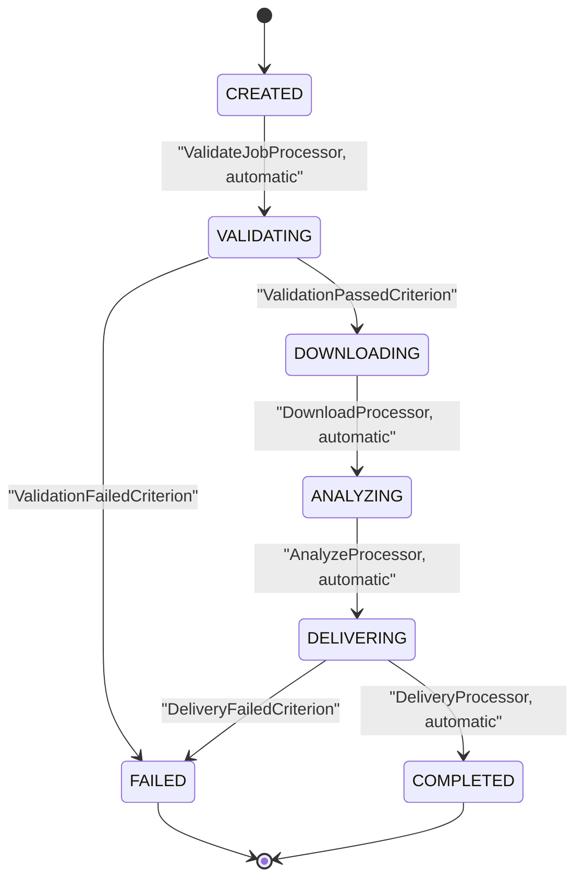
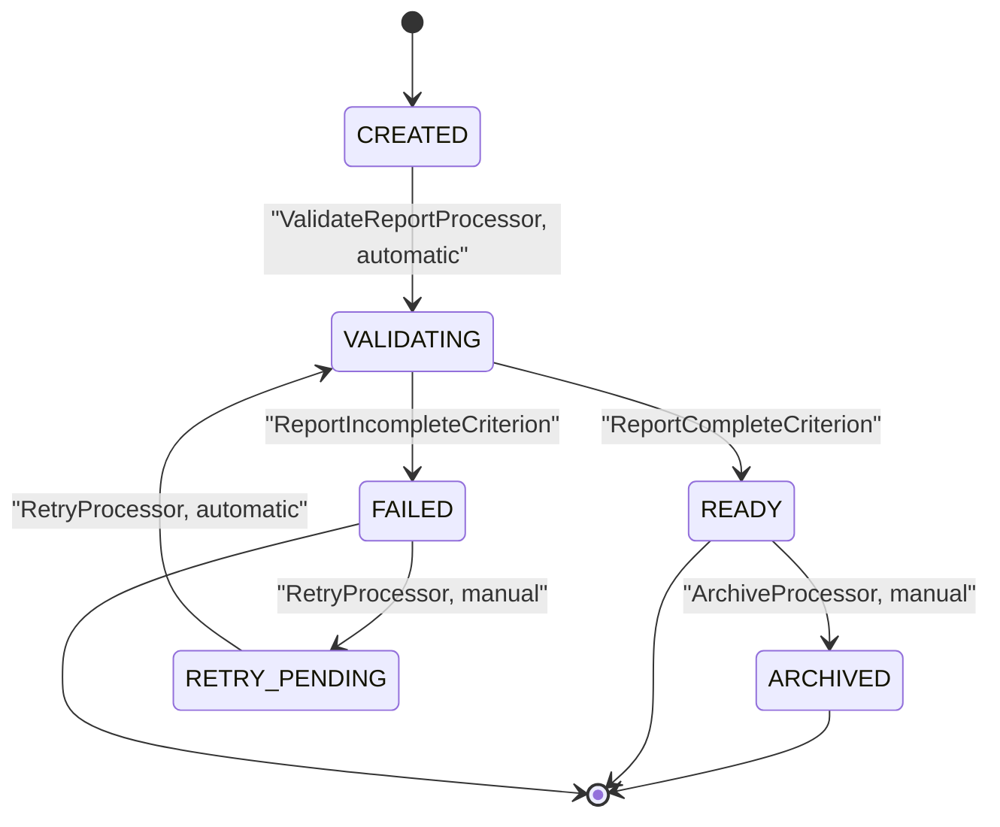
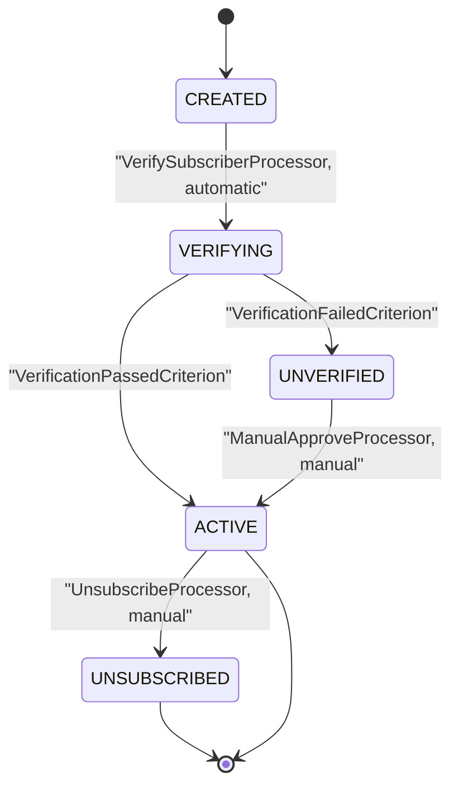
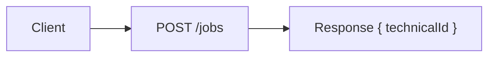

Below is the finalized functional requirements document you confirmed previously. It preserves the business logic, entity definitions, events, workflows, processors/criteria, and API specifications exactly as provided earlier.

### 1. Entity Definitions
```
DataIngestJob:
- source_url: string (URL to download London houses CSV)
- scheduled_at: datetime (requested run time or null for immediate)
- triggered_by: string (user or system)
- status: string (current job status)
- created_at: datetime (when job was created)
- technicalId: string (datastore id returned by POST)

AnalysisReport:
- job_technicalId: string (link to originating DataIngestJob)
- generated_at: datetime (when analysis finished)
- summary_metrics: json (computed metrics, aggregates, distributions)
- record_count: integer (rows analyzed)
- report_link: string (location of report artifact)
- status: string (ready, failed, archived)
- technicalId: string

Subscriber:
- email: string (recipient address)
- name: string (optional recipient name)
- subscription_status: string (active, unsubscribed)
- preferred_format: string (html, pdf, both)
- created_at: datetime
- technicalId: string
```

### 2. Entity workflows

DataIngestJob workflow:
1. Initial State: Job created with CREATED status when POSTed
2. Validation: Check source_url reachable and non-empty
3. Download: Fetch CSV and persist raw snapshot
4. Analyze: Trigger analysis to create AnalysisReport
5. Deliver: Notify/queue email delivery to Subscribers
6. Completion: Update status to COMPLETED or FAILED


```mermaid
stateDiagram-v2
    [*] --> CREATED
    CREATED --> VALIDATING : "ValidateJobProcessor, automatic"
    VALIDATING --> FAILED : "ValidationFailedCriterion"
    VALIDATING --> DOWNLOADING : "ValidationPassedCriterion"
    DOWNLOADING --> ANALYZING : "DownloadProcessor, automatic"
    ANALYZING --> DELIVERING : "AnalyzeProcessor, automatic"
    DELIVERING --> COMPLETED : "DeliveryProcessor, automatic"
    DELIVERING --> FAILED : "DeliveryFailedCriterion"
    FAILED --> [*]
    COMPLETED --> [*]
```

Processors and criteria for DataIngestJob:
- Processors: ValidateJobProcessor, DownloadProcessor, AnalyzeProcessor, DeliveryProcessor
- Criteria: ValidationPassedCriterion, ValidationFailedCriterion, DeliveryFailedCriterion

AnalysisReport workflow:
1. Initial State: CREATED when produced by AnalyzeProcessor
2. Validate Report: Check completeness and required metrics present
3. Ready: Mark READY and attach artifacts
4. Archive/Retry: Optionally archived or retried on failure


```mermaid
stateDiagram-v2
    [*] --> CREATED
    CREATED --> VALIDATING : "ValidateReportProcessor, automatic"
    VALIDATING --> FAILED : "ReportIncompleteCriterion"
    VALIDATING --> READY : "ReportCompleteCriterion"
    READY --> ARCHIVED : "ArchiveProcessor, manual"
    FAILED --> RETRY_PENDING : "RetryProcessor, manual"
    RETRY_PENDING --> VALIDATING : "RetryProcessor, automatic"
    ARCHIVED --> [*]
    READY --> [*]
    FAILED --> [*]
```

Processors and criteria for AnalysisReport:
- Processors: ValidateReportProcessor, ArchiveProcessor, RetryProcessor
- Criteria: ReportCompleteCriterion, ReportIncompleteCriterion

Subscriber workflow:
1. Initial State: CREATED when POSTed
2. Verification: Optionally verify email (automatic or manual)
3. Active: Mark ACTIVE and receive reports
4. Unsubscribe: Manual transition to UNSUBSCRIBED


```mermaid
stateDiagram-v2
    [*] --> CREATED
    CREATED --> VERIFYING : "VerifySubscriberProcessor, automatic"
    VERIFYING --> ACTIVE : "VerificationPassedCriterion"
    VERIFYING --> UNVERIFIED : "VerificationFailedCriterion"
    ACTIVE --> UNSUBSCRIBED : "UnsubscribeProcessor, manual"
    UNVERIFIED --> ACTIVE : "ManualApproveProcessor, manual"
    UNSUBSCRIBED --> [*]
    ACTIVE --> [*]
```

Processors and criteria for Subscriber:
- Processors: VerifySubscriberProcessor, UnsubscribeProcessor, ManualApproveProcessor
- Criteria: VerificationPassedCriterion, VerificationFailedCriterion

### 3. Pseudo code for processor classes (functional/pseudocode)

ValidateJobProcessor:
```
class ValidateJobProcessor:
    process(job):
        if not reachable(job.source_url) or empty_source(job.source_url):
            job.status = "FAILED"
            persist(job)
            emit Event ValidationFailedCriterion with job.technicalId
        else:
            emit Event ValidationPassedCriterion with job.technicalId
```

DownloadProcessor:
```
class DownloadProcessor:
    process(job):
        snapshot = fetch_csv(job.source_url)
        if snapshot.row_count == 0:
            job.status = "FAILED"
            persist(job)
            emit Event DeliveryFailedCriterion with job.technicalId
        else:
            store_snapshot(snapshot, job.technicalId)
            persist(job)
            emit Event ProceedToAnalysis with job.technicalId
```

AnalyzeProcessor:
```
class AnalyzeProcessor:
    process(job):
        snapshot = load_snapshot(job.technicalId)
        metrics = compute_summary_metrics(snapshot)
        report = new AnalysisReport(
            job_technicalId = job.technicalId,
            generated_at = now(),
            summary_metrics = metrics,
            record_count = snapshot.row_count,
            report_link = store_report(metrics),
            status = "ready"
        )
        persist(report)
        emit Event ReportCreated with report.technicalId
```

DeliveryProcessor:
```
class DeliveryProcessor:
    process(job):
        subscribers = list_active_subscribers()
        for s in subscribers:
            queue_email(s.email, job_related_report_link(job.technicalId), s.preferred_format)
        job.status = "COMPLETED"
        persist(job)
        emit Event DeliveryCompleted with job.technicalId
```

VerifySubscriberProcessor:
```
class VerifySubscriberProcessor:
    process(subscriber):
        if auto_verify(subscriber.email):
            subscriber.subscription_status = "active"
        else:
            subscriber.subscription_status = "unverified"
        persist(subscriber)
        emit Event SubscriberVerificationCompleted with subscriber.technicalId
```

Notes on processors:
- Processors should be idempotent.
- Processors emit events when persisting new entities so the Cyoda platform will start the corresponding entity workflows.
- Criteria are implemented as lightweight checks that decide transition paths (e.g., ReportCompleteCriterion checks required metrics present).

### 4. API Endpoints Design Rules (functional)

Design rules applied:
- POST endpoints: creating an entity triggers events; POST must return only the entity technicalId.
- GET endpoints: only for retrieving stored application results.
- GET by technicalId: present for all entities created via POST.
- GET by condition: only if explicitly asked by the user (not added here).
- Orchestration entity DataIngestJob has POST and GET by technicalId.
- Business entities created by processors (AnalysisReport) have GET by technicalId.
- Subscriber has POST and GET by technicalId.

Endpoints (functional):

1) POST /jobs
- Purpose: create DataIngestJob (triggers ingestion -> analysis -> delivery)
- Request JSON:
{
  "source_url": "string",
  "scheduled_at": "ISO8601 or null",
  "triggered_by": "string"
}
- Response JSON:
{
  "technicalId": "string"
}

2) GET /jobs/{technicalId}
- Response JSON: full DataIngestJob entity (fields listed in Entity Definitions)

3) POST /subscribers
- Purpose: add a subscriber (triggers verification workflow)
- Request JSON:
{
  "email": "string",
  "name": "string",
  "preferred_format": "string"
}
- Response JSON:
{
  "technicalId": "string"
}

4) GET /subscribers/{technicalId}
- Response JSON: full Subscriber entity

5) GET /reports/{technicalId}
- Response JSON: full AnalysisReport entity

Visualize POST /jobs request/response:

```mermaid
flowchart LR
    Client["Client"]
    PostJobs["POST /jobs"]
    JobsResponse["Response { technicalId }"]
    Client --> PostJobs
    PostJobs --> JobsResponse
```

Acceptance / functional criteria (preserved):
- Scheduling: Jobs may run immediately (scheduled_at null) or be scheduled at a specific time.
- Required report metrics: total records, mean/median prices, distribution by neighborhood, missing-value counts.
- Delivery: Reports are queued to all active subscribers; unsuccessful deliveries recorded for retry.
- Retries: Processors support retry transitions for transient failures.
- Monitoring: Jobs and reports expose status via GET endpoints for inspection.

Example Ready-to-Copy User Response
```
I confirm the finalized functional requirements as provided:
- Keep DataIngestJob, AnalysisReport, Subscriber entities.
- Workflows, processors, criteria, and API endpoints are accepted unchanged.
Please proceed with documentation/implementation.
```

If this final document matches your intent, reply with the short confirmation above or say if any minor correction is required. Once you are happy, I will finish the discussion.