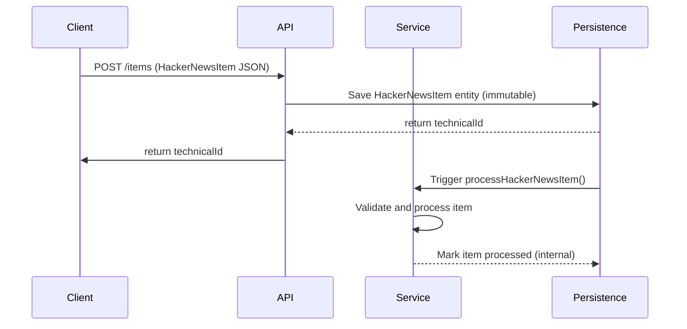
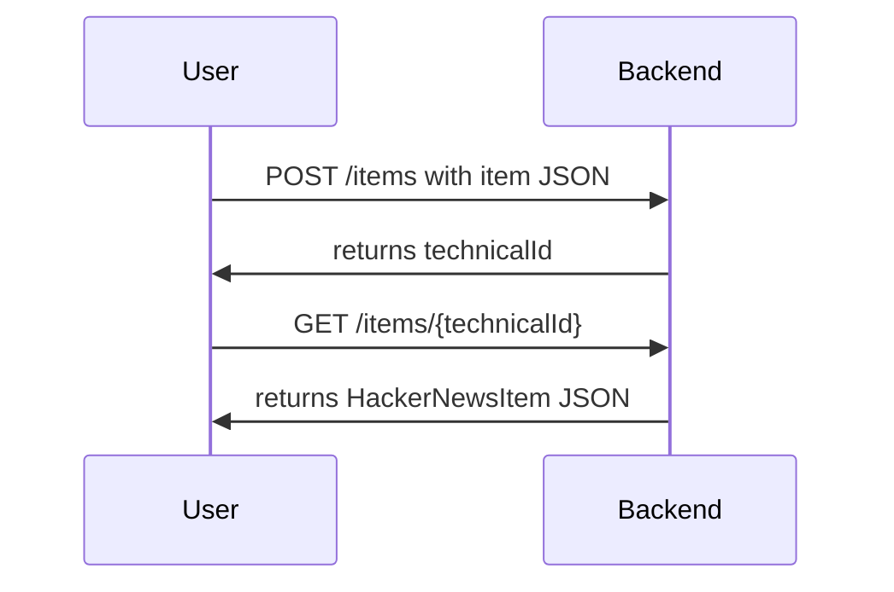

### 1. Entity Definitions

``` 
HackerNewsItem: 
- hnId: Long (Hacker News official item ID, unique per item)
- by: String (author username)
- type: String (type of item, e.g., story, comment, poll)
- time: Long (UNIX timestamp when item was created)
- title: String (story title, if applicable)
- url: String (story URL, if applicable)
- score: Integer (points or score of the item)
- text: String (comment or text content, if applicable)
- kids: List<Long> (IDs of child items, e.g., comments)
- parent: Long (ID of the parent item, if applicable)
- descendants: Integer (total comment count, if applicable)
```

### 2. Process Method Flows

```
processHackerNewsItem() Flow:
1. Initial State: HackerNewsItem entity is created and persisted (immutable).
2. Validation: Validate required fields (hnId, type, time, by).
3. Processing: 
   - Normalize data if needed (e.g., ensure kids list is not null).
   - Index or prepare item for retrieval.
4. Completion: Mark item as processed (internally, no update endpoint exposed).
5. Possible Trigger: Trigger downstream events or notifications if needed (optional).
```

### 3. API Endpoints Design

| Method | Endpoint           | Description                          | Request Body                    | Response                  |
|--------|--------------------|------------------------------------|--------------------------------|---------------------------|
| POST   | /items             | Create a HackerNewsItem entity      | HackerNewsItem JSON             | `{ "technicalId": "<id>"}` |
| GET    | /items/{technicalId}| Retrieve HackerNewsItem by technicalId | None                           | HackerNewsItem JSON       |

- POST /items triggers `processHackerNewsItem()` event automatically.
- GET /items/{technicalId} returns stored item by internal generated technical ID.
- No update or delete endpoints (immutable data).
- No additional GET by condition endpoints unless explicitly requested.

### 4. Request/Response Formats

**POST /items**  
_Request Body_ (example):

```json
{
  "hnId": 8863,
  "by": "dhouston",
  "type": "story",
  "time": 1175714200,
  "title": "My YC app: Dropbox - Throw away your USB drive",
  "url": "http://www.getdropbox.com/u/2/screencast.html",
  "score": 111,
  "kids": [8952, 9224, 8917],
  "descendants": 71
}
```

_Response Body_:

```json
{
  "technicalId": "generated-uuid-or-db-id"
}
```

**GET /items/{technicalId}**  
_Response Body_ (example):

```json
{
  "hnId": 8863,
  "by": "dhouston",
  "type": "story",
  "time": 1175714200,
  "title": "My YC app: Dropbox - Throw away your USB drive",
  "url": "http://www.getdropbox.com/u/2/screencast.html",
  "score": 111,
  "kids": [8952, 9224, 8917],
  "descendants": 71
}
```

### 5. Mermaid Diagrams

**Entity lifecycle state diagram**


```mermaid
stateDiagram-v2
    [*] --> ItemCreated
    ItemCreated --> Processing : processHackerNewsItem()
    Processing --> Completed : success
    Processing --> Failed : error
    Completed --> [*]
    Failed --> [*]
```

**Event-driven processing chain**


```mermaid
sequenceDiagram
    participant Client
    participant API
    participant Service
    participant Persistence

    Client->>API: POST /items (HackerNewsItem JSON)
    API->>Persistence: Save HackerNewsItem entity (immutable)
    Persistence-->>API: return technicalId
    API->>Client: return technicalId
    Persistence->>Service: Trigger processHackerNewsItem()
    Service->>Service: Validate and process item
    Service-->>Persistence: Mark item processed (internal)
```

**User interaction sequence flow**


```mermaid
sequenceDiagram
    participant User
    participant Backend

    User->>Backend: POST /items with item JSON
    Backend->>User: returns technicalId
    User->>Backend: GET /items/{technicalId}
    Backend->>User: returns HackerNewsItem JSON
```